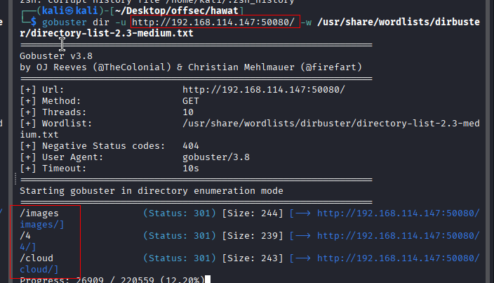
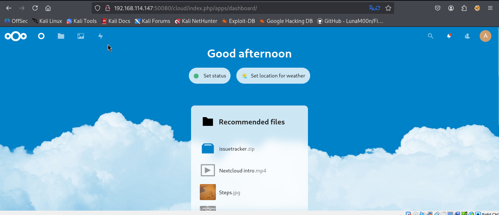
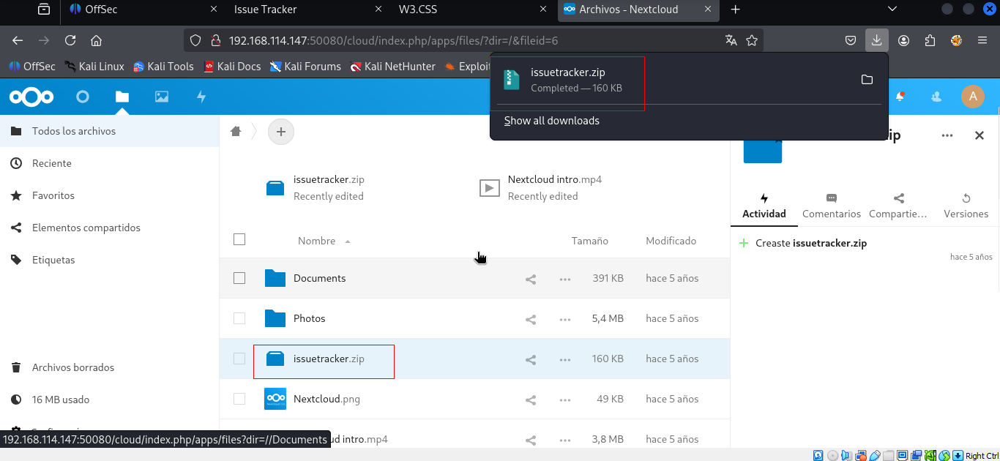
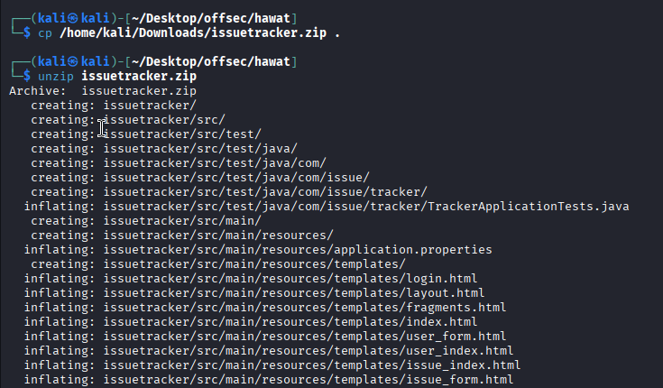
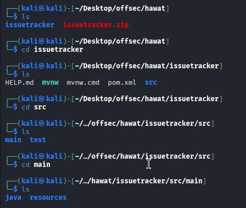
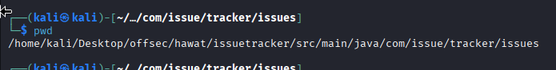
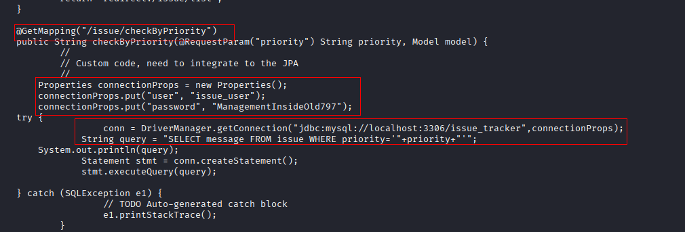

Nmap scan
```sh
nmap -p- --min-rate 5000 -T4 -Pn 192.168.215.147
Starting Nmap 7.95 ( https://nmap.org ) at 2026-02-18 15:18 IST
Nmap scan report for 192.168.215.147
Host is up (0.41s latency).
Not shown: 65527 filtered tcp ports (no-response)
PORT      STATE  SERVICE
22/tcp    open   ssh
111/tcp   closed rpcbind
139/tcp   closed netbios-ssn
443/tcp   closed https
445/tcp   closed microsoft-ds
17445/tcp open   unknown
30455/tcp open   unknown
50080/tcp open   unknown

Nmap done: 1 IP address (1 host up) scanned in 42.49 seconds
```

```sh
nmap -sC -sV -T4 -Pn -p 22,17445,30455,50080 192.168.215.147
Starting Nmap 7.95 ( https://nmap.org ) at 2026-02-18 15:20 IST
Nmap scan report for 192.168.215.147
Host is up (0.18s latency).

PORT      STATE SERVICE VERSION
22/tcp    open  ssh     OpenSSH 8.4 (protocol 2.0)
| ssh-hostkey: 
|   3072 78:2f:ea:84:4c:09:ae:0e:36:bf:b3:01:35:cf:47:22 (RSA)
|   256 d2:7d:eb:2d:a5:9a:2f:9e:93:9a:d5:2e:aa:dc:f4:a6 (ECDSA)
|_  256 b6:d4:96:f0:a4:04:e4:36:78:1e:9d:a5:10:93:d7:99 (ED25519)
17445/tcp open  http    Apache Tomcat (language: en)
|_http-title: Issue Tracker
30455/tcp open  http    nginx 1.18.0
|_http-server-header: nginx/1.18.0
|_http-title: W3.CSS
50080/tcp open  http    Apache httpd 2.4.46 ((Unix) PHP/7.4.15)
|_http-server-header: Apache/2.4.46 (Unix) PHP/7.4.15

Service detection performed. Please report any incorrect results at https://nmap.org/submit/ .
Nmap done: 1 IP address (1 host up) scanned in 50.91 seconds
```

Visiting web server on all http ports. (17445, 30455, 50080)


### Brute forcing
Dir : /images, /4, /cloud


Dir: /4


We found this page at directory /cloud

Tried default creds `admin : admin`. It’s a Nextcloud application. I attempted to log in with `admin:admin`, and we successfully gained access. Despite my Google search, I couldn’t find an exploit for Nextcloud.


There’s an `issuetracker.zip` file, which we could assume contains the source code of the issue tracker site. Let’s attempt to download and analyze it. It appears to be a Java Spring application. Shortly after reviewing the source code, specifically inside `IssueController.java`, I quickly identified an SQL Injection vulnerability.







At the same time, we found that there is a path “/issue/checkByPriority” is running a SQL query that is vulnerable.

While the username and password could be useful after initial access, we want something else.
That’s a SQL injection vulnerability. The Priority parameter is vulnerable to SQLi.

How do we weaponize this knowledge? What is the vulnerable endpoint?
