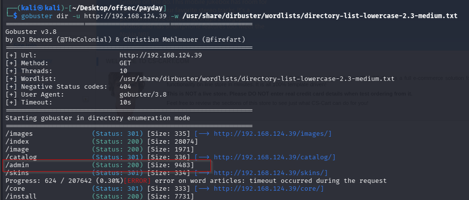
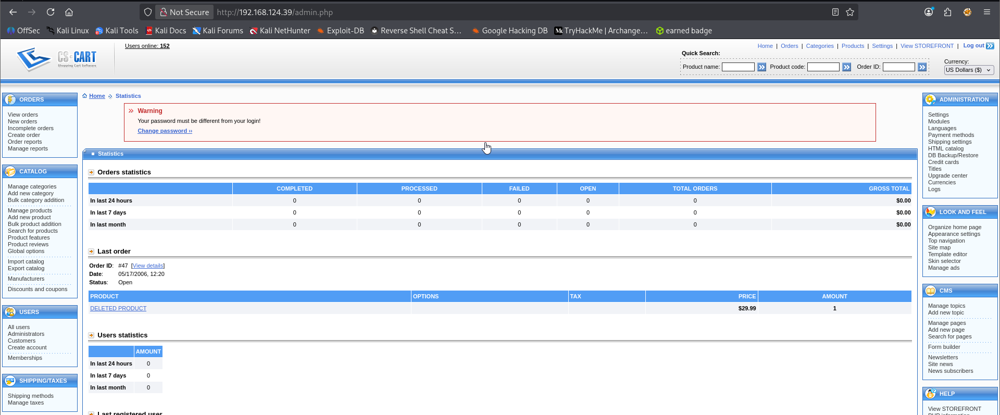
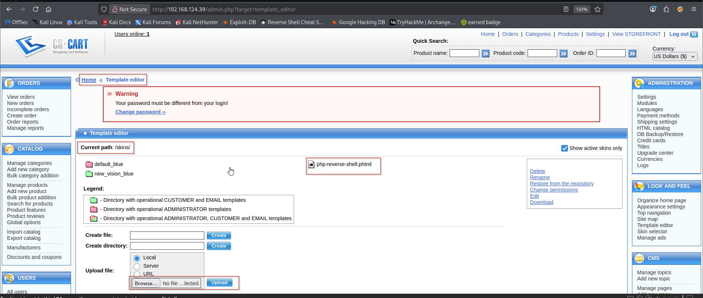
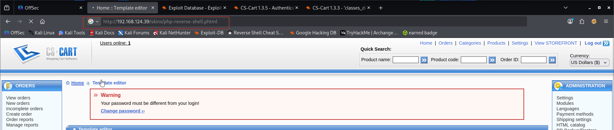
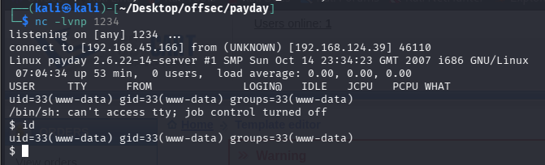
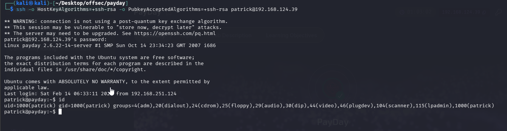
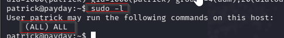

Nmap scan
```sh
 nmap -p- --min-rate 5000 -T4 -Pn 192.168.124.39
Starting Nmap 7.95 ( https://nmap.org ) at 2026-02-14 16:44 IST
Warning: 192.168.124.39 giving up on port because retransmission cap hit (6).
Nmap scan report for 192.168.124.39
Host is up (0.079s latency).
Not shown: 65514 closed tcp ports (reset)
PORT      STATE    SERVICE
22/tcp    open     ssh
80/tcp    open     http
110/tcp   open     pop3
139/tcp   open     netbios-ssn
143/tcp   open     imap
445/tcp   open     microsoft-ds
505/tcp   filtered mailbox-lm
993/tcp   open     imaps
995/tcp   open     pop3s
15539/tcp filtered unknown
24140/tcp filtered unknown
26240/tcp filtered unknown
27866/tcp filtered unknown
29092/tcp filtered unknown
35218/tcp filtered unknown
41282/tcp filtered unknown
47489/tcp filtered unknown
47663/tcp filtered unknown
55457/tcp filtered unknown
57595/tcp filtered unknown
58873/tcp filtered unknown

Nmap done: 1 IP address (1 host up) scanned in 17.54 seconds
```

```sh
nmap -sC -sV -T4 -Pn -p 22,80,110,139,143,445,505,993,995 192.168.124.39
Starting Nmap 7.95 ( https://nmap.org ) at 2026-02-14 16:45 IST
Nmap scan report for 192.168.124.39
Host is up (0.11s latency).

PORT    STATE  SERVICE     VERSION
22/tcp  open   ssh         OpenSSH 4.6p1 Debian 5build1 (protocol 2.0)
| ssh-hostkey: 
|   1024 f3:6e:87:04:ea:2d:b3:60:ff:42:ad:26:67:17:94:d5 (DSA)
|_  2048 bb:03:ce:ed:13:f1:9a:9e:36:03:e2:af:ca:b2:35:04 (RSA)
80/tcp  open   http        Apache httpd 2.2.4 ((Ubuntu) PHP/5.2.3-1ubuntu6)
|_http-title: CS-Cart. Powerful PHP shopping cart software
|_http-server-header: Apache/2.2.4 (Ubuntu) PHP/5.2.3-1ubuntu6
110/tcp open   pop3        Dovecot pop3d
|_pop3-capabilities: TOP PIPELINING SASL CAPA STLS UIDL RESP-CODES
|_ssl-date: 2026-02-14T11:15:52+00:00; +7s from scanner time.
| ssl-cert: Subject: commonName=ubuntu01/organizationName=OCOSA/stateOrProvinceName=There is no such thing outside US/countryName=XX
| Not valid before: 2008-04-25T02:02:48
|_Not valid after:  2008-05-25T02:02:48
| sslv2: 
|   SSLv2 supported
|   ciphers: 
|     SSL2_RC4_128_EXPORT40_WITH_MD5
|     SSL2_RC2_128_CBC_EXPORT40_WITH_MD5
|     SSL2_RC4_128_WITH_MD5
|     SSL2_DES_192_EDE3_CBC_WITH_MD5
|_    SSL2_RC2_128_CBC_WITH_MD5
139/tcp open   netbios-ssn Samba smbd 3.X - 4.X (workgroup: MSHOME)
143/tcp open   imap        Dovecot imapd
|_imap-capabilities: THREAD=REFERENCES IDLE completed LITERAL+ IMAP4rev1 STARTTLS LOGINDISABLEDA0001 Capability OK LOGIN-REFERRALS CHILDREN UNSELECT NAMESPACE SORT MULTIAPPEND SASL-IR
| sslv2: 
|   SSLv2 supported
|   ciphers: 
|     SSL2_RC4_128_EXPORT40_WITH_MD5
|     SSL2_RC2_128_CBC_EXPORT40_WITH_MD5
|     SSL2_RC4_128_WITH_MD5
|     SSL2_DES_192_EDE3_CBC_WITH_MD5
|_    SSL2_RC2_128_CBC_WITH_MD5
| ssl-cert: Subject: commonName=ubuntu01/organizationName=OCOSA/stateOrProvinceName=There is no such thing outside US/countryName=XX
| Not valid before: 2008-04-25T02:02:48
|_Not valid after:  2008-05-25T02:02:48
|_ssl-date: 2026-02-14T11:15:52+00:00; +7s from scanner time.
445/tcp open   netbios-ssn Samba smbd 3.0.26a (workgroup: MSHOME)
505/tcp closed mailbox-lm
993/tcp open   ssl/imap    Dovecot imapd
| sslv2: 
|   SSLv2 supported
|   ciphers: 
|     SSL2_RC4_128_EXPORT40_WITH_MD5
|     SSL2_RC2_128_CBC_EXPORT40_WITH_MD5
|     SSL2_RC4_128_WITH_MD5
|     SSL2_DES_192_EDE3_CBC_WITH_MD5
|_    SSL2_RC2_128_CBC_WITH_MD5
|_ssl-date: 2026-02-14T11:15:51+00:00; +6s from scanner time.
|_imap-capabilities: THREAD=REFERENCES IDLE LITERAL+ IMAP4rev1 completed OK Capability AUTH=PLAINA0001 LOGIN-REFERRALS CHILDREN UNSELECT NAMESPACE SORT MULTIAPPEND SASL-IR
| ssl-cert: Subject: commonName=ubuntu01/organizationName=OCOSA/stateOrProvinceName=There is no such thing outside US/countryName=XX
| Not valid before: 2008-04-25T02:02:48
|_Not valid after:  2008-05-25T02:02:48
995/tcp open   ssl/pop3    Dovecot pop3d
|_pop3-capabilities: TOP PIPELINING SASL(PLAIN) CAPA UIDL USER RESP-CODES
| sslv2: 
|   SSLv2 supported
|   ciphers: 
|     SSL2_RC4_128_EXPORT40_WITH_MD5
|     SSL2_RC2_128_CBC_EXPORT40_WITH_MD5
|     SSL2_RC4_128_WITH_MD5
|     SSL2_DES_192_EDE3_CBC_WITH_MD5
|_    SSL2_RC2_128_CBC_WITH_MD5
|_ssl-date: 2026-02-14T11:15:51+00:00; +6s from scanner time.
| ssl-cert: Subject: commonName=ubuntu01/organizationName=OCOSA/stateOrProvinceName=There is no such thing outside US/countryName=XX
| Not valid before: 2008-04-25T02:02:48
|_Not valid after:  2008-05-25T02:02:48
Service Info: OS: Linux; CPE: cpe:/o:linux:linux_kernel

Host script results:
|_smb2-time: Protocol negotiation failed (SMB2)
| smb-os-discovery: 
|   OS: Unix (Samba 3.0.26a)
|   Computer name: payday
|   NetBIOS computer name: 
|   Domain name: 
|   FQDN: payday
|_  System time: 2026-02-14T06:15:45-05:00
|_nbstat: NetBIOS name: PAYDAY, NetBIOS user: <unknown>, NetBIOS MAC: <unknown> (unknown)
| smb-security-mode: 
|   account_used: guest
|   authentication_level: user
|   challenge_response: supported
|_  message_signing: disabled (dangerous, but default)
|_clock-skew: mean: 50m06s, deviation: 2h02m29s, median: 5s

Service detection performed. Please report any incorrect results at https://nmap.org/submit/ .
Nmap done: 1 IP address (1 host up) scanned in 22.38 seconds
```

Visited web server on port 80. Tried login using default creds but didn't work.


Directory brute forcing. we found /admin page.

Visiting /admin page. We tried default creds admin : admin. We were successful to login.



Searched for public exploits on CS Cart. As we are logged in now, we looked for "authenticated RCE".


According to the exploit, a `.php` shell can be uploaded as a `.phtml` file via a file manager at the `/skins` directory of the web application.
After some further browsing I find another upload section in the **Template Editor**. Here, a specific path at `/skins` is specified so I create my PHP reverse shell and upload the file as a `.phtml` — knowing I will be able to browse to my reverse shell script at the URL:


Copied the shell. Changed IP and port. Renamed it with .phtml extension as mentioned in exploit.

Uploaded the shell to template editor.

Started nc.

Visiting the uploaded file.

Got the shell.

Stabilizing shell.
```sh
python -c 'import pty; pty.spawn("/bin/bash")'

Then, ctrl+z
stty raw -echo
fg  #press enter
reset
xterm
export TERM=xterm
stty size
stty rows 24 columns 80
```

We got the local flag.


Logging in as patrick via SSH was troublesome at first because my SSH client was not allowing me to connect at first due to weak encryption protocols offered by the target. I decided to ignore this for some reason and spent 3 hours stuck in a rabbit hole as www-data on a web shell trying to escalate privileges and find any exploits and it just didn’t work which was absolutely infuriating. That’s a lesson learned.

I fixed that with the following ssh command.

**Patrick’s password is : patrick**. I couldn’t believe it. Is this how the OSCP exam boxes are going to be – a guessing game of fairly predictable passwords?


```sh
ssh -o HostKeyAlgorithms=+ssh-rsa -o PubkeyAcceptedAlgorithms=+ssh-rsa patrick@192.168.124.39
```


### Privilege Escalation


When is show (ALL) ALL means consider it as /bin/bash. So that user can run /bin/bash as root..

