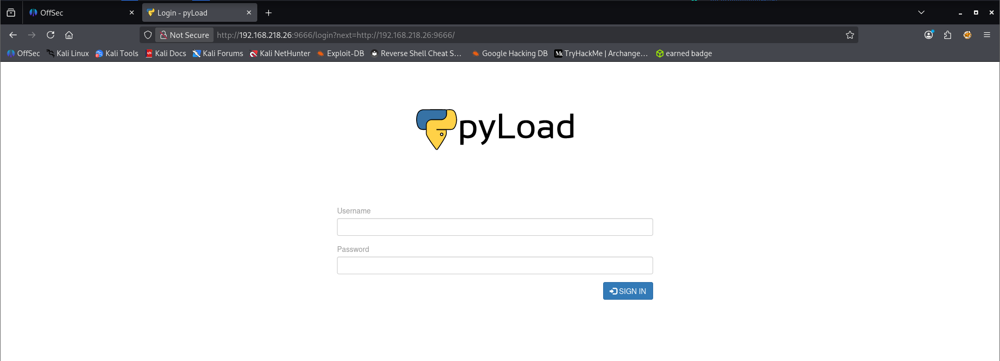
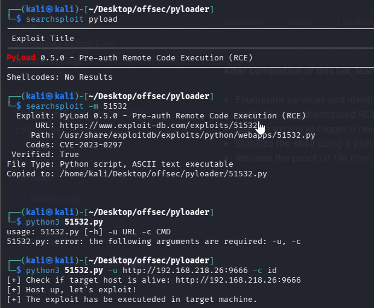

Nmap scan
```sh
nmap -p- --min-rate 5000 -T4 -Pn 192.168.218.26
Starting Nmap 7.95 ( https://nmap.org ) at 2026-02-28 15:47 IST
Nmap scan report for 192.168.218.26
Host is up (0.064s latency).
Not shown: 65533 closed tcp ports (reset)
PORT     STATE SERVICE
22/tcp   open  ssh
9666/tcp open  zoomcp

Nmap done: 1 IP address (1 host up) scanned in 13.92 seconds
```

```sh
nmap -sC -sV -T4 -Pn -p 22,9666 192.168.218.26 
Starting Nmap 7.95 ( https://nmap.org ) at 2026-02-28 15:48 IST
Nmap scan report for 192.168.218.26
Host is up (0.086s latency).

PORT     STATE SERVICE VERSION
22/tcp   open  ssh     OpenSSH 8.9p1 Ubuntu 3ubuntu0.1 (Ubuntu Linux; protocol 2.0)
| ssh-hostkey: 
|   256 b9:bc:8f:01:3f:85:5d:f9:5c:d9:fb:b6:15:a0:1e:74 (ECDSA)
|_  256 53:d9:7f:3d:22:8a:fd:57:98:fe:6b:1a:4c:ac:79:67 (ED25519)
9666/tcp open  http    CherryPy wsgiserver
| http-title: Login - pyLoad 
|_Requested resource was /login?next=http://192.168.218.26:9666/
|_http-server-header: Cheroot/8.6.0
| http-robots.txt: 1 disallowed entry 
|_/
Service Info: OS: Linux; CPE: cpe:/o:linux:linux_kernel

Service detection performed. Please report any incorrect results at https://nmap.org/submit/ .
Nmap done: 1 IP address (1 host up) scanned in 40.84 seconds
```

Visiting web server on port 9666.


Tried default creds `admin : admin` but they didn't work. So, searched for public exploits and found one.


But that also didn't work. So, searched for exploit on github and found one.
https://github.com/JacobEbben/CVE-2023-0297/blob/main/exploit.py


