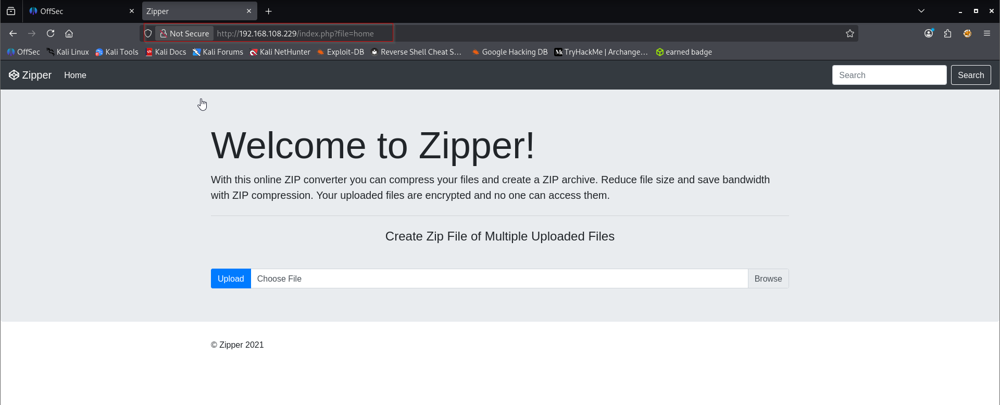
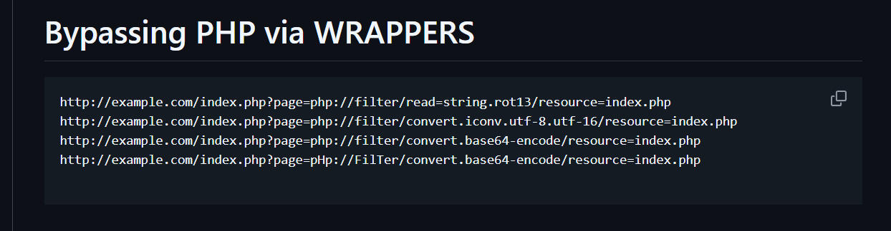

Nmap scan
```sh
nmap -p- --min-rate 5000 -T4 -Pn 192.168.108.229
Starting Nmap 7.95 ( https://nmap.org ) at 2026-02-28 10:34 IST
Warning: 192.168.108.229 giving up on port because retransmission cap hit (6).
Stats: 0:00:59 elapsed; 0 hosts completed (1 up), 1 undergoing SYN Stealth Scan
SYN Stealth Scan Timing: About 99.99% done; ETC: 10:35 (0:00:00 remaining)
Nmap scan report for 192.168.108.229
Host is up (3.6s latency).
Not shown: 57175 closed tcp ports (reset), 8358 filtered tcp ports (no-response)
PORT   STATE SERVICE
22/tcp open  ssh
80/tcp open  http

Nmap done: 1 IP address (1 host up) scanned in 93.29 seconds
```

```sh
 nmap -sC -sV -T4 -Pn -p 22,80 192.168.108.229   
Starting Nmap 7.95 ( https://nmap.org ) at 2026-02-28 10:37 IST
Nmap scan report for 192.168.108.229
Host is up (0.12s latency).

PORT   STATE SERVICE VERSION
22/tcp open  ssh     OpenSSH 8.2p1 Ubuntu 4ubuntu0.3 (Ubuntu Linux; protocol 2.0)
| ssh-hostkey: 
|   3072 c1:99:4b:95:22:25:ed:0f:85:20:d3:63:b4:48:bb:cf (RSA)
|   256 0f:44:8b:ad:ad:95:b8:22:6a:f0:36:ac:19:d0:0e:f3 (ECDSA)
|_  256 32:e1:2a:6c:cc:7c:e6:3e:23:f4:80:8d:33:ce:9b:3a (ED25519)
80/tcp open  http    Apache httpd 2.4.41 ((Ubuntu))
|_http-server-header: Apache/2.4.41 (Ubuntu)
|_http-title: Zipper
Service Info: OS: Linux; CPE: cpe:/o:linux:linux_kernel

Service detection performed. Please report any incorrect results at https://nmap.org/submit/ .
Nmap done: 1 IP address (1 host up) scanned in 12.91 seconds
```

Visiting web server on port 80.

Hm… It seems like this is a zip* exploitation. If only we could see the code. It’s definitely not Zipslip since it didn’t unzip the zip for us.

There’s a search feature, but it’s just dummy. Oh, when you press the home button, a GET parameter appears.

Let’s try LFI. We can extract the source using the PHP base64 wrapper. It seems like it’s appending ‘.php’ to the file.
https://github.com/RoqueNight/LFI---RCE-Cheat-Sheet?source=post_page-----54487957aab9---------------------------------------

