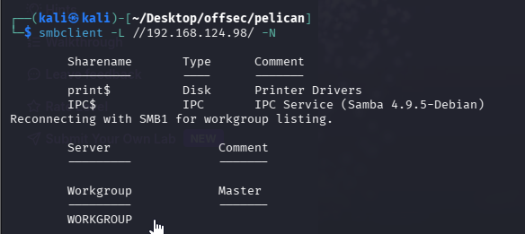
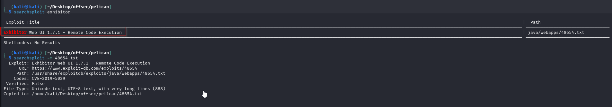
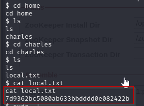
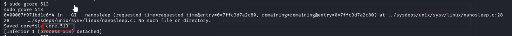
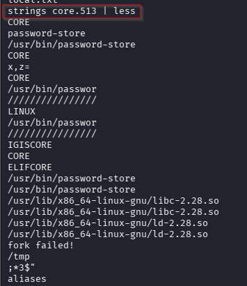
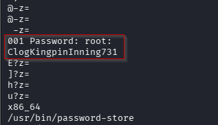

Nmap scan
```sh
nmap -p- --min-rate 5000 -T4 -Pn 192.168.124.98
Starting Nmap 7.95 ( https://nmap.org ) at 2026-02-14 14:57 IST
Nmap scan report for 192.168.124.98
Host is up (0.067s latency).
Not shown: 65526 closed tcp ports (reset)
PORT      STATE SERVICE
22/tcp    open  ssh
139/tcp   open  netbios-ssn
445/tcp   open  microsoft-ds
631/tcp   open  ipp
2181/tcp  open  eforward
2222/tcp  open  EtherNetIP-1
8080/tcp  open  http-proxy
8081/tcp  open  blackice-icecap
39605/tcp open  unknown

Nmap done: 1 IP address (1 host up) scanned in 14.54 seconds
```

```sh
nmap -sC -sV -T4 -Pn -p 22,139,445,631,2181,2222,8080,8081,39605 192.168.124.98
Starting Nmap 7.95 ( https://nmap.org ) at 2026-02-14 14:58 IST
Nmap scan report for 192.168.124.98
Host is up (0.11s latency).

PORT      STATE SERVICE     VERSION
22/tcp    open  ssh         OpenSSH 7.9p1 Debian 10+deb10u2 (protocol 2.0)
| ssh-hostkey: 
|   2048 a8:e1:60:68:be:f5:8e:70:70:54:b4:27:ee:9a:7e:7f (RSA)
|   256 bb:99:9a:45:3f:35:0b:b3:49:e6:cf:11:49:87:8d:94 (ECDSA)
|_  256 f2:eb:fc:45:d7:e9:80:77:66:a3:93:53:de:00:57:9c (ED25519)
139/tcp   open  netbios-ssn Samba smbd 3.X - 4.X (workgroup: WORKGROUP)
445/tcp   open  netbios-ssn Samba smbd 4.9.5-Debian (workgroup: WORKGROUP)
631/tcp   open  ipp         CUPS 2.2
|_http-title: Forbidden - CUPS v2.2.10
| http-methods: 
|_  Potentially risky methods: PUT
|_http-server-header: CUPS/2.2 IPP/2.1
2181/tcp  open  zookeeper   Zookeeper 3.4.6-1569965 (Built on 02/20/2014)
2222/tcp  open  ssh         OpenSSH 7.9p1 Debian 10+deb10u2 (protocol 2.0)
| ssh-hostkey: 
|   2048 a8:e1:60:68:be:f5:8e:70:70:54:b4:27:ee:9a:7e:7f (RSA)
|   256 bb:99:9a:45:3f:35:0b:b3:49:e6:cf:11:49:87:8d:94 (ECDSA)
|_  256 f2:eb:fc:45:d7:e9:80:77:66:a3:93:53:de:00:57:9c (ED25519)
8080/tcp  open  http        Jetty 1.0
|_http-server-header: Jetty(1.0)
|_http-title: Error 404 Not Found
8081/tcp  open  http        nginx 1.14.2
|_http-server-header: nginx/1.14.2
|_http-title: Did not follow redirect to http://192.168.124.98:8080/exhibitor/v1/ui/index.html
39605/tcp open  java-rmi    Java RMI
Service Info: Host: PELICAN; OS: Linux; CPE: cpe:/o:linux:linux_kernel

Host script results:
|_clock-skew: mean: 1h40m01s, deviation: 2h53m14s, median: 0s
| smb-security-mode: 
|   account_used: guest
|   authentication_level: user
|   challenge_response: supported
|_  message_signing: disabled (dangerous, but default)
| smb-os-discovery: 
|   OS: Windows 6.1 (Samba 4.9.5-Debian)
|   Computer name: pelican
|   NetBIOS computer name: PELICAN\x00
|   Domain name: \x00
|   FQDN: pelican
|_  System time: 2026-02-14T04:28:35-05:00
| smb2-time: 
|   date: 2026-02-14T09:28:35
|_  start_date: N/A
| smb2-security-mode: 
|   3:1:1: 
|_    Message signing enabled but not required

Service detection performed. Please report any incorrect results at https://nmap.org/submit/ .
Nmap done: 1 IP address (1 host up) scanned in 24.48 seconds
```

Enumerating SMB
We didn't find anything interesting.

When we visited web server on port 8080 it gave us error.
Visiting web server on port 8081 but it redirect us on port 8080.


Searched for exhibitor on searchsploit and we found below.


Open the exploit


Started the listener.


Follow the steps mentioned in exploit and proceed. **Here, nc stared on different port and we mentioned another port in payload this is because we tried to take shell multiple times on different port each time.**

We got the shell as user **charles**


Now, find the local flag.


### Privilege Escalation
I tried doing a `sudo -l`and discovered that charles can run `/usr/bin/gcore` as sudo **_without a password!!!_**

`gcore` creates a **core dump** of a running process. A core dump is a snapshot of a process’s memory and state at a given time. This is good because we can find processes running as root, and dump the memory of these processes to extract credentials or other sensitive information.


Let’s see all processes running as root , and if we can find something useful to dump as root to extract information:
```sh
ps aux | grep -i 'root'
```


I see a process running at `/usr/bin/password-store` which looks like a binary that may contain password information. The PID associated with this binary is 513. **(here we tried dumping 557 process also but it was not worth visiting)**
```sh
sudo gcore 513
```


Open the saved file using **string** .It looks like there is a password in this memory dump and it might even belong to the root user, judging from the strings below:
```sh
strings core.513 | less
```



### Root
With the found password we can use `su` to become root and it works but we have to be careful as the terminal doesn’t verbosely prompt for a password — **_do not misspell or copy/paste as you may make a mistake. There is no verbosity to give you that warning as this shell isn’t very interactive.


