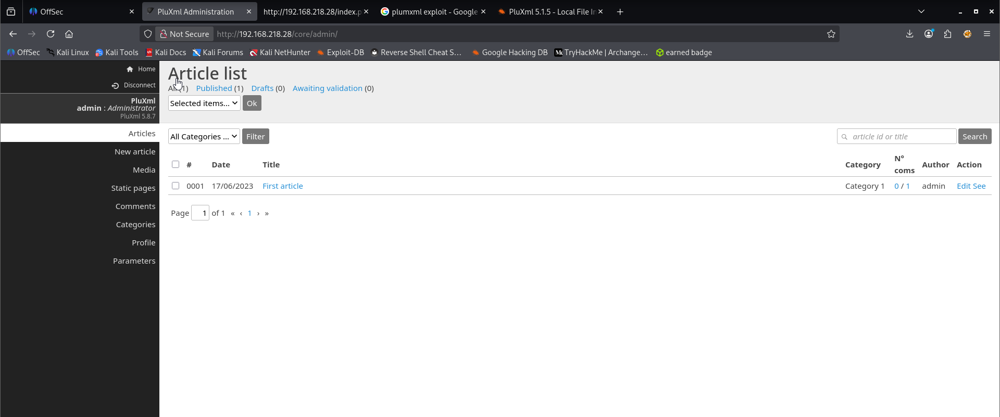
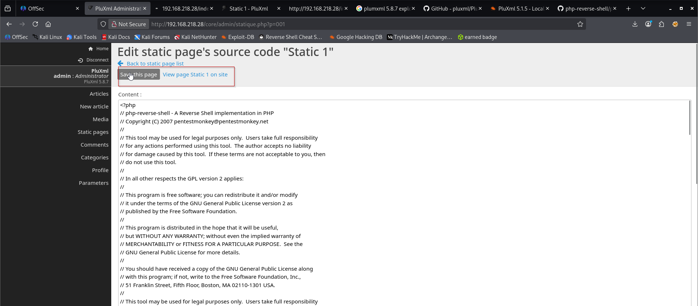
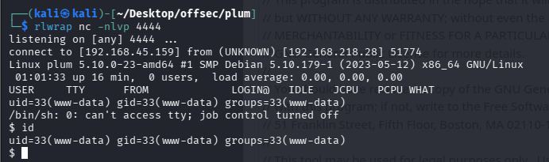
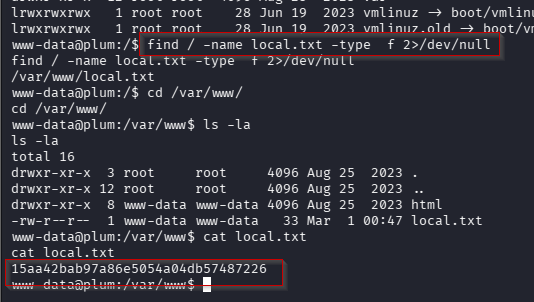
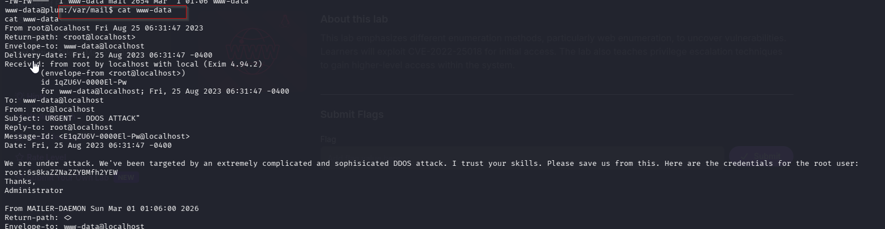
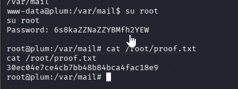

Nmap scan
```sh
nmap -p- --min-rate 5000 -T4 -Pn 192.168.218.28
Starting Nmap 7.95 ( https://nmap.org ) at 2026-03-01 11:18 IST
Nmap scan report for 192.168.218.28
Host is up (0.088s latency).
Not shown: 65533 closed tcp ports (reset)
PORT   STATE SERVICE
22/tcp open  ssh
80/tcp open  http

Nmap done: 1 IP address (1 host up) scanned in 14.77 seconds
```

```sh
nmap -sC -sV -T4 -Pn -p 22,80 192.168.218.28
Starting Nmap 7.95 ( https://nmap.org ) at 2026-03-01 11:20 IST
Nmap scan report for 192.168.218.28
Host is up (0.13s latency).

PORT   STATE SERVICE VERSION
22/tcp open  ssh     OpenSSH 8.4p1 Debian 5+deb11u1 (protocol 2.0)
| ssh-hostkey: 
|   3072 c9:c3:da:15:28:3b:f1:f8:9a:36:df:4d:36:6b:a7:44 (RSA)
|   256 26:03:2b:f6:da:90:1d:1b:ec:8d:8f:8d:1e:7e:3d:6b (ECDSA)
|_  256 fb:43:b2:b0:19:2f:d3:f6:bc:aa:60:67:ab:c1:af:37 (ED25519)
80/tcp open  http    Apache httpd 2.4.56 ((Debian))
|_http-server-header: Apache/2.4.56 (Debian)
|_http-title: PluXml - Blog or CMS, XML powered !
Service Info: OS: Linux; CPE: cpe:/o:linux:linux_kernel

Service detection performed. Please report any incorrect results at https://nmap.org/submit/ .
Nmap done: 1 IP address (1 host up) scanned in 11.12 seconds
```

Visiting web server on port 80.


At the bottom of the page we have administration link.


Logged in to the application using default creds `admin : admin`

Click on static page option and then edit.

Added php reverse shell to static page content.

Click on "save this page" and then "view page static 1 on site".

We'll receive the shell on netcat.

`find / -name local.txt -type f 2>/dev/null`



### Privilege Escalation
We tried searching root flag using `find` but found nothing.

We found a mail in a `/var/mail` directory where root password mentioned.

`root:6s8kaZZNaZZYBMfh2YEW`

