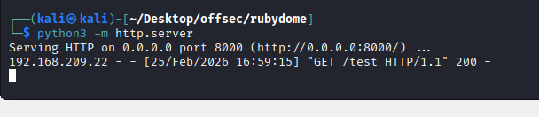
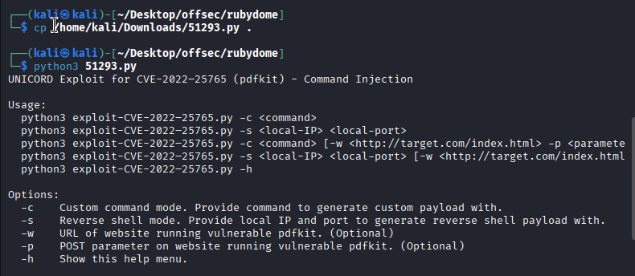
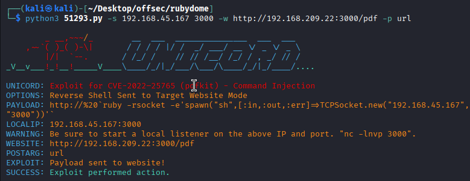
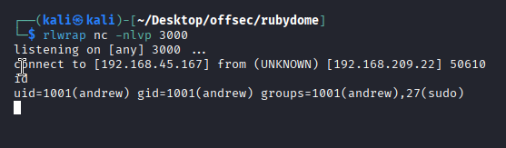

Nmap scan
```sh
nmap -p- --min-rate 5000 -T4 -Pn 192.168.185.22
Starting Nmap 7.95 ( https://nmap.org ) at 2026-02-25 11:36 IST
Warning: 192.168.185.22 giving up on port because retransmission cap hit (6).
Stats: 0:01:09 elapsed; 0 hosts completed (1 up), 1 undergoing SYN Stealth Scan
SYN Stealth Scan Timing: About 99.99% done; ETC: 11:37 (0:00:00 remaining)
Nmap scan report for 192.168.185.22
Host is up (3.9s latency).
Not shown: 61265 closed tcp ports (reset), 4268 filtered tcp ports (no-response)
PORT     STATE SERVICE
22/tcp   open  ssh
3000/tcp open  ppp

Nmap done: 1 IP address (1 host up) scanned in 83.65 seconds
```
```sh
nmap -sC -sV -T4 -p22,3000 192.168.209.22 
Starting Nmap 7.95 ( https://nmap.org ) at 2026-02-25 16:27 IST
Nmap scan report for 192.168.209.22
Host is up (0.12s latency).

PORT     STATE SERVICE VERSION
22/tcp   open  ssh     OpenSSH 8.9p1 Ubuntu 3ubuntu0.1 (Ubuntu Linux; protocol 2.0)
| ssh-hostkey: 
|   256 b9:bc:8f:01:3f:85:5d:f9:5c:d9:fb:b6:15:a0:1e:74 (ECDSA)
|_  256 53:d9:7f:3d:22:8a:fd:57:98:fe:6b:1a:4c:ac:79:67 (ED25519)
3000/tcp open  http    WEBrick httpd 1.7.0 (Ruby 3.0.2 (2021-07-07))
|_http-title: RubyDome HTML to PDF
|_http-server-header: WEBrick/1.7.0 (Ruby/3.0.2/2021-07-07)
Service Info: OS: Linux; CPE: cpe:/o:linux:linux_kernel

Service detection performed. Please report any incorrect results at https://nmap.org/submit/ .
Nmap done: 1 IP address (1 host up) scanned in 11.35 seconds
```

Visiting web server on port 3000.

I noticed that the application accepts URLs of target HTML pages. To check for an SSRF vulnerability, I hosted a Python web server and provided its URL to the RubyDome application. When I sent the URL, I received an interaction from the target server, confirming the vulnerability.


**Another way to get shell**
We can generate the payload.

Then, hit the application blank URL and capture it in burp suite and change the URL with payload and send. Before this start the nc.

### Method 1 Continue
I also observed that the application displayed an error revealing sensitive information. From this error, I discovered that the application is using the `pdfkit` library.
RubyDome HTML to PDF: Upon googling it, I quickly found numerous exploits.

We download the exploit from exploit-db and ran it.

We generated payload using exploit.

And we got the shell.

We captured the local flag.

### Privilege Escalation
Checked sudo commands.

Searched for ruby based shell and found one on GTFobins.

### What each part does:

|Part|Meaning|
|---|---|
|`ruby`|start Ruby interpreter|
|`-e`|execute inline Ruby code|
|`'exec "/bin/sh"'`|Ruby code to run|
You are already running:

`sudo ruby /home/andrew/app/app.rb`

This means:

✔ Ruby interpreter is already running  
✔ It is executing Ruby code inside the script  
✔ You only need to supply **Ruby code**, not a Ruby command

## Correct approach inside Ruby script

You insert **Ruby code**, not shell syntax:

`exec "/bin/sh"`

### Why this works

- `exec` is a Ruby method
    
- it replaces the current process
    
- spawns `/bin/sh`
    
- since script runs with sudo → shell is root
So we add ruby script into that app.

And simply run the command.


## 🆚 Alternative Ruby shell methods

These also work:

`system("/bin/sh")`

`spawn("/bin/sh")`

`/bin/sh`
