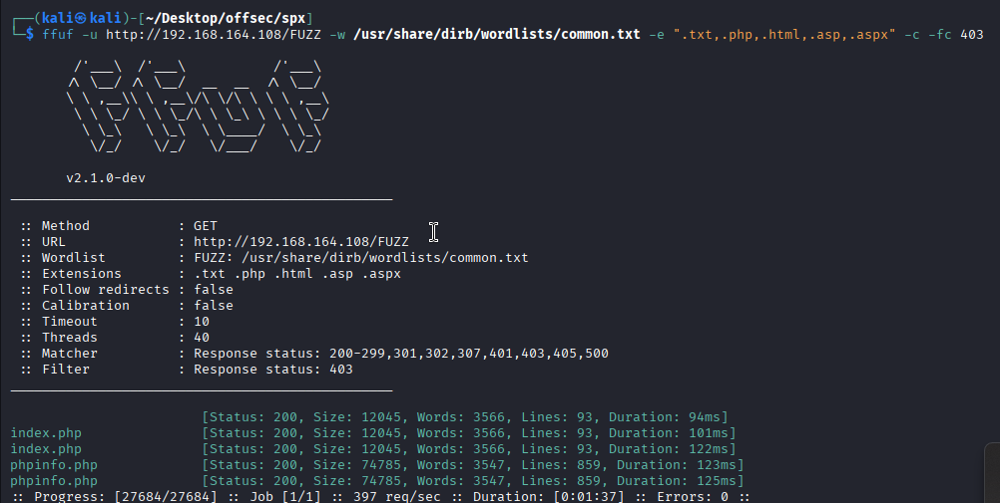
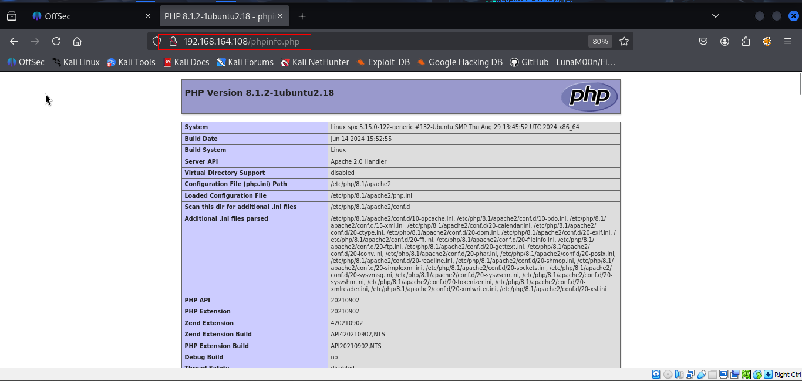
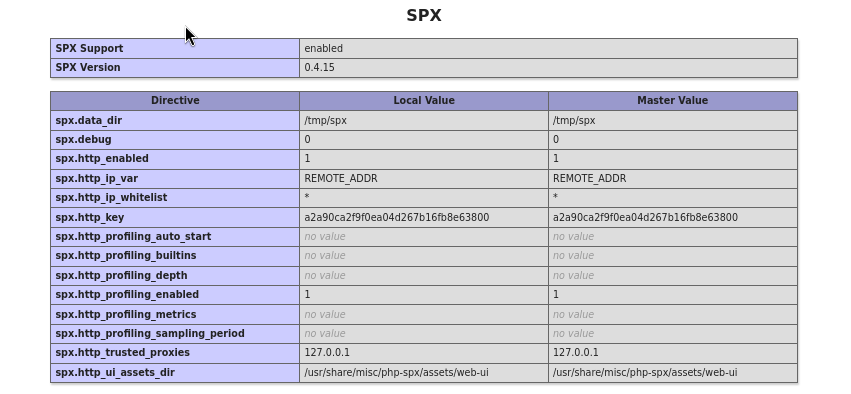

Nmap scan
```sh
nmap -p- --min-rate 5000 -T4 -Pn 192.168.164.108
Starting Nmap 7.95 ( https://nmap.org ) at 2026-02-25 09:23 IST
Nmap scan report for 192.168.164.108
Host is up (0.22s latency).
Not shown: 65533 filtered tcp ports (no-response)
PORT   STATE SERVICE
22/tcp open  ssh
80/tcp open  http

Nmap done: 1 IP address (1 host up) scanned in 26.97 seconds
```

```sh
nmap -sC -sV -T4 -Pn -p 22,80 192.168.164.108   
Starting Nmap 7.95 ( https://nmap.org ) at 2026-02-25 09:24 IST
Nmap scan report for 192.168.164.108
Host is up (0.081s latency).

PORT   STATE SERVICE VERSION
22/tcp open  ssh     OpenSSH 8.9p1 Ubuntu 3ubuntu0.10 (Ubuntu Linux; protocol 2.0)
| ssh-hostkey: 
|   256 b9:bc:8f:01:3f:85:5d:f9:5c:d9:fb:b6:15:a0:1e:74 (ECDSA)
|_  256 53:d9:7f:3d:22:8a:fd:57:98:fe:6b:1a:4c:ac:79:67 (ED25519)
80/tcp open  http    Apache httpd 2.4.52 ((Ubuntu))
|_http-title: Tiny File Manager
|_http-server-header: Apache/2.4.52 (Ubuntu)
Service Info: OS: Linux; CPE: cpe:/o:linux:linux_kernel

Service detection performed. Please report any incorrect results at https://nmap.org/submit/ .
Nmap done: 1 IP address (1 host up) scanned in 12.48 seconds
```
Visiting web server on port 80.


Directory brute forcing



Accessing `phpinfo.php` shows that `SPX` is enabled on the server. The `phpinfo()` output reveals a key—`SPX_KEY='a2a90ca2f9f0ea04d267b16fb8e63800'`.


Did some research and found out that php-spx of the version of the machine we are onto is vulnerable to path transversal and has been assigned `CVE-2024–42007`. This particular POC on this below links helped me understand the vulnerability and exploit it.
https://www.vicarius.io/vsociety/posts/journey-to-discovery-and-exploitation-of-path-traversal-in-php-spx-cve-2024-42007
https://github.com/BubblyCola/CVE_2024_42007/blob/main/README.md
A known vulnerability ([CVE-2024-42007](https://www.cve.org/CVERecord?id=CVE-2024-42007)) affects SPX: this is a directory traversal flaw that can be exploited if you know the `SPX_KEY`. With that key in hand, we can read arbitrary files
