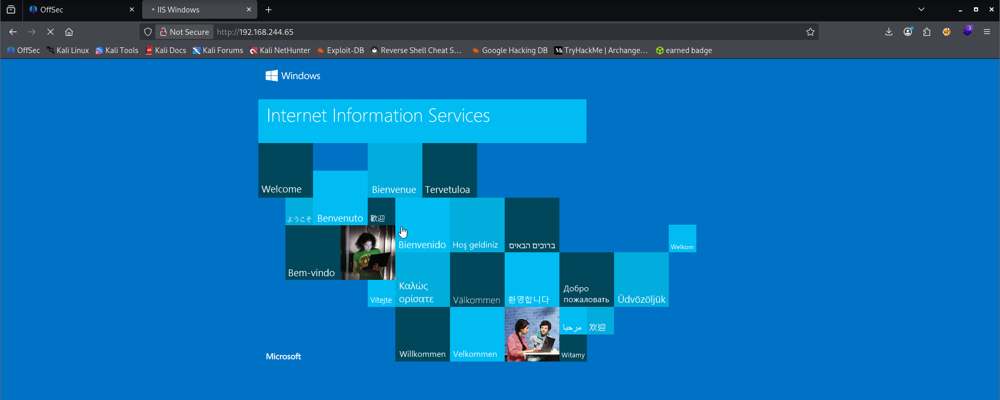
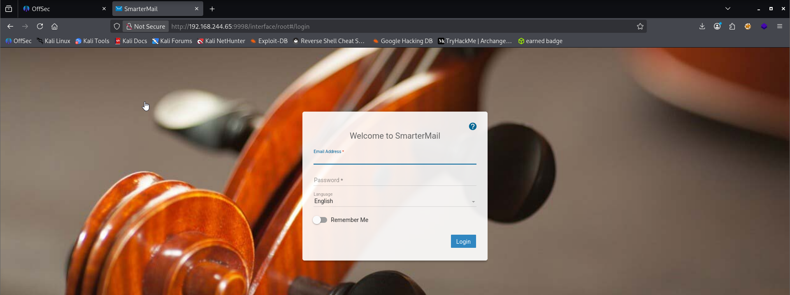
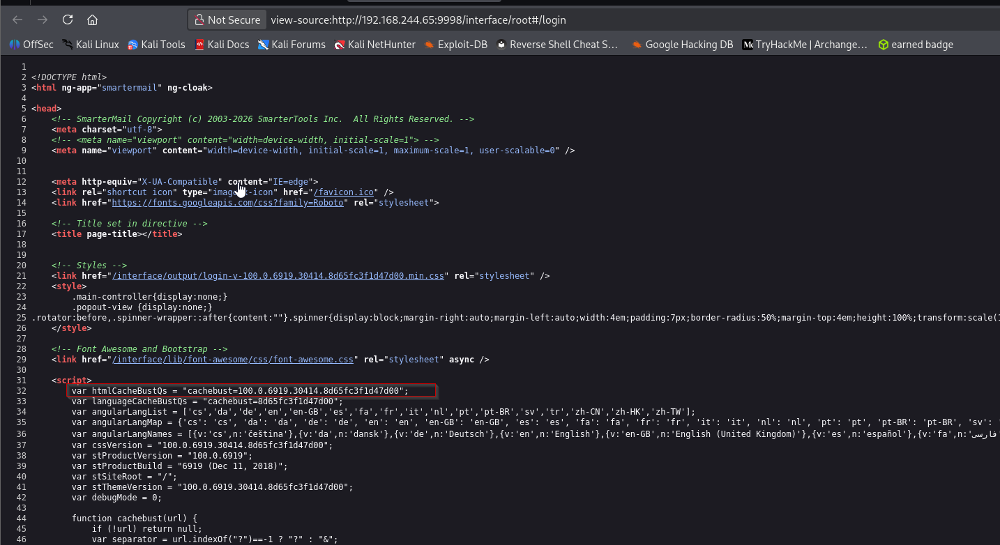
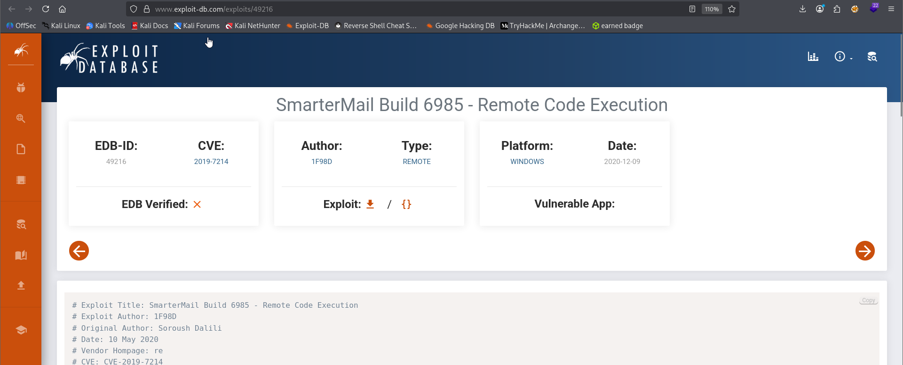
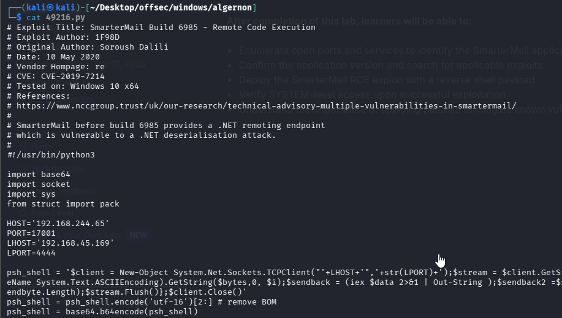
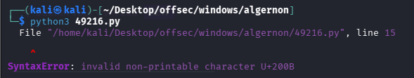
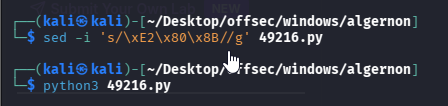
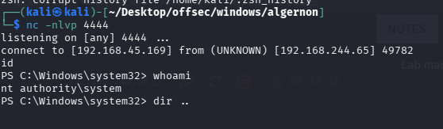
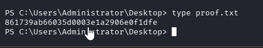

Nmap scan.
```sh
nmap -p- --min-rate 5000 -T4 -Pn 192.168.244.65                                                    
Starting Nmap 7.95 ( https://nmap.org ) at 2026-03-11 17:14 IST
Warning: 192.168.244.65 giving up on port because retransmission cap hit (6).
Nmap scan report for 192.168.244.65
Host is up (0.16s latency).
Not shown: 65509 closed tcp ports (reset)
PORT      STATE    SERVICE
21/tcp    open     ftp
80/tcp    open     http
135/tcp   open     msrpc
139/tcp   open     netbios-ssn
445/tcp   open     microsoft-ds
615/tcp   filtered sco-inetmgr
5040/tcp  open     unknown
7680/tcp  open     pando-pub
9998/tcp  open     distinct32
13934/tcp filtered unknown
15209/tcp filtered unknown
17001/tcp open     unknown
18741/tcp filtered unknown
20863/tcp filtered unknown
38912/tcp filtered unknown
44930/tcp filtered unknown
49664/tcp open     unknown
49665/tcp open     unknown
49666/tcp open     unknown
49667/tcp open     unknown
49668/tcp open     unknown
49669/tcp open     unknown
59901/tcp filtered unknown
61929/tcp filtered unknown
62531/tcp filtered unknown
63455/tcp filtered unknown

Nmap done: 1 IP address (1 host up) scanned in 20.09 seconds
```

```sh

```
Visiting web server on port 80. The web server only displayed the default **IIS** page.

Then, I tried accessing **port 9998**.

Since no email or password was known for login, and the **SmarterMail** version was also unknown, I inspected the webpage elements and found that the **SmarterMail version in use was 100.0.6919 (build 6919)**.

After searching online for an exploit targeting **SmarterMail 6919**, I found a relevant entry on **ExploitDB**. According to the information, **SmarterMail versions before build 6985** expose a **.NET remoting endpoint**, which is vulnerable to a **.NET deserialization attack**. This aligns with **port 170001 (MS .NET Remoting Services)** being open.
https://www.exploit-db.com/exploits/49216

## Initial Access:

I downloaded the public exploit from **ExploitDB** and modified the `HOST` and `LHOST` parameters. The `LPORT` parameter was optional, but I left it at its default value, **port 4444**, for the reverse shell listener.

When we ran exploit we run into the following error.

# Why this happens

Many websites insert invisible Unicode characters such as:

- **U+200B** → Zero Width Space
- **U+200C** → Zero Width Non-Joiner
- **U+FEFF** → BOM


They are **invisible in editors**, but Python still reads them.

So Python sees something like:

```sh
<invisible character>  
#!/usr/bin/python3
```


and fails.
# How to Fix It (Best Methods)

## Method 1 — Quick Fix (Recommended)

Remove hidden characters using `sed`.
`
```sh
sed -i 's/\xE2\x80\x8B//g' 49216.py
```
Then run again:


Captured the flag.

