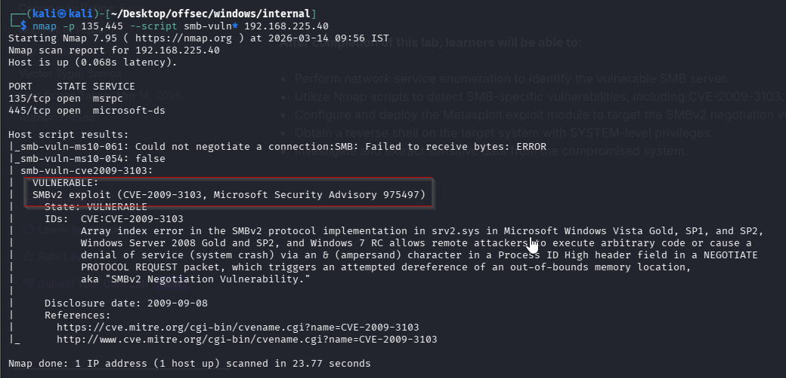
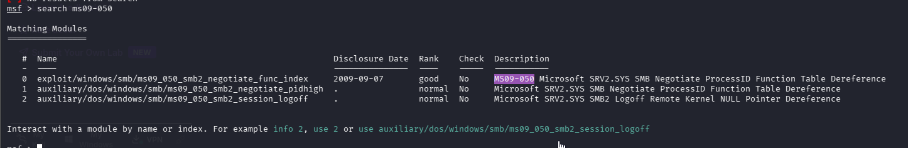
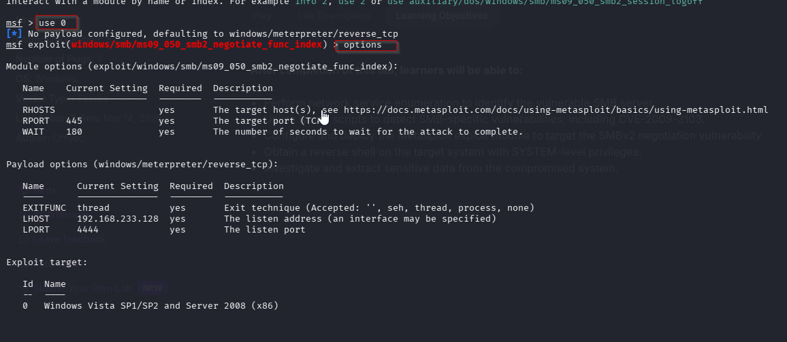
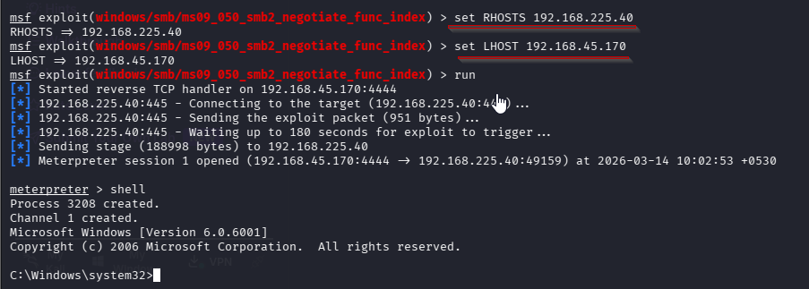
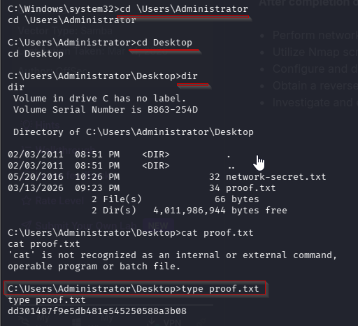

Nmap scan
```sh
nmap -p- --min-rate 5000 -T4 -Pn 192.168.224.40
Starting Nmap 7.95 ( https://nmap.org ) at 2026-03-13 21:02 IST
Warning: 192.168.224.40 giving up on port because retransmission cap hit (6).
Nmap scan report for 192.168.224.40
Host is up (0.099s latency).
Not shown: 64532 closed tcp ports (reset), 990 filtered tcp ports (no-response)
PORT      STATE SERVICE
53/tcp    open  domain
135/tcp   open  msrpc
139/tcp   open  netbios-ssn
445/tcp   open  microsoft-ds
3389/tcp  open  ms-wbt-server
5357/tcp  open  wsdapi
49152/tcp open  unknown
49153/tcp open  unknown
49154/tcp open  unknown
49155/tcp open  unknown
49156/tcp open  unknown
49157/tcp open  unknown
49158/tcp open  unknown

Nmap done: 1 IP address (1 host up) scanned in 25.37 seconds
```

```sh
nmap -sC -sV -T4 -Pn -p 53,135,139,445,3389,5357,49152,49153,49154,49155,49156,49157,49158 192.168.224.40
Starting Nmap 7.95 ( https://nmap.org ) at 2026-03-13 21:05 IST
Nmap scan report for 192.168.224.40
Host is up (0.16s latency).

PORT      STATE SERVICE      VERSION
53/tcp    open  domain       Microsoft DNS 6.0.6001 (17714650) (Windows Server 2008 SP1)
| dns-nsid: 
|_  bind.version: Microsoft DNS 6.0.6001 (17714650)
135/tcp   open  msrpc        Microsoft Windows RPC
139/tcp   open  netbios-ssn  Microsoft Windows netbios-ssn
445/tcp   open  microsoft-ds Windows Server (R) 2008 Standard 6001 Service Pack 1 microsoft-ds (workgroup: WORKGROUP)
3389/tcp  open  tcpwrapped
|_ssl-date: 2026-03-13T15:36:19+00:00; -1s from scanner time.
| ssl-cert: Subject: commonName=internal
| Not valid before: 2025-01-05T19:52:51
|_Not valid after:  2025-07-07T19:52:51
| rdp-ntlm-info: 
|   Target_Name: INTERNAL
|   NetBIOS_Domain_Name: INTERNAL
|   NetBIOS_Computer_Name: INTERNAL
|   DNS_Domain_Name: internal
|   DNS_Computer_Name: internal
|   Product_Version: 6.0.6001
|_  System_Time: 2026-03-13T15:36:05+00:00
5357/tcp  open  http         Microsoft HTTPAPI httpd 2.0 (SSDP/UPnP)
|_http-server-header: Microsoft-HTTPAPI/2.0
|_http-title: Service Unavailable
49152/tcp open  msrpc        Microsoft Windows RPC
49153/tcp open  msrpc        Microsoft Windows RPC
49154/tcp open  msrpc        Microsoft Windows RPC
49155/tcp open  msrpc        Microsoft Windows RPC
49156/tcp open  msrpc        Microsoft Windows RPC
49157/tcp open  msrpc        Microsoft Windows RPC
49158/tcp open  msrpc        Microsoft Windows RPC
Service Info: Host: INTERNAL; OS: Windows; CPE: cpe:/o:microsoft:windows_server_2008::sp1, cpe:/o:microsoft:windows, cpe:/o:microsoft:windows_server_2008:r2

Host script results:
| smb-security-mode: 
|   account_used: guest
|   authentication_level: user
|   challenge_response: supported
|_  message_signing: disabled (dangerous, but default)
|_clock-skew: mean: 1h23m59s, deviation: 3h07m50s, median: 0s
| smb2-security-mode: 
|   2:0:2: 
|_    Message signing enabled but not required
| smb2-time: 
|   date: 2026-03-13T15:36:04
|_  start_date: 2025-02-20T21:30:47
| smb-os-discovery: 
|   OS: Windows Server (R) 2008 Standard 6001 Service Pack 1 (Windows Server (R) 2008 Standard 6.0)
|   OS CPE: cpe:/o:microsoft:windows_server_2008::sp1
|   Computer name: internal
|   NetBIOS computer name: INTERNAL\x00
|   Workgroup: WORKGROUP\x00
|_  System time: 2026-03-13T08:36:04-07:00
|_nbstat: NetBIOS name: INTERNAL, NetBIOS user: <unknown>, NetBIOS MAC: 00:50:56:ab:8d:b9 (VMware)

Service detection performed. Please report any incorrect results at https://nmap.org/submit/ .
Nmap done: 1 IP address (1 host up) scanned in 79.37 seconds
```

```sh
nmap -p 135,445 --script smb-vuln* 192.168.225.40
```


Based on the results of the SMB scan, I discovered that the SMBv2 in use is vulnerable to CVE-2009–3103 (MS09–050), which can lead to Remote Code Execution.

## Initial Access:

After several failed attempts to execute a public exploit using Python3, I decided to use Metasploit for the exploitation.

First, launch `msfconsole` and search for `MS09-050` to check for available exploits related to CVE-2009-3103.
```sh
search ms09-050
```






