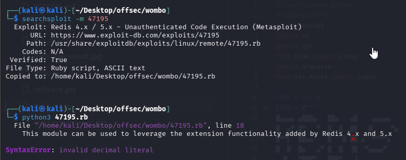

Nmap scan
```sh
nmap -p- --min-rate 5000 -T4 -Pn 192.168.244.69 
Starting Nmap 7.95 ( https://nmap.org ) at 2026-02-28 17:18 IST
Nmap scan report for 192.168.244.69
Host is up (0.067s latency).
Not shown: 65529 filtered tcp ports (no-response)
PORT      STATE  SERVICE
22/tcp    open   ssh
53/tcp    closed domain
80/tcp    open   http
6379/tcp  open   redis
8080/tcp  open   http-proxy
27017/tcp open   mongod

Nmap done: 1 IP address (1 host up) scanned in 26.52 seconds
```

```sh
nmap -sC -sV -T4 -Pn -p 22,80,6379,8080,27017 192.168.244.69
Starting Nmap 7.95 ( https://nmap.org ) at 2026-02-28 17:19 IST
Nmap scan report for 192.168.244.69
Host is up (0.17s latency).

PORT      STATE SERVICE    VERSION
22/tcp    open  ssh        OpenSSH 7.4p1 Debian 10+deb9u7 (protocol 2.0)
| ssh-hostkey: 
|   2048 09:80:39:ef:3f:61:a8:d9:e6:fb:04:94:23:c9:ef:a8 (RSA)
|   256 83:f8:6f:50:7a:62:05:aa:15:44:10:f5:4a:c2:f5:a6 (ECDSA)
|_  256 1e:2b:13:30:5c:f1:31:15:b4:e8:f3:d2:c4:e8:05:b5 (ED25519)
80/tcp    open  http       nginx 1.10.3
|_http-server-header: nginx/1.10.3
|_http-title: Welcome to nginx!
6379/tcp  open  redis      Redis key-value store 5.0.9
8080/tcp  open  http-proxy
|_http-title: Home | NodeBB
| http-robots.txt: 3 disallowed entries 
|_/admin/ /reset/ /compose
| fingerprint-strings: 
|   FourOhFourRequest: 
|     HTTP/1.1 404 Not Found
|     X-DNS-Prefetch-Control: off
|     X-Frame-Options: SAMEORIGIN
|     X-Download-Options: noopen
|     X-Content-Type-Options: nosniff
|     X-XSS-Protection: 1; mode=block
|     Referrer-Policy: strict-origin-when-cross-origin
|     X-Powered-By: NodeBB
|     set-cookie: _csrf=Vtr51NRYUuBd72Ea463eKa1M; Path=/
|     Content-Type: text/html; charset=utf-8
|     Content-Length: 11098
|     ETag: W/"2b5a-uFnxTGxsIk75WgvVk1fNh94Fdr8"
|     Vary: Accept-Encoding
|     Date: Sat, 28 Feb 2026 11:49:56 GMT
|     Connection: close
|     <!DOCTYPE html>
|     <html lang="en-GB" data-dir="ltr" style="direction: ltr;" >
|     <head>
|     <title>Not Found | NodeBB</title>
|     <meta name="viewport" content="width&#x3D;device-width, initial-scale&#x3D;1.0" />
|     <meta name="content-type" content="text/html; charset=UTF-8" />
|     <meta name="apple-mobile-web-app-capable" content="yes" />
|     <meta name="mobile-web-app-capable" content="yes" />
|     <meta property="og:site_n
|   GetRequest: 
|     HTTP/1.1 200 OK
|     X-DNS-Prefetch-Control: off
|     X-Frame-Options: SAMEORIGIN
|     X-Download-Options: noopen
|     X-Content-Type-Options: nosniff
|     X-XSS-Protection: 1; mode=block
|     Referrer-Policy: strict-origin-when-cross-origin
|     X-Powered-By: NodeBB
|     set-cookie: _csrf=t1z2X2GxNIyBVo9Gpt9d184c; Path=/
|     Content-Type: text/html; charset=utf-8
|     Content-Length: 18181
|     ETag: W/"4705-tcVZuDk5Twby9AnXakNSz/CKShw"
|     Vary: Accept-Encoding
|     Date: Sat, 28 Feb 2026 11:49:55 GMT
|     Connection: close
|     <!DOCTYPE html>
|     <html lang="en-GB" data-dir="ltr" style="direction: ltr;" >
|     <head>
|     <title>Home | NodeBB</title>
|     <meta name="viewport" content="width&#x3D;device-width, initial-scale&#x3D;1.0" />
|     <meta name="content-type" content="text/html; charset=UTF-8" />
|     <meta name="apple-mobile-web-app-capable" content="yes" />
|     <meta name="mobile-web-app-capable" content="yes" />
|     <meta property="og:site_name" content
|   HTTPOptions: 
|     HTTP/1.1 200 OK
|     X-DNS-Prefetch-Control: off
|     X-Frame-Options: SAMEORIGIN
|     X-Download-Options: noopen
|     X-Content-Type-Options: nosniff
|     X-XSS-Protection: 1; mode=block
|     Referrer-Policy: strict-origin-when-cross-origin
|     X-Powered-By: NodeBB
|     Allow: GET,HEAD
|     Content-Type: text/html; charset=utf-8
|     Content-Length: 8
|     ETag: W/"8-ZRAf8oNBS3Bjb/SU2GYZCmbtmXg"
|     Vary: Accept-Encoding
|     Date: Sat, 28 Feb 2026 11:49:55 GMT
|     Connection: close
|     GET,HEAD
|   RTSPRequest: 
|     HTTP/1.1 400 Bad Request
|_    Connection: close
27017/tcp open  mongodb    MongoDB 4.0.18 4.1.1 - 5.0
| mongodb-databases: 
|   code = 13
|   errmsg = command listDatabases requires authentication
|   codeName = Unauthorized
|_  ok = 0.0
| mongodb-info: 
|   MongoDB Build info
|     openssl
|       running = OpenSSL 1.1.0l  10 Sep 2019
|       compiled = OpenSSL 1.1.0l  10 Sep 2019
|     versionArray
|       0 = 4
|       1 = 0
|       2 = 18
|       3 = 0
|     bits = 64
|     storageEngines
|       0 = devnull
|       1 = ephemeralForTest
|       2 = mmapv1
|       3 = wiredTiger
|     buildEnvironment
|       cxx = /opt/mongodbtoolchain/v2/bin/g++: g++ (GCC) 5.4.0
|       distmod = debian92
|       ccflags = -fno-omit-frame-pointer -fno-strict-aliasing -ggdb -pthread -Wall -Wsign-compare -Wno-unknown-pragmas -Winvalid-pch -Werror -O2 -Wno-unused-local-typedefs -Wno-unused-function -Wno-deprecated-declarations -Wno-unused-but-set-variable -Wno-missing-braces -fstack-protector-strong -fno-builtin-memcmp
|       cc = /opt/mongodbtoolchain/v2/bin/gcc: gcc (GCC) 5.4.0
|       linkflags = -pthread -Wl,-z,now -rdynamic -Wl,--fatal-warnings -fstack-protector-strong -fuse-ld=gold -Wl,--build-id -Wl,--hash-style=gnu -Wl,-z,noexecstack -Wl,--warn-execstack -Wl,-z,relro
|       cxxflags = -Woverloaded-virtual -Wno-maybe-uninitialized -std=c++14
|       target_os = linux
|       distarch = x86_64
|       target_arch = x86_64
|     allocator = tcmalloc
|     gitVersion = 6883bdfb8b8cff32176b1fd176df04da9165fd67
|     sysInfo = deprecated
|     version = 4.0.18
|     ok = 1.0
|     maxBsonObjectSize = 16777216
|     debug = false
|     javascriptEngine = mozjs
|     modules
|   Server status
|     code = 13
|     errmsg = command serverStatus requires authentication
|     codeName = Unauthorized
|_    ok = 0.0
1 service unrecognized despite returning data. If you know the service/version, please submit the following fingerprint at https://nmap.org/cgi-bin/submit.cgi?new-service :
SF-Port8080-TCP:V=7.95%I=7%D=2/28%Time=69A2D663%P=x86_64-pc-linux-gnu%r(Ge
SF:tRequest,3638,"HTTP/1\.1\x20200\x20OK\r\nX-DNS-Prefetch-Control:\x20off
SF:\r\nX-Frame-Options:\x20SAMEORIGIN\r\nX-Download-Options:\x20noopen\r\n
SF:X-Content-Type-Options:\x20nosniff\r\nX-XSS-Protection:\x201;\x20mode=b
SF:lock\r\nReferrer-Policy:\x20strict-origin-when-cross-origin\r\nX-Powere
SF:d-By:\x20NodeBB\r\nset-cookie:\x20_csrf=t1z2X2GxNIyBVo9Gpt9d184c;\x20Pa
SF:th=/\r\nContent-Type:\x20text/html;\x20charset=utf-8\r\nContent-Length:
SF:\x2018181\r\nETag:\x20W/\"4705-tcVZuDk5Twby9AnXakNSz/CKShw\"\r\nVary:\x
SF:20Accept-Encoding\r\nDate:\x20Sat,\x2028\x20Feb\x202026\x2011:49:55\x20
SF:GMT\r\nConnection:\x20close\r\n\r\n<!DOCTYPE\x20html>\r\n<html\x20lang=
SF:\"en-GB\"\x20data-dir=\"ltr\"\x20style=\"direction:\x20ltr;\"\x20\x20>\
SF:r\n<head>\r\n\t<title>Home\x20\|\x20NodeBB</title>\r\n\t<meta\x20name=\
SF:"viewport\"\x20content=\"width&#x3D;device-width,\x20initial-scale&#x3D
SF:;1\.0\"\x20/>\n\t<meta\x20name=\"content-type\"\x20content=\"text/html;
SF:\x20charset=UTF-8\"\x20/>\n\t<meta\x20name=\"apple-mobile-web-app-capab
SF:le\"\x20content=\"yes\"\x20/>\n\t<meta\x20name=\"mobile-web-app-capable
SF:\"\x20content=\"yes\"\x20/>\n\t<meta\x20property=\"og:site_name\"\x20co
SF:ntent")%r(HTTPOptions,1BF,"HTTP/1\.1\x20200\x20OK\r\nX-DNS-Prefetch-Con
SF:trol:\x20off\r\nX-Frame-Options:\x20SAMEORIGIN\r\nX-Download-Options:\x
SF:20noopen\r\nX-Content-Type-Options:\x20nosniff\r\nX-XSS-Protection:\x20
SF:1;\x20mode=block\r\nReferrer-Policy:\x20strict-origin-when-cross-origin
SF:\r\nX-Powered-By:\x20NodeBB\r\nAllow:\x20GET,HEAD\r\nContent-Type:\x20t
SF:ext/html;\x20charset=utf-8\r\nContent-Length:\x208\r\nETag:\x20W/\"8-ZR
SF:Af8oNBS3Bjb/SU2GYZCmbtmXg\"\r\nVary:\x20Accept-Encoding\r\nDate:\x20Sat
SF:,\x2028\x20Feb\x202026\x2011:49:55\x20GMT\r\nConnection:\x20close\r\n\r
SF:\nGET,HEAD")%r(RTSPRequest,2F,"HTTP/1\.1\x20400\x20Bad\x20Request\r\nCo
SF:nnection:\x20close\r\n\r\n")%r(FourOhFourRequest,2D42,"HTTP/1\.1\x20404
SF:\x20Not\x20Found\r\nX-DNS-Prefetch-Control:\x20off\r\nX-Frame-Options:\
SF:x20SAMEORIGIN\r\nX-Download-Options:\x20noopen\r\nX-Content-Type-Option
SF:s:\x20nosniff\r\nX-XSS-Protection:\x201;\x20mode=block\r\nReferrer-Poli
SF:cy:\x20strict-origin-when-cross-origin\r\nX-Powered-By:\x20NodeBB\r\nse
SF:t-cookie:\x20_csrf=Vtr51NRYUuBd72Ea463eKa1M;\x20Path=/\r\nContent-Type:
SF:\x20text/html;\x20charset=utf-8\r\nContent-Length:\x2011098\r\nETag:\x2
SF:0W/\"2b5a-uFnxTGxsIk75WgvVk1fNh94Fdr8\"\r\nVary:\x20Accept-Encoding\r\n
SF:Date:\x20Sat,\x2028\x20Feb\x202026\x2011:49:56\x20GMT\r\nConnection:\x2
SF:0close\r\n\r\n<!DOCTYPE\x20html>\r\n<html\x20lang=\"en-GB\"\x20data-dir
SF:=\"ltr\"\x20style=\"direction:\x20ltr;\"\x20\x20>\r\n<head>\r\n\t<title
SF:>Not\x20Found\x20\|\x20NodeBB</title>\r\n\t<meta\x20name=\"viewport\"\x
SF:20content=\"width&#x3D;device-width,\x20initial-scale&#x3D;1\.0\"\x20/>
SF:\n\t<meta\x20name=\"content-type\"\x20content=\"text/html;\x20charset=U
SF:TF-8\"\x20/>\n\t<meta\x20name=\"apple-mobile-web-app-capable\"\x20conte
SF:nt=\"yes\"\x20/>\n\t<meta\x20name=\"mobile-web-app-capable\"\x20content
SF:=\"yes\"\x20/>\n\t<meta\x20property=\"og:site_n");
Service Info: OS: Linux; CPE: cpe:/o:linux:linux_kernel

Service detection performed. Please report any incorrect results at https://nmap.org/submit/ .
Nmap done: 1 IP address (1 host up) scanned in 25.90 seconds
```

Visiting web server on port 80 and 8080, we found.


We can leverage `searchsploit` to identify potential exploits related to NodeBB. By running the following command, we can search for any existing vulnerabilities associated with this application:

In attempting to test the exploit for **“NodeBB Plugin Emoji 3.2.1 — Arbitrary File Write,”** we discovered that admin access is required to execute the exploit effectively. Unfortunately, since we do not possess admin credentials, we are unable to proceed with this particular attack vector. We will need to explore alternative methods or vulnerabilities that do not require elevated privileges.
As it turns out, there are additional services running, including Redis on port 6379 and MongoDB on port 27017.
Searched public exploits for `redis`

Using above exploit, we faced error. So we searched for other python exploits as previous one was written in ruby.
Let’s proceed methodically. We’ll start by searching and researching the Redis service. I found a verified exploit for Redis 4.x / 5.x, which should work for our version as well.
https://github.com/jas502n/Redis-RCE?tab=readme-ov-file&source=post_page-----806d32d65274---------------------------------------
https://github.com/n0b0dyCN/redis-rogue-server
**Git clone the above exploits**
