Nmap scan
```sh
nmap -p- --min-rate 5000 -T4 -Pn 10.82.168.253
Starting Nmap 7.95 ( https://nmap.org ) at 2026-02-09 13:48 IST
Warning: 10.82.168.253 giving up on port because retransmission cap hit (6).
Nmap scan report for 10.82.168.253
Host is up (0.16s latency).
Not shown: 64616 closed tcp ports (reset), 915 filtered tcp ports (no-response)
PORT      STATE SERVICE
21/tcp    open  ftp
80/tcp    open  http
10000/tcp open  snet-sensor-mgmt
55007/tcp open  unknown

Nmap done: 1 IP address (1 host up) scanned in 30.42 seconds
```

```sh
nmap -sC -sV -T4 -Pn -p 21,80,10000,55007 10.82.168.253
Starting Nmap 7.95 ( https://nmap.org ) at 2026-02-09 13:49 IST
Nmap scan report for 10.82.168.253
Host is up (0.18s latency).

PORT      STATE SERVICE VERSION
21/tcp    open  ftp     vsftpd 3.0.3
| ftp-syst: 
|   STAT: 
| FTP server status:
|      Connected to ::ffff:192.168.161.2
|      Logged in as ftp
|      TYPE: ASCII
|      No session bandwidth limit
|      Session timeout in seconds is 300
|      Control connection is plain text
|      Data connections will be plain text
|      At session startup, client count was 3
|      vsFTPd 3.0.3 - secure, fast, stable
|_End of status
|_ftp-anon: Anonymous FTP login allowed (FTP code 230)
80/tcp    open  http    Apache httpd 2.4.18 ((Ubuntu))
|_http-title: Apache2 Ubuntu Default Page: It works
|_http-server-header: Apache/2.4.18 (Ubuntu)
| http-robots.txt: 1 disallowed entry 
|_/
10000/tcp open  http    MiniServ 1.930 (Webmin httpd)
|_http-title: Site doesn't have a title (text/html; Charset=iso-8859-1).
|_http-server-header: MiniServ/1.930
55007/tcp open  ssh     OpenSSH 7.2p2 Ubuntu 4ubuntu2.8 (Ubuntu Linux; protocol 2.0)
| ssh-hostkey: 
|   2048 e3:ab:e1:39:2d:95:eb:13:55:16:d6:ce:8d:f9:11:e5 (RSA)
|   256 ae:de:f2:bb:b7:8a:00:70:20:74:56:76:25:c0:df:38 (ECDSA)
|_  256 25:25:83:f2:a7:75:8a:a0:46:b2:12:70:04:68:5c:cb (ED25519)
Service Info: OSs: Unix, Linux; CPE: cpe:/o:linux:linux_kernel

Service detection performed. Please report any incorrect results at https://nmap.org/submit/ .
Nmap done: 1 IP address (1 host up) scanned in 39.02 seconds
```

ftp is running on port 21. The interesting thing is that it allows anonymous login. So, anyone can login and see what is in there. The username and password is ‘anonymous’ (Since anonymous login is allowed).

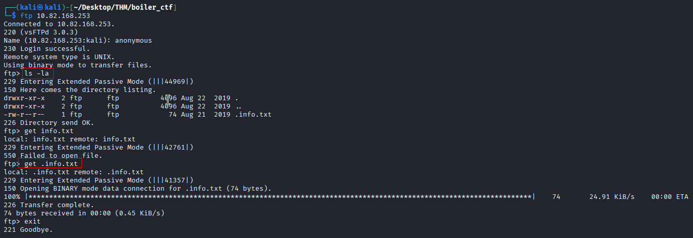

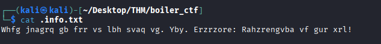
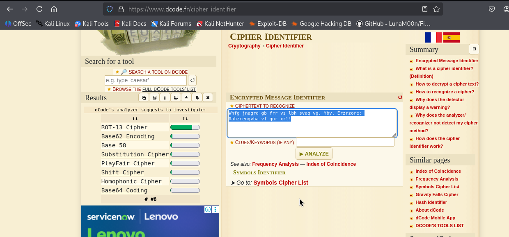
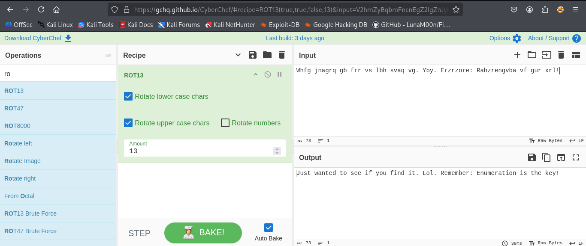

After that, let’s check the website on port 80. We have the default page for apache2(Ubuntu). I checked the page-source and saw nothing interesting (You can check if I missed something).
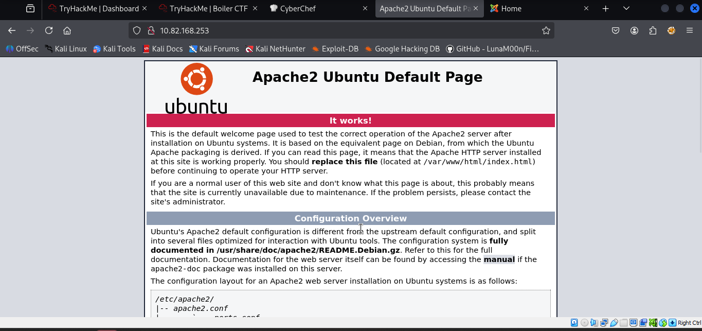
We can check other ports if we want. But, since we have a webserver here, we can see if there are hidden routes. I do this using **gobuster**.
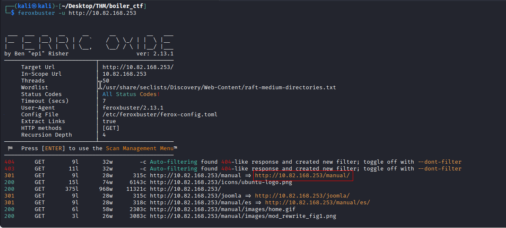
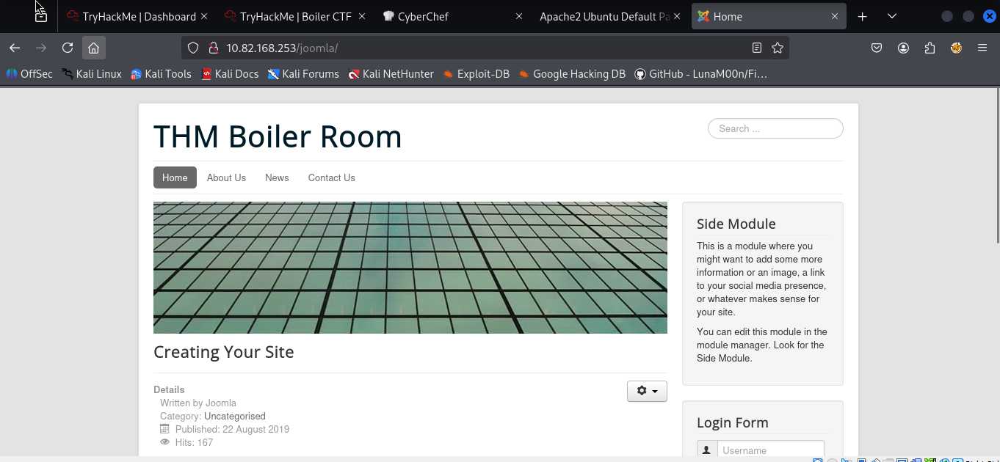

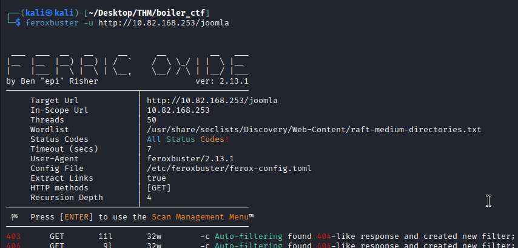

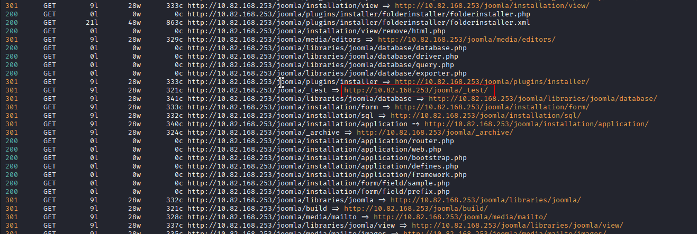

In the third route(/test), we have something. I don’t know what it is, so I downloaded the given find and extracted it.

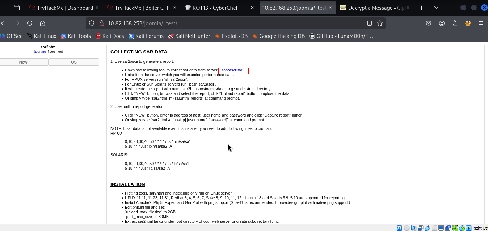

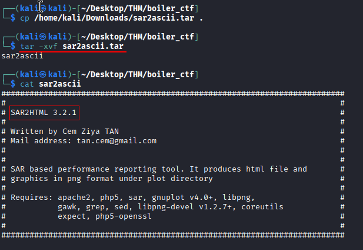
We see that the version is 3.2.1. I did a quick google search and found an exploit for it ([here](https://www.exploit-db.com/exploits/47204)). We have an RCE exploit.
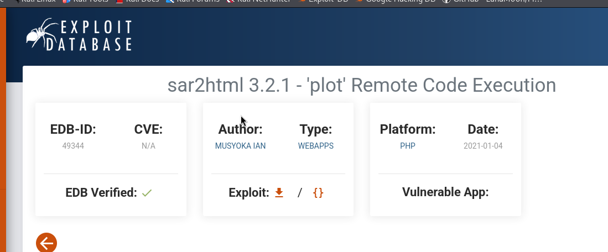
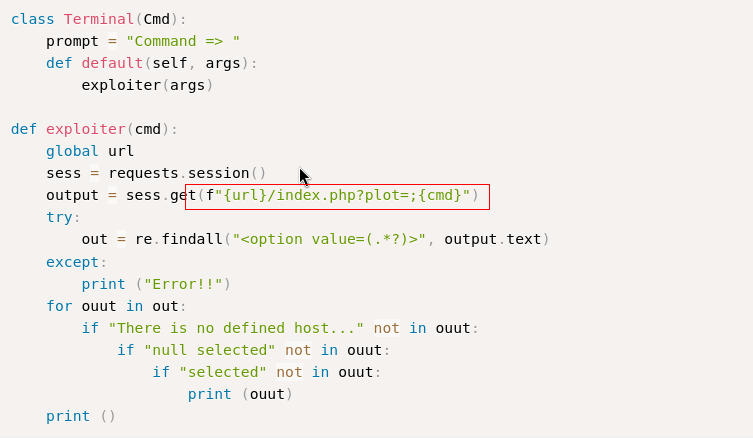
Now we can use the url to inject our commands.
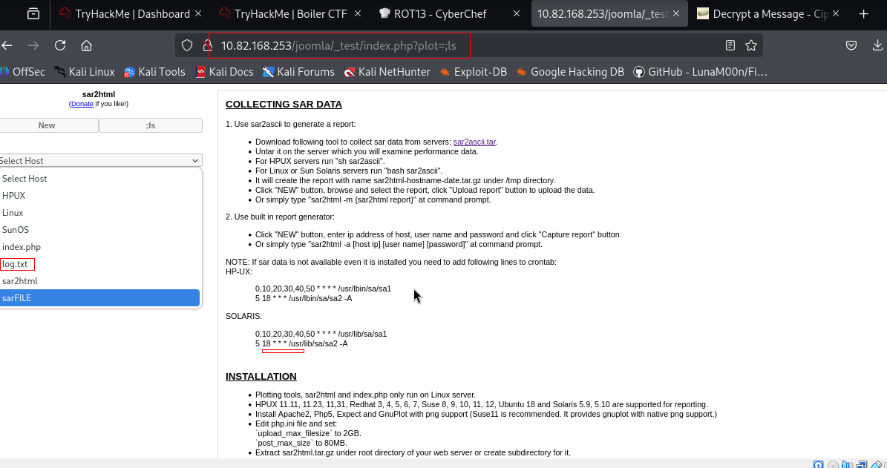
No we can use “cat log.txt” to read the file.
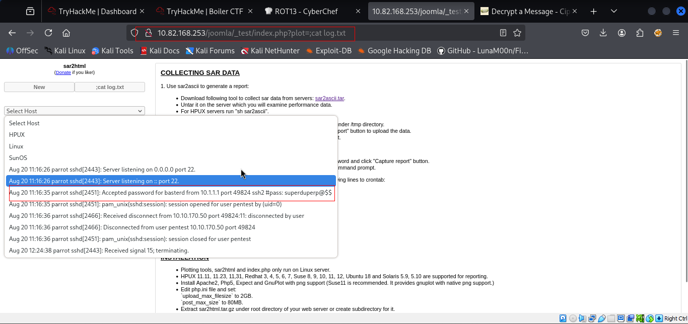

**basterd : superduperp@2timesdollarsign

Login to ssh using credentials.

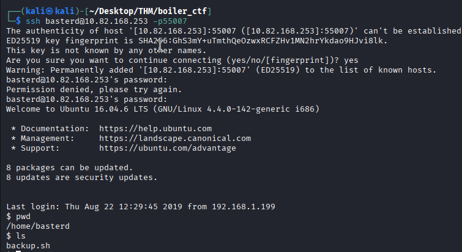
Now here is a file named as backup.sh, let’s see what’s inside this file
Here we can see a user and password, let’s switch to this user and see what’s there…

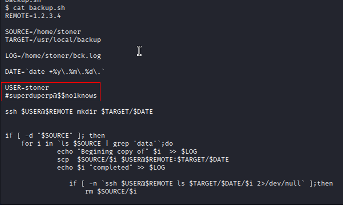
Now here is a file named as .secret.
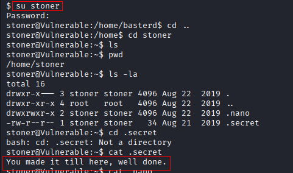

Now we have to escalate privilege to get the root flag..

We will search for 4000 permission to exploit that thing.
```sh
find / -perm -4000 2>/dev/null
```
Then, I tried to check if I can run any command as sudo, but NotThisTime.

Another way is to exploit binaries that have suid bit set. We can use the ‘**find**’ command to see what binaries have suid bit set.

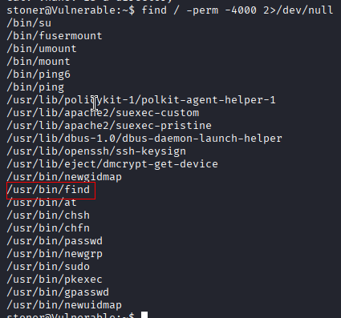

If you check [here](https://gtfobins.github.io/gtfobins/find/#suid), we see that the ‘**find**’ binary itself has an exploit that will give us higher privilege.
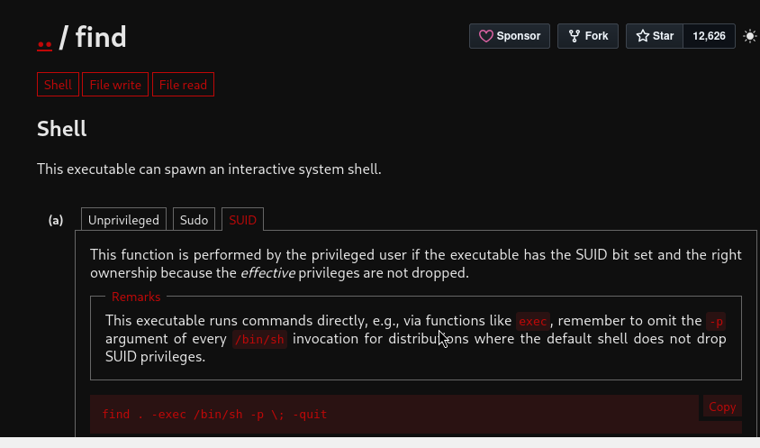
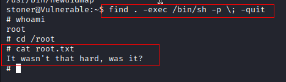
