Nmap scan
```sh
nmap -p- -sC -sV --min-rate 5000 -T4 -Pn 10.81.169.157
Starting Nmap 7.95 ( https://nmap.org ) at 2026-02-11 16:03 IST
Warning: 10.81.169.157 giving up on port because retransmission cap hit (6).
Nmap scan report for 10.81.169.157
Host is up (0.71s latency).
Not shown: 59643 closed tcp ports (reset), 5890 filtered tcp ports (no-response)
PORT   STATE SERVICE VERSION
22/tcp open  ssh     OpenSSH 7.2p2 Ubuntu 4ubuntu2.7 (Ubuntu Linux; protocol 2.0)
| ssh-hostkey: 
|   2048 61:ea:89:f1:d4:a7:dc:a5:50:f7:6d:89:c3:af:0b:03 (RSA)
|   256 b3:7d:72:46:1e:d3:41:b6:6a:91:15:16:c9:4a:a5:fa (ECDSA)
|_  256 53:67:09:dc:ff:fb:3a:3e:fb:fe:cf:d8:6d:41:27:ab (ED25519)
80/tcp open  http    Apache httpd 2.4.18 ((Ubuntu))
| http-cookie-flags: 
|   /: 
|     PHPSESSID: 
|_      httponly flag not set
|_http-server-header: Apache/2.4.18 (Ubuntu)
|_http-title: Game Zone
Service Info: OS: Linux; CPE: cpe:/o:linux:linux_kernel

Service detection performed. Please report any incorrect results at https://nmap.org/submit/ .
Nmap done: 1 IP address (1 host up) scanned in 70.29 seconds
```


### Web Discovery (Port 80/tcp):

Upon discovering the website, the next logical step is to navigate to the homepage and take a closer look. The homepage reveals that the character featured is "**Agent 47**," which could potentially serve as a username. The page appears to be fairly simple, with a login and site search box displayed.
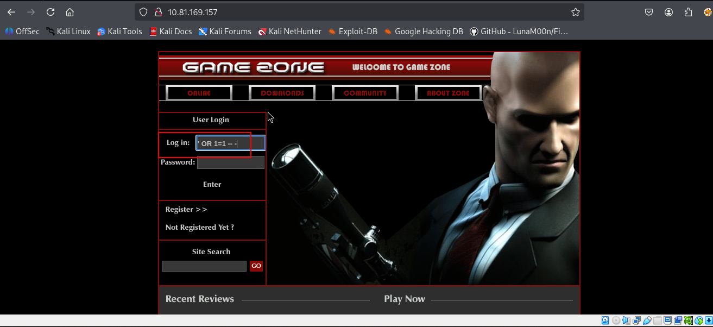
###  SQLi:
After noticing the presence of a login box, we attempted default credentials but they were unsuccessful. As the website appears to be custom-made, we attempted a basic login bypass using SQL injection. Specifically, we utilized the syntax: ' OR 1=1 -- -. This allowed us to bypass the login and gain access to a "portal.php" page that contains another search box.
After gaining initial access to the web server, we find ourselves with a limited search box that doesn't provide much information. To extract more useful data, we'll utilize SQLMap to dump the entire GameZone database.

After observing the aforementioned, the initial step would be to intercept a request made to the search feature through BurpSuite.
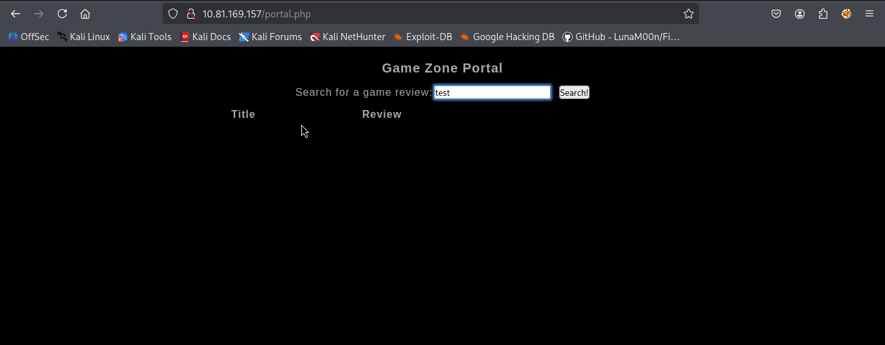
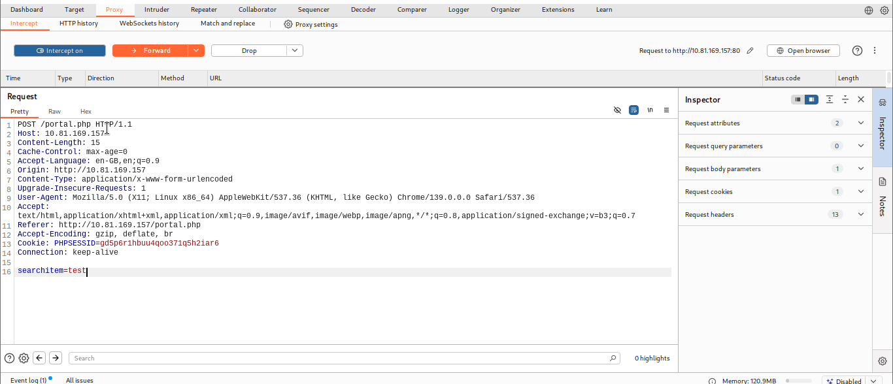
We can save the intercepted request made to the search feature using BurpSuite into a text file and then pass it to SQLMap to utilize our authenticated user session.

### SQLMap:
There exist several types of SQL injection attacks, such as boolean or time-based attacks. Fortunately, SQLMap automates the process by attempting various techniques until it identifies the vulnerable one. Once it is successful, SQLMap will output the entire database.
```sh
sqlmap -r request.txt --dbms=mysql --dump
```
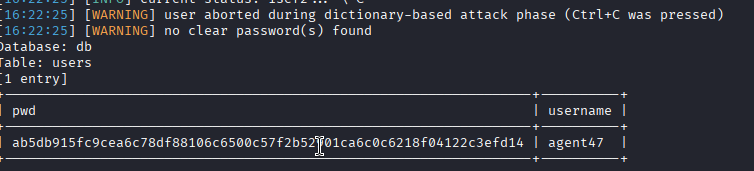
HASH : ab5db915fc9cea6c78df88106c6500c57f2b52901ca6c0c6218f04122c3efd14

Using hash-identifier we can easily find the corresponding hashing algorithm used, in this case SHA-256. We can save it to hash.txt so we can have JohnTheRipper a crack at it.
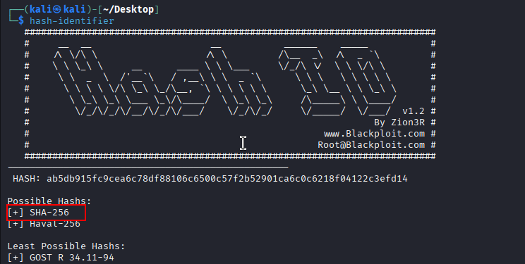
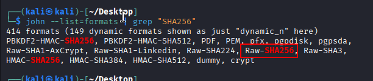
!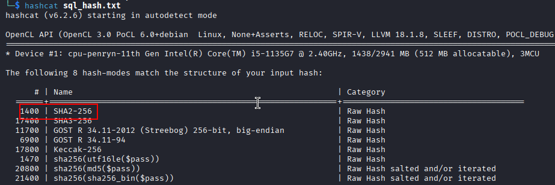
```sh
 hashcat -m 1400 sql_hash.txt /usr/share/wordlists/rockyou.txt
```
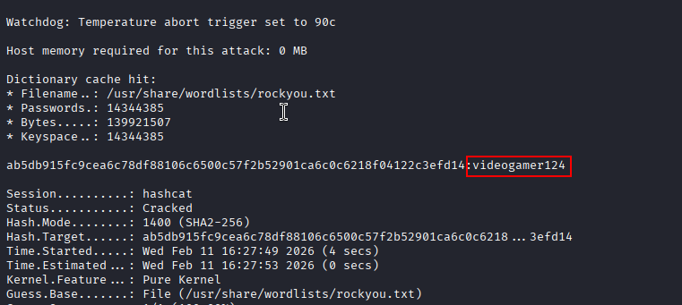

### Initial Foothold:
Having obtained the username and password through the previous steps, we can attempt to establish a SSH connection to the target machine. It's worth noting that during the Nmap scan, port 22 was found open, suggesting SSH was running.

If we try these credentials via SSH, we will get a full shell on the remote system running as agent47. So now we can further enumerate the machine and escalate our privileges to root.
### User Flag:
Once I gained access, I used the `find /home -name user.txt` command to search for the user flag, making it a quick and efficient method for finding it.

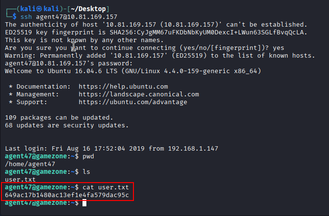
### SSH Tunneling:
By this point, it should be clear that in order to reveal additional services on this box, we need to use SSH tunneling, as it has been mentioned repeatedly throughout the TryHackMe room.

Reverse SSH port forwarding directs a specific port on the remote server to be forwarded to the designated host and port on the local side. To investigate sockets operating on a host, we will utilize a utility named `ss`. Running the command `ss -tulpn` will provide us with information regarding the socket connections that are currently running.

|              |                                    |
| ------------ | ---------------------------------- |
| **Argument** | **Description**                    |
| -t           | Display TCP sockets                |
| -u           | Display UDP sockets                |
| -l           | Displays only listening sockets    |
| -p           | Shows the process using the socket |
| -n           | Doesn't resolve service names      |
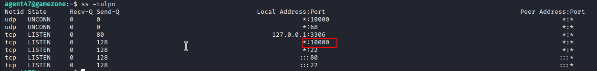
```sh
ssh -L 10000:localhost:10000 agent47@10.81.169.157
```
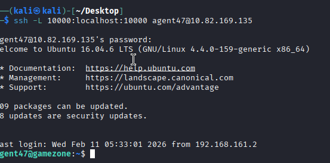
We have discovered that there is a running service on **port 10000** that was not detected during our initial Nmap scan. Fortunately, we can use SSH tunneling to expose the port to our local machine, allowing us to access it.

To set up the local tunnel, we use the command `ssh -L 10000:localhost:10000 agent47@$IP`.

- **-L**: indicates that we are creating a local tunnel. This means that if there are any blocked sites or services, we can forward their traffic to a server we own and view it.

> **Note**: **-R** syntax for example is used for creating a remote tunnel. This means that we forward our traffic to another server for others to view, which is similar to the previous example but in reverse.

Now that the port is open to us, we can navigate to localhost:10000 to reveal access the newly-exposed webserver with a login page running Webmin.
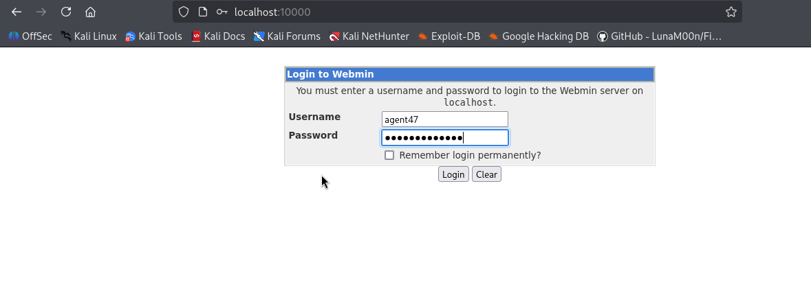
During our login attempt here, we found that the Agent 47 user had reused their password, which is a security issue. After accessing the machine, we discovered that it was running an outdated version of **Webmin (1.580)** and **Ubuntu 16.0.4.6 LTS**, which is no longer supported.
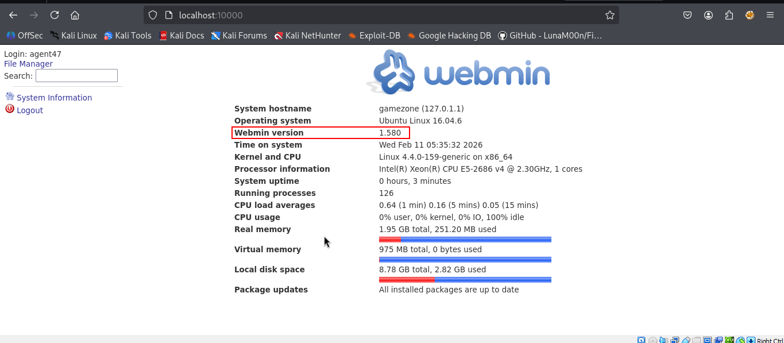

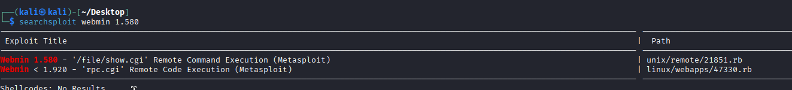
As per the Exploit Database ([https://www.exploit-db.com/exploits/21851](https://www.exploit-db.com/exploits/21851)), it was observed that the same vulnerability we can use for remote code execution could also be used to manually extract information from the underlying system as part of a **File Disclosure vulnerability**. The exploit operates by using "/Document follows/" via an URL path.
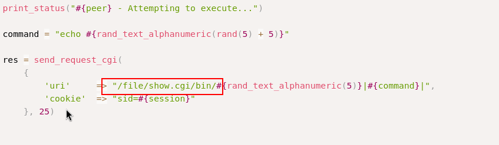
So knowing that, we can bypass the whole privilege escalation part by simply requesting the root.txt flag via `http://localhost:10000/file/show.cgi/root/root.txt.`
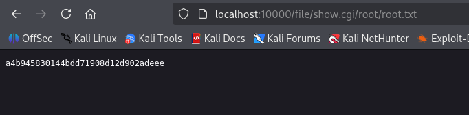
### Metasploit:
Once we identified the attack vector, we utilized Metasploit to execute the `webmin_show_cgi_exec` module. Next, we displayed the required options to initiate the exploit.

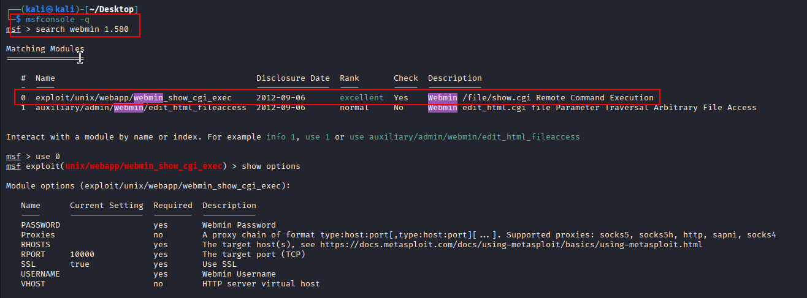

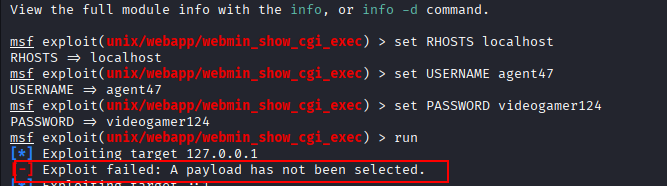

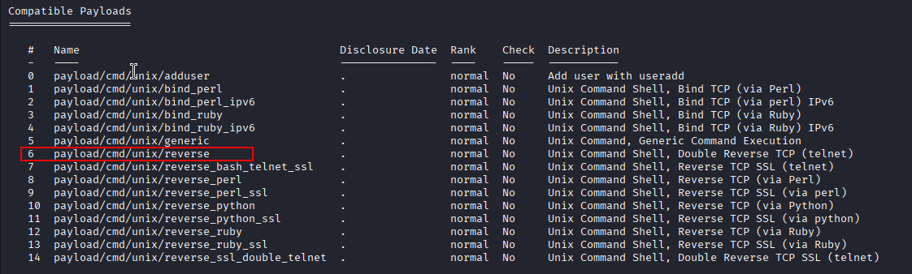
As we established an SSH tunnel to the target machine earlier, we set the RHOSTS option to our local machine's IP address. Additionally, we set the LHOST option to our TryHackMe OpenVPN tun0 interface address. My own machine address.
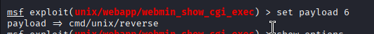
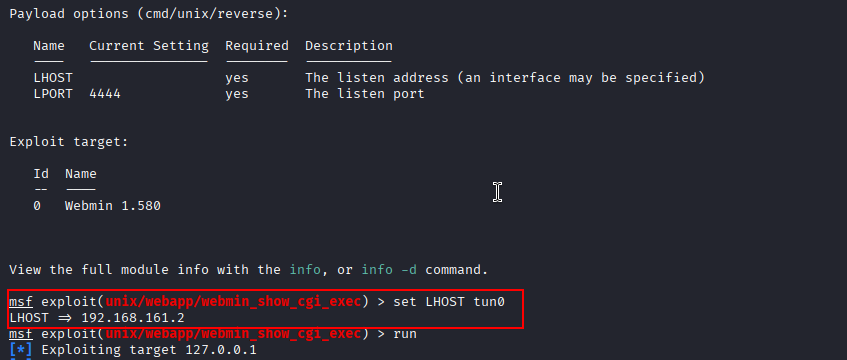


