nmap scan
```sh
nmap -p- -T4 --min-rate 5000 -Pn 10.82.145.224
Starting Nmap 7.95 ( https://nmap.org ) at 2026-02-03 14:42 IST
Warning: 10.82.145.224 giving up on port because retransmission cap hit (6).
Nmap scan report for 10.82.145.224
Host is up (0.21s latency).
Not shown: 65533 closed tcp ports (reset)
PORT   STATE SERVICE
22/tcp open  ssh
80/tcp open  http

Nmap done: 1 IP address (1 host up) scanned in 21.82 seconds
```
```sh
nmap -sC -sV -T4 -Pn -p 22,80 10.82.145.224
Starting Nmap 7.95 ( https://nmap.org ) at 2026-02-03 14:43 IST
Nmap scan report for 10.82.145.224
Host is up (0.14s latency).

PORT   STATE SERVICE VERSION
22/tcp open  ssh     OpenSSH 7.2p2 Ubuntu 4ubuntu2.8 (Ubuntu Linux; protocol 2.0)
| ssh-hostkey: 
|   2048 49:7c:f7:41:10:43:73:da:2c:e6:38:95:86:f8:e0:f0 (RSA)
|   256 2f:d7:c4:4c:e8:1b:5a:90:44:df:c0:63:8c:72:ae:55 (ECDSA)
|_  256 61:84:62:27:c6:c3:29:17:dd:27:45:9e:29:cb:90:5e (ED25519)
80/tcp open  http    Apache httpd 2.4.18 ((Ubuntu))
|_http-server-header: Apache/2.4.18 (Ubuntu)
|_http-title: Apache2 Ubuntu Default Page: It works
Service Info: OS: Linux; CPE: cpe:/o:linux:linux_kernel

Service detection performed. Please report any incorrect results at https://nmap.org/submit/ .
Nmap done: 1 IP address (1 host up) scanned in 12.33 seconds
```
As port 80 is open so let’s navigate to the URL http://<TARGET_IP>
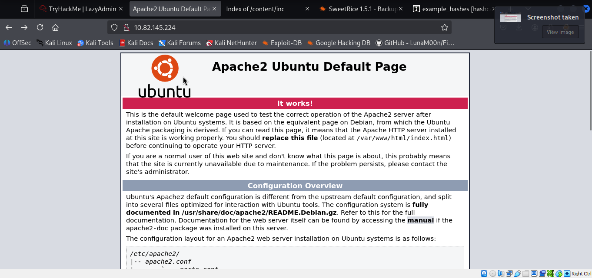

### Directory brute forcing


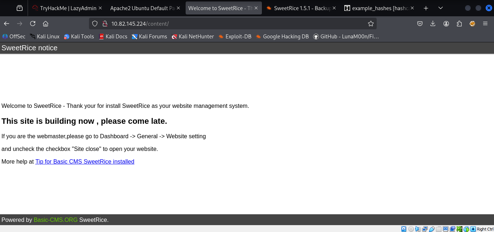

Additionally, what we can do is to use gobuster tool again to find the hidden directories within the directory we already found ‘content'.


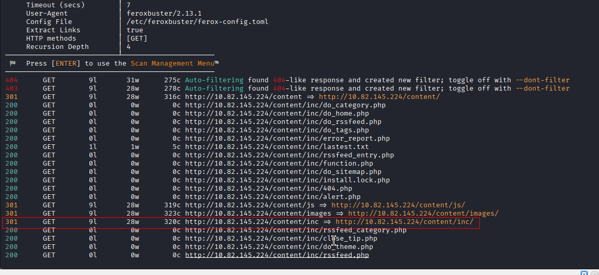

Surprisingly we have a bunch of folders to check out. They could lead to anything.

One-by-one navigate to the directories.
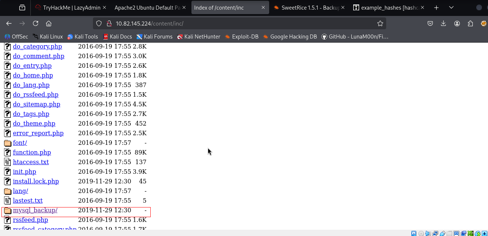

Lovely. We have a mysql backup file. That could be helpful for us. Let’s download that to our system.

<TARGET_IP>/content/as/
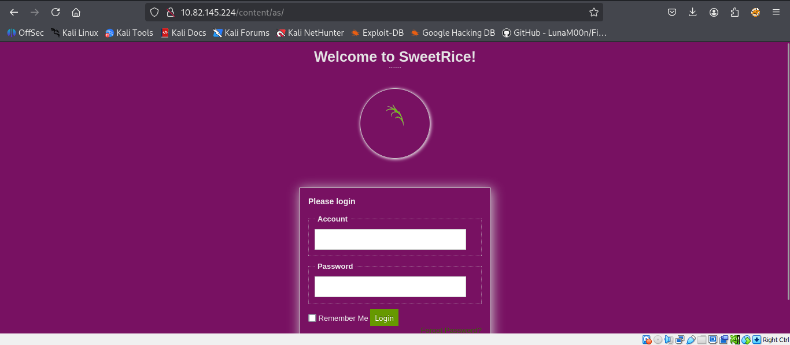

We can use ‘cat’ to inspect the backup file. Perhaps something is there for us to find. Keep your eyes peeled. Start analysing it from the top to bottom.
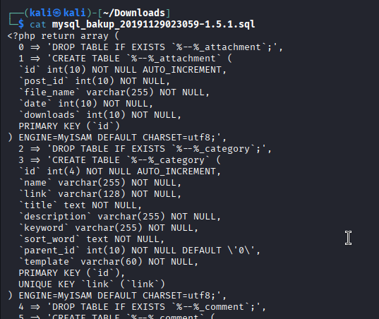

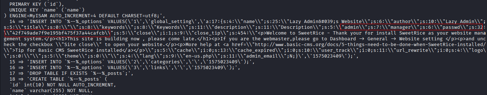

Admin: manager
Password: 42f749ade7f9e195bf475f37a44cafcb

Clearly it is evident that the password is in form of hash. So let’s decrypt that.

Go to crackstation / cyberchef / hash-identifier to analyze hash / john the ripper. Too many to choose from. I will go to crackstation and decrypt the hash.

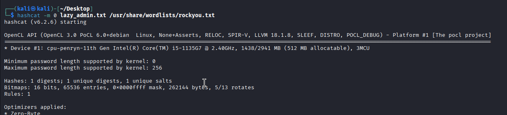

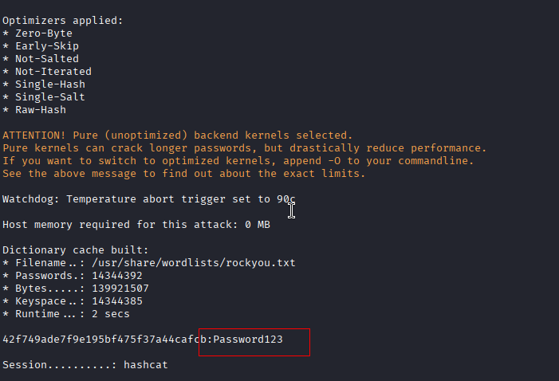

We can try logging into <TARGET_IP>/content/as/ login page with the credentials we have.
We are in !! Now what do we have to do? First just look around the website to find anywhere we can upload a script. I have found a couple of pages where we can .g. creating a new post or in plugin list page.  
We will create a new post and upload a php-reverse-shell.php

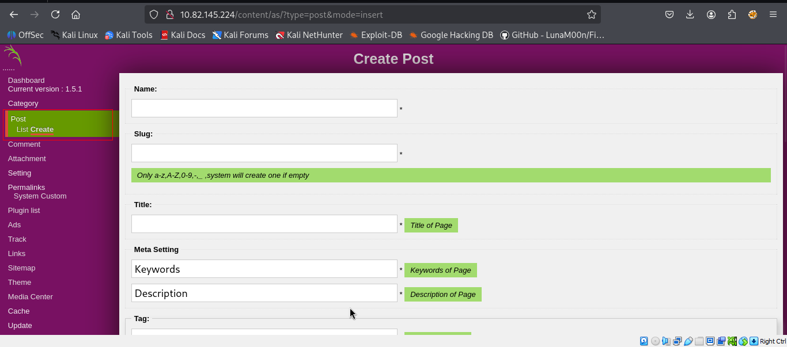

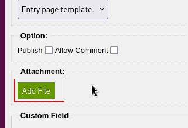
For this task we will upload php reverse shell script.  
I frequently use pentestmonkey php-reverse-shell.php script to try to gain a reverse shell using netcat.  
Git Link to download the script or clone in terminal : [https://github.com/pentestmonkey/php-reverse-shell](https://github.com/pentestmonkey/php-reverse-shell)
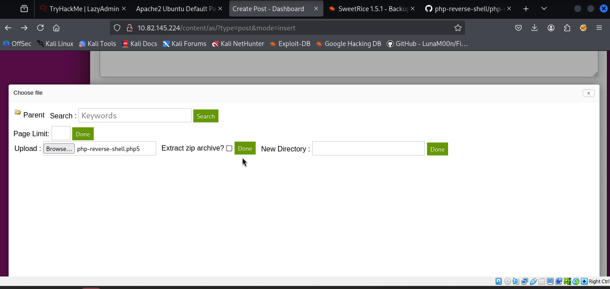

We will now need to start a listener on netcat and try to gain a shell. Fingers crossed.
We need to execute the uploaded script.
Remember earlier on we found a directory in gobuster that was actually empty but it won’t be now. Or maybe it is. Let’s find out.
<MACHINE_IP>/content/attachments
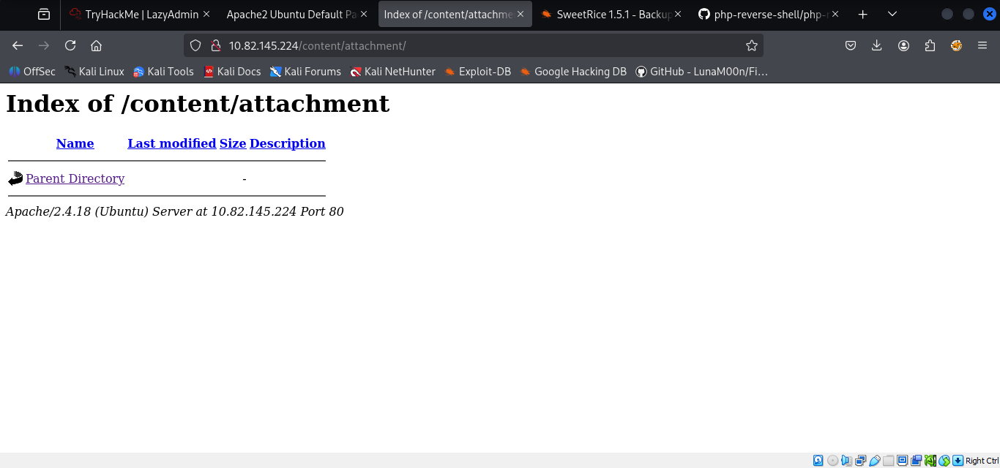
This is EMPTY !!! But why? This is because .php extension is being filtered and is not allowed to be uploaded therefore we will have to bypass the upload by renaming the script into an unpopular extension e.g. phtml, php5 etc.

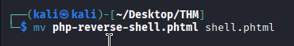
Repeat the process again and try to see if it bypasses the upload
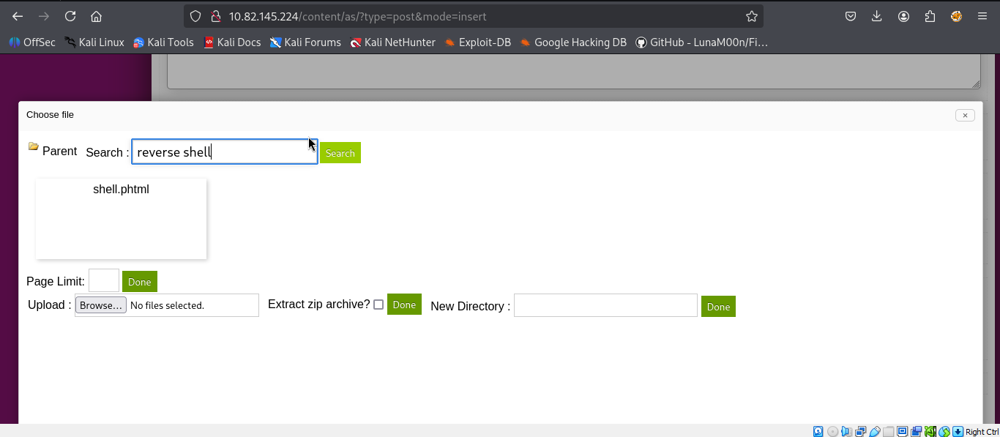

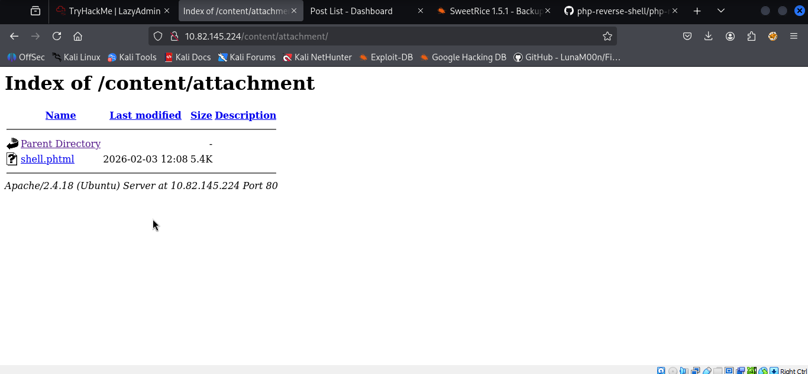
We have successfully uploaded or bypassed the upload.  
We are going to execute the script and check back on our netcat listener to see if we have gained the shell.
We have successfully gained shell.  
BUT the shell is not a stable shell.  
How do we get a stable shell? Let me show you the way.
```python
python -c 'import pty; pty.spawn("/bin/bash")'
```


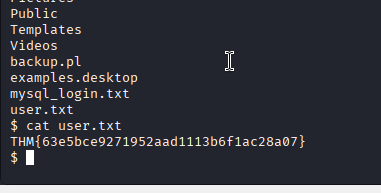

Use command: sudo -l
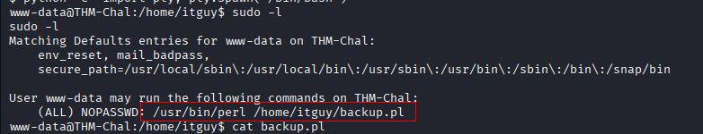
**Findings:**  
The user **www-data** can run `/usr/bin/perl /home/itguy/backup.pl` with root privileges without needing a password.

**Next Step:**  
Examine the **backup.pl** script

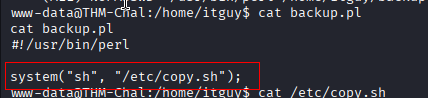

The content of the backup.pl Perl script you’ve provided shows that it runs a shell script located at /etc/copy.sh. This is a key vulnerability, as you can modify or replace the contents of copy.sh to execute arbitrary commands as root.

Next check the contents of the copy.sh file

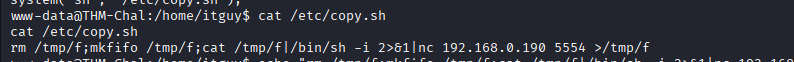

**Findings:**  
The script calls another file, **/etc/copy.sh**, which contains a vulnerable reverse shell.

**Next Step:**  
Modify **copy.sh** to connect back to the attacker’s IP address.

Since the attacker IP address is 10.2.7.247/17, will need to modify the reverse shell script (/etc/copy.sh) to connect back to this new IP address instead of the previous one 192.168.0.190

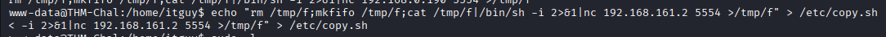

Set up a listener on attacer Machine. Run the the modified Perl script on the Target Machine with root privileges.
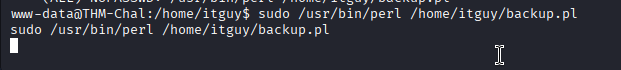
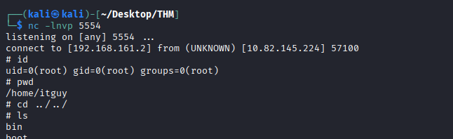
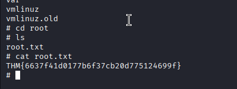
