### Nmap scan
```sh
sudo nmap -sV -sC -A -T4 -Pn 10.81.185.79                       
[sudo] password for kali: 
Starting Nmap 7.95 ( https://nmap.org ) at 2026-01-14 12:22 IST
Nmap scan report for 10.81.185.79
Host is up (0.18s latency).
Not shown: 998 closed tcp ports (reset)
PORT   STATE SERVICE VERSION
22/tcp open  ssh     OpenSSH 8.2p1 Ubuntu 4ubuntu0.13 (Ubuntu Linux; protocol 2.0)
| ssh-hostkey: 
|   3072 8a:85:f1:8a:b6:f3:3f:e1:16:cd:84:84:29:31:49:e8 (RSA)
|   256 4d:73:91:6e:26:2e:c0:30:0f:87:3a:87:d6:ea:a2:37 (ECDSA)
|_  256 31:a3:8f:ed:6a:65:55:af:1b:62:7f:f8:c5:93:d8:59 (ED25519)
80/tcp open  http    Apache httpd 2.4.41 ((Ubuntu))
|_http-title: HackIT - Home
|_http-server-header: Apache/2.4.41 (Ubuntu)
| http-cookie-flags: 
|   /: 
|     PHPSESSID: 
|_      httponly flag not set
No exact OS matches for host (If you know what OS is running on it, see https://nmap.org/submit/ ).
TCP/IP fingerprint:
OS:SCAN(V=7.95%E=4%D=1/14%OT=22%CT=1%CU=39147%PV=Y%DS=3%DC=T%G=Y%TM=69673D6
OS:9%P=x86_64-pc-linux-gnu)SEQ(SP=100%GCD=1%ISR=10A%TI=Z%CI=Z%II=I%TS=A)SEQ
OS:(SP=100%GCD=1%ISR=10F%TI=Z%CI=Z%II=I%TS=A)SEQ(SP=105%GCD=1%ISR=10D%TI=Z%
OS:CI=Z%II=I%TS=A)SEQ(SP=106%GCD=1%ISR=108%TI=Z%CI=Z%II=I%TS=A)SEQ(SP=107%G
OS:CD=1%ISR=10D%TI=Z%CI=Z%II=I%TS=A)OPS(O1=M4E8ST11NW7%O2=M4E8ST11NW7%O3=M4
OS:E8NNT11NW7%O4=M4E8ST11NW7%O5=M4E8ST11NW7%O6=M4E8ST11)WIN(W1=F4B3%W2=F4B3
OS:%W3=F4B3%W4=F4B3%W5=F4B3%W6=F4B3)ECN(R=Y%DF=Y%T=40%W=F507%O=M4E8NNSNW7%C
OS:C=Y%Q=)T1(R=Y%DF=Y%T=40%S=O%A=S+%F=AS%RD=0%Q=)T2(R=N)T3(R=N)T4(R=Y%DF=Y%
OS:T=40%W=0%S=A%A=Z%F=R%O=%RD=0%Q=)T5(R=Y%DF=Y%T=40%W=0%S=Z%A=S+%F=AR%O=%RD
OS:=0%Q=)T6(R=Y%DF=Y%T=40%W=0%S=A%A=Z%F=R%O=%RD=0%Q=)T7(R=Y%DF=Y%T=40%W=0%S
OS:=Z%A=S+%F=AR%O=%RD=0%Q=)U1(R=Y%DF=N%T=40%IPL=164%UN=0%RIPL=G%RID=G%RIPCK
OS:=G%RUCK=G%RUD=G)IE(R=Y%DFI=N%T=40%CD=S)

Network Distance: 3 hops
Service Info: OS: Linux; CPE: cpe:/o:linux:linux_kernel

TRACEROUTE (using port 1723/tcp)
HOP RTT       ADDRESS
1   170.24 ms 192.168.128.1
2   ...
3   170.70 ms 10.81.185.79

OS and Service detection performed. Please report any incorrect results at https://nmap.org/submit/ .
Nmap done: 1 IP address (1 host up) scanned in 34.68 seconds
```

### Directory brute forcing
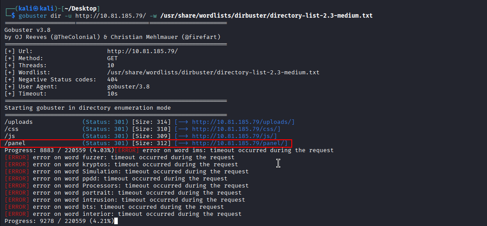

To explore this directory, open a web browser and enter the URL in the browser
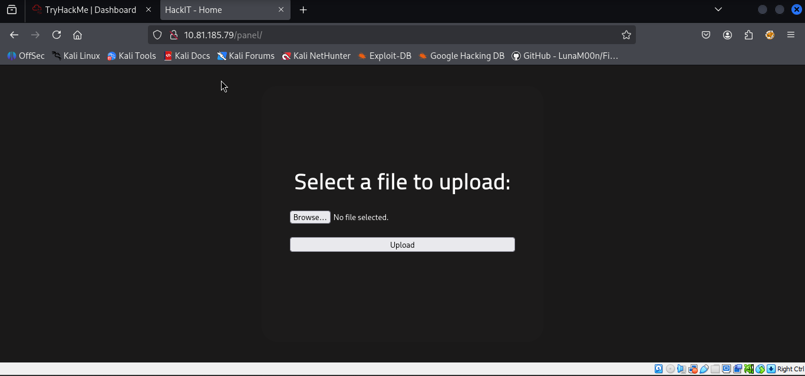
Open the php-reverse-shell.php file using tex editor
Look for the following section in the script, where you will modify the **$ip** and **$port** variables:

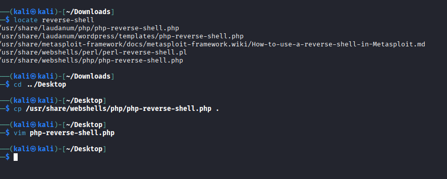
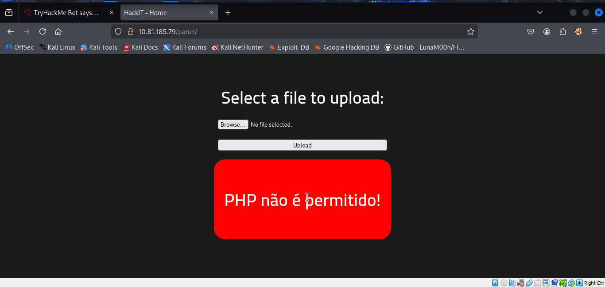

Select the php-reverse-shell.php file and click Upload.
The Uplode result shows an error message, that means the PHP file is not allowed. This indicates that the upload system is blocking the upload of PHP files for security reasons.

#### Search for “file upload bypass” and “PHP reverse shell”.

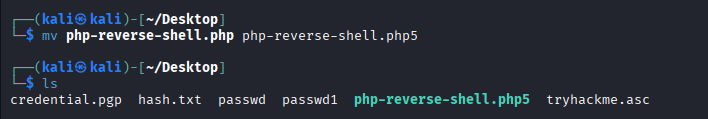

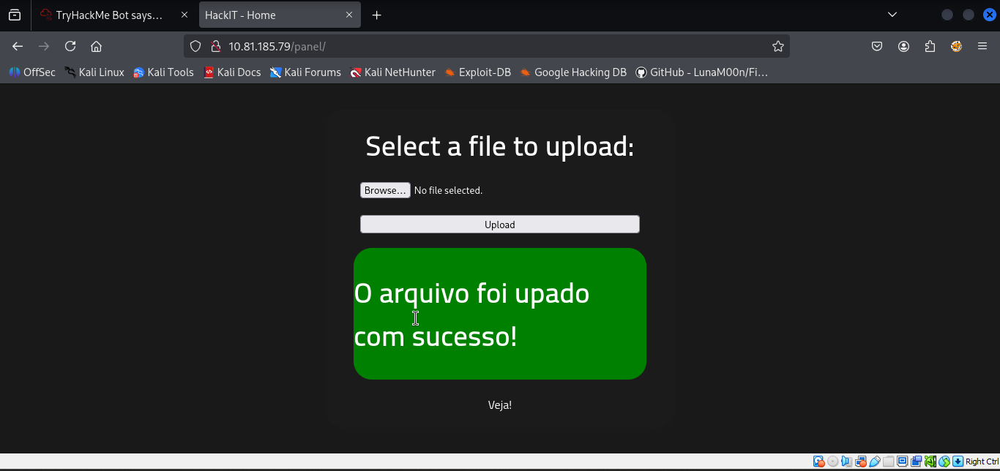

The file has been successfully uploaded
#### . Set up a listener on your local machine using Netcat
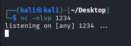

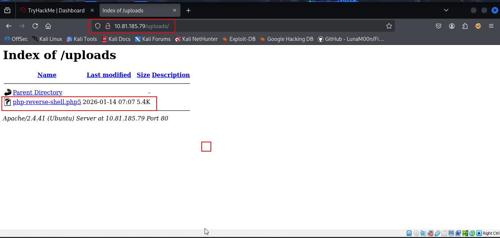

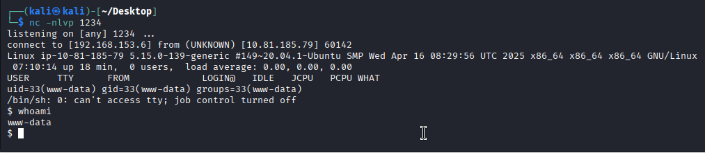

#### Upgrade the shell
```python
python -c 'import pty; pty.spawn("/bin/bash")'
```

#### Use find to locate user.txt

```sh
find / -type f -name user.txt 2>/dev/null
```
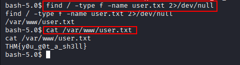

#### 1. Starting with finding files with SUID Permissions Owned by Root
```sh
find / -type f -user root -perm -4000 2>/dev/null
```
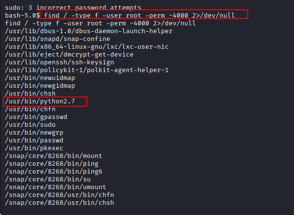

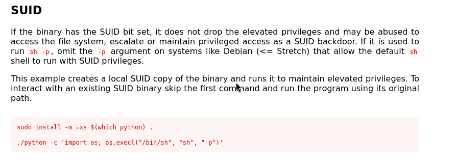

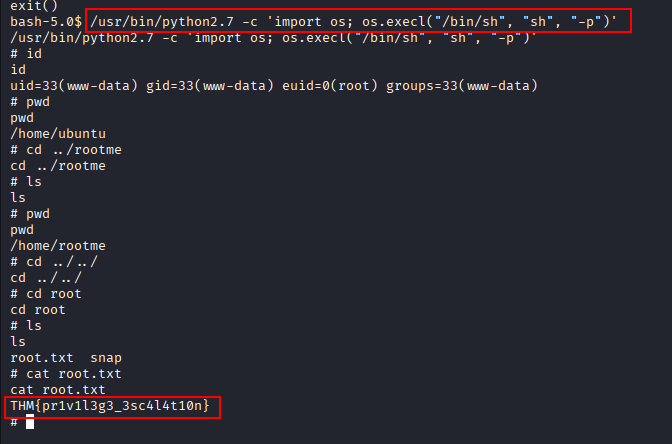
